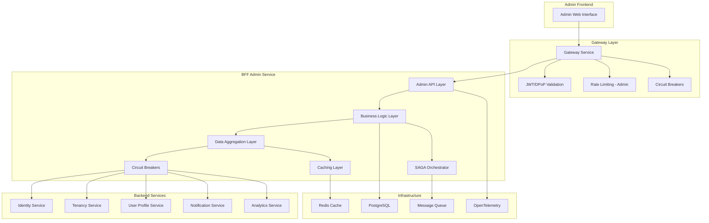
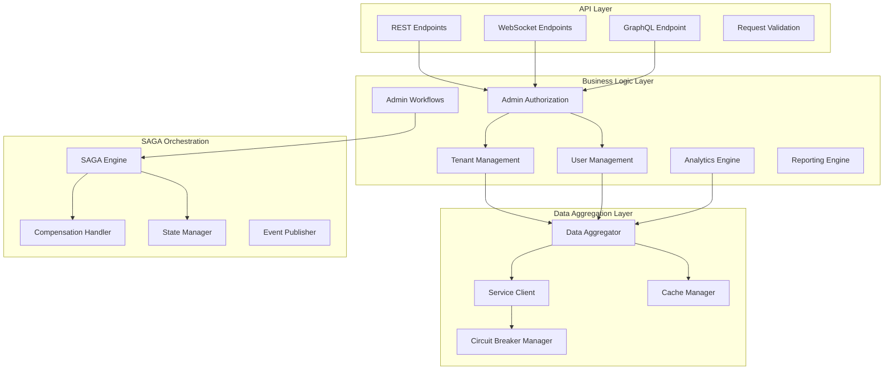

# 🏗️ Design Document – BFF Admin Service

## Overview

The BFF Admin Service is a specialized Backend for Frontend service that provides optimized data aggregation, caching, and admin-specific business logic for the SmartEdify platform's administrative interfaces. It acts as an intelligent intermediary between the admin web interface and backend services, implementing SAGA patterns for multi-service operations, circuit breakers for resilience, and comprehensive caching strategies for performance.

### Key Design Principles

- **Resilience First**: Circuit breakers and fallback strategies for every service dependency
- **Data Consistency**: SAGA patterns and compensating transactions for multi-service operations
- **Performance Optimized**: Intelligent caching and parallel service calls with realistic timeouts
- **Admin-Centric**: Specialized business logic and workflows for administrative operations
- **Observable**: Comprehensive monitoring and tracing for operational excellence

---

## Architecture

### High-Level Architecture



### Service Architecture



---

## Components and Interfaces

### Service Client with Circuit Breaker Integration

```typescript
// Service Client with Resilience Patterns
interface ServiceClient {
  // Service Communication
  call<T>(service: ServiceType, endpoint: string, options: CallOptions): Promise<ServiceResponse<T>>;
  
  // Bulk Operations
  bulkCall<T>(requests: BulkRequest[]): Promise<BulkResponse<T>>;
  
  // Health Monitoring
  getServiceHealth(service: ServiceType): ServiceHealth;
  
  // Circuit Breaker Management
  getCircuitBreakerState(service: ServiceType): CircuitBreakerState;
}

interface CallOptions {
  timeout?: number;
  retries?: number;
  fallback?: FallbackStrategy;
  cacheKey?: string;
  cacheTTL?: number;
  tenantId?: string;
  adminUserId?: string;
}

interface ServiceResponse<T> {
  data: T;
  status: 'success' | 'partial' | 'fallback' | 'error';
  source: 'service' | 'cache' | 'fallback';
  serviceHealth: ServiceHealth;
  duration: number;
  traceId: string;
}

enum ServiceType {
  IDENTITY = 'identity-service',
  TENANCY = 'tenancy-service',
  USER_PROFILE = 'user-profile-service',
  NOTIFICATION = 'notification-service',
  ANALYTICS = 'analytics-service'
}

interface CircuitBreakerConfig {
  failureThreshold: number; // 5 errors
  timeWindow: number; // 30 seconds
  timeout: number; // 10 seconds
  halfOpenMaxCalls: number; // 3 calls
  bulkheadSize: number; // 10 concurrent calls
}

class ServiceClientImpl implements ServiceClient {
  private circuitBreakers: Map<ServiceType, CircuitBreaker>;
  private cacheManager: CacheManager;
  private httpClient: HTTPClient;
  private metrics: MetricsCollector;
  
  constructor(
    cacheManager: CacheManager,
    httpClient: HTTPClient,
    metrics: MetricsCollector
  ) {
    this.cacheManager = cacheManager;
    this.httpClient = httpClient;
    this.metrics = metrics;
    this.initializeCircuitBreakers();
  }
  
  async call<T>(
    service: ServiceType,
    endpoint: string,
    options: CallOptions = {}
  ): Promise<ServiceResponse<T>> {
    const startTime = Date.now();
    const traceId = generateTraceId();
    
    try {
      // Check circuit breaker state
      const circuitBreaker = this.circuitBreakers.get(service);
      if (circuitBreaker?.isOpen()) {
        return this.handleFallback<T>(service, endpoint, options, traceId);
      }
      
      // Try cache first for GET requests
      if (options.cacheKey && endpoint.startsWith('GET')) {
        const cached = await this.cacheManager.get<T>(options.cacheKey);
        if (cached) {
          return {
            data: cached,
            status: 'success',
            source: 'cache',
            serviceHealth: this.getServiceHealth(service),
            duration: Date.now() - startTime,
            traceId,
          };
        }
      }
      
      // Make service call
      const response = await this.executeServiceCall<T>(service, endpoint, options);
      
      // Cache successful responses
      if (response.status === 'success' && options.cacheKey) {
        await this.cacheManager.set(
          options.cacheKey,
          response.data,
          options.cacheTTL || 300 // 5 minutes default
        );
      }
      
      // Record success
      circuitBreaker?.recordSuccess();
      this.metrics.recordServiceCall(service, endpoint, 'success', Date.now() - startTime);
      
      return {
        ...response,
        source: 'service',
        duration: Date.now() - startTime,
        traceId,
      };
      
    } catch (error) {
      // Record failure
      const circuitBreaker = this.circuitBreakers.get(service);
      circuitBreaker?.recordFailure();
      
      this.metrics.recordServiceCall(service, endpoint, 'error', Date.now() - startTime);
      
      // Try fallback
      return this.handleFallback<T>(service, endpoint, options, traceId, error);
    }
  }
  
  private async handleFallback<T>(
    service: ServiceType,
    endpoint: string,
    options: CallOptions,
    traceId: string,
    error?: Error
  ): Promise<ServiceResponse<T>> {
    const fallbackStrategy = this.getFallbackStrategy(service, endpoint);
    
    switch (fallbackStrategy.type) {
      case 'cached_data':
        const cachedData = await this.cacheManager.getStale<T>(options.cacheKey);
        if (cachedData) {
          return {
            data: cachedData,
            status: 'fallback',
            source: 'cache',
            serviceHealth: this.getServiceHealth(service),
            duration: 0,
            traceId,
          };
        }
        break;
        
      case 'degraded_view':
        return {
          data: this.generateDegradedView<T>(service, endpoint),
          status: 'partial',
          source: 'fallback',
          serviceHealth: this.getServiceHealth(service),
          duration: 0,
          traceId,
        };
        
      case 'empty_response':
        return {
          data: this.generateEmptyResponse<T>(service, endpoint),
          status: 'fallback',
          source: 'fallback',
          serviceHealth: this.getServiceHealth(service),
          duration: 0,
          traceId,
        };
    }
    
    // If no fallback available, throw error
    throw new ServiceUnavailableError(service, endpoint, error);
  }
  
  private getFallbackStrategy(service: ServiceType, endpoint: string): FallbackStrategy {
    const strategies: Record<ServiceType, Record<string, FallbackStrategy>> = {
      [ServiceType.TENANCY]: {
        'GET /tenants': { type: 'cached_data', ttl: 3600 },
        'GET /tenants/:id': { type: 'cached_data', ttl: 1800 },
        'POST /tenants': { type: 'error', message: 'Tenant creation unavailable' },
      },
      [ServiceType.USER_PROFILE]: {
        'GET /users': { type: 'degraded_view', fields: ['id', 'email', 'name'] },
        'GET /users/:id': { type: 'cached_data', ttl: 900 },
        'PUT /users/:id': { type: 'error', message: 'User updates unavailable' },
      },
      [ServiceType.IDENTITY]: {
        'GET /auth/sessions': { type: 'cached_data', ttl: 300 },
        'POST /auth/logout': { type: 'error', message: 'Authentication changes unavailable' },
      },
      [ServiceType.NOTIFICATION]: {
        'GET /notifications': { type: 'empty_response' },
        'POST /notifications': { type: 'queue_for_later' },
      },
      [ServiceType.ANALYTICS]: {
        'GET /metrics': { type: 'cached_data', ttl: 600 },
        'GET /reports': { type: 'degraded_view', message: 'Limited data available' },
      },
    };
    
    return strategies[service]?.[endpoint] || { type: 'error', message: 'Service unavailable' };
  }
}
```

### SAGA Pattern Implementation for Multi-Service Operations

```typescript
// SAGA Pattern for Multi-Service Consistency
interface SAGAOrchestrator {
  // SAGA Execution
  executeSAGA<T>(sagaDefinition: SAGADefinition): Promise<SAGAResult<T>>;
  
  // State Management
  getSAGAState(sagaId: string): Promise<SAGAState>;
  
  // Compensation
  compensate(sagaId: string, fromStep?: number): Promise<CompensationResult>;
  
  // Monitoring
  getActiveSAGAs(): Promise<SAGAState[]>;
}

interface SAGADefinition {
  id: string;
  name: string;
  steps: SAGAStep[];
  timeout: number;
  retryPolicy: RetryPolicy;
  compensationStrategy: CompensationStrategy;
}

interface SAGAStep {
  id: string;
  name: string;
  service: ServiceType;
  action: ServiceAction;
  compensation: CompensationAction;
  timeout: number;
  retries: number;
  dependencies: string[]; // Step IDs this step depends on
}

interface ServiceAction {
  method: 'GET' | 'POST' | 'PUT' | 'DELETE';
  endpoint: string;
  payload?: any;
  headers?: Record<string, string>;
}

interface CompensationAction {
  method: 'GET' | 'POST' | 'PUT' | 'DELETE';
  endpoint: string;
  payload?: any;
  condition?: (stepResult: any) => boolean;
}

enum SAGAStatus {
  PENDING = 'pending',
  RUNNING = 'running',
  COMPLETED = 'completed',
  FAILED = 'failed',
  COMPENSATING = 'compensating',
  COMPENSATED = 'compensated'
}

interface SAGAState {
  id: string;
  status: SAGAStatus;
  currentStep: number;
  completedSteps: SAGAStepResult[];
  failedStep?: SAGAStepResult;
  startedAt: Date;
  completedAt?: Date;
  error?: Error;
}

class SAGAOrchestratorImpl implements SAGAOrchestrator {
  private serviceClient: ServiceClient;
  private stateManager: SAGAStateManager;
  private eventPublisher: EventPublisher;
  private logger: Logger;
  
  async executeSAGA<T>(sagaDefinition: SAGADefinition): Promise<SAGAResult<T>> {
    const sagaId = sagaDefinition.id;
    
    try {
      // Initialize SAGA state
      await this.stateManager.initializeSAGA(sagaId, sagaDefinition);
      
      // Execute steps in order
      const results: SAGAStepResult[] = [];
      
      for (let i = 0; i < sagaDefinition.steps.length; i++) {
        const step = sagaDefinition.steps[i];
        
        // Check dependencies
        await this.waitForDependencies(step.dependencies, results);
        
        // Update state
        await this.stateManager.updateSAGAStep(sagaId, i, 'running');
        
        try {
          // Execute step
          const stepResult = await this.executeStep(step, results);
          results.push(stepResult);
          
          // Update state
          await this.stateManager.updateSAGAStep(sagaId, i, 'completed', stepResult);
          
          // Publish event
          await this.eventPublisher.publish('saga.step.completed', {
            sagaId,
            stepId: step.id,
            result: stepResult,
          });
          
        } catch (error) {
          // Step failed - start compensation
          await this.stateManager.updateSAGAStep(sagaId, i, 'failed', null, error);
          
          // Execute compensation
          const compensationResult = await this.compensate(sagaId, i - 1);
          
          return {
            success: false,
            sagaId,
            error,
            compensationResult,
            completedSteps: results,
          };
        }
      }
      
      // SAGA completed successfully
      await this.stateManager.updateSAGAStatus(sagaId, SAGAStatus.COMPLETED);
      
      return {
        success: true,
        sagaId,
        result: this.aggregateResults<T>(results),
        completedSteps: results,
      };
      
    } catch (error) {
      await this.stateManager.updateSAGAStatus(sagaId, SAGAStatus.FAILED, error);
      throw error;
    }
  }
  
  async compensate(sagaId: string, fromStep?: number): Promise<CompensationResult> {
    const sagaState = await this.stateManager.getSAGAState(sagaId);
    const sagaDefinition = await this.stateManager.getSAGADefinition(sagaId);
    
    await this.stateManager.updateSAGAStatus(sagaId, SAGAStatus.COMPENSATING);
    
    const compensationResults: CompensationStepResult[] = [];
    const startStep = fromStep ?? sagaState.completedSteps.length - 1;
    
    // Execute compensation in reverse order
    for (let i = startStep; i >= 0; i--) {
      const step = sagaDefinition.steps[i];
      const stepResult = sagaState.completedSteps[i];
      
      try {
        // Check if compensation is needed
        if (step.compensation.condition && !step.compensation.condition(stepResult.result)) {
          continue;
        }
        
        // Execute compensation
        const compensationResult = await this.executeCompensation(step, stepResult);
        compensationResults.push(compensationResult);
        
        this.logger.info(`Compensation completed for step ${step.id}`, {
          sagaId,
          stepId: step.id,
          compensationResult,
        });
        
      } catch (error) {
        this.logger.error(`Compensation failed for step ${step.id}`, {
          sagaId,
          stepId: step.id,
          error,
        });
        
        // Continue with other compensations even if one fails
        compensationResults.push({
          stepId: step.id,
          success: false,
          error,
        });
      }
    }
    
    await this.stateManager.updateSAGAStatus(sagaId, SAGAStatus.COMPENSATED);
    
    return {
      sagaId,
      compensationSteps: compensationResults,
      success: compensationResults.every(r => r.success),
    };
  }
  
  private async executeStep(step: SAGAStep, previousResults: SAGAStepResult[]): Promise<SAGAStepResult> {
    // Prepare payload with data from previous steps
    const payload = this.prepareStepPayload(step, previousResults);
    
    // Execute with retries
    let lastError: Error;
    for (let attempt = 0; attempt <= step.retries; attempt++) {
      try {
        const response = await this.serviceClient.call(
          step.service,
          `${step.action.method} ${step.action.endpoint}`,
          {
            timeout: step.timeout,
            retries: 0, // Handle retries at SAGA level
            tenantId: payload.tenantId,
            adminUserId: payload.adminUserId,
          }
        );
        
        return {
          stepId: step.id,
          success: true,
          result: response.data,
          duration: response.duration,
          attempt: attempt + 1,
        };
        
      } catch (error) {
        lastError = error;
        
        if (attempt < step.retries) {
          // Wait before retry with exponential backoff
          const delay = Math.min(1000 * Math.pow(2, attempt), 10000);
          await new Promise(resolve => setTimeout(resolve, delay));
        }
      }
    }
    
    throw lastError;
  }
}

// Predefined SAGA Definitions for Common Admin Operations
const TENANT_CREATION_SAGA: SAGADefinition = {
  id: 'tenant-creation',
  name: 'Create New Tenant',
  timeout: 30000, // 30 seconds
  retryPolicy: { maxRetries: 3, backoffMultiplier: 2 },
  compensationStrategy: 'reverse_order',
  steps: [
    {
      id: 'validate-tenant-data',
      name: 'Validate Tenant Data',
      service: ServiceType.TENANCY,
      action: {
        method: 'POST',
        endpoint: '/tenants/validate',
        payload: '{{tenantData}}',
      },
      compensation: {
        method: 'DELETE',
        endpoint: '/tenants/validate/{{validationId}}',
      },
      timeout: 5000,
      retries: 2,
      dependencies: [],
    },
    {
      id: 'create-tenant-record',
      name: 'Create Tenant Record',
      service: ServiceType.TENANCY,
      action: {
        method: 'POST',
        endpoint: '/tenants',
        payload: '{{tenantData}}',
      },
      compensation: {
        method: 'DELETE',
        endpoint: '/tenants/{{tenantId}}',
      },
      timeout: 10000,
      retries: 2,
      dependencies: ['validate-tenant-data'],
    },
    {
      id: 'create-admin-user',
      name: 'Create Admin User',
      service: ServiceType.USER_PROFILE,
      action: {
        method: 'POST',
        endpoint: '/users',
        payload: '{{adminUserData}}',
      },
      compensation: {
        method: 'DELETE',
        endpoint: '/users/{{adminUserId}}',
      },
      timeout: 10000,
      retries: 2,
      dependencies: ['create-tenant-record'],
    },
    {
      id: 'setup-identity',
      name: 'Setup Identity for Admin User',
      service: ServiceType.IDENTITY,
      action: {
        method: 'POST',
        endpoint: '/identities',
        payload: '{{identityData}}',
      },
      compensation: {
        method: 'DELETE',
        endpoint: '/identities/{{identityId}}',
      },
      timeout: 10000,
      retries: 2,
      dependencies: ['create-admin-user'],
    },
    {
      id: 'send-welcome-notification',
      name: 'Send Welcome Notification',
      service: ServiceType.NOTIFICATION,
      action: {
        method: 'POST',
        endpoint: '/notifications',
        payload: '{{welcomeNotification}}',
      },
      compensation: {
        method: 'DELETE',
        endpoint: '/notifications/{{notificationId}}',
        condition: (result) => result.sent === true,
      },
      timeout: 5000,
      retries: 1,
      dependencies: ['setup-identity'],
    },
  ],
};
```

### Admin Data Aggregation Layer

```typescript
// Data Aggregation with Intelligent Caching
interface DataAggregator {
  // Tenant Aggregation
  aggregateTenantData(tenantId: string): Promise<AggregatedTenantData>;
  aggregateTenantsOverview(filters: TenantFilters): Promise<TenantsOverview>;
  
  // User Aggregation
  aggregateUserData(userId: string): Promise<AggregatedUserData>;
  aggregateUsersOverview(filters: UserFilters): Promise<UsersOverview>;
  
  // Dashboard Aggregation
  aggregateDashboardData(adminUserId: string): Promise<AdminDashboardData>;
  
  // Analytics Aggregation
  aggregateAnalytics(query: AnalyticsQuery): Promise<AnalyticsData>;
}

interface AggregatedTenantData {
  tenant: TenantInfo;
  users: {
    total: number;
    active: number;
    inactive: number;
    recentLogins: UserActivity[];
  };
  usage: {
    storage: StorageUsage;
    apiCalls: APIUsage;
    features: FeatureUsage;
  };
  billing: {
    tier: string;
    status: string;
    nextBilling: Date;
    usage: BillingUsage;
  };
  health: {
    status: 'healthy' | 'warning' | 'critical';
    issues: HealthIssue[];
    lastCheck: Date;
  };
}

interface AdminDashboardData {
  overview: {
    totalTenants: number;
    totalUsers: number;
    activeUsers: number;
    systemHealth: SystemHealth;
  };
  recentActivity: {
    tenantCreations: TenantActivity[];
    userRegistrations: UserActivity[];
    systemEvents: SystemEvent[];
  };
  metrics: {
    performance: PerformanceMetrics;
    errors: ErrorMetrics;
    usage: UsageMetrics;
  };
  alerts: {
    critical: Alert[];
    warnings: Alert[];
    info: Alert[];
  };
}

class DataAggregatorImpl implements DataAggregator {
  private serviceClient: ServiceClient;
  private cacheManager: CacheManager;
  private metricsCollector: MetricsCollector;
  
  async aggregateTenantData(tenantId: string): Promise<AggregatedTenantData> {
    const cacheKey = `tenant:aggregated:${tenantId}`;
    
    // Try cache first
    const cached = await this.cacheManager.get<AggregatedTenantData>(cacheKey);
    if (cached) {
      return cached;
    }
    
    // Parallel service calls with fallbacks
    const [tenantInfo, userStats, usageData, billingData] = await Promise.allSettled([
      this.fetchTenantInfo(tenantId),
      this.fetchUserStats(tenantId),
      this.fetchUsageData(tenantId),
      this.fetchBillingData(tenantId),
    ]);
    
    // Aggregate results with fallback handling
    const aggregated: AggregatedTenantData = {
      tenant: this.extractResult(tenantInfo, 'tenant info'),
      users: this.extractResult(userStats, 'user stats', {
        total: 0,
        active: 0,
        inactive: 0,
        recentLogins: [],
      }),
      usage: this.extractResult(usageData, 'usage data', {
        storage: { used: 0, limit: 0 },
        apiCalls: { current: 0, limit: 0 },
        features: {},
      }),
      billing: this.extractResult(billingData, 'billing data', {
        tier: 'unknown',
        status: 'unknown',
        nextBilling: new Date(),
        usage: {},
      }),
      health: await this.calculateTenantHealth(tenantId),
    };
    
    // Cache result
    await this.cacheManager.set(cacheKey, aggregated, 300); // 5 minutes
    
    return aggregated;
  }
  
  async aggregateDashboardData(adminUserId: string): Promise<AdminDashboardData> {
    const cacheKey = `dashboard:admin:${adminUserId}`;
    
    // Try cache first (shorter TTL for dashboard)
    const cached = await this.cacheManager.get<AdminDashboardData>(cacheKey);
    if (cached) {
      return cached;
    }
    
    // Parallel aggregation with timeout
    const aggregationPromises = [
      this.aggregateOverviewData(),
      this.aggregateRecentActivity(),
      this.aggregateSystemMetrics(),
      this.aggregateSystemAlerts(),
    ];
    
    const results = await Promise.allSettled(
      aggregationPromises.map(p => this.withTimeout(p, 2000)) // 2 second timeout
    );
    
    const dashboard: AdminDashboardData = {
      overview: this.extractResult(results[0], 'overview', {
        totalTenants: 0,
        totalUsers: 0,
        activeUsers: 0,
        systemHealth: { status: 'unknown', services: [] },
      }),
      recentActivity: this.extractResult(results[1], 'recent activity', {
        tenantCreations: [],
        userRegistrations: [],
        systemEvents: [],
      }),
      metrics: this.extractResult(results[2], 'metrics', {
        performance: { avgResponseTime: 0, errorRate: 0 },
        errors: { total: 0, byService: {} },
        usage: { requests: 0, bandwidth: 0 },
      }),
      alerts: this.extractResult(results[3], 'alerts', {
        critical: [],
        warnings: [],
        info: [],
      }),
    };
    
    // Cache with shorter TTL for real-time data
    await this.cacheManager.set(cacheKey, dashboard, 60); // 1 minute
    
    return dashboard;
  }
  
  private async fetchTenantInfo(tenantId: string): Promise<TenantInfo> {
    const response = await this.serviceClient.call<TenantInfo>(
      ServiceType.TENANCY,
      `GET /tenants/${tenantId}`,
      {
        timeout: 5000,
        cacheKey: `tenant:info:${tenantId}`,
        cacheTTL: 600, // 10 minutes
      }
    );
    
    if (response.status === 'fallback') {
      // Add indicator that data might be stale
      response.data.dataStatus = 'cached';
    }
    
    return response.data;
  }
  
  private async fetchUserStats(tenantId: string): Promise<UserStats> {
    const response = await this.serviceClient.call<UserStats>(
      ServiceType.USER_PROFILE,
      `GET /users/stats?tenantId=${tenantId}`,
      {
        timeout: 5000,
        cacheKey: `users:stats:${tenantId}`,
        cacheTTL: 300, // 5 minutes
      }
    );
    
    return response.data;
  }
  
  private extractResult<T>(
    settledResult: PromiseSettledResult<T>,
    operation: string,
    fallback?: T
  ): T {
    if (settledResult.status === 'fulfilled') {
      return settledResult.value;
    }
    
    this.metricsCollector.recordAggregationError(operation, settledResult.reason);
    
    if (fallback) {
      return fallback;
    }
    
    throw new AggregationError(`Failed to ${operation}: ${settledResult.reason.message}`);
  }
  
  private async withTimeout<T>(promise: Promise<T>, timeoutMs: number): Promise<T> {
    const timeoutPromise = new Promise<never>((_, reject) => {
      setTimeout(() => reject(new Error('Operation timeout')), timeoutMs);
    });
    
    return Promise.race([promise, timeoutPromise]);
  }
}
```

### Intelligent Caching System

```typescript
// Multi-Level Caching with Tenant Awareness
interface CacheManager {
  // Basic Operations
  get<T>(key: string): Promise<T | null>;
  set<T>(key: string, value: T, ttl?: number): Promise<void>;
  delete(key: string): Promise<void>;
  
  // Advanced Operations
  getStale<T>(key: string): Promise<T | null>;
  setWithTags<T>(key: string, value: T, tags: string[], ttl?: number): Promise<void>;
  invalidateByTag(tag: string): Promise<void>;
  
  // Bulk Operations
  mget<T>(keys: string[]): Promise<(T | null)[]>;
  mset<T>(entries: CacheEntry<T>[]): Promise<void>;
  
  // Statistics
  getStats(): Promise<CacheStats>;
}

interface CacheEntry<T> {
  key: string;
  value: T;
  ttl?: number;
  tags?: string[];
}

interface CacheStats {
  hitRate: number;
  missRate: number;
  totalRequests: number;
  memoryUsage: number;
  keyCount: number;
  avgResponseTime: number;
}

enum CacheStrategy {
  CACHE_FIRST = 'cache-first',
  CACHE_ASIDE = 'cache-aside',
  WRITE_THROUGH = 'write-through',
  WRITE_BEHIND = 'write-behind'
}

class CacheManagerImpl implements CacheManager {
  private redis: RedisClient;
  private localCache: Map<string, CacheItem>;
  private stats: CacheStatsCollector;
  
  constructor(redis: RedisClient) {
    this.redis = redis;
    this.localCache = new Map();
    this.stats = new CacheStatsCollector();
    this.startCleanupTimer();
  }
  
  async get<T>(key: string): Promise<T | null> {
    const startTime = Date.now();
    
    try {
      // L1 Cache (Local Memory)
      const localItem = this.localCache.get(key);
      if (localItem && !this.isExpired(localItem)) {
        this.stats.recordHit('local', Date.now() - startTime);
        return localItem.value as T;
      }
      
      // L2 Cache (Redis)
      const redisValue = await this.redis.get(key);
      if (redisValue) {
        const parsed = JSON.parse(redisValue) as CacheItem;
        
        // Store in local cache for faster access
        this.localCache.set(key, parsed);
        
        this.stats.recordHit('redis', Date.now() - startTime);
        return parsed.value as T;
      }
      
      this.stats.recordMiss(Date.now() - startTime);
      return null;
      
    } catch (error) {
      this.stats.recordError('get', error);
      return null;
    }
  }
  
  async set<T>(key: string, value: T, ttl: number = 300): Promise<void> {
    const item: CacheItem = {
      value,
      expiresAt: Date.now() + (ttl * 1000),
      createdAt: Date.now(),
      tags: [],
    };
    
    try {
      // Store in both caches
      this.localCache.set(key, item);
      await this.redis.setex(key, ttl, JSON.stringify(item));
      
      this.stats.recordSet();
      
    } catch (error) {
      this.stats.recordError('set', error);
      throw error;
    }
  }
  
  async setWithTags<T>(key: string, value: T, tags: string[], ttl: number = 300): Promise<void> {
    const item: CacheItem = {
      value,
      expiresAt: Date.now() + (ttl * 1000),
      createdAt: Date.now(),
      tags,
    };
    
    try {
      // Store item
      this.localCache.set(key, item);
      await this.redis.setex(key, ttl, JSON.stringify(item));
      
      // Store tag mappings
      for (const tag of tags) {
        await this.redis.sadd(`tag:${tag}`, key);
        await this.redis.expire(`tag:${tag}`, ttl + 60); // Slightly longer TTL for tags
      }
      
      this.stats.recordSet();
      
    } catch (error) {
      this.stats.recordError('setWithTags', error);
      throw error;
    }
  }
  
  async invalidateByTag(tag: string): Promise<void> {
    try {
      // Get all keys with this tag
      const keys = await this.redis.smembers(`tag:${tag}`);
      
      if (keys.length > 0) {
        // Remove from both caches
        for (const key of keys) {
          this.localCache.delete(key);
        }
        await this.redis.del(...keys);
        
        // Remove tag mapping
        await this.redis.del(`tag:${tag}`);
        
        this.stats.recordInvalidation(keys.length);
      }
      
    } catch (error) {
      this.stats.recordError('invalidateByTag', error);
      throw error;
    }
  }
  
  async getStale<T>(key: string): Promise<T | null> {
    try {
      // Check local cache first (even if expired)
      const localItem = this.localCache.get(key);
      if (localItem) {
        return localItem.value as T;
      }
      
      // Check Redis (even if expired)
      const redisValue = await this.redis.get(key);
      if (redisValue) {
        const parsed = JSON.parse(redisValue) as CacheItem;
        return parsed.value as T;
      }
      
      return null;
      
    } catch (error) {
      this.stats.recordError('getStale', error);
      return null;
    }
  }
  
  private isExpired(item: CacheItem): boolean {
    return Date.now() > item.expiresAt;
  }
  
  private startCleanupTimer(): void {
    setInterval(() => {
      // Clean up expired local cache items
      for (const [key, item] of this.localCache.entries()) {
        if (this.isExpired(item)) {
          this.localCache.delete(key);
        }
      }
    }, 60000); // Every minute
  }
}

// Cache Key Strategies for Admin Operations
class AdminCacheKeyBuilder {
  static tenantData(tenantId: string): string {
    return `tenant:data:${tenantId}`;
  }
  
  static tenantUsers(tenantId: string, page: number = 1): string {
    return `tenant:users:${tenantId}:page:${page}`;
  }
  
  static userProfile(userId: string): string {
    return `user:profile:${userId}`;
  }
  
  static dashboardData(adminUserId: string): string {
    return `dashboard:admin:${adminUserId}`;
  }
  
  static systemMetrics(timeRange: string): string {
    return `metrics:system:${timeRange}`;
  }
  
  static analyticsQuery(queryHash: string): string {
    return `analytics:query:${queryHash}`;
  }
  
  // Tag builders for cache invalidation
  static tenantTags(tenantId: string): string[] {
    return [`tenant:${tenantId}`, 'tenants'];
  }
  
  static userTags(userId: string, tenantId?: string): string[] {
    const tags = [`user:${userId}`, 'users'];
    if (tenantId) {
      tags.push(`tenant:${tenantId}`);
    }
    return tags;
  }
  
  static systemTags(): string[] {
    return ['system', 'metrics'];
  }
}
```

---

## Data Models

### Admin-Specific Data Models

```typescript
// Admin Domain Models
interface AdminUser {
  id: string;
  email: string;
  firstName: string;
  lastName: string;
  role: AdminRole;
  permissions: AdminPermission[];
  tenantAccess: TenantAccess[];
  lastLoginAt: Date;
  createdAt: Date;
  updatedAt: Date;
  preferences: AdminPreferences;
}

interface AdminRole {
  id: string;
  name: 'super-admin' | 'tenant-admin' | 'support-admin' | 'read-only-admin';
  description: string;
  permissions: AdminPermission[];
  tenantScoped: boolean;
}

interface AdminPermission {
  id: string;
  resource: string; // 'tenants', 'users', 'analytics', 'system'
  actions: string[]; // 'read', 'write', 'delete', 'impersonate'
  conditions?: PermissionCondition[];
}

interface TenantAccess {
  tenantId: string;
  tenantName: string;
  accessLevel: 'full' | 'read-only' | 'limited';
  grantedAt: Date;
  grantedBy: string;
  expiresAt?: Date;
}

interface AdminPreferences {
  theme: 'light' | 'dark' | 'auto';
  language: string;
  timezone: string;
  dashboardLayout: DashboardWidget[];
  notifications: AdminNotificationPreferences;
  defaultFilters: Record<string, any>;
}

// Aggregated Data Models
interface TenantOverview {
  id: string;
  name: string;
  displayName: string;
  tier: 'free' | 'premium' | 'enterprise';
  status: 'active' | 'suspended' | 'trial' | 'pending';
  createdAt: Date;
  lastActivityAt: Date;
  
  // Aggregated metrics
  userCount: number;
  activeUserCount: number;
  storageUsed: number;
  storageLimit: number;
  apiCallsThisMonth: number;
  apiCallsLimit: number;
  
  // Health indicators
  healthStatus: 'healthy' | 'warning' | 'critical';
  healthIssues: string[];
  
  // Billing information
  billingStatus: 'current' | 'overdue' | 'suspended';
  nextBillingDate: Date;
  monthlyRevenue: number;
}

interface UserOverview {
  id: string;
  email: string;
  firstName: string;
  lastName: string;
  tenantId: string;
  tenantName: string;
  roles: string[];
  status: 'active' | 'inactive' | 'suspended' | 'pending';
  
  // Activity metrics
  lastLoginAt: Date;
  loginCount: number;
  lastActivityAt: Date;
  
  // Profile completeness
  profileCompleteness: number;
  emailVerified: boolean;
  phoneVerified: boolean;
  
  // Security indicators
  mfaEnabled: boolean;
  suspiciousActivity: boolean;
  failedLoginAttempts: number;
}

interface SystemMetrics {
  timestamp: Date;
  
  // Performance metrics
  avgResponseTime: number;
  p95ResponseTime: number;
  errorRate: number;
  throughput: number;
  
  // Resource metrics
  cpuUsage: number;
  memoryUsage: number;
  diskUsage: number;
  networkIO: number;
  
  // Service health
  serviceHealth: Record<string, ServiceHealthStatus>;
  
  // Business metrics
  activeUsers: number;
  newSignups: number;
  revenue: number;
  churnRate: number;
}

interface AnalyticsData {
  query: AnalyticsQuery;
  results: AnalyticsResult[];
  metadata: {
    totalRecords: number;
    executionTime: number;
    cacheHit: boolean;
    dataFreshness: Date;
  };
}

interface AnalyticsQuery {
  dimensions: string[];
  metrics: string[];
  filters: AnalyticsFilter[];
  timeRange: {
    start: Date;
    end: Date;
    granularity: 'hour' | 'day' | 'week' | 'month';
  };
  groupBy?: string[];
  orderBy?: string[];
  limit?: number;
}
```

---

## Error Handling

### Comprehensive Error Management for Multi-Service Operations

```typescript
// Error Handling Framework for BFF Admin
interface AdminErrorHandler {
  // Error Classification
  classifyError: (error: Error, context: AdminOperationContext) => AdminErrorClassification;
  
  // Error Recovery
  attemptRecovery: (error: ClassifiedAdminError) => Promise<AdminRecoveryResult>;
  
  // User Notification
  notifyAdmin: (error: ClassifiedAdminError) => AdminErrorResponse;
  
  // Error Reporting
  reportError: (error: ClassifiedAdminError) => Promise<void>;
}

interface AdminErrorClassification {
  type: 'service_unavailable' | 'data_inconsistency' | 'authorization' | 'validation' | 'timeout' | 'saga_failure';
  severity: 'low' | 'medium' | 'high' | 'critical';
  recoverable: boolean;
  affectedServices: ServiceType[];
  adminMessage: string;
  technicalMessage: string;
  suggestedActions: AdminAction[];
  fallbackData?: any;
}

interface AdminAction {
  label: string;
  action: 'retry' | 'fallback' | 'contact_support' | 'check_service_status' | 'use_cached_data';
  parameters?: Record<string, any>;
}

interface AdminOperationContext {
  adminUserId: string;
  operation: string;
  tenantId?: string;
  affectedResources: string[];
  requestId: string;
  timestamp: Date;
}

class AdminErrorHandlerImpl implements AdminErrorHandler {
  private serviceClient: ServiceClient;
  private cacheManager: CacheManager;
  private notificationService: NotificationService;
  private logger: Logger;
  
  classifyError(error: Error, context: AdminOperationContext): AdminErrorClassification {
    // Service unavailable errors
    if (error instanceof ServiceUnavailableError) {
      return {
        type: 'service_unavailable',
        severity: this.getServiceSeverity(error.service),
        recoverable: true,
        affectedServices: [error.service],
        adminMessage: `${error.service} is temporarily unavailable. Some data may be limited.`,
        technicalMessage: error.message,
        suggestedActions: [
          { label: 'Use Cached Data', action: 'use_cached_data' },
          { label: 'Check Service Status', action: 'check_service_status' },
          { label: 'Retry Operation', action: 'retry' },
        ],
        fallbackData: this.getFallbackData(error.service, context),
      };
    }
    
    // SAGA operation failures
    if (error instanceof SAGAExecutionError) {
      return {
        type: 'saga_failure',
        severity: 'high',
        recoverable: true,
        affectedServices: error.affectedServices,
        adminMessage: `Multi-step operation failed at step "${error.failedStep}". Compensation has been initiated.`,
        technicalMessage: error.message,
        suggestedActions: [
          { label: 'View Compensation Status', action: 'check_service_status', parameters: { sagaId: error.sagaId } },
          { label: 'Retry Operation', action: 'retry' },
          { label: 'Contact Support', action: 'contact_support' },
        ],
      };
    }
    
    // Data consistency errors
    if (error instanceof DataConsistencyError) {
      return {
        type: 'data_inconsistency',
        severity: 'critical',
        recoverable: false,
        affectedServices: error.affectedServices,
        adminMessage: 'Data inconsistency detected across services. Manual intervention may be required.',
        technicalMessage: error.message,
        suggestedActions: [
          { label: 'Contact Support Immediately', action: 'contact_support' },
          { label: 'View Affected Resources', action: 'check_service_status' },
        ],
      };
    }
    
    // Timeout errors
    if (error instanceof TimeoutError) {
      return {
        type: 'timeout',
        severity: 'medium',
        recoverable: true,
        affectedServices: error.affectedServices || [],
        adminMessage: 'Operation timed out. This may be due to high system load.',
        technicalMessage: error.message,
        suggestedActions: [
          { label: 'Retry with Longer Timeout', action: 'retry', parameters: { timeout: 30000 } },
          { label: 'Use Cached Data', action: 'use_cached_data' },
          { label: 'Check System Status', action: 'check_service_status' },
        ],
      };
    }
    
    // Authorization errors
    if (error instanceof AuthorizationError) {
      return {
        type: 'authorization',
        severity: 'high',
        recoverable: false,
        affectedServices: [],
        adminMessage: 'You do not have permission to perform this operation.',
        technicalMessage: error.message,
        suggestedActions: [
          { label: 'Contact Administrator', action: 'contact_support' },
          { label: 'Check Your Permissions', action: 'check_service_status' },
        ],
      };
    }
    
    // Default classification
    return {
      type: 'validation',
      severity: 'medium',
      recoverable: true,
      affectedServices: [],
      adminMessage: 'An unexpected error occurred. Please try again.',
      technicalMessage: error.message,
      suggestedActions: [
        { label: 'Retry Operation', action: 'retry' },
        { label: 'Contact Support', action: 'contact_support' },
      ],
    };
  }
  
  async attemptRecovery(error: ClassifiedAdminError): Promise<AdminRecoveryResult> {
    switch (error.classification.type) {
      case 'service_unavailable':
        return this.recoverFromServiceUnavailable(error);
      
      case 'saga_failure':
        return this.recoverFromSAGAFailure(error);
      
      case 'timeout':
        return this.recoverFromTimeout(error);
      
      default:
        return { success: false, message: 'No recovery strategy available' };
    }
  }
  
  private async recoverFromServiceUnavailable(error: ClassifiedAdminError): Promise<AdminRecoveryResult> {
    const affectedService = error.classification.affectedServices[0];
    
    // Try to get cached data
    const fallbackData = await this.getFallbackDataForService(affectedService, error.context);
    
    if (fallbackData) {
      return {
        success: true,
        message: 'Using cached data while service recovers',
        fallbackData,
        limitations: ['Data may be stale', 'Some operations unavailable'],
      };
    }
    
    // Check if service is recovering
    const serviceHealth = await this.serviceClient.getServiceHealth(affectedService);
    if (serviceHealth.status === 'recovering') {
      return {
        success: false,
        message: 'Service is recovering, please wait',
        retryAfter: serviceHealth.estimatedRecoveryTime,
      };
    }
    
    return { success: false, message: 'Service unavailable and no cached data available' };
  }
  
  private async recoverFromSAGAFailure(error: ClassifiedAdminError): Promise<AdminRecoveryResult> {
    if (error.originalError instanceof SAGAExecutionError) {
      const sagaId = error.originalError.sagaId;
      
      // Check compensation status
      const compensationResult = await this.getSAGACompensationStatus(sagaId);
      
      if (compensationResult.success) {
        return {
          success: true,
          message: 'Operation rolled back successfully',
          compensationDetails: compensationResult,
        };
      } else {
        return {
          success: false,
          message: 'Compensation failed, manual intervention required',
          compensationDetails: compensationResult,
        };
      }
    }
    
    return { success: false, message: 'Unable to recover from SAGA failure' };
  }
  
  notifyAdmin(error: ClassifiedAdminError): AdminErrorResponse {
    return {
      error: {
        id: generateErrorId(),
        type: error.classification.type,
        severity: error.classification.severity,
        message: error.classification.adminMessage,
        timestamp: new Date(),
        requestId: error.context.requestId,
      },
      fallbackData: error.classification.fallbackData,
      actions: error.classification.suggestedActions,
      serviceStatus: this.getAffectedServicesStatus(error.classification.affectedServices),
      retryable: error.classification.recoverable,
    };
  }
  
  private getServiceSeverity(service: ServiceType): 'low' | 'medium' | 'high' | 'critical' {
    const criticalServices = [ServiceType.IDENTITY, ServiceType.TENANCY];
    const highPriorityServices = [ServiceType.USER_PROFILE];
    
    if (criticalServices.includes(service)) return 'critical';
    if (highPriorityServices.includes(service)) return 'high';
    return 'medium';
  }
  
  private async getFallbackDataForService(service: ServiceType, context: AdminOperationContext): Promise<any> {
    switch (service) {
      case ServiceType.TENANCY:
        return this.cacheManager.getStale(`tenant:data:${context.tenantId}`);
      
      case ServiceType.USER_PROFILE:
        return this.cacheManager.getStale(`users:overview:${context.tenantId}`);
      
      case ServiceType.ANALYTICS:
        return this.cacheManager.getStale(`analytics:dashboard:${context.adminUserId}`);
      
      default:
        return null;
    }
  }
}

// Error Response Models
interface AdminErrorResponse {
  error: {
    id: string;
    type: string;
    severity: string;
    message: string;
    timestamp: Date;
    requestId: string;
  };
  fallbackData?: any;
  actions: AdminAction[];
  serviceStatus: ServiceStatus[];
  retryable: boolean;
}

interface ServiceStatus {
  service: ServiceType;
  status: 'healthy' | 'degraded' | 'unavailable';
  lastCheck: Date;
  estimatedRecovery?: Date;
}
```

This design document provides a comprehensive technical foundation for the BFF Admin Service, addressing all the critical gaps identified while maintaining realistic performance targets and robust error handling strategies. The implementation focuses on resilience patterns, data consistency through SAGA orchestration, and intelligent caching for optimal admin user experience.