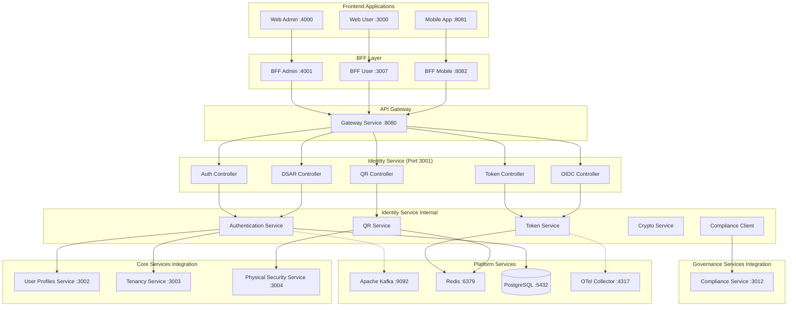

# 🏗️ Design Document – Identity Service

## Overview

The Identity Service is the central authentication and authorization hub for the SmartEdify platform, implementing a Zero Trust security model with multi-tenant support. It provides secure authentication using modern standards (WebAuthn, OAuth 2.0/OIDC), manages JWT tokens with device binding (DPoP), and supports physical access through QR tokens. The service integrates with compliance requirements and maintains audit trails for regulatory compliance.

## Service Boundaries and Data Ownership

**⚠️ CRITICAL: The Identity Service is strictly limited to managing technical identity, authentication credentials, sessions, and runtime compliance enforcement. It does NOT store or manage user profiles, business attributes, relationships, roles, entitlements, or communication preferences.**

**All user profile data — including full name, gender, date of birth, condominium memberships, roles, consent preferences for notifications, and national identifiers — belongs exclusively to the user-profiles-service (port 3002).**

### What the Identity Service DOES store:
- **email and phone** (used ONLY for login, OTP, and account recovery — never for display or business logic)
- **Authentication credentials** (password hash, WebAuthn public keys, TOTP secrets)
- **Session and token metadata** (device binding, DPoP keys, revocation state)
- **Audit records of consent** for authentication-related purposes (e.g., biometric usage, data processing for login)

### What the Identity Service does NOT store:
- User profiles, business attributes, or display names
- Condominium memberships, roles, or entitlements
- Communication preferences or notification settings
- National identifiers or government-issued IDs
- Any data intended for business logic or user interface display

### Data Flow and Event Emission:
Upon successful user registration and verification, the Identity Service emits a `UserProfileCreated` event to Kafka. The user-profiles-service consumes this event to initialize the canonical user profile.

### Integration Rules:
**No other service — including frontend applications, BFFs, or governance services — should read email or phone from the Identity Service for purposes other than authentication. All profile-related queries must be directed to the user-profiles-service.**

### Data Access Patterns:
- ✅ **Correct**: Frontend displays user name from user-profiles-service
- ✅ **Correct**: Notifications service gets email preferences from user-profiles-service  
- ✅ **Correct**: Identity service validates login credentials using stored email/phone
- ❌ **Incorrect**: Frontend displays email from identity-service as "display name"
- ❌ **Incorrect**: Business logic reads user roles from identity-service
- ❌ **Incorrect**: Any service other than identity-service writes to authentication tables

## Architecture

### Integration with SmartEdify Global Architecture

The Identity Service operates as a **Core Service** within the SmartEdify platform architecture, positioned at port 3001. It integrates seamlessly with the layered architecture:

- **Frontend Layer**: Serves Web Admin (:4000), Web User (:3000), and Mobile App (:8081)
- **BFF Layer**: Integrates with BFF Admin (:4001), BFF User (:3007), and BFF Mobile (:8082)
- **Gateway Layer**: All requests routed through Gateway Service (:8080)
- **Service Layer**: Coordinates with other Core, Governance, and Operations services
- **Platform Layer**: Utilizes shared infrastructure (PostgreSQL, Redis, Kafka, OpenTelemetry)

### High-Level Architecture



### Service Boundaries

**Identity Service (Core Service - Port 3001) - Technical Identity ONLY**
- **Authentication**: User registration (technical identity only), login, MFA, WebAuthn
- **Authorization**: Token validation, session management, tenant isolation
- **Token Management**: JWT issuance, refresh, revocation, DPoP binding
- **QR Tokens**: Physical access tokens with cryptographic signatures for Physical Security Service
- **OIDC Provider**: Standards-compliant OAuth 2.0/OIDC endpoints
- **DSAR Compliance**: Data export/deletion for authentication data only

**Integration Points:**
- **Gateway Service**: All requests routed through API Gateway (:8080)
- **User Profiles Service (:3002)**: Receives `UserProfileCreated` events to initialize canonical user profiles. **Identity Service never reads from this service.**
- **Tenancy Service**: Multi-tenant configuration and isolation (:3003)
- **Physical Security Service**: QR token validation for physical access (:3004)
- **Compliance Service**: Real-time compliance validation (:3012)
- **Platform Services**: 
  - PostgreSQL for persistent data (:5432)
  - Redis for session/cache management (:6379)
  - Kafka for event streaming (:9092)
  - OpenTelemetry for observability (:4317)

## Components and Interfaces

### 1. Authentication Controller

**QR Controller Business Context:**
QR tokens allow users secure, verifiable entry to physical spaces and events (assemblies, gates, document signing, etc.), ensuring only authorized individuals gain access, with tamper-proof cryptographic signatures.

**Endpoints:**
- `POST /auth/register` - User registration with collection of authentication-related consents (e.g., biometrics, OTP). Profile data (name, unit, role) is managed by user-profiles-service.
- `POST /auth/login` - Multi-method authentication (password, WebAuthn, TOTP)
- `POST /auth/webauthn/register` - WebAuthn credential registration
- `POST /auth/webauthn/authenticate` - WebAuthn authentication
- `POST /auth/mfa/setup` - TOTP setup for MFA
- `POST /auth/mfa/verify` - TOTP verification
- `POST /auth/logout` - Session termination
- `POST /auth/logout/global` - Global session revocation

**Key Features:**
- NIST 800-63-4 compliance with AAL levels
- Argon2id password hashing
- WebAuthn credential storage (credentialId, publicKey, signCount only)
- Adaptive MFA based on risk assessment
- Tenant-aware authentication

### 2. Token Controller

**Endpoints:**
- `POST /token` - OAuth 2.0 token endpoint (authorization_code + PKCE)
- `POST /token/refresh` - Token refresh with mandatory rotation
- `POST /token/revoke` - Token revocation
- `POST /token/validate` - Token validation for other services
- `GET /token/sessions` - Active session management
- `DELETE /token/sessions/{session_id}` - Individual session revocation

**Key Features:**
- JWT tokens with ES256/EdDSA signing
- DPoP binding with cnf claim
- Access token lifetime ≤ 10 minutes
- Refresh token rotation and family tracking
- Distributed revocation events

### 3. QR Controller

**Endpoints:**
- `POST /qr/generate` - Generate signed QR tokens for physical access
- `POST /qr/validate` - Validate QR token signatures
- `GET /qr/revocation-list` - Get revoked QR tokens
- `POST /qr/revoke` - Revoke specific QR tokens

**Key Features:**
- COSE/JWS signed tokens with short TTLs
- DPoP proof requirement for validation
- Revocation list management
- Context-specific audience claims (assembly, gate, document)

### 4. OIDC Controller

**Endpoints:**
- `GET /.well-known/openid-configuration` - OIDC discovery per tenant
- `GET /.well-known/jwks.json` - Public key sets per tenant
- `GET /auth/authorize` - Authorization endpoint with PKCE
- `POST /auth/userinfo` - User information endpoint

**Key Features:**
- Tenant-specific issuer URLs: `https://auth.smartedify.global/t/{tenant_id}`
- PKCE mandatory for all flows
- Implicit and hybrid flows explicitly blocked
- Kid header in all JWT tokens

### 5. DSAR Controller

**Endpoints:**
- `POST /dsar/export` - Initiate data export (AAL2 required)
- `POST /dsar/delete` - Initiate data deletion (AAL2 required)
- `GET /dsar/status/{job_id}` - Check DSAR job status
- `GET /dsar/download/{job_id}` - Download export data

**Key Features:**
- Asynchronous processing with job tracking
- Strong authentication requirement (AAL2)
- Cross-service orchestration via events
- Idempotent operations
- Audit trail generation

## Data Models

### User Entity
```typescript
interface User {
  id: string;
  tenant_id: string;
  // WARNING: email and phone are stored ONLY for authentication (login/OTP).
  // They are NOT the canonical source for user contact information.
  // Use user-profiles-service for display, notifications, or business logic.
  email: string;
  email_verified: boolean;
  phone?: string;
  phone_verified: boolean;
  password_hash?: string; // Argon2id
  created_at: Date;
  updated_at: Date;
  last_login?: Date;
  status: 'active' | 'suspended' | 'deleted';
  mfa_enabled: boolean;
  webauthn_enabled: boolean;
  // National identifiers, names, roles, and ALL profile data 
  // are stored in user-profiles-service, NOT here
}
```

### WebAuthn Credential
```typescript
interface WebAuthnCredential {
  id: string;
  user_id: string;
  credential_id: string; // Base64URL encoded
  public_key: string;    // COSE public key
  sign_count: number;
  created_at: Date;
  last_used?: Date;
  device_name?: string;
  // NEVER store biometric templates or private keys
}
```

### TOTP Secret
```typescript
interface TOTPSecret {
  id: string;
  user_id: string;
  secret: string; // Encrypted
  backup_codes: string[]; // Encrypted, one-time use
  created_at: Date;
  verified_at?: Date;
}
```

### Session
```typescript
interface Session {
  id: string;
  user_id: string;
  tenant_id: string;
  device_id: string;
  cnf_jkt: string; // DPoP key thumbprint
  refresh_token_family: string;
  version: number; // For "not-before" enforcement
  created_at: Date;
  last_activity: Date;
  expires_at: Date;
  revoked: boolean;
}
```

### QR Token
```typescript
interface QRToken {
  jti: string;        // Unique token ID
  sub: string;        // User ID
  aud: string;        // Context (assembly, gate, document)
  iss: string;        // Issuer
  iat: number;        // Issued at
  nbf: number;        // Not before
  exp: number;        // Expires (short TTL)
  cnf: {
    jkt: string;      // DPoP key thumbprint
  };
  kid: string;        // Key ID for signature verification
}
```

### Consent Record
```typescript
interface ConsentRecord {
  id: string;
  user_id: string;
  tenant_id: string;
  consent_type: 'data_processing' | 'biometric_usage' | 'video_recording';
  granted: boolean;
  granted_at: Date;
  withdrawn_at?: Date;
  legal_basis: string;
  version: string; // Consent version for audit
}
```

## Error Handling

### Error Response Format
```typescript
interface ErrorResponse {
  error: string;           // OAuth 2.0 error code
  error_description: string;
  error_uri?: string;
  correlation_id: string;  // For tracing
  timestamp: string;
}
```

### Error Categories

1. **Authentication Errors (401)**
   - `invalid_credentials` - Wrong username/password
   - `token_expired` - Access token expired
   - `token_invalid` - Malformed or invalid token
   - `mfa_required` - MFA verification needed
   - `webauthn_failed` - WebAuthn verification failed

2. **Authorization Errors (403)**
   - `insufficient_scope` - Missing required permissions
   - `tenant_mismatch` - Cross-tenant access attempt
   - `compliance_blocked` - Compliance policy violation

3. **Client Errors (400)**
   - `invalid_request` - Malformed request
   - `unsupported_grant_type` - Invalid OAuth flow
   - `invalid_pkce` - PKCE verification failed
   - `consent_required` - Missing required consents

4. **Rate Limiting (429)**
   - `rate_limit_exceeded` - Too many requests
   - `login_attempts_exceeded` - Brute force protection

## Testing Strategy

### Unit Testing
- Authentication service logic
- Token generation and validation
- Cryptographic operations
- PKCE implementation
- WebAuthn credential handling

### Integration Testing
- OAuth 2.0/OIDC flows end-to-end
- Multi-tenant isolation
- Cross-service event emission
- Compliance service integration
- Database transaction integrity

### Security Testing
- Token binding verification (DPoP)
- Cryptographic signature validation
- Session management security
- PKCE flow security
- WebAuthn implementation security

### Performance Testing
- Token validation latency (target: <50ms P95)
- Global logout performance (target: <30s P95)
- Concurrent authentication load
- Redis cache performance
- Database query optimization

### Compliance Testing
- NIST 800-63-4 AAL verification
- GDPR DSAR workflow validation
- Audit trail completeness
- Cross-border data handling
- Consent management validation

## Security Considerations

### Cryptographic Standards
- **JWT Signing**: ES256 or EdDSA only (no HS256)
- **Key Rotation**: Automatic 90-day rotation with 7-day rollover
- **Password Hashing**: Argon2id with appropriate parameters
- **Random Generation**: Cryptographically secure random for tokens

### Token Security
- **Access Token Lifetime**: ≤ 10 minutes
- **Refresh Token Rotation**: Mandatory on each use
- **Device Binding**: DPoP with cnf claim
- **Revocation**: Distributed events, not just blacklisting

### Session Security
- **Global Logout**: P95 ≤ 30 seconds
- **Session Versioning**: Per-device "not-before" enforcement
- **Concurrent Sessions**: Configurable limits per tenant
- **Activity Tracking**: Last activity timestamps

### Physical Access Security
- **QR Token TTL**: Short-lived (configurable, typically 5-15 minutes)
- **Signature Verification**: ES256/EdDSA with kid-based key selection
- **Revocation Lists**: Real-time revocation checking
- **Context Binding**: Audience-specific tokens

## Deployment Considerations

### Environment Configuration
- **Port Configuration**: Service runs on port 3001 as defined in global architecture
- **Multi-tenant OIDC**: Issuer per tenant configuration
- **Gateway Integration**: All traffic routed through Gateway Service (:8080)
- **Service Discovery**: Integration with platform service registry

### Platform Services Integration
- **PostgreSQL (:5432)**: Shared database with tenant-based partitioning
- **Redis (:6379)**: Shared cache for session and token management
- **Apache Kafka (:9092)**: Event streaming for cross-service communication
- **OpenTelemetry (:4317)**: Distributed tracing and metrics collection

### Monitoring and Observability
- **Prometheus Integration**: Metrics exposed for Prometheus (:9090) collection
- **Grafana Dashboards**: Integration with Grafana (:3000) for visualization
- **OpenTelemetry Tracing**: Distributed tracing through OTel Collector (:4317)
- **Authentication Metrics**: Success/failure rates, MFA usage
- **Token Metrics**: Issuance, validation, revocation rates
- **Security Metrics**: Failed login attempts, suspicious activity
- **Performance Metrics**: Response times, throughput, error rates

### Service Communication
- **Synchronous**: REST API calls through Gateway Service
- **Asynchronous**: Event-driven communication via Kafka
- **Cross-Service Events**: 
  - `UserProfileCreated` → User Profiles Service (to initialize canonical user profile)
  - `DataDeletionRequested` → All services (for GDPR compliance)
  - `QRTokenGenerated` → Physical Security Service (for physical access validation)
  - `ComplianceValidationRequired` → Compliance Service (for real-time policy enforcement)

### Compliance and Audit
- **Audit Logging**: All authentication events with correlation IDs
- **Data Retention**: Configurable per jurisdiction requirements via Compliance Service
- **Export Capabilities**: DSAR-compliant data export formats
- **Deletion Orchestration**: Cross-service crypto-erase coordination via Kafka events