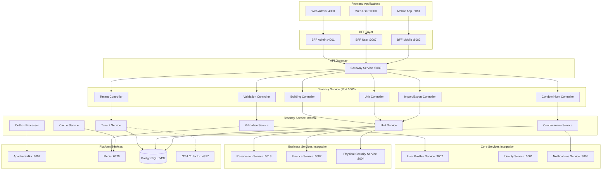

# 🏗️ Design Document – Tenancy Service

## Overview

The Tenancy Service is the **canonical source of truth** for all tenant organizations, condominium structures, building layouts, and unit definitions within the SmartEdify platform. Operating at port 3003, it manages multi-tenant SaaS architecture while providing detailed condominium governance structures, unit validation services, and revenue configuration for common areas. This service ensures complete data isolation between tenants and provides high-performance APIs for cross-service integration.

## Service Boundaries and Data Ownership

**⚠️ CRITICAL: The Tenancy Service is the exclusive owner and manager of ALL tenant organizational data, condominium structures, building layouts, unit definitions, and revenue configurations. It serves as the authoritative source for unit validation across the platform.**

### Owned Data and Responsibilities:
- **Tenant Organizations**: Legal entities, subscription configurations, compliance status
- **Condominium Structures**: Community definitions, governance configurations, financial settings
- **Building Hierarchies**: Building layouts, floor plans, spatial relationships
- **Unit Definitions**: Unit classifications, aliquot distributions, revenue configurations
- **Contact Management**: Legal representatives, billing contacts, notification preferences
- **Tax and Compliance**: Registration validations, regulatory compliance tracking
- **Unit Validation**: Authoritative validation services for other platform services

### Delegated Responsibilities (NOT owned):
- **User Authentication**: Identity management → `identity-service`
- **User Profiles**: Personal information, memberships → `user-profiles-service`
- **Financial Transactions**: Billing, payments → `finance-service`
- **Reservations**: Booking management → `reservation-service`
- **Document Storage**: File management → `documents-service`

### Data Flow and Integration:
The Tenancy Service provides unit validation APIs to other services and emits structural change events via Kafka using transactional outbox pattern. It maintains strict tenant isolation through Row-Level Security (RLS) and provides high-performance caching for frequently accessed data.

## Architecture

### Integration with SmartEdify Global Architecture

The Tenancy Service operates as a **Core Service** within the SmartEdify platform architecture, positioned at port 3003. It serves as the foundational service for multi-tenant architecture and unit validation:

- **Frontend Layer**: Tenant management through Web Admin (:4000) and configuration via Web User (:3000)
- **BFF Layer**: Administrative operations through BFF Admin (:4001) and user operations through BFF User (:3007)
- **Gateway Layer**: All requests routed through Gateway Service (:8080)
- **Service Layer**: Provides unit validation and structural data to all other services
- **Platform Layer**: Utilizes PostgreSQL with RLS, Redis for caching, and Kafka for events

### High-Level Architecture



### Service Boundaries

**Tenancy Service (Core Service - Port 3003) - Structural Foundation**
- **Tenant Management**: Multi-tenant organization management with complete data isolation
- **Condominium Management**: Community structures, governance configurations, compliance tracking
- **Building Management**: Physical structures, floor plans, spatial relationships
- **Unit Management**: Unit definitions, classifications, aliquot distributions, revenue configurations
- **Validation Services**: Authoritative unit validation for cross-service integration
- **Import/Export**: Bulk data operations with comprehensive validation

**Integration Points:**
- **Gateway Service**: All requests routed through API Gateway (:8080)
- **User Profiles Service (:3002)**: Provides unit validation for membership assignments
- **Reservation Service (:3013)**: Provides common area pricing and availability rules
- **Finance Service (:3007)**: Provides aliquot distributions and revenue allocation data
- **Physical Security Service (:3004)**: Provides unit access permissions and spatial data
- **Notifications Service (:3005)**: Receives contact updates and configuration changes
- **Platform Services**: 
  - PostgreSQL with RLS for data persistence (:5432)
  - Redis for high-performance caching (:6379)
  - Kafka for event streaming with transactional outbox (:9092)
  - OpenTelemetry for observability (:4317)

## Components and Interfaces

### 1. Tenant Controller

**Endpoints:**
- `POST /api/v1/tenants` - Create tenant organization
- `GET /api/v1/tenants/{tenant_id}` - Retrieve tenant information
- `PUT /api/v1/tenants/{tenant_id}` - Update tenant configuration
- `PATCH /api/v1/tenants/{tenant_id}/status` - Update tenant status
- `GET /api/v1/tenants/{tenant_id}/compliance` - Get compliance status
- `PUT /api/v1/tenants/{tenant_id}/tax-info` - Update tax registration information

**Key Features:**
- Tenant type management (ADMINISTRADORA vs JUNTA)
- Legal name uniqueness validation per country
- Tax registration validation with country-specific rules
- Compliance status tracking with evidence documentation
- Status cascade to associated condominiums
- Event emission for tenant changes

### 2. Condominium Controller

**Endpoints:**
- `POST /api/v1/condominiums` - Create condominium community
- `GET /api/v1/condominiums/{condominium_id}` - Retrieve condominium details
- `PUT /api/v1/condominiums/{condominium_id}` - Update condominium configuration
- `GET /api/v1/condominiums/{condominium_id}/financial-config` - Get financial settings
- `PUT /api/v1/condominiums/{condominium_id}/financial-config` - Update financial configuration
- `GET /api/v1/condominiums/{condominium_id}/contacts` - List condominium contacts
- `POST /api/v1/condominiums/{condominium_id}/contacts` - Add contact assignment

**Key Features:**
- Unique name constraint within tenant scope
- Country-specific compliance rule validation
- Financial configuration management
- Contact role assignment with governance validation
- Notification settings with consent verification
- Registration number validation against government rules

### 3. Building Controller

**Endpoints:**
- `POST /api/v1/condominiums/{condominium_id}/buildings` - Create building
- `GET /api/v1/buildings/{building_id}` - Retrieve building details
- `PUT /api/v1/buildings/{building_id}` - Update building information
- `GET /api/v1/buildings/{building_id}/floors` - List building floors
- `POST /api/v1/buildings/{building_id}/floors` - Add floor to building
- `GET /api/v1/buildings/{building_id}/layout` - Get building layout

**Key Features:**
- Unique naming within condominium-tenant scope
- Floor plan and spatial relationship management
- Building capacity and structural validation
- Layout versioning and change tracking
- Integration with physical security systems

### 4. Unit Controller

**Endpoints:**
- `POST /api/v1/buildings/{building_id}/units` - Create unit
- `GET /api/v1/units/{unit_id}` - Retrieve unit details
- `PUT /api/v1/units/{unit_id}` - Update unit information
- `PATCH /api/v1/units/{unit_id}/revenue-config` - Update revenue configuration (COMMON units only)
- `GET /api/v1/condominiums/{condominium_id}/units` - List condominium units
- `GET /api/v1/units/{unit_id}/aliquot-impact` - Calculate aliquot impact of changes
- `POST /api/v1/condominiums/{condominium_id}/units/bulk-import` - Bulk import units

**Key Features:**
- Unit classification (PRIVATE, COMMON, COMMERCIAL, PARKING, STORAGE)
- Aliquot distribution with precision (7,4) and sum validation ≤ 1.0001
- Revenue configuration for COMMON units with comprehensive validation
- Local code uniqueness validation
- Bulk import with comprehensive validation and rollback capabilities
- Real-time aliquot recalculation and validation triggers

### 5. Validation Controller

**Endpoints:**
- `GET /api/v1/units/{unit_id}/validate` - Validate unit for specific purpose
- `POST /api/v1/units/validate/batch` - Batch unit validation (up to 1,000 units)
- `GET /api/v1/units/{unit_id}/compatibility` - Check unit compatibility
- `GET /api/v1/validation/cache/status` - Validation cache health
- `DELETE /api/v1/validation/cache/{unit_id}` - Invalidate unit cache

**Key Features:**
- Purpose-specific validation (MEMBERSHIP, RESERVATION, FINANCIAL)
- P95 response time ≤ 50ms with intelligent Redis caching
- Comprehensive unit metadata including ownership and restrictions
- Compatibility scoring and recommendation engine
- Batch processing with performance optimization
- Cache invalidation on unit changes

### 6. Import/Export Controller

**Endpoints:**
- `POST /api/v1/import/units` - Create unit import job
- `GET /api/v1/import/jobs/{job_id}` - Get import job status
- `POST /api/v1/import/jobs/{job_id}/validate` - Validate import data
- `POST /api/v1/import/jobs/{job_id}/execute` - Execute validated import
- `GET /api/v1/export/condominiums/{condominium_id}` - Export condominium structure
- `POST /api/v1/export/custom` - Create custom export job

**Key Features:**
- Support for CSV, JSON, and Excel formats
- Comprehensive validation with detailed error reporting
- Progress tracking with pause/resume capabilities
- Rollback mechanisms and backup snapshots
- Rate limiting and resource management
- Audit trail for all import/export operations

**Bulk Import Validation Implementation:**
```typescript
@Injectable()
export class BulkImportService {
  
  async validateImportBatch(batch: UnitImport[]): Promise<ValidationReport> {
    const report: ValidationReport = {
      valid: true,
      errors: [],
      warnings: [],
      statistics: {
        totalUnits: batch.length,
        privateUnits: 0,
        commonUnits: 0,
        totalAliquot: 0,
        duplicateLocalCodes: [],
        invalidRevenueConfigs: []
      }
    };

    // Track local codes for uniqueness validation
    const localCodeMap = new Map<string, number>();
    
    for (const [index, unit] of batch.entries()) {
      const result = await this.validateUnitImport(unit, index);
      if (!result.valid) {
        report.valid = false;
        report.errors.push(...result.errors);
      }
      report.warnings.push(...result.warnings);
      
      // Check local code uniqueness
      const key = `${unit.buildingId}:${unit.localCode}`;
      if (localCodeMap.has(key)) {
        report.valid = false;
        report.errors.push({
          line: index + 1,
          field: 'localCode',
          error: `Duplicate local_code '${unit.localCode}' in building (first seen at line ${localCodeMap.get(key)! + 1})`
        });
      } else {
        localCodeMap.set(key, index);
      }
      
      // Update statistics
      this.updateStatistics(report.statistics, unit);
    }

    // Final aliquot validation per condominium
    const condominiumAliquots = this.groupAliquotsByCondominium(batch);
    for (const [condominiumId, totalAliquot] of condominiumAliquots.entries()) {
      if (totalAliquot > 1.0001) {
        report.valid = false;
        report.errors.push({
          line: 'TOTAL',
          field: 'aliquot',
          error: `Condominium ${condominiumId}: Total aliquot sum ${totalAliquot.toFixed(4)} exceeds 1.0001`
        });
      }
    }

    return report;
  }

  private async validateUnitImport(unit: UnitImport, index: number): Promise<UnitValidationResult> {
    const result: UnitValidationResult = {
      valid: true,
      errors: [],
      warnings: []
    };

    // Validate required fields
    if (!unit.localCode || unit.localCode.trim().length === 0) {
      result.valid = false;
      result.errors.push({
        line: index + 1,
        field: 'localCode',
        error: 'Local code is required'
      });
    }

    // Validate aliquot range
    if (unit.aliquot < 0 || unit.aliquot > 0.5) {
      result.valid = false;
      result.errors.push({
        line: index + 1,
        field: 'aliquot',
        error: `Aliquot ${unit.aliquot} must be between 0 and 0.5`
      });
    }

    // Validate revenue config for COMMON units
    if (unit.kind === 'COMMON') {
      if (!unit.revenueConfig) {
        result.valid = false;
        result.errors.push({
          line: index + 1,
          field: 'revenueConfig',
          error: 'Revenue configuration is required for COMMON units'
        });
      } else {
        const revenueValidation = await this.validateRevenueConfig(unit.revenueConfig);
        if (!revenueValidation.valid) {
          result.valid = false;
          result.errors.push(...revenueValidation.errors.map(err => ({
            ...err,
            line: index + 1
          })));
        }
      }
    } else if (unit.revenueConfig) {
      result.warnings.push({
        line: index + 1,
        field: 'revenueConfig',
        warning: `Revenue configuration ignored for ${unit.kind} unit`
      });
    }

    // Validate building existence
    const buildingExists = await this.validateBuildingExists(unit.buildingId, unit.tenantId);
    if (!buildingExists) {
      result.valid = false;
      result.errors.push({
        line: index + 1,
        field: 'buildingId',
        error: `Building ${unit.buildingId} does not exist`
      });
    }

    return result;
  }

  private updateStatistics(stats: ImportStatistics, unit: UnitImport): void {
    stats.totalAliquot += unit.aliquot;
    
    if (unit.kind === 'PRIVATE') {
      stats.privateUnits++;
    } else if (unit.kind === 'COMMON') {
      stats.commonUnits++;
    }
  }

  private groupAliquotsByCondominium(batch: UnitImport[]): Map<string, number> {
    const condominiumAliquots = new Map<string, number>();
    
    for (const unit of batch) {
      const current = condominiumAliquots.get(unit.condominiumId) || 0;
      condominiumAliquots.set(unit.condominiumId, current + unit.aliquot);
    }
    
    return condominiumAliquots;
  }
}

interface ValidationReport {
  valid: boolean;
  errors: ValidationError[];
  warnings: ValidationWarning[];
  statistics: ImportStatistics;
}

interface ValidationError {
  line: number | string;
  field: string;
  error: string;
}

interface ImportStatistics {
  totalUnits: number;
  privateUnits: number;
  commonUnits: number;
  totalAliquot: number;
  duplicateLocalCodes: string[];
  invalidRevenueConfigs: string[];
}
```

## Data Models

### Tenant Entity
```typescript
interface Tenant {
  id: string;
  legalName: string; // Unique per country
  tenantType: TenantType;
  country: string; // ISO 3166-1 alpha-2
  status: TenantStatus;
  subscriptionConfig: SubscriptionConfig;
  complianceStatus: ComplianceStatus;
  createdAt: Date;
  updatedAt: Date;
  deactivatedAt?: Date;
}

enum TenantType {
  ADMINISTRADORA = 'ADMINISTRADORA', // Multiple condominiums
  JUNTA = 'JUNTA'                    // Single condominium
}

enum TenantStatus {
  ACTIVE = 'ACTIVE',
  INACTIVE = 'INACTIVE',
  SUSPENDED = 'SUSPENDED',
  DEACTIVATED = 'DEACTIVATED'
}
```

### Condominium Entity
```typescript
interface Condominium {
  id: string;
  tenantId: string;
  name: string; // Unique within tenant
  registrationNumber?: string;
  registrationValidFrom?: Date;
  registrationValidTo?: Date;
  financialConfig: FinancialConfig;
  notificationSettings: NotificationSettings;
  status: CondominiumStatus;
  createdAt: Date;
  updatedAt: Date;
}

interface FinancialConfig {
  currency: string; // ISO 4217
  taxRate: number;
  billingCycle: BillingCycle;
  paymentMethods: PaymentMethod[];
  complianceRules: Record<string, any>;
}
```

### Building Entity
```typescript
interface Building {
  id: string;
  tenantId: string;
  condominiumId: string;
  name: string; // Unique within condominium-tenant
  address: Address;
  floors: number;
  totalUnits: number;
  layoutData?: LayoutData;
  status: BuildingStatus;
  createdAt: Date;
  updatedAt: Date;
}

interface LayoutData {
  floorPlans: FloorPlan[];
  spatialRelationships: SpatialRelationship[];
  coordinates?: Coordinates;
}
```

### Unit Entity
```typescript
interface Unit {
  id: string;
  tenantId: string;
  condominiumId: string;
  buildingId: string;
  localCode: string; // Unique within building
  kind: UnitKind;
  area: number; // Square meters
  aliquot: number; // Decimal(7,4), sum ≤ 1.0001 per condominium
  revenueConfig?: RevenueConfig; // Only for COMMON units
  validationRules: Record<string, any>;
  lastValidatedAt?: Date;
  status: UnitStatus;
  createdAt: Date;
  updatedAt: Date;
}

enum UnitKind {
  PRIVATE = 'PRIVATE',     // Residential units
  COMMON = 'COMMON',       // Shared spaces with revenue potential
  COMMERCIAL = 'COMMERCIAL', // Commercial spaces
  PARKING = 'PARKING',     // Parking spaces
  STORAGE = 'STORAGE'      // Storage units
}

interface RevenueConfig {
  reservation: ReservationConfig;
  penalties?: PenaltyConfig;
  exemptions?: ExemptionConfig;
  operational?: OperationalConfig;
  revenueAllocation?: RevenueAllocation;
  taxConfig?: TaxConfig;
}
```

### Event Outbox Entity
```typescript
interface EventOutbox {
  id: string;
  tenantId: string;
  aggregateId: string;
  aggregateType: string;
  eventType: string;
  eventVersion: number;
  eventData: Record<string, any>;
  correlationId: string;
  createdAt: Date;
  processedAt?: Date;
  retryCount: number;
  maxRetries: number;
  nextRetryAt?: Date;
  status: OutboxStatus;
}

enum OutboxStatus {
  PENDING = 'PENDING',
  PROCESSED = 'PROCESSED',
  FAILED = 'FAILED',
  DEAD_LETTER = 'DEAD_LETTER'
}
```

### Contact Assignment Entity
```typescript
interface ContactAssignment {
  id: string;
  tenantId: string;
  condominiumId?: string; // Null for tenant-level contacts
  userId: string; // Reference to identity-service
  contactRole: ContactRole;
  permissions: ContactPermission[];
  consentEvidence: ConsentEvidence;
  assignedAt: Date;
  assignedBy: string;
  revokedAt?: Date;
  revokedBy?: string;
}

enum ContactRole {
  LEGAL_REPRESENTATIVE = 'LEGAL_REPRESENTATIVE',
  BILLING_CONTACT = 'BILLING_CONTACT',
  NOTIFICATION_CONTACT = 'NOTIFICATION_CONTACT',
  EMERGENCY_CONTACT = 'EMERGENCY_CONTACT'
}
```

## Performance and Caching Strategy

### Redis Caching Configuration
```typescript
interface CacheStrategy {
  unitValidation: {
    keyPattern: 'unit:validation:{tenant_id}:{unit_id}:{purpose}';
    ttl: 300; // 5 minutes
    invalidateOn: ['unit_update', 'aliquot_change', 'status_change'];
  };
  tenantConfig: {
    keyPattern: 'tenant:config:{tenant_id}';
    ttl: 600; // 10 minutes
    invalidateOn: ['tenant_update', 'compliance_change'];
  };
  buildingStructure: {
    keyPattern: 'building:structure:{tenant_id}:{building_id}';
    ttl: 1800; // 30 minutes
    invalidateOn: ['building_update', 'unit_hierarchy_change'];
  };
  aliquotDistribution: {
    keyPattern: 'aliquot:distribution:{tenant_id}:{condominium_id}';
    ttl: 3600; // 1 hour
    invalidateOn: ['unit_aliquot_change', 'unit_creation', 'unit_deletion'];
  };
}
```

### Database Optimization and Constraints
```sql
-- Composite Foreign Key Constraints for Tenant Isolation
ALTER TABLE units ADD CONSTRAINT fk_units_buildings_tenant 
  FOREIGN KEY (building_id, tenant_id) 
  REFERENCES buildings(id, tenant_id);

ALTER TABLE buildings ADD CONSTRAINT fk_buildings_condominiums_tenant 
  FOREIGN KEY (condominium_id, tenant_id) 
  REFERENCES condominiums(id, tenant_id);

ALTER TABLE condominiums ADD CONSTRAINT fk_condominiums_tenants 
  FOREIGN KEY (tenant_id) 
  REFERENCES tenants(id);

ALTER TABLE contact_assignments ADD CONSTRAINT fk_contacts_condominiums_tenant 
  FOREIGN KEY (condominium_id, tenant_id) 
  REFERENCES condominiums(id, tenant_id);

-- Row-Level Security Policies
ALTER TABLE tenants ENABLE ROW LEVEL SECURITY;
ALTER TABLE condominiums ENABLE ROW LEVEL SECURITY;
ALTER TABLE buildings ENABLE ROW LEVEL SECURITY;
ALTER TABLE units ENABLE ROW LEVEL SECURITY;
ALTER TABLE contact_assignments ENABLE ROW LEVEL SECURITY;
ALTER TABLE event_outbox ENABLE ROW LEVEL SECURITY;

-- RLS Policies for Complete Tenant Isolation
CREATE POLICY tenant_isolation_policy ON tenants 
  FOR ALL USING (id = current_setting('app.tenant_id')::uuid);

CREATE POLICY tenant_isolation_policy ON condominiums 
  FOR ALL USING (tenant_id = current_setting('app.tenant_id')::uuid);

CREATE POLICY tenant_isolation_policy ON buildings 
  FOR ALL USING (tenant_id = current_setting('app.tenant_id')::uuid);

CREATE POLICY tenant_isolation_policy ON units 
  FOR ALL USING (tenant_id = current_setting('app.tenant_id')::uuid);

CREATE POLICY tenant_isolation_policy ON contact_assignments 
  FOR ALL USING (tenant_id = current_setting('app.tenant_id')::uuid);

CREATE POLICY tenant_isolation_policy ON event_outbox 
  FOR ALL USING (tenant_id = current_setting('app.tenant_id')::uuid);

-- Performance-optimized indexes
CREATE INDEX CONCURRENTLY idx_units_tenant_condo_kind 
  ON units(tenant_id, condominium_id, kind) 
  WHERE status = 'ACTIVE';

CREATE INDEX CONCURRENTLY idx_units_validation_lookup 
  ON units(tenant_id, id, kind, status, local_code);

CREATE INDEX CONCURRENTLY idx_units_aliquot_validation 
  ON units(tenant_id, condominium_id, aliquot) 
  WHERE status = 'ACTIVE';

-- Composite indexes for foreign key performance
CREATE INDEX CONCURRENTLY idx_buildings_composite_fk 
  ON buildings(id, tenant_id);

CREATE INDEX CONCURRENTLY idx_condominiums_composite_fk 
  ON condominiums(id, tenant_id);

-- Partial index for revenue configuration
CREATE INDEX CONCURRENTLY idx_units_revenue_config 
  ON units(tenant_id, condominium_id) 
  WHERE kind = 'COMMON' AND revenue_config IS NOT NULL;

-- Outbox processing optimization
CREATE INDEX CONCURRENTLY idx_outbox_processing 
  ON event_outbox(status, next_retry_at) 
  WHERE status = 'PENDING';
```

## Event-Driven Architecture

### Transactional Outbox Implementation
```typescript
@Injectable()
export class OutboxProcessor {
  
  @Cron('*/5 * * * * *') // Every 5 seconds
  async processOutboxEvents() {
    const pendingEvents = await this.getNextBatch(100);
    
    for (const event of pendingEvents) {
      try {
        await this.publishToKafka(event);
        await this.markAsProcessed(event.id);
      } catch (error) {
        await this.handleRetry(event, error);
      }
    }
  }
  
  private async handleRetry(event: EventOutbox, error: Error) {
    const nextRetryDelay = Math.min(
      1000 * Math.pow(2, event.retryCount), // Exponential backoff
      300000 // Max 5 minutes
    );
    
    if (event.retryCount >= event.maxRetries) {
      await this.moveToDeadLetter(event, error);
    } else {
      await this.scheduleRetry(event, nextRetryDelay);
    }
  }
}
```

### Event Schemas
```typescript
interface TenantStatusChanged {
  eventId: string;
  tenantId: string;
  eventType: 'TenantStatusChanged';
  timestamp: Date;
  previousStatus: TenantStatus;
  newStatus: TenantStatus;
  reason?: string;
  changedBy: string;
}

interface UnitUpdated {
  eventId: string;
  tenantId: string;
  condominiumId: string;
  unitId: string;
  eventType: 'UnitUpdated';
  timestamp: Date;
  changedFields: string[];
  previousValues: Record<string, any>;
  newValues: Record<string, any>;
  aliquotImpact?: AliquotImpact;
}

interface CommonAreaPricingUpdated {
  eventId: string;
  tenantId: string;
  condominiumId: string;
  unitId: string;
  eventType: 'CommonAreaPricingUpdated';
  timestamp: Date;
  previousConfig: RevenueConfig;
  newConfig: RevenueConfig;
  effectiveDate: Date;
  changedBy: string;
}
```

## Error Handling

### Error Response Format
```typescript
interface ErrorResponse {
  error: string;
  errorDescription: string;
  errorDetails?: Record<string, any>;
  correlationId: string;
  timestamp: string;
  tenantId: string;
  suggestions?: string[];
}
```

### Error Categories

1. **Validation Errors (400)**
   - `INVALID_TENANT_DATA` - Tenant validation failed
   - `DUPLICATE_LEGAL_NAME` - Legal name already exists in country
   - `INVALID_ALIQUOT_DISTRIBUTION` - Aliquot sum exceeds 1.0001
   - `INVALID_REVENUE_CONFIG` - Revenue configuration validation failed

2. **Business Logic Errors (422)**
   - `ALIQUOT_SUM_EXCEEDED` - Total aliquot distribution exceeds maximum
   - `UNIT_KIND_MISMATCH` - Revenue config on non-COMMON unit
   - `ACTIVE_MEMBERSHIPS_EXIST` - Cannot delete unit with active memberships
   - `COMPLIANCE_VIOLATION` - Operation violates compliance rules

3. **Authorization Errors (403)**
   - `INSUFFICIENT_TENANT_PERMISSIONS` - Missing tenant-level permissions
   - `CROSS_TENANT_ACCESS_DENIED` - Attempted cross-tenant operation
   - `CONTACT_ROLE_DENIED` - Cannot assign contact role
   - `GOVERNANCE_EVIDENCE_REQUIRED` - Missing governance authorization

4. **Performance Errors (429)**
   - `IMPORT_RATE_EXCEEDED` - Import rate limit exceeded
   - `VALIDATION_RATE_EXCEEDED` - Unit validation rate limit exceeded
   - `BULK_OPERATION_LIMIT_EXCEEDED` - Bulk operation limits exceeded

5. **Service Dependencies (503)**
   - `COMPLIANCE_SERVICE_UNAVAILABLE` - Cannot validate compliance rules
   - `CACHE_SERVICE_UNAVAILABLE` - Redis cache unavailable
   - `EVENT_PUBLISHING_FAILED` - Kafka event publishing failed

## Testing Strategy

### Unit Testing
- Tenant management logic and validation
- Aliquot distribution calculations and constraints
- Revenue configuration validation
- Event outbox processing logic
- Cache invalidation strategies

### Integration Testing
- Cross-service unit validation APIs
- Event publishing and consumption flows
- Database transaction integrity with RLS
- Cache consistency and invalidation
- Import/export workflows with rollback

### Performance Testing
- Unit validation API performance (target: P95 ≤ 50ms)
- Bulk import performance (target: P95 ≤ 2s per 1000 units)
- Cache hit ratio validation (target: ≥ 85%)
- Concurrent operation handling
- Database query optimization validation

### Security Testing
- Row-Level Security (RLS) enforcement
- Multi-tenant data isolation validation
- JWT tenant claim validation
- Cross-tenant access prevention
- Audit trail integrity

## Security Considerations

### Multi-Tenant Isolation Implementation

**Row-Level Security with Session Context:**
```typescript
@Injectable()
export class DatabaseService {
  
  async executeWithTenantContext<T>(
    tenantId: string, 
    operation: () => Promise<T>
  ): Promise<T> {
    // Set session-level tenant context
    await this.dataSource.query(
      'SELECT set_config($1, $2, true)',
      ['app.tenant_id', tenantId]
    );
    
    try {
      return await operation();
    } finally {
      // Clear session context
      await this.dataSource.query(
        'SELECT set_config($1, $2, true)',
        ['app.tenant_id', '']
      );
    }
  }
  
  async validateTenantAccess(requestTenantId: string, jwtTenantId: string): Promise<void> {
    if (requestTenantId !== jwtTenantId) {
      throw new ForbiddenException({
        error: 'CROSS_TENANT_ACCESS_DENIED',
        errorDescription: 'Cannot access resources from different tenant',
        requestedTenant: requestTenantId,
        authorizedTenant: jwtTenantId
      });
    }
  }
}
```

**Middleware for Automatic Tenant Context:**
```typescript
@Injectable()
export class TenantContextMiddleware implements NestMiddleware {
  
  use(req: Request, res: Response, next: NextFunction) {
    const tenantId = this.extractTenantFromJWT(req);
    const requestedTenantId = this.extractTenantFromRequest(req);
    
    // Validate tenant access
    if (requestedTenantId && tenantId !== requestedTenantId) {
      throw new ForbiddenException('CROSS_TENANT_ACCESS_DENIED');
    }
    
    // Set tenant context for this request
    req['tenantId'] = tenantId;
    next();
  }
  
  private extractTenantFromJWT(req: Request): string {
    const token = req.headers.authorization?.replace('Bearer ', '');
    const decoded = jwt.decode(token) as any;
    return decoded?.tenant_id;
  }
  
  private extractTenantFromRequest(req: Request): string | null {
    // Extract from path parameters or query parameters
    return req.params.tenant_id || req.query.tenant_id as string;
  }
}
```

**Security Features:**
- **Row-Level Security**: All tables enforce tenant_id isolation with no exceptions
- **JWT Validation**: Tenant claims validated against requested resource tenant_id
- **Session Context**: Database session-level RLS context with automatic cleanup
- **Composite Keys**: All foreign key relationships include tenant_id validation
- **Request Validation**: Middleware validates tenant access on every request
- **Audit Logging**: All cross-tenant access attempts logged for security monitoring

### Data Protection
- **Sensitive Data Encryption**: Tax IDs and legal information encrypted at rest
- **Audit Trails**: Complete change tracking with immutable records
- **Access Logging**: All data access logged with correlation IDs
- **Compliance Tracking**: Evidence-based governance event tracking

### Performance Security
- **Rate Limiting**: 1000 requests/minute per tenant with circuit breakers
- **Resource Limits**: Connection pooling and query result limits
- **Cache Security**: Tenant-scoped cache keys with proper invalidation
- **Input Validation**: Comprehensive validation with SQL injection prevention

## Deployment Considerations

### Environment Configuration
- **Port Configuration**: Service runs on port 3003 as defined in global architecture
- **Database Configuration**: PostgreSQL with RLS enabled and tenant partitioning
- **Cache Configuration**: Redis cluster with tenant-scoped keys and TTL management
- **Event Configuration**: Kafka with transactional outbox and retry mechanisms

### Platform Services Integration
- **PostgreSQL (:5432)**: Primary database with RLS, composite indexes, and triggers
- **Redis (:6379)**: High-performance caching with distributed invalidation
- **Apache Kafka (:9092)**: Event streaming with transactional outbox pattern
- **OpenTelemetry (:4317)**: Distributed tracing and performance monitoring

### Monitoring and Observability
- **Performance Metrics**: API response times, cache hit ratios, aliquot validation accuracy
- **Business Metrics**: Tenant onboarding rates, unit validation success rates, import completion rates
- **Security Metrics**: Cross-tenant access attempts, compliance violations, audit trail completeness
- **Operational Metrics**: Event processing latency, retry rates, dead letter queue size

### Service Communication
- **Synchronous**: REST API calls for unit validation and structural data
- **Asynchronous**: Event-driven updates via Kafka with guaranteed delivery
- **Outbound Events**: 
  - `TenantStatusChanged` → All dependent services
  - `UnitUpdated` → User Profiles, Finance, Reservation services
  - `CommonAreaPricingUpdated` → Reservation and Finance services
  - `ComplianceAlert` → Compliance service

### Scalability and Performance
- **Horizontal Scaling**: Read replicas and database sharding by tenant_id
- **Caching Strategy**: Multi-level caching with intelligent invalidation
- **Connection Management**: Optimized connection pooling with health checks
- **Query Optimization**: Composite indexes and prepared statements for performance