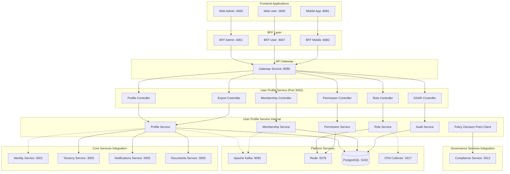

# 🏗️ Design Document – User Profile Service

## Overview

The User Profile Service is the **canonical source of truth** for all user profile data, business attributes, relationships, roles, and preferences within the SmartEdify platform. Operating at port 3002, it manages comprehensive user profiles for multi-tenant condominium governance, handles role-based access control (RBAC), and ensures strict data privacy compliance. This service initiates user registration flows and coordinates with other services through event-driven architecture.

## Service Boundaries and Data Ownership

**⚠️ CRITICAL: The User Profile Service is the exclusive owner and manager of ALL user profile data, business attributes, relationships, roles, entitlements, and communication preferences. It serves as the canonical source of truth and initiates user registration flows.**

### Owned Data and Responsibilities:
- **User Profiles**: Full name, personal details, verification status, trust levels
- **Contact Information**: Email addresses, phone numbers (canonical source for display/business logic)
- **Condominium Memberships**: Unit relationships, occupancy details, membership periods
- **Role-Based Access Control**: Role assignments, permissions, entitlements
- **Communication Preferences**: Notification settings, channel preferences (not legal consents)
- **Audit Trails**: Complete change history with immutable snapshots
- **Data Subject Rights**: DSAR orchestration and cross-service coordination

### Delegated Responsibilities (NOT owned):
- **Authentication**: Credentials, sessions, tokens → `identity-service`
- **Legal Compliance**: Policy validation, consent management → `compliance-service`
- **Document Storage**: File management, document versioning → `documents-service`
- **Unit Management**: Condominium structures, unit definitions → `tenancy-service`

### Data Flow and Event Emission:
The User Profile Service **initiates** user registration by creating canonical profiles first, then emits `ProfileCreated` events to Kafka. The identity-service consumes these events to create minimal technical identities for authentication purposes only.

## Architecture

### Integration with SmartEdify Global Architecture

The User Profile Service operates as a **Core Service** within the SmartEdify platform architecture, positioned at port 3002. It serves as the primary entry point for user registration and profile management:

- **Frontend Layer**: Direct registration through Web Admin (:4000), Web User (:3000), and Mobile App (:8081)
- **BFF Layer**: Profile management through BFF Admin (:4001), BFF User (:3007), and BFF Mobile (:8082)
- **Gateway Layer**: All requests routed through Gateway Service (:8080)
- **Service Layer**: Coordinates with Core, Governance, and Operations services as the canonical source
- **Platform Layer**: Utilizes shared infrastructure (PostgreSQL, Redis, Kafka, OpenTelemetry)

### High-Level Architecture



### Service Boundaries

**User Profile Service (Core Service - Port 3002) - Canonical Profile Data**
- **Profile Management**: Complete user profiles, personal information, verification status
- **Membership Management**: Condominium relationships, unit assignments, occupancy details
- **Role Management**: Hierarchical roles, permissions, entitlements
- **Preference Management**: Communication preferences, notification settings, privacy controls
- **Audit Management**: Historical tracking, change logs, compliance reporting
- **DSAR Coordination**: Data export/deletion orchestration

**Integration Points:**
- **Gateway Service**: All requests routed through API Gateway (:8080)
- **Identity Service (:3001)**: Receives `ProfileCreated` events to create technical identities. **User Profile Service never reads from identity-service.**
- **Tenancy Service (:3003)**: Validates unit assignments and condominium memberships
- **Notifications Service (:3005)**: Receives preference updates and contact information
- **Documents Service (:3006)**: Manages profile documents and verification files
- **Compliance Service (:3012)**: Validates legal requirements and data processing permissions
- **Platform Services**: 
  - PostgreSQL for persistent data (:5432)
  - Redis for permission caching (:6379)
  - Kafka for event streaming (:9092)
  - OpenTelemetry for observability (:4317)

## Components and Interfaces

### 1. Profile Controller

**Endpoints:**
- `POST /api/v1/profiles` - Create user profile (canonical entry point)
- `GET /api/v1/profiles/{profile_id}` - Retrieve user profile
- `PUT /api/v1/profiles/{profile_id}` - Update user profile
- `PATCH /api/v1/profiles/{profile_id}` - Partial profile update
- `GET /api/v1/profiles/{profile_id}/verification` - Get verification status
- `PUT /api/v1/profiles/{profile_id}/verification` - Update verification status
- `DELETE /api/v1/profiles/{profile_id}` - Soft delete profile (status=INACTIVE)

**Key Features:**
- Canonical source for all profile data with immutable audit trails
- Multi-tenant isolation with PostgreSQL Row-Level Security (RLS)
- Profile status management with state transition validation
- Input validation: Email (RFC5322), Phone (E.164), Names (Unicode normalization)
- Event emission for profile changes with schema validation
- Idempotent operations with correlation ID tracking
- Rate limiting: 100 requests/minute per tenant for profile operations

### 2. Membership Controller

**Endpoints:**
- `POST /api/v1/profiles/{profile_id}/memberships` - Create condominium membership
- `GET /api/v1/profiles/{profile_id}/memberships` - List user memberships
- `GET /api/v1/memberships/{membership_id}` - Get specific membership
- `PUT /api/v1/memberships/{membership_id}` - Update membership details
- `DELETE /api/v1/memberships/{membership_id}` - End membership
- `GET /api/v1/condominiums/{condominium_id}/members` - List condominium members

**Key Features:**
- Relationship types: OWNER, TENANT, CONVIVIENTE, STAFF, PROVIDER, VISITOR
- Tenant types: ARRENDATARIO, CONVIVIENTE with responsible_profile_id validation
- Automatic status calculation (ACTIVE/ENDED) based on since/until timestamps
- Unit validation with tenancy-service integration

### 3. Role Controller

**Endpoints:**
- `POST /api/v1/profiles/{profile_id}/roles` - Assign role to user
- `GET /api/v1/profiles/{profile_id}/roles` - List user roles
- `DELETE /api/v1/profiles/{profile_id}/roles/{role_id}` - Revoke role
- `GET /api/v1/condominiums/{condominium_id}/roles` - List available roles
- `POST /api/v1/condominiums/{condominium_id}/roles` - Create custom role
- `PUT /api/v1/roles/{role_id}` - Update role definition

**Key Features:**
- Country-specific role templates
- Custom roles per condominium
- Grant/revocation timestamp tracking
- JSONB permissions storage
- RoleChanged event emission for identity-service token refresh

### 4. Permission Controller

**Endpoints:**
- `POST /api/v1/permissions/evaluate` - Evaluate user permissions
- `GET /api/v1/profiles/{profile_id}/permissions` - Get user effective permissions
- `POST /api/v1/permissions/bulk-evaluate` - Bulk permission evaluation
- `GET /api/v1/permissions/cache/status` - Permission cache health
- `DELETE /api/v1/permissions/cache` - Clear permission cache

**Key Features:**
- Policy Decision Point (PDP) integration
- P95 latency ≤ 150ms for evaluations
- Fail-closed behavior when PDP unavailable
- Intelligent caching with invalidation
- Decision rationale for audit purposes

### 5. Export Controller

**Endpoints:**
- `POST /api/v1/exports/profiles` - Create profile export job
- `POST /api/v1/exports/memberships` - Create membership export job
- `GET /api/v1/exports/jobs/{job_id}` - Get export job status
- `GET /api/v1/exports/jobs/{job_id}/download` - Download export file
- `GET /api/v1/exports/jobs` - List export jobs (with pagination)

**Key Features:**
- CSV and JSON format support
- Rate limiting (≤10 exports per minute)
- PII redaction based on permissions
- Bulk operation limits (10,000 rows, 5 concurrent jobs)
- Audit event generation

### 6. DSAR Controller

**Endpoints:**
- `POST /api/v1/dsar/profiles/{profile_id}/export` - Initiate data export
- `POST /api/v1/dsar/profiles/{profile_id}/delete` - Initiate data deletion
- `GET /api/v1/dsar/jobs/{job_id}` - Check DSAR job status
- `PUT /api/v1/dsar/jobs/{job_id}/complete` - Mark DSAR operation complete
- `GET /api/v1/dsar/jobs` - List DSAR jobs (with pagination and filtering)

**Key Features:**
- Cross-service orchestration proxy
- Crypto-erase with referential integrity
- Compliance-service coordination
- Immutable deletion records
- Completion event emission

## Data Models

### User Profile Entity
```typescript
interface UserProfile {
  id: string;
  tenantId: string;
  
  // CANONICAL SOURCE: Core profile information
  fullName: string; // ≤ 140 characters, required
  dateOfBirth?: Date;
  gender?: string; // Extensible enum from compliance-service
  profilePhotoUrl?: string;
  
  // Sensitive data with compliance metadata
  nationalId?: EncryptedField<string>; // AES-256-GCM with tenant KMS keys
  
  // Profile management
  status: ProfileStatus;
  verificationLevel: number; // 0-5 trust score
  createdAt: Date;
  updatedAt: Date;
  deletedAt?: Date; // Soft deletion
  
  // Privacy and preferences
  privacySettings: Record<string, boolean | string>;
  languagePreference: string; // ISO 639-1 code
  timezone: string; // IANA timezone identifier
  
  // Compliance metadata
  complianceMetadata: ComplianceMetadata[];
}

enum ProfileStatus {
  PENDING_VERIFICATION = 'PENDING_VERIFICATION',
  ACTIVE = 'ACTIVE',
  LOCKED = 'LOCKED',
  INACTIVE = 'INACTIVE'
}

interface EncryptedField<T> {
  encryptedValue: string; // AES-256-GCM encrypted
  keyId: string; // KMS key identifier
  encryptionTimestamp: Date;
  algorithm: 'AES-256-GCM'; // Explicit algorithm specification
}

interface ComplianceMetadata {
  dataField: string;
  purpose: string;
  legalBasis: 'CONSENT' | 'CONTRACT' | 'LEGAL_OBLIGATION';
  consentGrantedAt?: Date;
  retentionPeriod: string;
  automaticDeletionDate?: Date;
  jurisdiction: string;
  policyVersion: string; // Track policy version for audit
}
```

### Profile Contact Methods Entity (Normalized - No Duplication)
```typescript
interface ProfileContactMethod {
  id: string;
  profileId: string;
  tenantId: string;
  
  contactType: ContactType;
  value: string; // RFC5322 for email, E.164 for phone
  isVerified: boolean;
  isPrimary: boolean;
  
  // Compliance per contact method
  legalBasis: LegalBasis;
  consentGrantedAt?: Date;
  retentionPolicy: string;
  
  createdAt: Date;
  updatedAt: Date;
  verifiedAt?: Date;
}

enum ContactType {
  PRIMARY_EMAIL = 'PRIMARY_EMAIL',
  SECONDARY_EMAIL = 'SECONDARY_EMAIL',
  PRIMARY_PHONE = 'PRIMARY_PHONE',
  SECONDARY_PHONE = 'SECONDARY_PHONE'
}

enum LegalBasis {
  CONSENT = 'CONSENT',
  CONTRACT = 'CONTRACT',
  LEGAL_OBLIGATION = 'LEGAL_OBLIGATION'
}
```

### Condominium Membership Entity
```typescript
interface CondominiumMembership {
  id: string;
  profile_id: string;
  tenant_id: string;
  condominium_id: string;
  unit_id: string; // Validated with tenancy-service
  
  // Relationship details
  relationship: 'OWNER' | 'TENANT' | 'CONVIVIENTE' | 'STAFF' | 'PROVIDER' | 'VISITOR';
  tenant_type?: 'ARRENDATARIO' | 'CONVIVIENTE';
  responsible_profile_id?: string; // For CONVIVIENTE/ARRENDATARIO
  
  // Membership period
  since: Date;
  until?: Date;
  status: 'ACTIVE' | 'ENDED'; // Calculated from timestamps
  
  created_at: Date;
  updated_at: Date;
}
```

### Role Assignment Entity
```typescript
interface RoleAssignment {
  id: string;
  profile_id: string;
  tenant_id: string;
  condominium_id: string;
  role_id: string;
  
  // Audit trail
  granted_at: Date;
  granted_by: string;
  revoked_at?: Date;
  revoked_by?: string;
  
  // Role details
  role_name: string;
  permissions: string[]; // JSONB array
  is_custom: boolean;
}
```

### Communication Preferences Entity (No Contact Duplication)
```typescript
interface CommunicationPreferences {
  id: string;
  profile_id: string;
  tenant_id: string;
  
  // Channel preferences (NOT legal consents)
  channel: 'EMAIL' | 'SMS' | 'PUSH' | 'IN_APP';
  notification_type: 'GOVERNANCE' | 'MAINTENANCE' | 'SOCIAL' | 'EMERGENCY';
  enabled: boolean;
  
  // Reference to contact method (no duplication)
  preferred_contact_method_id?: string; // FK to ProfileContactMethod
  
  updated_at: Date;
}
```

### Entitlement Entity
```typescript
interface Entitlement {
  id: string;
  profile_id: string;
  tenant_id: string;
  condominium_id: string;
  
  service_code: string;
  entitlement_key: string;
  
  granted_at: Date;
  granted_by: string;
  revoked_at?: Date;
  revoked_by?: string;
  
  metadata: Record<string, any>;
}
```

### Immutable Audit Snapshots Entity
```typescript
interface ProfileAuditSnapshot {
  id: string;
  profile_id: string;
  tenant_id: string;
  
  // Complete state at the moment of the event (immutable)
  profile_snapshot: Record<string, any>;
  memberships_snapshot: Record<string, any>[];
  roles_snapshot: Record<string, any>[];
  contact_methods_snapshot: Record<string, any>[];
  
  event_type: 'CREATED' | 'UPDATED' | 'VERIFIED' | 'LOCKED' | 'DELETED';
  actor_id: string;
  actor_type: 'USER' | 'ADMIN' | 'SYSTEM';
  correlation_id: string;
  timestamp: Date;
  
  // Blockchain-style integrity
  snapshot_hash: string; // SHA-256 of complete snapshot
  previous_hash?: string; // Hash of previous snapshot for chain integrity
}
```

### Cross-Service Consistency Entity
```typescript
interface ConsistencyCheck {
  id: string;
  profile_id: string;
  tenant_id: string;
  
  check_type: 'IDENTITY_SYNC' | 'TENANCY_VALIDATION' | 'COMPLIANCE_VALIDATION';
  status: 'CONSISTENT' | 'INCONSISTENT' | 'RECONCILED' | 'FAILED';
  
  inconsistency_details?: Record<string, any>;
  reconciliation_action?: string;
  
  checked_at: Date;
  reconciled_at?: Date;
  next_check_at: Date;
}
```

## Error Handling

### Error Response Format
```typescript
interface ErrorResponse {
  error: string;
  error_description: string;
  error_details?: Record<string, any>;
  correlation_id: string;
  timestamp: string;
  tenant_id: string;
}
```

### Error Categories

1. **Validation Errors (400)**
   - `INVALID_PROFILE_DATA` - Field validation failed (specific field in error_details)
   - `DUPLICATE_PROFILE` - Profile already exists for this tenant
   - `INVALID_CONTACT_FORMAT` - Email/phone format validation failed
   - `PROFILE_STATUS_TRANSITION_INVALID` - Invalid status change attempted

2. **Business Logic Errors (422)**
   - `INVALID_UNIT_REFERENCE` - Unit not found in tenancy-service
   - `INVALID_RELATIONSHIP_TYPE` - Unsupported relationship type for unit
   - `RESPONSIBLE_PROFILE_REQUIRED` - Missing responsible profile for tenant types
   - `MEMBERSHIP_PERIOD_CONFLICT` - Overlapping membership periods detected

3. **Authorization Errors (403)**
   - `INSUFFICIENT_PERMISSIONS` - Missing required permissions for operation
   - `ROLE_ASSIGNMENT_DENIED` - Cannot assign role to user in this context
   - `CROSS_TENANT_ACCESS_DENIED` - Attempted cross-tenant operation
   - `PROFILE_LOCKED` - Profile is locked for modifications

4. **Rate Limiting (429)**
   - `EXPORT_RATE_EXCEEDED` - Export rate limit exceeded (10/minute)
   - `BULK_OPERATION_LIMIT_EXCEEDED` - Bulk operation limits exceeded
   - `API_RATE_LIMIT_EXCEEDED` - General API rate limit exceeded (100/minute)

5. **Service Dependencies (503)**
   - `TENANCY_SERVICE_UNAVAILABLE` - Cannot validate unit references
   - `COMPLIANCE_SERVICE_UNAVAILABLE` - Cannot validate legal requirements
   - `PDP_SERVICE_UNAVAILABLE` - Permission evaluation service unavailable

## Testing Strategy

### Unit Testing
- Profile validation logic
- Membership relationship validation
- Permission evaluation algorithms
- Event emission logic
- Data encryption/decryption

### Integration Testing
- Cross-service event flows (ProfileCreated → identity-service)
- Tenancy-service unit validation
- Compliance-service legal validation
- PDP permission evaluation
- Database transaction integrity with RLS

### Security Testing
- Row-Level Security (RLS) enforcement
- Multi-tenant data isolation
- Permission evaluation security
- PII encryption validation
- Audit trail integrity

### Performance Testing
- Profile lookup performance (target: <100ms P95)
- Permission evaluation latency (target: <150ms P95)
- Bulk operation performance (10,000 rows)
- Export generation performance
- Database query optimization

### Compliance Testing
- GDPR DSAR workflow validation
- Data retention policy compliance
- Cross-service deletion coordination
- Audit trail completeness
- Privacy settings enforcement

## Cross-Service Consistency and Health Management

### Consistency Monitoring Service
```typescript
@Injectable()
export class CrossServiceConsistencyService {
  
  @Cron('*/5 * * * *') // Every 5 minutes
  async verifyGlobalConsistency() {
    const inconsistencies = await this.findInconsistencies();
    
    for (const inconsistency of inconsistencies) {
      await this.reconcileInconsistency(inconsistency);
    }
    
    await this.emitConsistencyMetrics(inconsistencies);
  }
  
  private async reconcileInconsistency(inconsistency: ConsistencyIssue) {
    // UPS ALWAYS WINS - it's the canonical source
    const canonicalData = await this.getCanonicalData(inconsistency.profileId);
    await this.syncDependentServices(canonicalData);
  }
}
```

### Health Check Controller
```typescript
@Controller('health')
export class HealthController {
  
  @Get('deep')
  async deepHealthCheck() {
    return {
      service: 'user-profiles-service',
      status: await this.checkServiceHealth(),
      dependencies: {
        postgres: await this.checkPostgres(),
        kafka: await this.checkKafka(),
        redis: await this.checkRedis(),
        identity_service: await this.checkIdentityService(),
        tenancy_service: await this.checkTenancyService(),
        compliance_service: await this.checkComplianceService()
      },
      consistency: await this.checkDataConsistency(),
      compliance: await this.checkComplianceHealth()
    };
  }
  
  private async checkDataConsistency() {
    const inconsistencies = await this.consistencyService.findInconsistencies();
    return {
      status: inconsistencies.length === 0 ? 'HEALTHY' : 'DEGRADED',
      inconsistency_count: inconsistencies.length,
      last_reconciliation: await this.getLastReconciliationTime()
    };
  }
}
```

### Event Schema Registry
```typescript
interface EventSchema {
  ProfileCreated: {
    version: '1.0';
    schema: {
      event_id: string;
      profile_id: string;
      tenant_id: string;
      timestamp: Date;
      profile_data: {
        full_name: string;
        contact_methods: ProfileContactMethod[];
      };
    };
    required: ['profile_id', 'tenant_id', 'profile_data'];
    producer: 'user-profiles-service';
    consumers: ['identity-service', 'notifications-service'];
  };
  
  ProfileUpdated: {
    version: '1.0';
    schema: {
      event_id: string;
      profile_id: string;
      tenant_id: string;
      timestamp: Date;
      changed_fields: string[];
      new_values: Record<string, any>;
    };
    required: ['profile_id', 'tenant_id', 'changed_fields'];
    producer: 'user-profiles-service';
    consumers: ['identity-service', 'notifications-service', 'governance-service'];
  };
}
```

### Circuit Breaker Configuration
```typescript
@Injectable()
export class ResilientServiceClient {
  
  @CircuitBreaker({
    failureThreshold: 5,
    recoveryTimeout: 30000,
    monitoringPeriod: 10000
  })
  async callTenancyService(unitId: string) {
    // Tenancy service validation with circuit breaker
  }
  
  @CircuitBreaker({
    failureThreshold: 3,
    recoveryTimeout: 60000,
    fallbackMethod: 'complianceFallback'
  })
  async callComplianceService(request: ComplianceRequest) {
    // Compliance service validation with fallback
  }
  
  private async complianceFallback(request: ComplianceRequest) {
    // Fail-safe compliance validation
    return { approved: false, reason: 'COMPLIANCE_SERVICE_UNAVAILABLE' };
  }
}
```

## Security Considerations

### Data Protection
- **PII Encryption**: 
  - Algorithm: AES-256-GCM for all sensitive fields
  - Key Management: AWS KMS with tenant-specific keys
  - Key Rotation: Automatic 90-day rotation with re-encryption
  - Access Control: IAM roles with least-privilege principle
- **Row-Level Security**: All tables enforce tenant_id isolation with PostgreSQL RLS
- **Audit Trails**: Immutable snapshots with blockchain-style hash chaining
- **Privacy Controls**: Granular privacy settings per data field with compliance metadata

### Access Control
- **JWT Validation**: ES256/EdDSA tokens with kid header and DPoP binding
- **Permission Caching**: Intelligent caching with proper invalidation
- **Fail-Closed**: Deny access when PDP unavailable
- **Cross-Tenant Protection**: Strict tenant boundary enforcement

### Data Integrity
- **Referential Integrity**: Foreign key constraints with cascade rules
- **Optimistic Locking**: Prevent concurrent update conflicts
- **Event Consistency**: Transactional event emission
- **Backup Validation**: Regular data consistency checks

## Best Practices and Conventions

### API Design Principles
- **RESTful Design**: All endpoints follow REST conventions with proper HTTP verbs
- **Versioning**: API versioned with `/api/v1/` prefix for backward compatibility
- **Consistent Naming**: camelCase for JSON fields, kebab-case for URLs
- **Idempotency**: All write operations support idempotency keys
- **Pagination**: List endpoints use cursor-based pagination with `limit` and `cursor` parameters

### Data Consistency Patterns
- **Event Sourcing**: All state changes emit events with complete context
- **Eventual Consistency**: Cross-service consistency achieved through event processing
- **Optimistic Locking**: Version fields prevent concurrent update conflicts
- **Immutable Audit**: Historical records never modified, only appended

### Security Best Practices
- **Principle of Least Privilege**: Minimal permissions for each operation
- **Defense in Depth**: Multiple layers of validation and authorization
- **Encryption at Rest**: All PII encrypted with tenant-specific keys
- **Audit Everything**: Complete audit trail for all data access and modifications

### Performance Optimization
- **Caching Strategy**: Redis for frequently accessed permissions and roles
- **Database Optimization**: Proper indexing on tenant_id, profile_id, and timestamps
- **Connection Pooling**: Efficient database connection management
- **Async Processing**: Heavy operations (exports, bulk updates) processed asynchronously

### Error Handling Standards
- **Structured Errors**: Consistent error format with correlation IDs
- **Graceful Degradation**: Fallback behavior when dependencies unavailable
- **Circuit Breakers**: Prevent cascade failures from service dependencies
- **Retry Logic**: Exponential backoff for transient failures

## Deployment Considerations

### Environment Configuration
- **Port Configuration**: Service runs on port 3002 as defined in global architecture
- **Database Sharding**: Tenant-based partitioning strategy
- **Gateway Integration**: All traffic routed through Gateway Service (:8080)
- **Service Discovery**: Integration with platform service registry

### Platform Services Integration
- **PostgreSQL (:5432)**: Primary database with RLS and tenant partitioning
- **Redis (:6379)**: Permission caching and session data
- **Apache Kafka (:9092)**: Event streaming for profile changes
- **OpenTelemetry (:4317)**: Distributed tracing and metrics collection

### Monitoring and Observability
- **Prometheus Integration**: Metrics exposed for Prometheus (:9090) collection
- **Grafana Dashboards**: Integration with Grafana (:3000) for visualization
- **OpenTelemetry Tracing**: Distributed tracing through OTel Collector (:4317)
- **Profile Metrics**: Registration rates, verification completion, role assignments
- **Permission Metrics**: Evaluation latency, cache hit rates, PDP availability
- **Bulk Operation Metrics**: Job completion rates, error rates, processing times
- **Compliance Metrics**:
  - Valid consents rate and explicit consents count
  - DSAR response time P95 and completion rate
  - Data retention compliance percentage
  - Automatic deletions count and audit trail completeness
  - Cross-service consistency health score
- **Security Metrics**:
  - Encryption key rotation success rate
  - Failed authentication attempts per tenant
  - Suspicious access pattern detection
  - Data breach detection and response times

### Service Communication
- **Synchronous**: REST API calls through Gateway Service
- **Asynchronous**: Event-driven communication via Kafka
- **Outbound Events**: 
  - `ProfileCreated` → Identity Service (for technical identity creation)
  - `ProfileUpdated` → All dependent services
  - `RoleChanged` → Identity Service (for token refresh)
  - `PreferencesUpdated` → Notifications Service
  - `MembershipChanged` → Governance Services

### Compliance and Audit
- **Audit Logging**: All profile operations with correlation IDs
- **Data Retention**: Configurable per jurisdiction via Compliance Service
- **DSAR Orchestration**: Cross-service data export/deletion coordination
- **Privacy by Design**: Minimal data collection and granular privacy controls