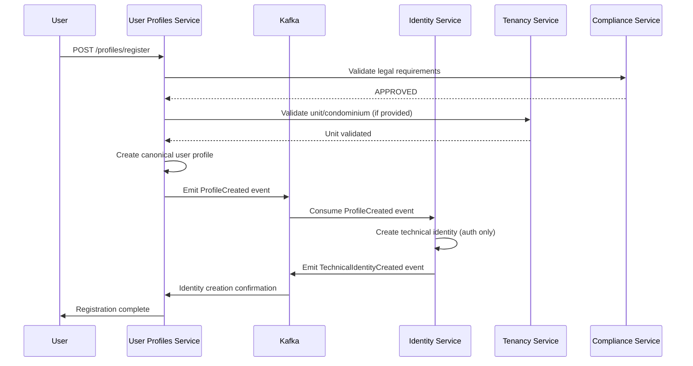

# 📋 Requirements Document – User Profiles Service

## 1. Introduction

This document establishes the auditable requirements for `user-profiles-service` (port 3002), defining the minimum technical, business, and integration criteria to be validated. The service serves as the **canonical source of truth** for user profiles, memberships, local roles, and entitlements within the SmartEdify platform, managing relationships between people and condominium units while ensuring proper role-based access control and compliance with data protection regulations.

---

## 2. Requirements

### Requirement ID: UP-001 - Multi-Tenant Profile Management

**User Story:**  
As a system administrator, I want to create and manage user profiles within specific tenants, so that user data remains properly isolated and organized by SaaS customer while serving as the canonical source for all profile information.

**Acceptance Criteria:**
1. WHEN creating a user profile THEN the system SHALL require tenant_id and enforce RLS (Row-Level Security) on all operations
2. WHEN validating profile data THEN the system SHALL validate email format (RFC5322 simplified), phone format (E.164), and full_name length (≤ 140 characters)
3. WHEN managing profile status THEN the system SHALL support states: PENDING_VERIFICATION, ACTIVE, LOCKED, INACTIVE
4. WHEN performing soft deletion THEN the system SHALL use deleted_at timestamp while preferring status=INACTIVE for operational deactivation
5. WHEN accessing profile data THEN the system SHALL enforce tenant isolation through RLS policies
6. WHEN creating profiles THEN the system SHALL emit ProfileCreated events for identity-service consumption
7. WHEN serving as canonical source THEN the system SHALL never delegate profile data management to other services
8. WHEN profile data changes THEN the system SHALL be the exclusive source of truth for all consumer services

---

### Requirement ID: UP-002 - Condominium Membership Management

**User Story:**  
As a condominium administrator, I want to manage user memberships and relationships to units, so that proper access controls and responsibilities are established within the community.

**Acceptance Criteria:**
1. WHEN creating memberships THEN the system SHALL validate that unit_id references a valid unit from tenancy-service with kind='PRIVATE'
2. WHEN assigning relationships THEN the system SHALL support: OWNER, TENANT, CONVIVIENTE, STAFF, PROVIDER, VISITOR
3. WHEN managing tenant types THEN the system SHALL support ARRENDATARIO and CONVIVIENTE with proper responsible_profile_id validation
4. WHEN setting membership periods THEN the system SHALL automatically calculate status as ACTIVE or ENDED based on since/until timestamps
5. WHEN validating responsible profiles THEN the system SHALL ensure responsible_profile_id belongs to same condominium with relation ∈ {OWNER, TENANT}

---

### Requirement ID: UP-003 - Role-Based Access Control (RBAC)

**User Story:**  
As a condominium administrator, I want to define and assign roles to users, so that permissions are consistently applied across the platform and integrate with identity-service authorization.

**Acceptance Criteria:**
1. WHEN managing roles THEN the system SHALL support country-specific templates and custom roles per condominium
2. WHEN assigning roles THEN the system SHALL track grant and revocation timestamps for audit purposes
3. WHEN validating role assignments THEN the system SHALL ensure user belongs to the same condominium as the role
4. WHEN managing role permissions THEN the system SHALL store permissions as JSONB array with structured format
5. WHEN roles change THEN the system SHALL emit RoleChanged events to trigger token refresh in identity-service

---

### Requirement ID: UP-004 - Entitlements Management

**User Story:**  
As a service provider, I want to grant and revoke service entitlements to users, so that premium features are properly controlled and monetized.

**Acceptance Criteria:**
1. WHEN granting entitlements THEN the system SHALL require service_code, entitlement_key, and condominium context
2. WHEN managing entitlements THEN the system SHALL track grant and revocation timestamps
3. WHEN querying entitlements THEN the system SHALL return active entitlements (where revoked_at IS NULL)
4. WHEN validating entitlements THEN the system SHALL enforce tenant and condominium boundaries
5. WHEN revoking entitlements THEN the system SHALL set revoked_at timestamp without deleting the record

---

### Requirement ID: UP-005 - Permission Evaluation Engine

**User Story:**  
As an application service, I want to evaluate user permissions in real-time, so that access decisions are consistent and policy-driven.

**Acceptance Criteria:**
1. WHEN evaluating permissions THEN the system SHALL integrate with PDP (Policy Decision Point) and cache results appropriately
2. WHEN PDP is unavailable THEN the system SHALL implement fail-closed behavior to deny access
3. WHEN measuring performance THEN the system SHALL achieve P95 latency ≤ 150ms for permission evaluations
4. WHEN caching policy decisions THEN the system SHALL implement proper cache invalidation on membership or role changes
5. WHEN returning evaluation results THEN the system SHALL include decision rationale for audit purposes

---

### Requirement ID: UP-006 - Communication Preferences Management

**User Story:**  
As a user, I want to control my communication preferences, so that I receive only the notifications I want through my preferred channels while maintaining the canonical source for all contact preferences.

**Acceptance Criteria:**
1. WHEN managing preferences THEN the system SHALL track channel, purpose, and user preferences only (not legal compliance)
2. WHEN updating preferences THEN the system SHALL maintain audit history of changes with timestamps
3. WHEN managing preferences THEN the system SHALL NOT validate legal compliance (delegated to compliance-service)
4. WHEN querying preferences THEN the system SHALL return current preference state per channel and purpose
5. WHEN preferences change THEN the system SHALL emit PreferencesUpdated events to notification-service

---

### Requirement ID: UP-007 - Bulk Operations Support

**User Story:**  
As an administrator, I want to perform bulk operations on profiles and memberships, so that I can efficiently manage large condominium communities.

**Acceptance Criteria:**
1. WHEN processing bulk operations THEN the system SHALL limit to 10,000 rows per job and 5 concurrent jobs per tenant
2. WHEN validating bulk data THEN the system SHALL provide detailed validation reports with error specifics
3. WHEN executing bulk operations THEN the system SHALL process asynchronously with job status tracking
4. WHEN handling bulk failures THEN the system SHALL provide rollback mechanisms for partial failures
5. WHEN monitoring bulk operations THEN the system SHALL expose metrics for job completion rates and error rates

---

### Requirement ID: UP-008 - Data Export Capabilities

**User Story:**  
As an administrator, I want to export user and membership data, so that I can generate reports and perform external analysis while maintaining the canonical source of profile data.

**Acceptance Criteria:**
1. WHEN generating exports THEN the system SHALL support CSV and JSON formats with configurable fields
2. WHEN managing export requests THEN the system SHALL enforce rate limits of ≤ 10 exports per minute
3. WHEN processing exports THEN the system SHALL apply proper PII redaction based on user permissions
4. WHEN exporting data THEN the system SHALL include tenant_id and condominium_id context in all records
5. WHEN completing exports THEN the system SHALL generate audit events for compliance tracking

---

### Requirement ID: UP-009 - Historical Audit Trail

**User Story:**  
As an auditor, I want to track all changes to profiles and memberships, so that I can maintain complete audit trails for compliance and troubleshooting.

**Acceptance Criteria:**
1. WHEN modifying profiles THEN the system SHALL record events in profile_history with event_type and data diff
2. WHEN changing memberships THEN the system SHALL record events in membership_history with complete change context
3. WHEN querying history THEN the system SHALL filter by tenant_id, condominium_id, and time range
4. WHEN storing historical data THEN the system SHALL include actor information for accountability
5. WHEN retaining audit data THEN the system SHALL comply with data retention policies from compliance-service

---

### Requirement ID: UP-010 - DSAR Compliance Integration

**User Story:**  
As a data subject, I want my data deletion requests to be properly processed across all services, so that my right to be forgotten is respected while coordinating with identity-service.

**Acceptance Criteria:**
1. WHEN receiving DSAR requests THEN the system SHALL act as proxy between identity-service and compliance-service
2. WHEN processing data deletion THEN the system SHALL perform crypto-erase of user data while maintaining referential integrity
3. WHEN handling cross-service deletion THEN the system SHALL participate in the orchestrated deletion flow managed by compliance-service
4. WHEN completing DSAR operations THEN the system SHALL verify successful deletion and generate completion events
5. WHEN auditing DSAR compliance THEN the system SHALL maintain immutable records of all deletion operations

---

### Requirement ID: UP-011 - Policy Bindings Management

**User Story:**  
As a compliance officer, I want to manage policy bindings for condominiums, so that legal and operational policies are properly enforced.

**Acceptance Criteria:**
1. WHEN creating policy bindings THEN the system SHALL require policy_id, policy_version, and scope
2. WHEN updating policies THEN the system SHALL maintain version history for audit purposes
3. WHEN evaluating policies THEN the system SHALL consider condominium-specific bindings in permission decisions
4. WHEN querying active policies THEN the system SHALL return current bindings with version information
5. WHEN policy conflicts occur THEN the system SHALL apply conflict resolution rules based on policy hierarchy

---

## 3. User Registration and Synchronization Flow

### High-Level Integration Flow

### Step-by-Step Process

1. **User Registration Initiation**
   - User submits registration through user-profiles-service (canonical source)
   - User-profiles-service validates all business data and requirements
   - Compliance-service validates legal requirements and data processing permissions

2. **Canonical Profile Creation**
   - User-profiles-service creates comprehensive user profile as source of truth
   - All business attributes, preferences, and profile data stored here
   - User-profiles-service emits `ProfileCreated` event to Kafka

3. **Technical Identity Creation**
   - Identity-service consumes `ProfileCreated` event
   - Identity-service creates minimal technical identity (authentication only)
   - Email/phone copied for authentication purposes only (not canonical source)

4. **Change Propagation**
   - All profile changes originate from user-profiles-service
   - Events emitted: ProfileUpdated, RoleChanged, PreferencesUpdated, etc.
   - Identity-service and other services consume events for synchronization
   - No direct database access between services

---

## 4. Cross-Service Integration Validation

**User Story:**  
As a system architect, I want to validate consistency across services to identify missing or incorrect dependencies.

**Acceptance Criteria:**
1. WHEN validating consistency THEN the system SHALL ensure identity-service user IDs are created from ProfileCreated events
2. WHEN reviewing APIs THEN the system SHALL verify unit_id references valid tenancy-service units with proper kind validation
3. WHEN analyzing events THEN the system SHALL confirm ProfileCreated events are properly emitted to identity-service
4. WHEN validating security THEN the system SHALL enforce JWT with ES256/EdDSA, kid header, and DPoP for write operations
5. WHEN reviewing data models THEN the system SHALL ensure RLS is active on all tables with proper tenant_id enforcement
6. WHEN validating data ownership THEN the system SHALL confirm it is the exclusive source for all profile data and never delegates to identity-service
7. WHEN reviewing integration patterns THEN the system SHALL confirm identity-service consumes events from user-profiles-service, not vice versa

---

## 5. Reporting & Traceability

- **Traceability:**  
  All requirements must be uniquely referenced (UP-XXX) for traceability in implementation, testing, and audit reports. Each requirement shall be mapped to specific API endpoints, database schemas, and event types.

- **Reporting:**  
  The system SHALL generate a requirements coverage matrix and report all unmet or partially met requirements. Key performance indicators shall include:
  - Profile management operation success rates
  - Permission evaluation latency percentiles
  - Bulk operation completion metrics
  - DSAR request processing times
  - Cross-service integration health

---

## 6. Approval & Change Control

- **Versioning:**  
  Update this document as requirements change, recording revisions and rationales. All changes must reference architectural decisions and compliance impacts, particularly for membership relationship rules and data protection requirements.

- **Approval:**  
  All requirements must be reviewed and approved by architecture and product leads before moving to implementation. Specific approvals required from:
  - Chief Technology Officer
  - Data Protection Officer
  - Product Manager - Community Management
  - Security Architect

---

> _This document specifies and tracks requirements for SmartEdify User Profiles Service, ensuring proper management of user relationships, roles, and entitlements within the multi-tenant condominium management platform while serving as the canonical source of truth for all user profile data._