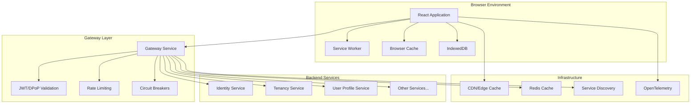
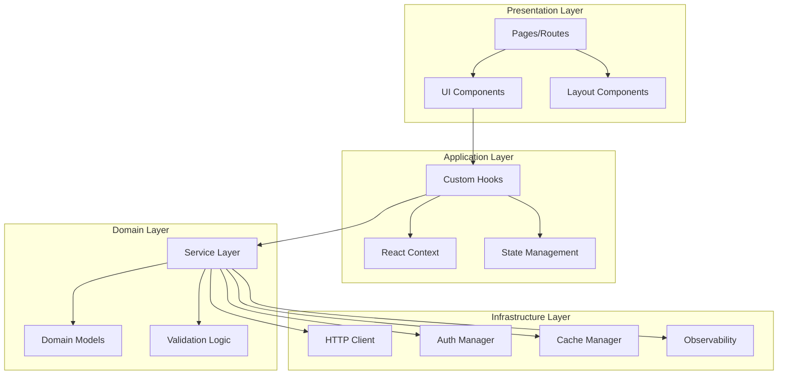

# 🏗️ Design Document – Web Admin Service

## Overview

The Web Admin Service is a modern React-based frontend application that provides the administrative interface for the SmartEdify platform (port 4000). It implements secure authentication flows, comprehensive service testing interfaces, and a responsive dashboard system. The application is designed to work seamlessly with the Gateway Service, implementing JWT/DPoP authentication, multi-tenant context management, and comprehensive observability.

### Key Design Principles

- **Security First**: All authentication and authorization flows follow zero-trust principles
- **Multi-Tenant Aware**: Every component respects tenant boundaries and context
- **Performance Optimized**: Designed for sub-2.5s load times including gateway overhead
- **Accessibility Compliant**: WCAG 2.1 AA compliance throughout the application
- **Observable**: Full tracing and metrics integration for operational excellence

---

## Architecture

### High-Level Architecture



### Component Architecture



---

## Components and Interfaces

### Core Authentication System

```typescript
// Authentication Manager
interface AuthManager {
  // JWT Token Management
  tokenStorage: {
    store: (tokens: TokenPair) => Promise<void>;
    retrieve: () => Promise<TokenPair | null>;
    clear: () => Promise<void>;
    isExpired: (token: string) => boolean;
  };
  
  // DPoP Proof Generation
  dpopManager: {
    generateKeyPair: () => Promise<CryptoKeyPair>;
    storeKeyPair: (keyPair: CryptoKeyPair) => Promise<void>;
    generateProof: (method: string, url: string, accessToken?: string) => Promise<string>;
    rotateKeys: () => Promise<void>;
  };
  
  // Session Management
  sessionManager: {
    startSession: (tokens: TokenPair) => Promise<void>;
    refreshSession: () => Promise<boolean>;
    endSession: () => Promise<void>;
    getSessionInfo: () => SessionInfo | null;
  };
  
  // Authentication Flow
  authenticate: (credentials: LoginCredentials) => Promise<AuthResult>;
  logout: () => Promise<void>;
  refreshTokens: () => Promise<boolean>;
}

interface TokenPair {
  accessToken: string;
  refreshToken: string;
  expiresAt: number;
  tokenType: 'Bearer';
}

interface DPoPProof {
  header: {
    typ: 'dpop+jwt';
    alg: 'ES256';
    jwk: JsonWebKey;
  };
  payload: {
    jti: string;
    htm: string;
    htu: string;
    iat: number;
    ath?: string; // hash of access token
  };
}

class AuthManagerImpl implements AuthManager {
  private keyPair: CryptoKeyPair | null = null;
  private sessionTimer: NodeJS.Timeout | null = null;
  
  async initialize(): Promise<void> {
    // Load or generate DPoP key pair
    this.keyPair = await this.loadOrGenerateKeyPair();
    
    // Check for existing session
    const tokens = await this.tokenStorage.retrieve();
    if (tokens && !this.tokenStorage.isExpired(tokens.accessToken)) {
      await this.sessionManager.startSession(tokens);
    }
  }
  
  async authenticate(credentials: LoginCredentials): Promise<AuthResult> {
    const dpopProof = await this.dpopManager.generateProof('POST', '/api/v1/auth/login');
    
    const response = await fetch('/api/v1/auth/login', {
      method: 'POST',
      headers: {
        'Content-Type': 'application/json',
        'DPoP': dpopProof,
      },
      body: JSON.stringify(credentials),
      credentials: 'include', // Include httpOnly cookies
    });
    
    if (response.ok) {
      const result = await response.json();
      await this.sessionManager.startSession(result.tokens);
      return { success: true, user: result.user };
    }
    
    return { success: false, error: await response.text() };
  }
  
  private async loadOrGenerateKeyPair(): Promise<CryptoKeyPair> {
    // Try to load existing key pair from IndexedDB
    const stored = await this.getStoredKeyPair();
    if (stored) return stored;
    
    // Generate new key pair
    const keyPair = await crypto.subtle.generateKey(
      {
        name: 'ECDSA',
        namedCurve: 'P-256',
      },
      true,
      ['sign', 'verify']
    );
    
    await this.dpopManager.storeKeyPair(keyPair);
    return keyPair;
  }
}
```

### Multi-Tenant Context System

```typescript
// Tenant Context Management
interface TenantContextManager {
  currentTenant: Tenant | null;
  availableTenants: Tenant[];
  
  // Context Operations
  detectTenant: () => Promise<Tenant | null>;
  switchTenant: (tenantId: string) => Promise<boolean>;
  validateTenantAccess: (tenantId: string) => Promise<boolean>;
  
  // UI Integration
  getTenantTheme: (tenantId: string) => Promise<TenantTheme>;
  getTenantFeatures: (tenantId: string) => Promise<FeatureFlags>;
  getTenantBranding: (tenantId: string) => Promise<BrandingConfig>;
}

interface Tenant {
  id: string;
  name: string;
  displayName: string;
  tier: 'free' | 'premium' | 'enterprise';
  status: 'active' | 'suspended' | 'trial';
  features: string[];
  branding?: {
    logo?: string;
    primaryColor?: string;
    secondaryColor?: string;
    customCss?: string;
  };
}

interface TenantTheme {
  colors: {
    primary: string;
    secondary: string;
    accent: string;
    background: string;
    surface: string;
    text: string;
  };
  typography: {
    fontFamily: string;
    fontSize: {
      small: string;
      medium: string;
      large: string;
    };
  };
  spacing: {
    unit: number;
    small: string;
    medium: string;
    large: string;
  };
}

// React Context for Tenant Management
const TenantContext = createContext<{
  tenant: Tenant | null;
  availableTenants: Tenant[];
  switchTenant: (tenantId: string) => Promise<void>;
  theme: TenantTheme;
  features: FeatureFlags;
}>({
  tenant: null,
  availableTenants: [],
  switchTenant: async () => {},
  theme: defaultTheme,
  features: {},
});

export const TenantProvider: React.FC<{ children: React.ReactNode }> = ({ children }) => {
  const [tenant, setTenant] = useState<Tenant | null>(null);
  const [availableTenants, setAvailableTenants] = useState<Tenant[]>([]);
  const [theme, setTheme] = useState<TenantTheme>(defaultTheme);
  const [features, setFeatures] = useState<FeatureFlags>({});
  
  const switchTenant = useCallback(async (tenantId: string) => {
    // Validate access
    const hasAccess = await tenantManager.validateTenantAccess(tenantId);
    if (!hasAccess) {
      throw new Error('Access denied to tenant');
    }
    
    // Switch requires re-authentication for security
    await authManager.logout();
    
    // Store tenant preference
    localStorage.setItem('preferredTenant', tenantId);
    
    // Redirect to login with tenant context
    window.location.href = `/login?tenant=${tenantId}`;
  }, []);
  
  useEffect(() => {
    const initializeTenantContext = async () => {
      const currentTenant = await tenantManager.detectTenant();
      if (currentTenant) {
        setTenant(currentTenant);
        setTheme(await tenantManager.getTenantTheme(currentTenant.id));
        setFeatures(await tenantManager.getTenantFeatures(currentTenant.id));
      }
      
      const available = await tenantManager.getAvailableTenants();
      setAvailableTenants(available);
    };
    
    initializeTenantContext();
  }, []);
  
  return (
    <TenantContext.Provider value={{ tenant, availableTenants, switchTenant, theme, features }}>
      {children}
    </TenantContext.Provider>
  );
};
```

### HTTP Client with Gateway Integration

```typescript
// HTTP Client with JWT/DPoP Integration
interface HTTPClient {
  get<T>(url: string, options?: RequestOptions): Promise<APIResponse<T>>;
  post<T>(url: string, data?: any, options?: RequestOptions): Promise<APIResponse<T>>;
  put<T>(url: string, data?: any, options?: RequestOptions): Promise<APIResponse<T>>;
  delete<T>(url: string, options?: RequestOptions): Promise<APIResponse<T>>;
  
  // Batch Operations
  batch(requests: BatchRequest[]): Promise<BatchResponse[]>;
  
  // WebSocket Support
  websocket(url: string, options?: WebSocketOptions): Promise<WebSocketConnection>;
}

interface RequestOptions {
  headers?: Record<string, string>;
  timeout?: number;
  retries?: number;
  cache?: 'no-cache' | 'force-cache' | 'default';
  tenantId?: string;
}

interface APIResponse<T> {
  data: T;
  status: number;
  headers: Record<string, string>;
  traceId: string;
  duration: number;
}

class HTTPClientImpl implements HTTPClient {
  private authManager: AuthManager;
  private tenantManager: TenantContextManager;
  private observability: ObservabilityManager;
  
  constructor(
    authManager: AuthManager,
    tenantManager: TenantContextManager,
    observability: ObservabilityManager
  ) {
    this.authManager = authManager;
    this.tenantManager = tenantManager;
    this.observability = observability;
  }
  
  async get<T>(url: string, options: RequestOptions = {}): Promise<APIResponse<T>> {
    return this.request<T>('GET', url, undefined, options);
  }
  
  async post<T>(url: string, data?: any, options: RequestOptions = {}): Promise<APIResponse<T>> {
    return this.request<T>('POST', url, data, options);
  }
  
  private async request<T>(
    method: string,
    url: string,
    data?: any,
    options: RequestOptions = {}
  ): Promise<APIResponse<T>> {
    const startTime = performance.now();
    const traceId = this.observability.generateTraceId();
    
    try {
      // Prepare headers
      const headers = await this.prepareHeaders(method, url, options);
      
      // Create request configuration
      const config: RequestInit = {
        method,
        headers,
        credentials: 'include',
        signal: AbortSignal.timeout(options.timeout || 10000),
      };
      
      if (data) {
        config.body = JSON.stringify(data);
      }
      
      // Execute request with retries
      const response = await this.executeWithRetries(url, config, options.retries || 3);
      
      // Parse response
      const responseData = await response.json();
      const duration = performance.now() - startTime;
      
      // Record metrics
      this.observability.recordAPICall({
        method,
        url,
        status: response.status,
        duration,
        traceId,
      });
      
      return {
        data: responseData,
        status: response.status,
        headers: Object.fromEntries(response.headers.entries()),
        traceId,
        duration,
      };
      
    } catch (error) {
      const duration = performance.now() - startTime;
      
      // Record error metrics
      this.observability.recordAPIError({
        method,
        url,
        error: error.message,
        duration,
        traceId,
      });
      
      throw new APIError(error.message, { method, url, traceId });
    }
  }
  
  private async prepareHeaders(
    method: string,
    url: string,
    options: RequestOptions
  ): Promise<Record<string, string>> {
    const headers: Record<string, string> = {
      'Content-Type': 'application/json',
      'X-Correlation-ID': this.observability.generateCorrelationId(),
      ...options.headers,
    };
    
    // Add tenant context
    const tenant = this.tenantManager.currentTenant;
    if (tenant) {
      headers['X-Tenant-ID'] = tenant.id;
    }
    
    // Add authentication headers
    const tokens = await this.authManager.tokenStorage.retrieve();
    if (tokens) {
      // Generate DPoP proof
      const dpopProof = await this.authManager.dpopManager.generateProof(
        method,
        url,
        tokens.accessToken
      );
      headers['DPoP'] = dpopProof;
      headers['Authorization'] = `Bearer ${tokens.accessToken}`;
    }
    
    return headers;
  }
  
  private async executeWithRetries(
    url: string,
    config: RequestInit,
    maxRetries: number
  ): Promise<Response> {
    let lastError: Error;
    
    for (let attempt = 0; attempt <= maxRetries; attempt++) {
      try {
        const response = await fetch(url, config);
        
        // Handle token refresh for 401 responses
        if (response.status === 401 && attempt === 0) {
          const refreshed = await this.authManager.refreshTokens();
          if (refreshed) {
            // Update headers with new tokens and retry
            const newHeaders = await this.prepareHeaders(
              config.method || 'GET',
              url,
              {}
            );
            config.headers = newHeaders;
            continue;
          }
        }
        
        // Return response for successful calls or non-retryable errors
        if (response.ok || !this.isRetryableError(response.status)) {
          return response;
        }
        
        throw new Error(`HTTP ${response.status}: ${response.statusText}`);
        
      } catch (error) {
        lastError = error;
        
        if (attempt < maxRetries) {
          // Exponential backoff
          const delay = Math.min(1000 * Math.pow(2, attempt), 10000);
          await new Promise(resolve => setTimeout(resolve, delay));
        }
      }
    }
    
    throw lastError;
  }
  
  private isRetryableError(status: number): boolean {
    return status >= 500 || status === 429 || status === 408;
  }
}
```

### Service Testing Interface Components

```typescript
// Service Testing Framework
interface ServiceTestingFramework {
  // Test Execution
  executeTest: (test: ServiceTest) => Promise<TestResult>;
  executeBatch: (tests: ServiceTest[]) => Promise<BatchTestResult>;
  
  // Test Management
  saveTest: (test: ServiceTest) => Promise<void>;
  loadTest: (testId: string) => Promise<ServiceTest>;
  getTestHistory: (serviceType: string) => Promise<TestResult[]>;
  
  // Request/Response Inspection
  inspectRequest: (request: APIRequest) => RequestInspection;
  inspectResponse: (response: APIResponse) => ResponseInspection;
  
  // Environment Management
  switchEnvironment: (env: 'dev' | 'staging' | 'prod') => void;
  getCurrentEnvironment: () => string;
}

interface ServiceTest {
  id: string;
  name: string;
  description: string;
  serviceType: 'tenancy' | 'user-profile' | 'identity';
  endpoint: string;
  method: 'GET' | 'POST' | 'PUT' | 'DELETE';
  headers: Record<string, string>;
  payload?: any;
  expectedStatus: number;
  expectedResponse?: any;
  assertions: TestAssertion[];
}

interface TestAssertion {
  type: 'status' | 'header' | 'body' | 'response-time' | 'schema';
  field?: string;
  operator: 'equals' | 'contains' | 'matches' | 'less-than' | 'greater-than';
  expected: any;
}

interface TestResult {
  testId: string;
  executedAt: Date;
  duration: number;
  status: 'passed' | 'failed' | 'error';
  request: APIRequest;
  response: APIResponse;
  assertions: AssertionResult[];
  traceId: string;
}

// React Components for Service Testing
const ServiceTestingInterface: React.FC = () => {
  const [selectedService, setSelectedService] = useState<'tenancy' | 'user-profile' | 'identity'>('tenancy');
  const [tests, setTests] = useState<ServiceTest[]>([]);
  const [results, setResults] = useState<TestResult[]>([]);
  const [isExecuting, setIsExecuting] = useState(false);
  
  return (
    <div className="service-testing-interface">
      <div className="testing-header">
        <ServiceSelector
          selected={selectedService}
          onSelect={setSelectedService}
        />
        <EnvironmentSelector />
      </div>
      
      <div className="testing-content">
        <div className="test-panel">
          <TestBuilder
            serviceType={selectedService}
            onTestCreated={(test) => setTests([...tests, test])}
          />
          <TestList
            tests={tests}
            onExecute={executeTest}
            onEdit={editTest}
            onDelete={deleteTest}
          />
        </div>
        
        <div className="results-panel">
          <TestResults
            results={results}
            isExecuting={isExecuting}
          />
          <RequestResponseInspector
            selectedResult={results[0]}
          />
        </div>
      </div>
    </div>
  );
};

const TestBuilder: React.FC<{
  serviceType: string;
  onTestCreated: (test: ServiceTest) => void;
}> = ({ serviceType, onTestCreated }) => {
  const [test, setTest] = useState<Partial<ServiceTest>>({
    serviceType: serviceType as any,
    method: 'GET',
    headers: {},
    assertions: [],
  });
  
  const handleSubmit = (e: React.FormEvent) => {
    e.preventDefault();
    if (test.name && test.endpoint) {
      onTestCreated({
        ...test,
        id: generateId(),
      } as ServiceTest);
      setTest({ serviceType: serviceType as any, method: 'GET', headers: {}, assertions: [] });
    }
  };
  
  return (
    <form onSubmit={handleSubmit} className="test-builder">
      <div className="form-group">
        <label htmlFor="test-name">Test Name</label>
        <input
          id="test-name"
          type="text"
          value={test.name || ''}
          onChange={(e) => setTest({ ...test, name: e.target.value })}
          placeholder="Enter test name"
          required
        />
      </div>
      
      <div className="form-group">
        <label htmlFor="endpoint">Endpoint</label>
        <div className="endpoint-builder">
          <select
            value={test.method}
            onChange={(e) => setTest({ ...test, method: e.target.value as any })}
          >
            <option value="GET">GET</option>
            <option value="POST">POST</option>
            <option value="PUT">PUT</option>
            <option value="DELETE">DELETE</option>
          </select>
          <input
            id="endpoint"
            type="text"
            value={test.endpoint || ''}
            onChange={(e) => setTest({ ...test, endpoint: e.target.value })}
            placeholder="/api/v1/tenants"
            required
          />
        </div>
      </div>
      
      <HeadersEditor
        headers={test.headers || {}}
        onChange={(headers) => setTest({ ...test, headers })}
      />
      
      {(test.method === 'POST' || test.method === 'PUT') && (
        <PayloadEditor
          payload={test.payload}
          onChange={(payload) => setTest({ ...test, payload })}
        />
      )}
      
      <AssertionsEditor
        assertions={test.assertions || []}
        onChange={(assertions) => setTest({ ...test, assertions })}
      />
      
      <button type="submit" className="btn-primary">
        Create Test
      </button>
    </form>
  );
};
```

---

## Data Models

### Authentication Models

```typescript
// User and Authentication Models
interface User {
  id: string;
  email: string;
  firstName: string;
  lastName: string;
  avatar?: string;
  roles: Role[];
  tenants: UserTenant[];
  preferences: UserPreferences;
  lastLoginAt: Date;
  createdAt: Date;
  updatedAt: Date;
}

interface Role {
  id: string;
  name: string;
  permissions: Permission[];
  tenantId?: string; // null for global roles
}

interface Permission {
  id: string;
  resource: string;
  action: string;
  conditions?: Record<string, any>;
}

interface UserTenant {
  tenantId: string;
  tenantName: string;
  roles: Role[];
  status: 'active' | 'suspended' | 'pending';
  joinedAt: Date;
}

interface UserPreferences {
  theme: 'light' | 'dark' | 'auto';
  language: string;
  timezone: string;
  notifications: NotificationPreferences;
  accessibility: AccessibilityPreferences;
}

interface NotificationPreferences {
  email: boolean;
  push: boolean;
  inApp: boolean;
  types: {
    security: boolean;
    system: boolean;
    tenant: boolean;
    personal: boolean;
  };
}

interface AccessibilityPreferences {
  highContrast: boolean;
  reducedMotion: boolean;
  fontSize: 'small' | 'medium' | 'large';
  screenReader: boolean;
}
```

### Service Testing Models

```typescript
// Service Testing Data Models
interface TenantTestData {
  id: string;
  name: string;
  displayName: string;
  tier: 'free' | 'premium' | 'enterprise';
  status: 'active' | 'suspended' | 'trial';
  settings: TenantSettings;
  quotas: TenantQuotas;
  users: TenantUser[];
  createdAt: Date;
  updatedAt: Date;
}

interface TenantSettings {
  branding: {
    logo?: string;
    primaryColor?: string;
    secondaryColor?: string;
    customCss?: string;
  };
  features: {
    [featureName: string]: boolean;
  };
  security: {
    passwordPolicy: PasswordPolicy;
    sessionTimeout: number;
    mfaRequired: boolean;
  };
}

interface TenantQuotas {
  users: {
    max: number;
    current: number;
  };
  storage: {
    max: number; // in bytes
    current: number;
  };
  apiCalls: {
    max: number; // per month
    current: number;
  };
}

interface UserProfileTestData {
  id: string;
  email: string;
  firstName: string;
  lastName: string;
  avatar?: string;
  phone?: string;
  address?: Address;
  profile: UserProfile;
  tenantId: string;
  roles: string[];
  status: 'active' | 'inactive' | 'suspended';
  emailVerified: boolean;
  phoneVerified: boolean;
  lastLoginAt?: Date;
  createdAt: Date;
  updatedAt: Date;
}

interface UserProfile {
  bio?: string;
  website?: string;
  socialLinks?: {
    linkedin?: string;
    twitter?: string;
    github?: string;
  };
  preferences: UserPreferences;
  customFields?: Record<string, any>;
}

interface IdentityTestData {
  userId: string;
  email: string;
  passwordHash: string;
  salt: string;
  mfaEnabled: boolean;
  mfaSecret?: string;
  backupCodes?: string[];
  sessions: UserSession[];
  loginAttempts: LoginAttempt[];
  passwordResets: PasswordReset[];
  emailVerification?: EmailVerification;
  createdAt: Date;
  updatedAt: Date;
}

interface UserSession {
  id: string;
  userId: string;
  deviceInfo: DeviceInfo;
  ipAddress: string;
  userAgent: string;
  createdAt: Date;
  lastActivityAt: Date;
  expiresAt: Date;
  isActive: boolean;
}

interface LoginAttempt {
  id: string;
  userId?: string;
  email: string;
  ipAddress: string;
  userAgent: string;
  success: boolean;
  failureReason?: string;
  attemptedAt: Date;
}
```

---

## Error Handling

### Comprehensive Error Management System

```typescript
// Error Handling Framework
interface ErrorHandler {
  // Error Classification
  classifyError: (error: Error) => ErrorClassification;
  
  // Error Recovery
  attemptRecovery: (error: ClassifiedError) => Promise<RecoveryResult>;
  
  // User Notification
  notifyUser: (error: ClassifiedError) => void;
  
  // Error Reporting
  reportError: (error: ClassifiedError) => Promise<void>;
}

interface ErrorClassification {
  type: 'network' | 'authentication' | 'authorization' | 'validation' | 'server' | 'client';
  severity: 'low' | 'medium' | 'high' | 'critical';
  recoverable: boolean;
  userMessage: string;
  technicalMessage: string;
  suggestedActions: string[];
}

interface ClassifiedError extends Error {
  classification: ErrorClassification;
  context: ErrorContext;
  traceId: string;
  timestamp: Date;
}

interface ErrorContext {
  userId?: string;
  tenantId?: string;
  url: string;
  userAgent: string;
  sessionId: string;
  apiCall?: {
    method: string;
    endpoint: string;
    payload?: any;
  };
}

class ErrorHandlerImpl implements ErrorHandler {
  private observability: ObservabilityManager;
  private notificationManager: NotificationManager;
  
  classifyError(error: Error): ErrorClassification {
    // Network errors
    if (error.name === 'TypeError' && error.message.includes('fetch')) {
      return {
        type: 'network',
        severity: 'medium',
        recoverable: true,
        userMessage: 'Connection issue detected. Please check your internet connection.',
        technicalMessage: error.message,
        suggestedActions: ['Check internet connection', 'Retry request', 'Contact support if persistent'],
      };
    }
    
    // Authentication errors
    if (error.message.includes('401') || error.message.includes('Unauthorized')) {
      return {
        type: 'authentication',
        severity: 'high',
        recoverable: true,
        userMessage: 'Your session has expired. Please log in again.',
        technicalMessage: error.message,
        suggestedActions: ['Log in again', 'Clear browser cache', 'Contact support'],
      };
    }
    
    // Authorization errors
    if (error.message.includes('403') || error.message.includes('Forbidden')) {
      return {
        type: 'authorization',
        severity: 'medium',
        recoverable: false,
        userMessage: 'You don\'t have permission to perform this action.',
        technicalMessage: error.message,
        suggestedActions: ['Contact administrator', 'Check user permissions', 'Switch tenant if applicable'],
      };
    }
    
    // Server errors
    if (error.message.includes('5')) {
      return {
        type: 'server',
        severity: 'high',
        recoverable: true,
        userMessage: 'Server is temporarily unavailable. Please try again in a moment.',
        technicalMessage: error.message,
        suggestedActions: ['Wait and retry', 'Check system status', 'Contact support'],
      };
    }
    
    // Default classification
    return {
      type: 'client',
      severity: 'medium',
      recoverable: false,
      userMessage: 'An unexpected error occurred. Please try again.',
      technicalMessage: error.message,
      suggestedActions: ['Refresh page', 'Clear browser cache', 'Contact support'],
    };
  }
  
  async attemptRecovery(error: ClassifiedError): Promise<RecoveryResult> {
    switch (error.classification.type) {
      case 'authentication':
        return this.recoverFromAuthError(error);
      
      case 'network':
        return this.recoverFromNetworkError(error);
      
      case 'server':
        return this.recoverFromServerError(error);
      
      default:
        return { success: false, message: 'No recovery strategy available' };
    }
  }
  
  private async recoverFromAuthError(error: ClassifiedError): Promise<RecoveryResult> {
    try {
      // Attempt token refresh
      const authManager = getAuthManager();
      const refreshed = await authManager.refreshTokens();
      
      if (refreshed) {
        return { success: true, message: 'Session refreshed successfully' };
      }
      
      // Redirect to login if refresh fails
      window.location.href = '/login';
      return { success: true, message: 'Redirecting to login' };
      
    } catch (refreshError) {
      return { success: false, message: 'Failed to refresh session' };
    }
  }
  
  private async recoverFromNetworkError(error: ClassifiedError): Promise<RecoveryResult> {
    // Check if we're offline
    if (!navigator.onLine) {
      return { success: false, message: 'Device is offline' };
    }
    
    // Attempt to retry the original request
    if (error.context.apiCall) {
      try {
        const httpClient = getHTTPClient();
        await httpClient.request(
          error.context.apiCall.method,
          error.context.apiCall.endpoint,
          error.context.apiCall.payload
        );
        return { success: true, message: 'Request succeeded on retry' };
      } catch (retryError) {
        return { success: false, message: 'Retry failed' };
      }
    }
    
    return { success: false, message: 'No retry strategy available' };
  }
  
  notifyUser(error: ClassifiedError): void {
    const notification: UserNotification = {
      id: generateId(),
      type: this.getNotificationType(error.classification.severity),
      title: 'Error',
      message: error.classification.userMessage,
      actions: error.classification.suggestedActions.map(action => ({
        label: action,
        action: () => this.handleSuggestedAction(action, error),
      })),
      duration: error.classification.severity === 'critical' ? 0 : 5000, // Critical errors don't auto-dismiss
    };
    
    this.notificationManager.show(notification);
  }
  
  async reportError(error: ClassifiedError): Promise<void> {
    const errorReport: ErrorReport = {
      id: generateId(),
      traceId: error.traceId,
      timestamp: error.timestamp,
      classification: error.classification,
      context: error.context,
      stackTrace: error.stack,
      userAgent: navigator.userAgent,
      url: window.location.href,
    };
    
    // Send to observability system
    await this.observability.reportError(errorReport);
    
    // For critical errors, also send immediate alert
    if (error.classification.severity === 'critical') {
      await this.observability.sendAlert({
        level: 'critical',
        message: error.classification.technicalMessage,
        context: error.context,
      });
    }
  }
}

// Error Boundary Component
class ErrorBoundary extends React.Component<
  { children: React.ReactNode; fallback?: React.ComponentType<{ error: Error }> },
  { hasError: boolean; error: Error | null }
> {
  private errorHandler: ErrorHandler;
  
  constructor(props: any) {
    super(props);
    this.state = { hasError: false, error: null };
    this.errorHandler = getErrorHandler();
  }
  
  static getDerivedStateFromError(error: Error) {
    return { hasError: true, error };
  }
  
  componentDidCatch(error: Error, errorInfo: React.ErrorInfo) {
    const classifiedError: ClassifiedError = {
      ...error,
      classification: this.errorHandler.classifyError(error),
      context: {
        url: window.location.href,
        userAgent: navigator.userAgent,
        sessionId: getSessionId(),
        userId: getCurrentUser()?.id,
        tenantId: getCurrentTenant()?.id,
      },
      traceId: generateTraceId(),
      timestamp: new Date(),
    };
    
    // Report error
    this.errorHandler.reportError(classifiedError);
    
    // Attempt recovery
    this.errorHandler.attemptRecovery(classifiedError);
    
    // Notify user
    this.errorHandler.notifyUser(classifiedError);
  }
  
  render() {
    if (this.state.hasError) {
      const FallbackComponent = this.props.fallback || DefaultErrorFallback;
      return <FallbackComponent error={this.state.error!} />;
    }
    
    return this.props.children;
  }
}
```

---

## Testing Strategy

### Comprehensive Testing Approach

```typescript
// Testing Framework Integration
interface TestingStrategy {
  // Unit Testing
  unitTests: {
    framework: 'Jest' | 'Vitest';
    coverage: {
      statements: 90;
      branches: 85;
      functions: 90;
      lines: 90;
    };
    mocking: {
      httpClient: MockHTTPClient;
      authManager: MockAuthManager;
      tenantManager: MockTenantManager;
    };
  };
  
  // Integration Testing
  integrationTests: {
    framework: 'Testing Library';
    scenarios: [
      'authentication-flow',
      'tenant-switching',
      'service-testing-interface',
      'error-handling',
      'performance-monitoring'
    ];
  };
  
  // End-to-End Testing
  e2eTests: {
    framework: 'Playwright';
    browsers: ['chromium', 'firefox', 'webkit'];
    scenarios: [
      'complete-user-journey',
      'multi-tenant-workflows',
      'service-integration-testing',
      'accessibility-compliance'
    ];
  };
  
  // Performance Testing
  performanceTests: {
    framework: 'Lighthouse CI';
    metrics: {
      firstContentfulPaint: '<1.5s';
      largestContentfulPaint: '<2.5s';
      cumulativeLayoutShift: '<0.1';
      firstInputDelay: '<100ms';
    };
  };
  
  // Security Testing
  securityTests: {
    framework: 'OWASP ZAP';
    checks: [
      'xss-protection',
      'csrf-protection',
      'content-security-policy',
      'secure-headers',
      'authentication-bypass'
    ];
  };
  
  // Accessibility Testing
  accessibilityTests: {
    framework: 'axe-core';
    standards: 'WCAG 2.1 AA';
    automated: true;
    manual: true;
  };
}

// Example Unit Tests
describe('AuthManager', () => {
  let authManager: AuthManager;
  let mockHTTPClient: MockHTTPClient;
  
  beforeEach(() => {
    mockHTTPClient = new MockHTTPClient();
    authManager = new AuthManagerImpl(mockHTTPClient);
  });
  
  describe('authenticate', () => {
    it('should successfully authenticate with valid credentials', async () => {
      // Arrange
      const credentials = { email: 'test@example.com', password: 'password123' };
      const expectedTokens = { accessToken: 'token', refreshToken: 'refresh' };
      mockHTTPClient.mockResponse('/api/v1/auth/login', { tokens: expectedTokens });
      
      // Act
      const result = await authManager.authenticate(credentials);
      
      // Assert
      expect(result.success).toBe(true);
      expect(mockHTTPClient.lastRequest.headers['DPoP']).toBeDefined();
      expect(mockHTTPClient.lastRequest.body).toEqual(JSON.stringify(credentials));
    });
    
    it('should handle authentication failure gracefully', async () => {
      // Arrange
      const credentials = { email: 'test@example.com', password: 'wrong' };
      mockHTTPClient.mockError('/api/v1/auth/login', 401, 'Invalid credentials');
      
      // Act
      const result = await authManager.authenticate(credentials);
      
      // Assert
      expect(result.success).toBe(false);
      expect(result.error).toBe('Invalid credentials');
    });
  });
  
  describe('DPoP proof generation', () => {
    it('should generate valid DPoP proof', async () => {
      // Arrange
      await authManager.initialize();
      
      // Act
      const proof = await authManager.dpopManager.generateProof('POST', '/api/test');
      
      // Assert
      expect(proof).toBeDefined();
      const [header, payload] = proof.split('.');
      const decodedHeader = JSON.parse(atob(header));
      expect(decodedHeader.typ).toBe('dpop+jwt');
      expect(decodedHeader.alg).toBe('ES256');
      expect(decodedHeader.jwk).toBeDefined();
    });
  });
});

// Example Integration Tests
describe('Service Testing Interface', () => {
  let screen: Screen;
  let user: UserEvent;
  
  beforeEach(async () => {
    const rendered = render(
      <TestProviders>
        <ServiceTestingInterface />
      </TestProviders>
    );
    screen = rendered.screen;
    user = userEvent.setup();
  });
  
  it('should allow creating and executing a tenant service test', async () => {
    // Select tenancy service
    await user.click(screen.getByText('Tenancy Service'));
    
    // Fill test form
    await user.type(screen.getByLabelText('Test Name'), 'Get All Tenants');
    await user.selectOptions(screen.getByLabelText('Method'), 'GET');
    await user.type(screen.getByLabelText('Endpoint'), '/api/v1/tenants');
    
    // Add assertion
    await user.click(screen.getByText('Add Assertion'));
    await user.selectOptions(screen.getByLabelText('Assertion Type'), 'status');
    await user.type(screen.getByLabelText('Expected Value'), '200');
    
    // Create test
    await user.click(screen.getByText('Create Test'));
    
    // Execute test
    await user.click(screen.getByText('Execute'));
    
    // Verify results
    await waitFor(() => {
      expect(screen.getByText('Test Passed')).toBeInTheDocument();
    });
  });
});

// Example E2E Tests
test('complete user authentication and tenant switching flow', async ({ page }) => {
  // Navigate to login
  await page.goto('/login');
  
  // Verify login page design
  await expect(page.locator('.login-container')).toHaveCSS('border-radius', '20px');
  await expect(page.locator('.branding-section')).toContainText('SmartEdify');
  
  // Login
  await page.fill('[data-testid="email"]', 'test@example.com');
  await page.fill('[data-testid="password"]', 'password123');
  await page.click('[data-testid="login-button"]');
  
  // Verify dashboard
  await expect(page).toHaveURL('/dashboard');
  await expect(page.locator('[data-testid="user-info"]')).toBeVisible();
  
  // Switch tenant
  await page.click('[data-testid="tenant-switcher"]');
  await page.click('[data-testid="tenant-option-2"]');
  
  // Verify re-authentication required
  await expect(page).toHaveURL('/login?tenant=tenant-2');
  
  // Complete re-authentication
  await page.fill('[data-testid="password"]', 'password123');
  await page.click('[data-testid="login-button"]');
  
  // Verify tenant context
  await expect(page.locator('[data-testid="current-tenant"]')).toContainText('Tenant 2');
});
```

This design document provides a comprehensive technical foundation for the Web Service, covering all the requirements while maintaining consistency with the gateway service architecture and security patterns. The implementation focuses on modern React patterns, robust error handling, comprehensive testing, and seamless integration with the SmartEdify platform ecosystem.

<function_calls>
<invoke name="userInput">
<parameter name="question">**Does the design look good? If so, we can move on to the implementation plan.**
--
-

## Progressive Web App (PWA) and Offline Capabilities

### PWA Implementation Strategy

```typescript
// Service Worker Configuration
interface PWAConfiguration {
  serviceWorker: {
    scope: '/';
    updateStrategy: 'immediate' | 'lazy';
    cacheStrategy: {
      static: 'cache-first';
      api: 'network-first';
      images: 'cache-first';
      documents: 'network-first';
    };
    backgroundSync: {
      enabled: true;
      maxRetries: 3;
      retryDelay: 5000; // 5 seconds
    };
  };
  
  manifest: {
    name: 'SmartEdify Platform';
    shortName: 'SmartEdify';
    description: 'Multi-tenant platform for educational content management';
    startUrl: '/dashboard';
    display: 'standalone';
    orientation: 'portrait-primary';
    themeColor: '#5dade2';
    backgroundColor: '#f5f7fa';
    icons: PWAIcon[];
  };
  
  offlineCapabilities: {
    pages: ['/dashboard', '/profile', '/tenants', '/offline'];
    apiEndpoints: ['/api/v1/user/profile', '/api/v1/tenants/current'];
    storage: {
      maxSize: '50MB';
      strategy: 'least-recently-used';
    };
  };
}

interface PWAIcon {
  src: string;
  sizes: string;
  type: string;
  purpose?: 'any' | 'maskable' | 'monochrome';
}

// Offline Data Management
class OfflineDataManager {
  private db: IDBDatabase;
  private syncQueue: SyncOperation[] = [];
  
  async initialize(): Promise<void> {
    this.db = await this.openDatabase();
    await this.setupSyncListener();
  }
  
  async cacheAPIResponse(endpoint: string, data: any, ttl: number = 3600000): Promise<void> {
    const transaction = this.db.transaction(['api_cache'], 'readwrite');
    const store = transaction.objectStore('api_cache');
    
    await store.put({
      endpoint,
      data,
      cachedAt: Date.now(),
      expiresAt: Date.now() + ttl,
    });
  }
  
  async getCachedResponse(endpoint: string): Promise<any | null> {
    const transaction = this.db.transaction(['api_cache'], 'readonly');
    const store = transaction.objectStore('api_cache');
    const cached = await store.get(endpoint);
    
    if (cached && cached.expiresAt > Date.now()) {
      return cached.data;
    }
    
    return null;
  }
  
  async queueForSync(operation: SyncOperation): Promise<void> {
    this.syncQueue.push(operation);
    await this.persistSyncQueue();
    
    // Attempt immediate sync if online
    if (navigator.onLine) {
      await this.processSyncQueue();
    }
  }
  
  private async processSyncQueue(): Promise<void> {
    while (this.syncQueue.length > 0) {
      const operation = this.syncQueue[0];
      
      try {
        await this.executeSync(operation);
        this.syncQueue.shift();
      } catch (error) {
        if (operation.retries >= 3) {
          this.syncQueue.shift(); // Remove failed operation
        } else {
          operation.retries++;
          break; // Stop processing on failure
        }
      }
    }
    
    await this.persistSyncQueue();
  }
}

// Service Worker Implementation
self.addEventListener('install', (event) => {
  event.waitUntil(
    caches.open('smartedify-v1').then((cache) => {
      return cache.addAll([
        '/',
        '/dashboard',
        '/static/css/main.css',
        '/static/js/main.js',
        '/manifest.json',
        '/offline.html',
      ]);
    })
  );
});

self.addEventListener('fetch', (event) => {
  const { request } = event;
  const url = new URL(request.url);
  
  // Handle API requests
  if (url.pathname.startsWith('/api/')) {
    event.respondWith(handleAPIRequest(request));
    return;
  }
  
  // Handle static assets
  if (request.destination === 'image' || request.destination === 'style' || request.destination === 'script') {
    event.respondWith(handleStaticAsset(request));
    return;
  }
  
  // Handle navigation requests
  if (request.mode === 'navigate') {
    event.respondWith(handleNavigation(request));
    return;
  }
  
  // Default: network first
  event.respondWith(fetch(request));
});

async function handleAPIRequest(request: Request): Promise<Response> {
  try {
    const response = await fetch(request);
    
    // Cache successful GET requests
    if (request.method === 'GET' && response.ok) {
      const cache = await caches.open('api-cache');
      cache.put(request, response.clone());
    }
    
    return response;
  } catch (error) {
    // Return cached response if available
    const cache = await caches.open('api-cache');
    const cached = await cache.match(request);
    
    if (cached) {
      return cached;
    }
    
    // Return offline response
    return new Response(
      JSON.stringify({ error: 'Offline', cached: false }),
      { status: 503, headers: { 'Content-Type': 'application/json' } }
    );
  }
}

// Offline UI Components
const OfflineIndicator: React.FC = () => {
  const [isOnline, setIsOnline] = useState(navigator.onLine);
  const [syncPending, setSyncPending] = useState(false);
  
  useEffect(() => {
    const handleOnline = () => setIsOnline(true);
    const handleOffline = () => setIsOnline(false);
    
    window.addEventListener('online', handleOnline);
    window.addEventListener('offline', handleOffline);
    
    return () => {
      window.removeEventListener('online', handleOnline);
      window.removeEventListener('offline', handleOffline);
    };
  }, []);
  
  if (isOnline && !syncPending) return null;
  
  return (
    <div className="offline-indicator">
      {!isOnline && (
        <div className="offline-banner">
          <Icon name="wifi-off" />
          <span>You're offline. Some features may be limited.</span>
        </div>
      )}
      {syncPending && (
        <div className="sync-banner">
          <Icon name="sync" className="spinning" />
          <span>Syncing changes...</span>
        </div>
      )}
    </div>
  );
};

const OfflinePage: React.FC = () => {
  const [cachedData, setCachedData] = useState<any>(null);
  
  useEffect(() => {
    const loadCachedData = async () => {
      const offlineManager = getOfflineDataManager();
      const data = await offlineManager.getCachedResponse('/api/v1/user/profile');
      setCachedData(data);
    };
    
    loadCachedData();
  }, []);
  
  return (
    <div className="offline-page">
      <div className="offline-header">
        <Icon name="wifi-off" size="large" />
        <h1>You're Offline</h1>
        <p>Don't worry, you can still access some features with cached data.</p>
      </div>
      
      <div className="offline-content">
        {cachedData && (
          <div className="cached-profile">
            <h2>Your Profile (Cached)</h2>
            <UserProfileCard user={cachedData} readonly />
          </div>
        )}
        
        <div className="offline-actions">
          <button onClick={() => window.location.reload()}>
            Try Again
          </button>
          <button onClick={() => window.history.back()}>
            Go Back
          </button>
        </div>
      </div>
    </div>
  );
};
```

---

## Deployment Strategy

### Comprehensive Deployment Pipeline

```typescript
// Deployment Configuration
interface DeploymentStrategy {
  environments: {
    development: DevEnvironment;
    staging: StagingEnvironment;
    production: ProductionEnvironment;
  };
  
  pipeline: {
    stages: DeploymentStage[];
    approvals: ApprovalGate[];
    rollback: RollbackStrategy;
  };
  
  infrastructure: {
    hosting: 'AWS CloudFront + S3' | 'Vercel' | 'Netlify';
    cdn: 'CloudFront' | 'Cloudflare';
    monitoring: 'DataDog' | 'New Relic' | 'Sentry';
  };
  
  security: {
    csp: ContentSecurityPolicy;
    headers: SecurityHeaders;
    certificates: CertificateManagement;
  };
}

interface DeploymentStage {
  name: string;
  environment: string;
  steps: DeploymentStep[];
  healthChecks: HealthCheck[];
  rollbackTriggers: RollbackTrigger[];
}

interface DeploymentStep {
  name: string;
  type: 'build' | 'test' | 'deploy' | 'verify';
  command: string;
  timeout: number;
  retries: number;
  conditions: StepCondition[];
}

// CI/CD Pipeline Configuration (GitHub Actions)
const cicdPipeline = `
name: Web Service Deployment

on:
  push:
    branches: [main, develop]
  pull_request:
    branches: [main]

env:
  NODE_VERSION: '18'
  PNPM_VERSION: '8'

jobs:
  test:
    runs-on: ubuntu-latest
    steps:
      - uses: actions/checkout@v4
      
      - name: Setup Node.js
        uses: actions/setup-node@v4
        with:
          node-version: \${{ env.NODE_VERSION }}
          
      - name: Setup pnpm
        uses: pnpm/action-setup@v2
        with:
          version: \${{ env.PNPM_VERSION }}
          
      - name: Install dependencies
        run: pnpm install --frozen-lockfile
        
      - name: Run linting
        run: pnpm lint
        
      - name: Run type checking
        run: pnpm type-check
        
      - name: Run unit tests
        run: pnpm test:unit --coverage
        
      - name: Run integration tests
        run: pnpm test:integration
        
      - name: Upload coverage
        uses: codecov/codecov-action@v3
        
  security-scan:
    runs-on: ubuntu-latest
    steps:
      - uses: actions/checkout@v4
      
      - name: Run security audit
        run: pnpm audit --audit-level moderate
        
      - name: Run OWASP dependency check
        uses: dependency-check/Dependency-Check_Action@main
        
      - name: Run CodeQL analysis
        uses: github/codeql-action/analyze@v2
        
  build:
    needs: [test, security-scan]
    runs-on: ubuntu-latest
    strategy:
      matrix:
        environment: [staging, production]
    steps:
      - uses: actions/checkout@v4
      
      - name: Setup Node.js
        uses: actions/setup-node@v4
        with:
          node-version: \${{ env.NODE_VERSION }}
          
      - name: Install dependencies
        run: pnpm install --frozen-lockfile
        
      - name: Build application
        run: pnpm build:\${{ matrix.environment }}
        env:
          REACT_APP_API_URL: \${{ secrets[format('API_URL_{0}', upper(matrix.environment))] }}
          REACT_APP_GATEWAY_URL: \${{ secrets[format('GATEWAY_URL_{0}', upper(matrix.environment))] }}
          
      - name: Run bundle analysis
        run: pnpm analyze
        
      - name: Upload build artifacts
        uses: actions/upload-artifact@v3
        with:
          name: build-\${{ matrix.environment }}
          path: dist/
          
  deploy-staging:
    needs: build
    if: github.ref == 'refs/heads/develop'
    runs-on: ubuntu-latest
    environment: staging
    steps:
      - name: Download build artifacts
        uses: actions/download-artifact@v3
        with:
          name: build-staging
          
      - name: Deploy to S3
        run: |
          aws s3 sync . s3://\${{ secrets.S3_BUCKET_STAGING }} --delete
          aws cloudfront create-invalidation --distribution-id \${{ secrets.CLOUDFRONT_ID_STAGING }} --paths "/*"
        env:
          AWS_ACCESS_KEY_ID: \${{ secrets.AWS_ACCESS_KEY_ID }}
          AWS_SECRET_ACCESS_KEY: \${{ secrets.AWS_SECRET_ACCESS_KEY }}
          
      - name: Run smoke tests
        run: pnpm test:e2e:smoke
        env:
          BASE_URL: https://staging.smartedify.com
          
  deploy-production:
    needs: [build, deploy-staging]
    if: github.ref == 'refs/heads/main'
    runs-on: ubuntu-latest
    environment: production
    steps:
      - name: Download build artifacts
        uses: actions/download-artifact@v3
        with:
          name: build-production
          
      - name: Blue-Green Deployment
        run: |
          # Deploy to blue environment
          aws s3 sync . s3://\${{ secrets.S3_BUCKET_BLUE }} --delete
          
          # Run health checks
          ./scripts/health-check.sh https://blue.smartedify.com
          
          # Switch traffic to blue
          aws route53 change-resource-record-sets --hosted-zone-id \${{ secrets.ROUTE53_ZONE_ID }} --change-batch file://switch-to-blue.json
          
          # Verify deployment
          sleep 60
          ./scripts/verify-deployment.sh https://smartedify.com
          
      - name: Run full E2E tests
        run: pnpm test:e2e:full
        env:
          BASE_URL: https://smartedify.com
          
      - name: Update monitoring
        run: |
          # Update deployment markers in monitoring
          curl -X POST "https://api.datadoghq.com/api/v1/events" \\
            -H "Content-Type: application/json" \\
            -H "DD-API-KEY: \${{ secrets.DATADOG_API_KEY }}" \\
            -d '{
              "title": "Web Service Deployment",
              "text": "Successfully deployed version \${{ github.sha }}",
              "tags": ["environment:production", "service:web-service"]
            }'
`;

// Infrastructure as Code (Terraform)
const infrastructureConfig = `
# CloudFront Distribution
resource "aws_cloudfront_distribution" "web_service" {
  origin {
    domain_name = aws_s3_bucket.web_service.bucket_regional_domain_name
    origin_id   = "S3-\${aws_s3_bucket.web_service.id}"
    
    s3_origin_config {
      origin_access_identity = aws_cloudfront_origin_access_identity.web_service.cloudfront_access_identity_path
    }
  }
  
  enabled             = true
  is_ipv6_enabled     = true
  default_root_object = "index.html"
  
  default_cache_behavior {
    allowed_methods        = ["DELETE", "GET", "HEAD", "OPTIONS", "PATCH", "POST", "PUT"]
    cached_methods         = ["GET", "HEAD"]
    target_origin_id       = "S3-\${aws_s3_bucket.web_service.id}"
    compress               = true
    viewer_protocol_policy = "redirect-to-https"
    
    forwarded_values {
      query_string = false
      cookies {
        forward = "none"
      }
    }
    
    min_ttl     = 0
    default_ttl = 3600
    max_ttl     = 86400
  }
  
  # Cache behavior for API calls (no caching)
  ordered_cache_behavior {
    path_pattern           = "/api/*"
    allowed_methods        = ["DELETE", "GET", "HEAD", "OPTIONS", "PATCH", "POST", "PUT"]
    cached_methods         = ["GET", "HEAD"]
    target_origin_id       = "Gateway-Origin"
    compress               = true
    viewer_protocol_policy = "https-only"
    
    forwarded_values {
      query_string = true
      headers      = ["Authorization", "DPoP", "X-Tenant-ID", "X-Correlation-ID"]
      cookies {
        forward = "all"
      }
    }
    
    min_ttl     = 0
    default_ttl = 0
    max_ttl     = 0
  }
  
  # Cache behavior for static assets (long caching)
  ordered_cache_behavior {
    path_pattern           = "/static/*"
    allowed_methods        = ["GET", "HEAD"]
    cached_methods         = ["GET", "HEAD"]
    target_origin_id       = "S3-\${aws_s3_bucket.web_service.id}"
    compress               = true
    viewer_protocol_policy = "https-only"
    
    forwarded_values {
      query_string = false
      cookies {
        forward = "none"
      }
    }
    
    min_ttl     = 31536000  # 1 year
    default_ttl = 31536000
    max_ttl     = 31536000
  }
  
  restrictions {
    geo_restriction {
      restriction_type = "none"
    }
  }
  
  viewer_certificate {
    acm_certificate_arn      = aws_acm_certificate.web_service.arn
    ssl_support_method       = "sni-only"
    minimum_protocol_version = "TLSv1.2_2021"
  }
  
  custom_error_response {
    error_code         = 404
    response_code      = 200
    response_page_path = "/index.html"
  }
  
  custom_error_response {
    error_code         = 403
    response_code      = 200
    response_page_path = "/index.html"
  }
}

# WAF for additional security
resource "aws_wafv2_web_acl" "web_service" {
  name  = "web-service-waf"
  scope = "CLOUDFRONT"
  
  default_action {
    allow {}
  }
  
  rule {
    name     = "RateLimitRule"
    priority = 1
    
    action {
      block {}
    }
    
    statement {
      rate_based_statement {
        limit              = 2000
        aggregate_key_type = "IP"
      }
    }
    
    visibility_config {
      cloudwatch_metrics_enabled = true
      metric_name                = "RateLimitRule"
      sampled_requests_enabled   = true
    }
  }
  
  rule {
    name     = "AWSManagedRulesCommonRuleSet"
    priority = 2
    
    override_action {
      none {}
    }
    
    statement {
      managed_rule_group_statement {
        name        = "AWSManagedRulesCommonRuleSet"
        vendor_name = "AWS"
      }
    }
    
    visibility_config {
      cloudwatch_metrics_enabled = true
      metric_name                = "CommonRuleSetMetric"
      sampled_requests_enabled   = true
    }
  }
}
`;

// Deployment Scripts
interface DeploymentScripts {
  healthCheck: string;
  rollback: string;
  blueGreenSwitch: string;
  monitoring: string;
}

const deploymentScripts: DeploymentScripts = {
  healthCheck: `
#!/bin/bash
set -e

URL=$1
MAX_ATTEMPTS=30
ATTEMPT=1

echo "Running health check for $URL"

while [ $ATTEMPT -le $MAX_ATTEMPTS ]; do
  echo "Attempt $ATTEMPT of $MAX_ATTEMPTS"
  
  # Check if the site is responding
  HTTP_CODE=$(curl -s -o /dev/null -w "%{http_code}" "$URL/health")
  
  if [ "$HTTP_CODE" = "200" ]; then
    echo "Health check passed!"
    
    # Additional checks
    curl -s "$URL/health" | jq -e '.status == "healthy"' > /dev/null
    
    # Check critical pages
    curl -s -f "$URL/" > /dev/null
    curl -s -f "$URL/login" > /dev/null
    
    echo "All health checks passed!"
    exit 0
  fi
  
  echo "Health check failed with HTTP code: $HTTP_CODE"
  sleep 10
  ATTEMPT=$((ATTEMPT + 1))
done

echo "Health check failed after $MAX_ATTEMPTS attempts"
exit 1
  `,
  
  rollback: `
#!/bin/bash
set -e

ENVIRONMENT=$1
PREVIOUS_VERSION=$2

echo "Rolling back $ENVIRONMENT to version $PREVIOUS_VERSION"

# Switch CloudFront to previous version
aws s3 sync "s3://smartedify-releases/$PREVIOUS_VERSION/" "s3://smartedify-$ENVIRONMENT/" --delete

# Invalidate CloudFront cache
DISTRIBUTION_ID=$(aws cloudfront list-distributions --query "DistributionList.Items[?Comment=='$ENVIRONMENT'].Id" --output text)
aws cloudfront create-invalidation --distribution-id "$DISTRIBUTION_ID" --paths "/*"

# Wait for invalidation to complete
aws cloudfront wait invalidation-completed --distribution-id "$DISTRIBUTION_ID" --id "$(aws cloudfront list-invalidations --distribution-id "$DISTRIBUTION_ID" --query 'InvalidationList.Items[0].Id' --output text)"

# Verify rollback
./health-check.sh "https://$ENVIRONMENT.smartedify.com"

echo "Rollback completed successfully"
  `,
  
  blueGreenSwitch: `
#!/bin/bash
set -e

BLUE_URL="https://blue.smartedify.com"
GREEN_URL="https://green.smartedify.com"
PROD_URL="https://smartedify.com"

# Determine current active environment
CURRENT=$(dig +short smartedify.com | head -1)
BLUE_IP=$(dig +short blue.smartedify.com | head -1)

if [ "$CURRENT" = "$BLUE_IP" ]; then
  ACTIVE="blue"
  INACTIVE="green"
  INACTIVE_URL=$GREEN_URL
else
  ACTIVE="green"
  INACTIVE="blue"
  INACTIVE_URL=$BLUE_URL
fi

echo "Current active: $ACTIVE"
echo "Switching to: $INACTIVE"

# Deploy to inactive environment
aws s3 sync dist/ "s3://smartedify-$INACTIVE/" --delete

# Health check inactive environment
./health-check.sh "$INACTIVE_URL"

# Switch DNS
aws route53 change-resource-record-sets --hosted-zone-id "$ROUTE53_ZONE_ID" --change-batch "{
  \"Changes\": [{
    \"Action\": \"UPSERT\",
    \"ResourceRecordSet\": {
      \"Name\": \"smartedify.com\",
      \"Type\": \"CNAME\",
      \"TTL\": 60,
      \"ResourceRecords\": [{\"Value\": \"$INACTIVE.smartedify.com\"}]
    }
  }]
}"

# Wait for DNS propagation
sleep 120

# Final health check
./health-check.sh "$PROD_URL"

echo "Blue-green deployment completed successfully"
  `
};

// Monitoring and Alerting Configuration
interface MonitoringConfiguration {
  metrics: {
    performance: PerformanceMetrics;
    errors: ErrorMetrics;
    business: BusinessMetrics;
  };
  alerts: AlertConfiguration[];
  dashboards: DashboardConfiguration[];
}

const monitoringConfig: MonitoringConfiguration = {
  metrics: {
    performance: {
      pageLoadTime: { threshold: 2500, severity: 'warning' },
      firstContentfulPaint: { threshold: 1500, severity: 'warning' },
      largestContentfulPaint: { threshold: 2500, severity: 'critical' },
      cumulativeLayoutShift: { threshold: 0.1, severity: 'warning' },
      firstInputDelay: { threshold: 100, severity: 'warning' },
    },
    errors: {
      errorRate: { threshold: 0.01, severity: 'critical' },
      jsErrors: { threshold: 10, severity: 'warning' },
      networkErrors: { threshold: 0.05, severity: 'warning' },
      authenticationErrors: { threshold: 0.02, severity: 'critical' },
    },
    business: {
      loginSuccessRate: { threshold: 0.95, severity: 'critical' },
      tenantSwitchingRate: { threshold: 0.98, severity: 'warning' },
      apiTestExecutionRate: { threshold: 0.99, severity: 'warning' },
    },
  },
  alerts: [
    {
      name: 'High Error Rate',
      condition: 'error_rate > 0.01',
      severity: 'critical',
      channels: ['slack', 'pagerduty'],
    },
    {
      name: 'Slow Page Load',
      condition: 'page_load_time > 2500ms',
      severity: 'warning',
      channels: ['slack'],
    },
    {
      name: 'Authentication Failures',
      condition: 'auth_failure_rate > 0.02',
      severity: 'critical',
      channels: ['slack', 'pagerduty', 'email'],
    },
  ],
  dashboards: [
    {
      name: 'Web Service Overview',
      widgets: ['performance', 'errors', 'traffic', 'user-satisfaction'],
    },
    {
      name: 'User Experience',
      widgets: ['core-web-vitals', 'user-flows', 'conversion-rates'],
    },
    {
      name: 'Technical Health',
      widgets: ['bundle-size', 'cache-hit-rate', 'api-performance'],
    },
  ],
};
```

This completes the design document with comprehensive PWA/offline capabilities and deployment strategy. The design now covers:

1. **PWA Implementation** - Service worker, offline data management, and offline UI components
2. **Deployment Pipeline** - Complete CI/CD with GitHub Actions, infrastructure as code, and deployment scripts
3. **Blue-Green Deployment** - Zero-downtime deployment strategy with health checks and rollback capabilities
4. **Monitoring & Alerting** - Comprehensive monitoring configuration with performance, error, and business metrics

The design is now complete and ready for implementation planning.