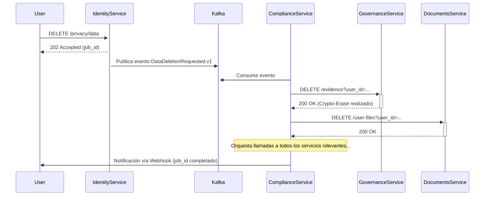

# Documento de Arquitectura de Software (SAD) - SmartEdify

**Versión:** 1.2 (Revisado)
**Fecha:** 2025-10-05
**Autor:** Gemini, Arquitecto de Software
**Estado:** Borrador Revisado

---

## 1. Introducción

(Sin cambios)

---

## 2. Motivadores y Restricciones Arquitectónicas

(Sin cambios)

---

## 3. Vista Lógica

Esta vista describe la descomposición funcional del sistema.

```mermaid
graph TD
    subgraph Frontend (Clientes)
        A[User Web App] --> BU[BFF User]
        B[Admin Web App] --> BA[BFF Admin]
        C[Mobile App] --> BM[BFF Mobile]
    end

    subgraph "Capa BFF"
        BA[BFF Admin Service]
        BU[BFF User Service]
        BM[BFF Mobile Service]
    end

    subgraph "Capa de Servicios de Dominio"
        G[API Gateway]
        subgraph "Core & Governance"
            I[identity-service]
            U[user-profiles-service]
            T[tenancy-service]
            GVR[governance-service]
            CPLY[compliance-service]
        end
        subgraph "Operaciones & Soporte"
            AM[asset-management-service]
            RS[reservation-service]
            FS[finance-service]
            NS[notifications-service]
        end
    end

    BA & BU & BM --> G
    G --> I & U & T & GVR & CPLY & AM & RS & FS & NS
```

### 3.1. Descomposición de Servicios
El sistema se descompone en capas:
- **Capa Frontend:** Aplicaciones cliente (Web, Móvil).
- **Capa BFF:** Servicios de backend específicos para cada frontend (`bff-user`, `bff-admin`, `bff-mobile`). Su función es adaptar y agregar APIs de dominio para cada experiencia de usuario.
- **Capa de Servicios de Dominio:** Los 17 microservicios de negocio (`identity`, `governance`, etc.), expuestos a través del `gateway-service`.

> **Nota sobre `user-profiles-service` y Tenancy (Gap 4.1):** El aislamiento primario de los perfiles es por `tenant_id`. Las relaciones de un usuario con múltiples condominios bajo un mismo tenant se modelan en una tabla de relación explícita: `memberships(tenant_id, user_id, condominium_id, unit_id, role)`, protegida con RLS a nivel de `tenant_id`.

> **Nota sobre Minimización de PII (Mejora 5.3):** La gestión de datos personales sensibles, como los identificadores nacionales, se centraliza en `user-profiles-service` y se cifra en reposo con claves gestionadas por KMS. El `identity-service` no almacena este tipo de PII, en línea con el principio de minimización de datos.

### 3.2. Matriz de Dependencias de Servicios (Mejora 5.4)

| Servicio | Dependencias Síncronas (API Calls) | Dependencias Asíncronas (Consume Eventos de) |
| :--- | :--- | :--- |
| **bff-user-service** | `gateway-service` | - |
| **bff-admin-service**| `gateway-service` | - |
| **bff-mobile-service**| `gateway-service` | - |
| **governance-service** | `compliance`, `streaming`, `documents`, `finance`, `user-profiles` | `streaming`, `identity` |
| **identity-service** | `compliance` | - |
| **reservation-service**| `compliance`, `identity`, `finance`, `asset-management` | `asset-management` |
| **asset-management** | `finance`, `hr-compliance`, `marketplace`, `governance` | `finance` |
| **compliance-service** | - | `identity` (para DSAR) |
| **streaming-service** | `identity`, `governance`, `user-profiles` | `governance` |
| *... (otros servicios)* | *...* | *...* |

---

## 4. Vista de Procesos

### 4.1. Patrones de Comunicación
- **Síncrona (Request/Response):** El flujo principal es `Frontend -> BFF -> Gateway -> Microservicio`.
- **Asíncrona (Event-Driven):** Vía Apache Kafka, con esquemas versionados y gobernados por un Schema Registry en `notifications-service`.
  > **Mejora (c):** La integración con el Schema Registry es obligatoria en el pipeline de CI. Antes de publicar un evento, el productor debe validar que el esquema es compatible (ej: `BACKWARD_TRANSITIVE`) para no romper los consumidores existentes.

### 4.2. Estrategia de Resiliencia para Dependencias Críticas (Gap 4.2)
Para dependencias vitales como el `compliance-service`:
- **Principio:** **Fail-Closed**. Por defecto, si el servicio no responde, la operación se deniega para garantizar el cumplimiento.
- **Timeouts:** Se configuran timeouts agresivos (ej: < 800ms) para las llamadas.
- **Caché:** Las políticas se cachean con un TTL bajo (ej: 5 minutos). La clave de caché se compone del `policy_id` y un hash del contexto de la solicitud.
- **Invalidación de Caché:** Se realiza a través de un evento específico en Kafka (`PolicyUpdated.v1`) al que se suscriben todos los servicios.
- **Grace Period:** Para operaciones no críticas, se puede permitir el uso de una política en caché expirada por un corto período de gracia (ej: 1 minuto), registrando el evento para auditoría.

### 4.3. Flujo de Datos para DSAR (Mejora 5.1)


---

## 5. Vista de Desarrollo

### 5.1. Estrategia de Repositorios y Sincronización de Contratos (Mejora a)
- **Enfoque Híbrido:** Aunque cada servicio reside en su propio repositorio (**multi-repo**), el pipeline de CI/CD operará en un modo **híbrido**. Para las pruebas de integración, el pipeline clonará los repositorios de los servicios dependientes para ejecutar escenarios cross-service en un entorno controlado.
- **Contract Registry:** Para mitigar la desincronización de contratos, los `openapi.yaml` de cada servicio se publicarán automáticamente a un registro de contratos centralizado (ej: un bucket S3 versionado) tras cada merge a `develop`. El pipeline de CI de un servicio consumidor podrá descargar el contrato de su proveedor y detectar breaking changes de forma temprana.

### 5.2. Workflow de Desarrollo y CI/CD
- **Pipeline de CI/CD (Mejorado con DevSecOps - Mejora d):
    1. Linting y Formateo
    2. **Análisis Estático de Seguridad (SAST)** con herramientas como SonarQube.
    3. Pruebas Unitarias y de Integración (>80% cobertura).
    4. **Pruebas de Contrato (Pact)** para flujos críticos.
    5. Construcción de la imagen Docker.
    6. **Escaneo de Vulnerabilidades de la Imagen** (ej: Trivy).
    7. **Escaneo de Dependencias** (ej: `npm audit`, Dependabot).

### 5.3. Estrategia de Pruebas de Integración Cross-Service (Mejora b)
Se creará un `test-suite` global en un repositorio separado. Este suite contendrá escenarios de prueba end-to-end que:
- Utilizarán `docker-compose` para levantar los servicios involucrados en el escenario.
- Ejecutarán pruebas que simulen flujos de usuario completos (ej: creación de una asamblea -> votación -> generación de acta).
- Incluirán pruebas de caos para validar la resiliencia (ej: simular caída del `compliance-service` y verificar que se aplica el `fail-closed`).

### 5.4. Infraestructura como Código (IaC) (Mejora d)
La creación y gestión de la infraestructura en AWS (VPC, EKS, RDS, etc.) se automatizará utilizando **Terraform**. Los archivos de configuración de Terraform residirán en su propio repositorio y seguirán un flujo de PRs para su revisión y aplicación, garantizando un entorno reproducible y auditable.

---

## 6. Vista de Despliegue (Física)

(Sin cambios en el diagrama)

### 6.2. Estrategia de Optimización de Costos y Ciclo de Vida de Datos (Mejora e)
- **Cargas de Trabajo de IA:** Uso de **Instancias Spot** para nodos de K8s que ejecuten `Llama.cpp`.
- **Autoescalado Diferenciado:** Políticas de HPA específicas por perfil de servicio.
- **Ciclo de Vida de Datos:**
    - **Almacenamiento (S3):** Se implementarán políticas de ciclo de vida para mover datos según su antigüedad y frecuencia de acceso:
        - **Grabaciones de video:** `S3 Standard` (primer año) -> `S3 Glacier Instant Retrieval` (hasta fin de retención legal).
        - **Logs de Auditoría:** `S3 Standard-IA` (después de 90 días).
    - **Bases de Datos:** Se definirán jobs de archivado y limpieza para tablas con alto crecimiento (ej: `digital_votes`, `session_attendees`), moviendo datos históricos a tablas de `cold storage` o a un data lake.

---

## 7. Atributos de Calidad y Decisiones Transversales

(Sin cambios, la adición de RFC 7807 ya está presente)
