# 📘 **SmartEdify Global — Especificación Técnica del Sistema (Versión 2.0 — FINAL)**

> **Estado:** `Vision Global - Para inicio del desarrollo spec`  
> **Alcance:** Plataforma Global de Gobernanza y Gestión de Condominios Multi-País  
> **Visión:** Convertir a SmartEdify en el sistema operativo digital para comunidades residenciales y comerciales en Latinoamérica y Europa, garantizando cumplimiento legal local, transparencia operativa y participación comunitaria inteligente.

---

### **🎯 1. Visión del Producto**

SmartEdify es una plataforma SaaS global de gobernanza y gestión comunitaria diseñada para digitalizar, automatizar y hacer jurídicamente válida la administración de condominios en Perú, con capacidad de expansión a Latinoamérica y Europa.

Su objetivo es convertirse en el sistema operativo digital para comunidades, combinando:

*   **Gobernanza Democrática Digital con Validez Legal Adaptativa:** Asambleas híbridas (presencial/virtual/mixta) con flujos legales multi-país, votación ponderada, validación de quórum vinculada criptográficamente al video, y generación de actas con IA.
*   **Gestión Operativa Inteligente e Inclusiva:** Mantenimiento predictivo, reservas de áreas comunes, seguridad física integrada, y soporte para votación asistida (moderador, biometría, SMS).
*   **Cumplimiento Normativo Adaptativo:** Motor legal dinámico (`compliance-service`) que se adapta a las regulaciones locales sin reescribir el núcleo del sistema.
*   **Experiencia de Usuario Centrada en la Comunidad:** Gamificación con recompensas tangibles, notificaciones personalizadas, y una UI/UX optimizada para reducir la fricción tecnológica.

---

### **🏗️ 2. Arquitectura General**

#### **2.1. Patrones Arquitectónicos**

| Patrón | Implementación | Justificación |
| --- | --- | --- |
| Microservicios | 14 servicios independientes, cada uno con su propia base de datos y ciclo de vida. | Escalabilidad, despliegue independiente, aislamiento de fallos. |
| API Gateway | Punto de entrada único para todos los clientes (web, móvil, terceros). | Centralización de seguridad, enrutamiento, rate limiting. |
| Event-Driven | Comunicación asíncrona vía Apache Kafka. Registro y validación de esquemas en `notifications-service`. | Desacoplamiento, resiliencia, escalabilidad horizontal. |
| Multi-Tenant | Modelo: `Shared Database, Shared Schema` con discriminador `condominium_id` + RLS. | Eficiencia operativa, escalabilidad a miles de tenants. |
| Frontend Monorepo | Aplicaciones: User Web, Admin Web, Mobile App (React/React Native). | Reutilización de código, consistencia UX, despliegue coordinado. |

#### **2.2. Componentes Principales (Diagrama Mermaid)**

```mermaid
graph TD
    subgraph Frontend
        A[User Web <br/ >Puerto 3000] --> G
        B[Admin Web <br/ >Puerto 4000] --> G
        C[Mobile App <br/ >Puerto 8081] --> G
    end
    subgraph Gateway
        G[API Gateway <br/ >Puerto 8080]
    end
    subgraph Core Backend
        G --> I[identity-service <br/ >3001]
        G --> U[user-profiles-service <br/ >3002]
        G --> T[tenancy-service <br/ >3003]
        G --> S[streaming-service <br/ >3014]
        G --> N[notifications-service <br/ >3005]
        G --> D[documents-service <br/ >3006]
        G --> F[finance-service <br/ >3007]
        G --> P[payroll-service <br/ >3008]
        G --> H[hr-compliance-service <br/ >3009]
        G --> M[asset-management-service <br/ >3010]
        G --> V[reservation-service <br/ >3013]
        G --> GVR[governance-service <br/ >3011]
        G --> CPLY[compliance-service <br/ >3012]
        G --> PS[physical-security-service <br/ >3004]
        G --> MKT[marketplace-service <br/ >3015]
        G --> ANL[analytics-service <br/ >3016]
    end
    classDef frontend fill:#4A90E2,stroke:#333,color:white;
    classDef gateway fill:#50E3C2,stroke:#333,color:black;
    classDef backend fill:#F5A623,stroke:#333, color:black;
    class A,B,C frontend
    class G gateway
    class I,U,T,S,N,D,F,P,H,M,V,GVR,CPLY,PS,MKT,ANL backend
```

---

### **📦 3. Alcance de Microservicios (14 Servicios) — ¡REVISIÓN 2.0!**

Cada servicio es autónomo, desplegable de forma independiente, y sigue el principio de responsabilidad única. Los cambios clave respecto a versiones anteriores están marcados con **🆕** y **⚠️**.

---

#### **3.1. `gateway-service` (Puerto 8080)**

*   **Alcance:** Punto de entrada único. Enrutamiento, autenticación JWT, rate limiting, CORS.
*   **Responsabilidades Clave:** Proxy inverso, extracción de `tenant_id` del token, propagación de contexto.
*   **⚠️ Nuevo Requisito Criptográfico (P0):** Debe cachear el JWKS del `identity-service` con un TTL **≤ 5 minutos** para garantizar la detección oportuna de rotación de claves.

---

#### **3.2. `identity-service` (Puerto 3001)**

*   **Alcance:** Gestión de identidad digital. Login, registro, MFA, OAuth2/OIDC, RBAC/ABAC.
*   **Responsabilidades Clave:** Autenticación, autorización, gestión de sesiones, cumplimiento normativo.
*   **🆕 Mejora Revisión 1.0:** Soporte para registro y validación de credenciales biométricas (Touch ID, Face ID) para integración con `streaming-service`.
*   **⚠️ Nuevo Requisito Criptográfico (P0):** Todos los tokens JWT/COSE emitidos (access, refresh, contextuales) **DEBEN** usar algoritmos asimétricos (`ES256` o `EdDSA`). El header **DEBE** incluir el campo `kid`. Se **prohíbe explícitamente** el uso de `HS256` en cualquier documentación o ejemplo.
*   **⚠️ Nuevo Requisito OIDC (P0):** El flujo `authorization_code` con **PKCE es obligatorio** para todas las aplicaciones cliente. Los flujos implícito e híbrido están **prohibidos**.
*   **⚠️ Nuevo Requisito DSAR (P1):** Orquesta la eliminación de datos personales. Publica eventos `DataDeletionRequested` que el `compliance-service` consume para orquestar el `crypto-erase` en servicios como `governance-service`.

---

#### **3.3. `user-profiles-service` (Puerto 3002)**

*   **Alcance:** Perfiles de usuario, roles por condominio, estructura organizacional (Junta Directiva, Comités).
*   **Responsabilidades Clave:** CRUD de perfiles, gestión de relaciones, fuente canónica de datos de usuario.

---

#### **3.4. `tenancy-service` (Puerto 3003)**

*   **Alcance:** Ciclo de vida de condominios. Unidades, alícuotas, onboarding, configuración dinámica.
*   **Responsabilidades Clave:** Creación de tenants, cálculo de alícuotas, aislamiento de datos.

---

#### **3.5. `streaming-service` (Puerto 3014) — ¡NUEVO EN SCOPE!**

*   **Alcance:** Gestión de sesiones de video en vivo para asambleas híbridas. Integración con Google Meet, generación y validación de QR, transcripción en tiempo real, grabación segura, y control de moderación.
*   **Responsabilidades Clave:**
    *   Iniciar/terminar sesiones de video.
    *   **⚠️ Corrección P0 (QR):** **NO genera ni valida QR.** Solo **muestra y escanea** el QR emitido por el `identity-service`. Delega la emisión al endpoint `POST /identity/v2/contextual-tokens` y la validación a `POST /identity/v2/contextual-tokens/validate`.
    *   Validar asistencia mediante biometría (huella/rostro) o código SMS/Email como alternativas al QR.
    *   Integrar Speech-to-Text para transcripción en vivo.
    *   Grabar, cifrar y almacenar videos con hash de verificación.
    *   Proporcionar controles de moderación (silenciar, ceder palabra, cronómetro).
    *   Gestionar el “Modo Presencial” para que el moderador registre asistentes y votos manuales.
*   **Justificación:** Separado del `governance-service` para cumplir con SRP, permitir reutilización y manejar la complejidad técnica del streaming de forma aislada.

---

#### **3.6. `physical-security-service` (Puerto 3004)**

*   **Alcance:** Seguridad física del condominio. CCTV, control de accesos (huella, facial), sensores IoT, protocolos de riesgo.
*   **Responsabilidades Clave:** Integración con hardware, detección de amenazas, alertas en tiempo real.

---

#### **3.7. `notifications-service` (Puerto 3005)**

*   **Alcance:** Envío de notificaciones (email, SMS, push). Registro y validación de esquemas de eventos (Event Schema Registry).
*   **Responsabilidades Clave:** Multicanal, gestión de plantillas, muro de noticias virtual.
*   **🆕 Mejora Revisión 1.0:** Soporte para enviar códigos de verificación de 6 dígitos para validación de asistencia vía SMS/Email.

---

#### **3.8. `documents-service` (Puerto 3006)**

*   **Alcance:** Gestión de documentos legales. Almacenamiento (S3), generación desde plantillas, flujos de firma electrónica.
*   **Responsabilidades Clave:** Generación de actas, contratos, carteles de convocatoria. Integración con Llama.pe.
*   **🆕 Mejora Revisión 1.0:** Adjuntar automáticamente fotos de papeletas físicas (votos presenciales) como anexos en el PDF del acta.

---

#### **3.9. `finance-service` (Puerto 3007)**

*   **Alcance:** Gestión financiera. Cuotas de mantenimiento, conciliación bancaria, reportes contables (PCGE, NIIF), impuestos.
*   **Responsabilidades Clave:** Cálculo de cuotas, procesamiento de pagos.
*   **⚠️ Alineación P1 (Quórum):** Proporciona el dato de “propietarios habilitados” (al día en pagos) al `governance-service` para el cálculo de quórum. El **snapshot de alícuotas** se toma y se congela **al momento de emitir la convocatoria formal**, no al cerrar la votación.

---

#### **3.10. `payroll-service` (Puerto 3008)**

*   **Alcance:** Cálculo y procesamiento de nóminas. Generación de PLAME y formatos equivalentes por país.
*   **Responsabilidades Clave:** Cálculo de salarios, beneficios, impuestos. Integración con `finance-service`.

---

#### **3.11. `hr-compliance-service` (Puerto 3009)**

*   **Alcance:** Gestión del ciclo de vida del empleado y cumplimiento laboral. Contratos, evaluaciones, SST, comités.
*   **Responsabilidades Clave:** Cumplimiento normativo laboral, gestión de riesgos, reportes de inspección.

---

#### **3.12. `asset-management-service` (Puerto 3010)**

*   **Alcance:** Inventario de activos (hard y soft). Órdenes de trabajo (preventivas y correctivas), gestión de proveedores.
*   **Responsabilidades Clave:** Jerarquía de activos, mantenimiento, indicadores de disponibilidad.
*   **Integración Clave:** `reservation-service` (las áreas comunes son activos).

---

#### **3.13. `governance-service` (Puerto 3011) — ¡REVISIÓN 2.0 COMPLETA!**

*   **Alcance:** Ciclo completo de asambleas con **validez legal adaptable multi-país (PMV: Perú)**. Gestión de iniciativas de convocatoria, flujos de aprobación, votación ponderada, generación de actas con IA (MCP), y moderación híbrida.
*   **Responsabilidades Clave:**
    *   **⚠️ Alineación P1 (Ámbito Legal):** Cambiado de “validez legal peruana garantizada” a “validez legal adaptable multi-país (PMV: Perú)”.
    *   **Flujos de Convocatoria Legalmente Alineados:**
        *   Iniciativa de Convocatoria: Creada por cualquier propietario, con orden del día estructurado (informativos/votables).
        *   Recolección de Adhesiones: Los propietarios “adhieren” (no votan) hasta alcanzar el 25% de alícuotas.
        *   Convocatoria Obligatoria: Al alcanzar el 25%, el sistema notifica al Administrador, quien tiene la obligación legal de emitir la convocatoria formal en 15 días.
        *   Validación Legal Dinámica: Consulta al `compliance-service` para validar quórum, mayorías y flujos en tiempo real. Ningún valor está hardcoded.
    *   **Gestión de Sesiones Híbridas (con `streaming-service`):**
        *   Validación de Asistencia: Solo los usuarios validados (QR, biometría, SMS) cuentan para el quórum. **⚠️ Alineación P1 (Consistencia):** La biometría/SMS son métodos de *presencia*, pero el *quórum* y las *mayorías* son calculados y validados por el `compliance-service`.
        *   Moderación Híbrida: Sistema automático (cola FIFO) + intervención manual del moderador (réplicas, ampliaciones).
        *   Votación Presencial Registrada por Moderador (Modo Mixta): El moderador puede registrar manualmente a asistentes presenciales y sus votos, adjuntando fotos de papeletas.
    *   **Auditoría Legal Inmutable:**
        *   Sello de Quórum: Al cerrar la votación, se genera un hash criptográfico del estado del quórum, que se incrusta en los metadatos del video.
        *   Snapshot de Quórum: Se genera un PDF con la lista de asistentes y alícuotas en el momento del cierre, que se adjunta al acta.
        *   **⚠️ Alineación P1 (Auditoría):** La plataforma **DEBE** exponer un **endpoint público de verificación** que permita a cualquier tercero validar la integridad del sello de quórum contra el video y el acta.
    *   Generación de Actas con IA (MCP): El MCP genera un borrador a partir de la transcripción. El acta final es aprobada y firmada por el Presidente y el Secretario.
    *   Gamificación con Recompensas Tangibles: Los puntos se pueden canjear por descuentos en cuotas (integración con `finance-service`).
*   **Dependencias Clave:** `streaming-service`, `compliance-service`, `documents-service`, `finance-service`, `user-profiles-service`.

---

#### **3.14. `reservation-service` (Puerto 3013)**

*   **Alcance:** Gestión de reservas de áreas comunes. Calendario, reglas de uso, validación de conflictos.
*   **Responsabilidades Clave:** Reservas, recordatorios, integración con `asset-management-service`.

---

#### **3.15. `compliance-service` (Puerto 3012)**

*   **Alcance:** **Motor de Cumplimiento Normativo Global.** Valida reglas legales (financieras, laborales, de asambleas) basadas en el país del tenant y su reglamento interno. Usa motor de reglas + LLM.
*   **Responsabilidades Clave:**
    *   Definir y validar flujos de aprobación de convocatorias.
    *   Inyectar dinámicamente quórum y mayorías requeridas para cada tipo de decisión.
    *   Gestionar perfiles regulatorios por país y tipo de propiedad.
    *   Adaptación multi-país.
    *   **⚠️ Nuevo Requisito DSAR (P1):** Orquesta el flujo de eliminación de datos. Consume eventos `DataDeletionRequested` del `identity-service` y llama a endpoints como `DELETE /evidence` en el `governance-service` para ejecutar el `crypto-erase`.

---

#### **3.16. `marketplace-service` (Puerto 3015)**

*   **Alcance:** Crear un ecosistema de servicios premium para los condominios. generando un nuevo flujo de ingresos recurrente para SmartEdify.
*   **Responsabilidades Clave:**
    *   Catálogo de Servicios: Listar y gestionar proveedores de servicios legales, de mantenimiento, asesoría contable, seguros, etc.
    *   Flujos de Contratación: Permitir a los administradores cotizar, contratar y pagar servicios directamente desde la plataforma.
    *   Revisión de Actas por Abogado: Integración con abogados certificados que revisan y certifican la validez legal de las actas generadas por el MCP.
    *   Asesoría Legal en Vivo: Permitir que un abogado se una como “observador legal” a una asamblea en vivo para dar consejos en tiempo real.
    *   Comisiones y Pagos: Gestionar las comisiones de SmartEdify por cada servicio contratado.
*   **Integraciones Clave:** `governance-service` (para revisiones de actas), `finance-service` (para pagos), `notifications-service` (para alertas de ofertas).

---

#### **3.17. `analytics-service` (Puerto 3016)**

*   **Alcance:** Proporcionar inteligencia de negocio a administradores y juntas directivas mediante dashboards y reportes basados en datos., ofrecido como un módulo premium.
*   **Responsabilidades Clave:**
    *   Ingesta de Datos: Consumir eventos de todos los microservicios (asambleas, votaciones, pagos, mantenimiento) y almacenarlos en un data warehouse (por ejemplo, Amazon Redshift o Snowflake).
    *   Dashboards de Insights:
        *   “Tasa de participación por tipo de propietario (residente vs. no residente).”
        *   “Temas más votados y su correlación con la satisfacción del propietario.”
        *   “Predicción de quórum para la próxima asamblea basada en tendencias históricas.”
        *   “Eficiencia del gasto en mantenimiento por tipo de activo.”
    *   Reportes Personalizados: Permitir a los administradores crear reportes ad-hoc.
    *   Modelos Predictivos: Usar ML para predecir morosidad, necesidad de mantenimiento, o riesgo de impugnación de asambleas.
*   **Integraciones Clave:** Todos los servicios. Es el consumidor final de los eventos del sistema.

---

### **🌐 4. Estrategia Multi-País y Localización**

*   **Motor de Cumplimiento (`compliance-service`):** Define perfiles regulatorios por país (Perú, Chile, México, España, etc.) y tipo de propiedad.
*   **Localización de UI:** Traducción de interfaces con `i18next`.
*   **Formatos Legales:** Plantillas de documentos y reportes adaptadas por jurisdicción.
*   **Moneda y Fecha:** Configurables por tenant.

---

### **🛡️ 5. Seguridad y Cumplimiento**

*   **Autenticación:** JWT + MFA + Biometría (opcional). **⚠️ P0:** Todos los tokens usan `ES256`/`EdDSA` con `kid`.
*   **Autorización:** RBAC/ABAC con políticas dinámicas.
*   **Cifrado:** AES-256 en reposo, TLS 1.3 en tránsito.
*   **Auditoría:** Trazas inmutables (Event Sourcing) para todas las operaciones críticas.
*   **Privacidad:** Cumplimiento normativo adaptativo. Consentimientos explícitos para grabación de video y uso de biometría. **⚠️ P1:** Flujo DSAR cross-service con `crypto-erase` orquestado.

---

### **🚀 6. Infraestructura y Operaciones**

*   **Backend:** Node.js + NestJS.
*   **Frontend:** React + React Native + TypeScript.
*   **Base de Datos:** PostgreSQL (por servicio) + RLS.
*   **Mensajería:** Apache Kafka.
*   **Almacenamiento:** AWS S3.
*   **Infraestructura:** Docker + Kubernetes + AWS.
*   **Observabilidad:** Prometheus + Grafana + OpenTelemetry + ELK.

---

### **✅ 7. Criterios de Aceptación (Definition of Done)**

Para que un microservicio se considere “completo” y listo para producción, debe cumplir con:

*   **Funcionalidad:** Todas las historias de usuario del alcance están implementadas y probadas.
*   **API:** Contrato de API definido en OpenAPI/Swagger y publicado.
*   **Pruebas:** >80% de cobertura de pruebas unitarias e integración. Pruebas E2E para flujos críticos.
*   **Observabilidad:** Métricas, logs estructurados y trazas distribuidas implementadas.
*   **Seguridad:** Auditoría de seguridad completada. No hay vulnerabilidades críticas.
*   **Documentación:** README.md con instrucciones de despliegue, configuración y uso.
*   **CI/CD:** Pipeline automatizado de build, test y despliegue.

---

### **📅 8. Hoja de Ruta (Roadmap) — Visión Global**

*   **Fase 1:** Lanzamiento en Perú (PMV: `governance-service`, `reservation-service`, `asset-management-service` + `streaming-service`).
*   **Fase 2:** Expansión a Chile y Colombia. Adaptación de `compliance-service`.
*   **Fase 3:** Lanzamiento en México y España. Integración con proveedores locales.
*   **Año 2:** Expansión a Brasil y resto de LATAM. Soporte para LGPD.
*   **Año 3:** Entrada en mercado Europeo. Cumplimiento con GDPR y normativas de eficiencia energética.

---

### **✅ 9. Conclusión**

Esta Revisión 2.0 del `SCOPE.md` establece una base técnica y funcional **totalmente coherente** para el desarrollo de SmartEdify. Los ajustes P0 (QR, criptografía, PKCE) y P1 (DSAR, alcance legal, quórum, auditoría) aseguran que la arquitectura no solo es modular y escalable, sino también segura, audit-proof y legalmente sólida desde el primer día.

La delegación clara de responsabilidades —especialmente la del `identity-service` como único emisor y validador de identidad y tokens, y el `compliance-service` como cerebro normativo y orquestador de cumplimiento— convierte a la plataforma en un sistema robusto, preparado para operar en múltiples jurisdicciones con la máxima eficiencia y confianza.

SmartEdify no solo digitaliza procesos; establece un nuevo estándar global para la gobernanza comunitaria digital, donde la tecnología, la legalidad y la participación se integran de forma transparente e irrefutable.

---

© 2025 SmartEdify Global. Todos los derechos reservados.
Documento generado automáticamente a partir de la especificación técnica.
