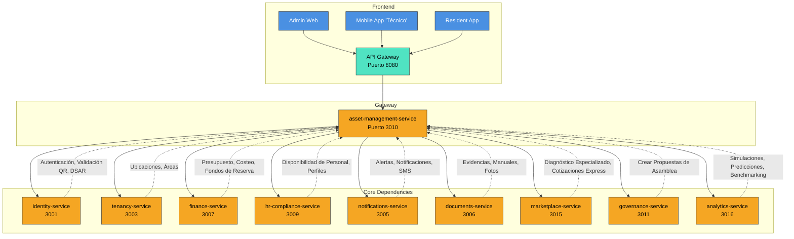

**📘 Especificación Técnica Definitiva: `asset-management-service` (Puerto 3010) — Versión 7.4 (BUILD FREEZE FINAL)**  
**Metodología:** `github/spec-kit`  
**Estado:** `✅ BUILD FREEZE FINAL — P0/P1 CERRADOS`  
**Última actualización:** `2025-09-25`  
**Rol:** Sistema central para la gestión del ciclo de vida de activos (hard y soft), planificación de mantenimiento, gestión de órdenes de trabajo, proveedores e insumos, integrado con la plataforma SmartEdify para gobernanza, finanzas y operaciones.

---

## **🧭 1. Visión y Justificación**

El `asset-management-service` es el sistema operativo técnico del edificio inteligente. Su misión es transformar el mantenimiento reactivo y opaco en un proceso proactivo, predecible y basado en datos.

*   **Para el Cliente (Condominio):** Proporciona transparencia financiera, prevención de fallas, optimización de costos y una experiencia de usuario simple (para residentes y técnicos).
*   **Para SmartEdify:** Es la fuente primaria de datos operativos del edificio. Estos datos alimentan servicios premium (predictivo, consultoría, marketplace) que generan ingresos recurrentes y diferencian a la plataforma.

Este servicio no solo gestiona tickets; **gestiona el valor del activo físico del condominio a lo largo del tiempo**.

---

## **🏗️ 2. Arquitectura y Diseño Global**

### **2.1. Patrones Arquitectónicos Clave**

| Patrón | Implementación | Justificación |
| :--- | :--- | :--- |
| **Microservicio Autónomo** | Node.js + NestJS, PostgreSQL, Redis, Kafka. | Escalabilidad, despliegue independiente, aislamiento de fallos. |
| **Event-Driven Architecture** | Comunicación asíncrona vía Apache Kafka con patrón Outbox. | Desacoplamiento, resiliencia, consistencia eventual con otros servicios (Finanzas, RRHH, Notificaciones). |
| **Multi-Tenant (Shared DB, Shared Schema)** | Discriminador `tenant_id` + Row-Level Security (RLS) activo en todas las tablas. FK compuestas en relaciones críticas. | Eficiencia operativa, escalabilidad a miles de condominios. |
| **CQRS (Command Query Responsibility Segregation)** | Modelos separados para escritura (gestión de activos, OT) y lectura (dashboards, reportes). | Optimización de rendimiento para consultas complejas y agregadas. |
| **Saga Pattern** | Para orquestar flujos de negocio complejos (SOS → Ofertas → Adjudicación → OT → Pago → Evaluación). | Garantiza consistencia en operaciones distribuidas. |
| **Mobile-First & Offline-First** | App móvil con sincronización automática y manejo de conflictos. | Soporte para técnicos que trabajan en áreas sin conectividad. |
| **Query Side para Finanzas** | Tablas de lectura optimizadas que consumen eventos de `finance-service`. | Rendimiento ultra-rápido en reportes financieros sin sobrecargar el servicio de finanzas. |

### **2.2. Diagrama de Contexto (Mermaid)**



---

## **📦 3. Especificación Funcional Detallada Consolidada y Corregida**

### **3.1. Gestión Maestra de Activos (Hard y Soft)**

*   **Ficha Técnica Completa (CRUD):** Crear, leer, actualizar y eliminar activos con estructura jerárquica.
    *   **Activos Hard (Técnicos):** `Sistema > Subsistema > Área > Equipo > Componente`.
    *   **Activos Soft (Espaciales):** `Edificio > Nivel > Área`.
*   **Categorización Estratégica:**
    *   **Activos Técnicos (Hard):** Gestionados para **disponibilidad y funcionalidad** (ej: ascensores, bombas). Requieren plan de mantenimiento obligatorio.
    *   **Activos Espaciales (Soft):** Gestionados para **estándar de calidad y presentación** (ej: jardines, lobby). Requieren plan de mantenimiento obligatorio (ej: "Limpieza Diaria", "Pintura Anual").
*   **Atributos Clave:**
    *   `marca`, `modelo`, `número de serie`, `fecha de instalación`, `estado operativo`.
    *   `garantia_hasta`: Fecha de vencimiento. El sistema muestra una **alerta prominente** si la garantía está vigente.
    *   `criticidad`: `{A (Crítico), B (Importante), C (Secundario)}`.
    *   `manual_operacion_id`, `manual_mantenimiento_id`: Referencias a `documents-service`.
    *   `fotos`: Array de URLs de fotos del activo.
    *   `metadatos`: Atributos libres personalizables.

### **3.2. Planificación Preventiva, Predictiva y de Servicios Generales**

*   **Planes de Mantenimiento (Hard y Soft):**
    *   Configurables por `tiempo` (frecuencia), `uso` (horas de operación) o `condición` (lecturas de sensores IoT).
    *   **NO generan OTs automáticamente.** Al activarse un plan, el sistema **genera una propuesta de OT** y **notifica al administrador** para que revise, **acepte, edite o rechace** la propuesta.
    *   **Diferenciación por Tipo de Tarea:**
        *   **`technical_maintenance`:** La propuesta sugiere enviar la tarea al `marketplace-service` para un **diagnóstico profesional** antes de proceder.
        *   **`soft_service`:** La propuesta sugiere asignar la tarea a un perfil de personal interno (ej: "Personal de Mantenimiento General").
    *   **Integración con RRHH y Analytics:** Para `soft_service`, el sistema consulta a `analytics-service` los **rendimientos históricos** y a `hr-compliance-service` la **disponibilidad del personal** para crear la propuesta. El administrador puede **asignar o redistribuir** las tareas propuestas al personal disponible.
*   **Incorporación de Tareas desde Incidencias:**
    *   Al clasificar una incidencia en un activo **Hard**, el sistema crea tareas y las vincula al plan del activo.
    *   **Clasificación de Tareas (Hard):**
        *   **`Urgente`:** Sigue el **flujo de Emergencias**.
        *   **`Ordinaria`:** Inicia una SOS por canal regular, con opción de **consolidar con tareas de un mantenimiento preventivo próximo**.
        *   **`Programable`:** Se **agrega al próximo mantenimiento preventivo planificado**. El administrador puede **adelantar la fecha del plan**.
    *   Estas tareas aparecen en una **bandeja de “Tareas Generadas”** para su revisión y consolidación.

### **3.3. Gestión de Incidencias y Solicitudes de Servicio (SOS)**

*   **Registro de Incidencias:** Recibe eventos de falla desde app móvil, web, IoT o inspecciones.
*   **Clasificación y Triage con LLM:**
    *   Al crearse una incidencia, el sistema envía la descripción original y las evidencias a `analytics-service`.
    *   El **LLM clasifica y estandariza** la incidencia, sugiriendo `asset_type`, `failure_type` y una `standardized_description`.
    *   El administrador ve esta sugerencia y puede aceptarla o editarla.
*   **Flujo de Incidencia a SOS Manual (Corregido):**
    1.  **Reporte:** Un usuario reporta una incidencia.
    2.  **Clasificación:** El administrador clasifica la incidencia (`task_type`, `criticidad`, `asset_id`).
    3.  **Generación de Tareas:** El sistema crea una o más tareas y las vincula al plan del activo/área.
    4.  **Consolidación:** El administrador puede **consolidar múltiples tareas** (de la misma área y con ventana de tiempo compatible) en un solo grupo.
    5.  **Propuesta de SOS:** El administrador puede **proponer manualmente una SOS** a partir del grupo de tareas consolidado.
    6.  **Publicación de SOS:** El administrador edita la propuesta (incluye anexos, selecciona proveedores) y la publica.
*   **Gestión Proactiva del Presupuesto (Corregido):**
    *   **Después de recibir las ofertas**, el administrador puede ver el costo propuesto.
    *   El sistema **consulta a `finance-service`** para mostrar el impacto financiero de la **oferta seleccionada** (porcentaje de presupuesto utilizado, saldo restante).

### **3.4. Gestión de Ofertas y Proveedores**

*   **Catálogo de Proveedores:** Gestión de información fiscal y de contacto.
*   **Envío de Invitaciones (Corregido):**
    *   El sistema **propone hasta 3 proveedores** calificados basados en el Vendor Scorecard y el tipo de trabajo.
    *   El **administrador tiene control total** para incluir o excluir a cualquier proveedor de la lista final de invitados antes de enviar la SOS.
*   **Recepción y Comparación de Ofertas:** Proporciona un comparador con filtros por precio, plazo y reputación.
*   **Portal de Gestión y Calificación (Vendor Scorecard):** Dashboard con métricas consolidadas por proveedor:
    *   **Calidad:** Promedio de calificaciones de OS cerradas.
    *   **Fiabilidad:** % de OS completadas dentro del plazo.
    *   **Velocidad:** Tiempo promedio de respuesta y ejecución.
    *   **Costo:** Relación con el promedio del mercado.
*   **Flujo SOS → Ofertas → OC → OT (Corregido):**
    1.  La SOS se envía a los proveedores.
    2.  Los proveedores envían sus ofertas antes de la fecha límite.
    3.  El administrador adjudica la SOS.
    4.  El sistema genera una **Orden de Compra (OC)** para `finance-service` y una **Orden de Trabajo (OT)** técnica.
    5.  Se envían **recordatorios** al proveedor para que acepte la OT. Si no hay respuesta en el plazo configurado, la OT se **anula automáticamente** y el flujo se reinicia.

### **3.5. Gestión de Órdenes de Trabajo (OT) y Ejecución**

*   **Creación de OT:** Manual (por administrador) o automática (desde una SOS adjudicada).
*   **Asignación:** A técnico interno (validando disponibilidad con `hr-compliance-service`) o a proveedor externo.
*   **Permisos de Trabajo de Alto Riesgo:** Bloquea el inicio de la OT hasta que un checklist de seguridad digital sea completado y firmado por el técnico y el supervisor.
*   **Experiencia del Técnico (Mobile-First & Offline):**
    *   **Descarga Proactiva:** El técnico sincroniza y descarga todas las OS asignadas para su jornada.
    *   **Trabajo Offline Completo:** Completa el formulario de cierre (con fotos, comentarios, checklist) sin conexión.
    *   **Sincronización Automática:** Al recuperar la conexión, la app sincroniza automáticamente todos los datos pendientes.
    *   **Validación de Ubicación:** El técnico valida su presencia en el área de trabajo escaneando un QR (emitido por `identity-service`) o seleccionando de una lista.
*   **Ejecución sin Bloqueo por Insumos (Nueva Funcionalidad):**
    *   **`technical_maintenance`:** El registro de **repuestos es obligatorio si la OT implica el cambio de componentes**. Se requiere **fotografía del componente viejo y del nuevo**.
    *   **`soft_service`:** El técnico **no está obligado a registrar insumos** para cerrar la OT.
    *   Un **batch de conciliación periódica** (diario/semanal/mensual, configurable) cruza los **despachos de almacén** (`warehouse_dispatches`) con las **OTs de soft service** ejecutadas.
    *   El consumo de insumos se **prorratea** usando los **rendimientos estandarizados de `analytics-service`** y la **Matriz de Volúmenes**.
*   **Control de Calidad y Cierre:** Requiere aprobación del supervisor y del administrador. El residente puede dar feedback opcional.

### **3.6. Registro de Insumos y Costeo (Corregido)**

*   **Gestión de Existencias:**
    *   Se gestiona un inventario simple de insumos (`consumables`) con `current_stock` y `min_stock`.
    *   Se registran los **despachos de almacén** (`warehouse_dispatches`) que asignan insumos a un trabajador y un área.
*   **Costeo e Imputación:**
    *   Tras la **aprobación del batch de conciliación**, el sistema publica los asientos de consumo consolidados a `finance-service` para su imputación al activo/área correspondiente.

### **3.7. Gestión de Excepciones y Emergencias**

*   **Registro de OTs de Emergencia:** Permite crear OTs que omiten el flujo estándar de SOS y adjudicación.
*   **Post-Regularización:** Exige un flujo de **aprobación retroactiva** para justificar y validar la OT de emergencia.
*   **Flujo de Falla Catastrófica (CAPEX):**
    *   Si un activo no es reparable y los fondos de reserva no son suficientes, el sistema guía al administrador para crear automáticamente una **propuesta de asamblea** (vía `governance-service`) para una cuota extraordinaria.
    *   Consulta al `finance-service` el estado del fondo de reserva y al `compliance-service` las políticas de uso.

---

## **🔄 4. Flujos Operativos Principales (7 Flujos Corregidos)**

### **Flujo 1: Reporte y Triaje de Incidencia (Residente → Administrador)**

1.  **Residente:** Reporta un problema vía app (foto, video, voz) y selecciona un área común.
2.  **Sistema:** Crea una incidencia en estado “abierta” y notifica al administrador.
3.  **Administrador:** Abre la incidencia, ve la alerta de garantía (si aplica), asigna un activo, una criticidad y decide el `task_type` (`technical_maintenance` o `soft_service`).
    *   **Si `soft_service`:** Crea una tarea y la asigna a personal interno.
    *   **Si `technical_maintenance`:** Clasifica la tarea como `Urgente`, `Ordinaria` o `Programable` y la incorpora al plan.

### **Flujo 2: Ejecución de Mantenimiento Preventivo (Sistema → Administrador → Técnico)**

1.  **Sistema:** Un plan de mantenimiento se activa (por fecha, uso o sensor).
2.  **Sistema:** **Genera una propuesta de OT** y **notifica al Administrador**.
3.  **Administrador:** Revisa la propuesta.
    *   **Si `technical_maintenance`:** Puede enviarla al `marketplace-service` para diagnóstico.
    *   **Si `soft_service`:** La asigna al personal interno.
4.  **Sistema:** Asigna la OT a un técnico disponible.
5.  **Técnico:** Recibe la OT en su app móvil, la descarga para trabajar offline, la ejecuta, llena el formulario de cierre y sincroniza.
6.  **Sistema:** Notifica al administrador para aprobación. Una vez aprobada, notifica al residente (si aplica).

### **Flujo 3: Gestión de Solicitud de Servicio (SOS) y Adjudicación (Administrador → Proveedor)**

1.  **Administrador:** Propone y publica una SOS consolidada.
2.  **Sistema:** Propone hasta 3 proveedores.
3.  **Administrador:** Edita la lista de proveedores y envía la SOS.
4.  **Proveedores:** Envían sus ofertas.
5.  **Administrador:** Compara ofertas.
6.  **Sistema:** Consulta a `finance-service` el impacto presupuestario de la oferta seleccionada.
7.  **Administrador:** Adjudica la SOS.
8.  **Sistema:** Genera una OC para `finance-service` y una OT técnica. Inicia el flujo de recordatorios al proveedor.

### **Flujo 4: Ejecución de Orden de Trabajo por Técnico (Técnico → Sistema)**

1.  **Técnico:** Recibe la OT, la descarga, va al lugar y valida su ubicación (QR o lista).
2.  **Si es Alto Riesgo:** Completa y firma digitalmente un checklist de seguridad.
3.  **Técnico:** Ejecuta la tarea.
    *   **Si `technical_maintenance`:** Registra repuestos y sube fotos del componente.
    *   **Si `soft_service`:** Cierra la OT sin registrar insumos.
4.  **Sistema:** Notifica al supervisor y al administrador para aprobación.
5.  **Residente:** Recibe notificación y puede dar feedback.

### **Flujo 5: Inspección y Mantenimiento de Áreas Soft (Supervisor → Personal de Servicios)**

1.  **Personal de Servicios:** Realiza una ronda de inspección.
2.  **Si “No Conforme”:** Crea una incidencia.
3.  **Sistema:** La incidencia sigue el **Flujo 1**, generando una tarea `soft_service` que se incorpora al plan del área.

### **Flujo 6: Manejo de Emergencias y CAPEX (Administrador → Junta Directiva)**

1.  **Trigger:** Un activo sufre una falla catastrófica.
2.  **Sistema:** Guía al administrador para crear una OT de emergencia.
3.  **Sistema:** Consulta a `finance-service` si hay fondos de reserva suficientes.
4.  **Si NO hay fondos:** El sistema ofrece crear automáticamente una propuesta de asamblea en `governance-service` para una cuota extraordinaria.
5.  **Sistema:** Envía cotizaciones express a 3 proveedores del `marketplace-service` para adjuntar a la propuesta.

### **Flujo 7: Calificación de Proveedores y Optimización (Sistema → Administrador)**

1.  **Trigger:** Una OT es cerrada y aprobada.
2.  **Sistema:** Actualiza automáticamente el “Vendor Scorecard” del proveedor (calidad, fiabilidad, velocidad, costo).
3.  **Sistema:** Si la puntuación de un proveedor cae por debajo de un umbral, lo excluye automáticamente de futuras invitaciones a SOS.
4.  **Administrador:** Recibe una notificación y puede revisar el scorecard en cualquier momento.

---

## **⚙️ 5. Modelo de Datos Clave (Fragmentos SQL)**

### **Tabla: `spaces` (Áreas)**
```sql
CREATE TABLE spaces (
    id UUID PRIMARY KEY,
    tenant_id UUID NOT NULL,
    name TEXT NOT NULL,
    category TEXT NOT NULL, -- 'petroom', 'pasillo', 'lobby', etc.
    usable_floor_area_m2 NUMERIC,
    perimeter_m NUMERIC,
    wall_height_m NUMERIC,
    wall_area_m2 NUMERIC GENERATED ALWAYS AS (perimeter_m * wall_height_m) STORED,
    complexity TEXT DEFAULT 'M' -- 'L', 'M', 'H'
);
```

### **Tabla: `tasks` (Tareas)**
```sql
CREATE TABLE tasks (
    id UUID PRIMARY KEY,
    tenant_id UUID NOT NULL,
    incident_id UUID REFERENCES incidents(id),
    asset_id UUID REFERENCES assets(id),
    area_id UUID REFERENCES spaces(id),
    plan_id UUID REFERENCES maintenance_plans(id),
    status TEXT NOT NULL, -- 'generated', 'scheduled', 'consolidated', 'escalated_to_sos'
    scheduled_for TIMESTAMPTZ,
    group_id UUID -- Para tareas consolidadas
);
```

### **Tabla: `warehouse_dispatches` (Despachos de Almacén)**
```sql
CREATE TABLE warehouse_dispatches (
    id UUID PRIMARY KEY,
    tenant_id UUID NOT NULL,
    item_id UUID NOT NULL, -- FK a consumables
    qty NUMERIC NOT NULL,
    worker_id UUID NOT NULL,
    area_id UUID NOT NULL,
    ts TIMESTAMPTZ NOT NULL DEFAULT NOW()
);
```

### **Tabla: `consumption_variances` (Variaciones de Consumo)**
```sql
CREATE TABLE consumption_variances (
    id UUID PRIMARY KEY,
    tenant_id UUID NOT NULL,
    work_order_id UUID NOT NULL,
    item_id UUID NOT NULL,
    delta NUMERIC NOT NULL, -- qty_reported - qty_allocated
    threshold NUMERIC NOT NULL, -- umbral de tolerancia (%)
    status TEXT NOT NULL DEFAULT 'pending' -- 'pending', 'approved', 'rejected'
);
```

---

## **🔌 6. Contrato de API (Endpoints Clave - Actualizados)**

```yaml
# Gestión de Espacios y Superficies
POST   /api/v1/spaces
PATCH  /api/v1/spaces/{id}/dimensions
POST   /api/v1/spaces/{id}/surfaces
GET    /api/v1/spaces/{id}/metrics?from=...&to=...

# Gestión de Tareas y Consolidación
POST   /api/v1/incidents/{id}/classify
GET    /api/v1/maintenance-plans/{id}/calendar?from=...&to=...
POST   /api/v1/tasks/merge
POST   /api/v1/tasks/{group_id}/propose-sos

# Gestión de Insumos y Conciliación
GET    /api/v1/consumables/reconciliations?from=...&to=...&status=...
POST   /api/v1/consumables/reconciliations/{batch_id}/approve
PATCH  /api/v1/consumables/variances/{id}

# Gestión de SOS y OT (Sin cambios en firma, pero con nueva lógica interna)
POST   /api/v1/sos
POST   /api/v1/work-orders/{id}/complete
```

---

## **🛡️ 7. Seguridad, Observabilidad y Multi-Tenant**

*   **Seguridad:** Total alineación con `gateway-service.md` y `identity-service.md` (ES256/EdDSA, `kid`, PKCE, DPoP, JWKS TTL ≤ 300s, DSAR orquestado).
*   **Observabilidad:** Métricas y dashboards operativos definidos para todos los flujos, incluyendo `consumables_variance_rate` y `clean_time_min_total`.
*   **Multi-Tenant:** PostgreSQL por servicio con RLS activo en todas las tablas que contienen `tenant_id`.

---

## **✅ 8. Criterios de Aceptación (Definition of Done - FINAL)**

*   **E2E Incidencia a Pago:** El flujo completo `Incidencia → Clasificar → Tareas → Plan → Consolidar → SOS → Adjudicar → OT → Cerrar → Conciliar → Pagar` está implementado y probado.
*   **Conciliación de Insumos:** El batch de conciliación, el prorrateo por área/tiempo y la gestión de variaciones están funcionales.
*   **Matriz de Volúmenes:** El modelo de datos `spaces`/`surfaces` y los cálculos de tiempos/estándares están implementados y alimentan los dashboards de `analytics-service`.
*   **Seguridad y Cumplimiento:** Todos los requisitos P0 de seguridad (`ES256`, `kid`, PKCE, DPoP, JWKS TTL) están implementados y verificados.
*   **Integraciones:** Todas las integraciones con `finance-service`, `hr-compliance-service`, `marketplace-service` y `governance-service` están funcionales y probadas.

---

## **🚀 9. Conclusión Final**

La **Versión 7.4** del `asset-management-service` es la especificación técnica final, corregida y completa, lista para el **build freeze**.

Incorpora y cierra todos los puntos del **Dictamen de Alineación Correcta — Versión 7**, incluyendo los dos cambios P0 críticos:
1.  **Flujo de Incidencia a SOS Manual con Consolidación.**
2.  **OT sin Bloqueo por Insumos y Conciliación por Prorrateo.**

Además, integra el **modelo de datos de la Matriz de Volúmenes**, alineando el servicio con la estrategia de inteligencia de negocio de SmartEdify.

Este servicio es ahora un **sistema coherente, alineado con el negocio de SmartEdify y técnicamente sólido**, listo para ser construido.
