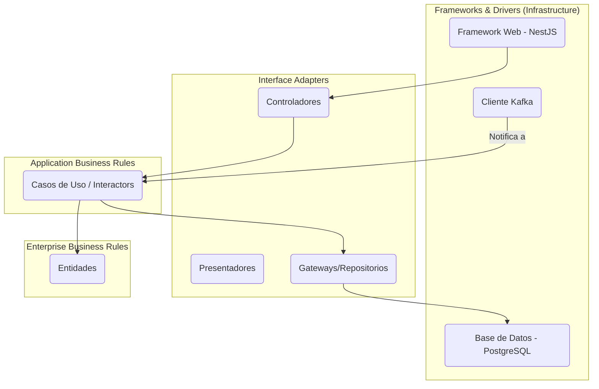

# 📘 Estrategia de Desarrollo y Arquitectura Tecnológica — SmartEdify

**Rol:** CTO  
**Estado:** `DEFINITIVA v1.1`  
**Fecha:** 2025-10-05

---

## 1. Visión Estratégica

El objetivo de esta estrategia es establecer los pilares técnicos y metodológicos para construir SmartEdify como una plataforma global, segura, escalable y mantenible. Cada decisión aquí documentada está orientada a garantizar la calidad del producto, la velocidad del equipo y la capacidad de adaptación a futuros desafíos regulatorios y de mercado.

Nos regiremos por **cinco pilares fundamentales** que todo el equipo de ingeniería debe adoptar y promover.

---

## 2. Pilar 1: Contratos de API, Versionado y Pruebas

Para garantizar la coherencia, el desacoplamiento y la evolución segura de nuestros microservicios, este pilar define cómo diseñamos, validamos y versionamos nuestras APIs.

### **2.1. OpenAPI 3.1 como Diseño de API Primero (API-First)**

-   **Contrato y Documentación Viva:** El archivo `openapi.yaml` de cada servicio es la fuente de verdad. La documentación y los SDKs de cliente se generan a partir de él.
-   **Workflow:**
    1.  **Diseño y Revisión:** Los cambios en la API se proponen y revisan en un PR sobre el archivo `openapi.yaml`.
    2.  **Generación de Código:** Se usan herramientas como `openapi-generator` para crear *server stubs* (NestJS) y *client SDKs* (TypeScript).
    3.  **Implementación:** Los desarrolladores implementan la lógica de negocio dentro de los *stubs* generados.

### **2.2. Pruebas de Contrato Orientadas al Consumidor (CDC)**

Para prevenir rupturas en las interacciones entre servicios, complementaremos OpenAPI con pruebas de contrato.
-   **Herramienta:** Se utilizará **Pact**.
-   **Proceso:** El servicio *consumidor* (ej: `governance-service`) define un "pacto" con las expectativas que tiene sobre el *proveedor* (ej: `finance-service`). Este pacto se ejecuta en el CI del proveedor para asegurar que cualquier cambio no rompa las integraciones existentes.
-   **Flujos Críticos a Cubrir:** `identity-service` ↔ `streaming-service`, `finance-service` ↔ `governance-service`, `gateway-service` ↔ `identity-service`.

### **2.3. Política de Versionado de API**

-   **Cambios Mayores (Breaking Changes):** Se gestionarán mediante versionado en la URL. Ejemplo: `/api/v2/governance/...`.
-   **Cambios Menores (Incrementales):** Se gestionarán mediante cabeceras `Accept` (Content Negotiation) para mantener la retrocompatibilidad.
-   **Ciclo de Vida:** Se establecerá una política de deprecación clara (ej: una versión se mantendrá por un mínimo de 6 meses), con comunicación proactiva a los consumidores de la API.

### **2.4. Estrategia de Validación en Runtime (Producción vs. Staging)**

-   **Staging/Pre-producción:** Se aplicará una validación **estricta**. Cualquier desviación del contrato OpenAPI en una solicitud o respuesta generará un error.
-   **Producción:** Se aplicará un modo de **"validación pasiva"**. Las desviaciones del contrato no generarán un error que afecte al usuario, sino que serán **registradas (log) y se emitirá una métrica** (`contract_deviation_total`). Esto nos alertará proactivamente sobre problemas sin causar una interrupción del servicio.

---

## 3. Pilar 2: Clean Architecture en el Núcleo de los Microservicios

Para garantizar la mantenibilidad, la capacidad de prueba y la independencia de la infraestructura, todos los microservicios seguirán los principios de **Clean Architecture**.

### **3.1. Justificación**

- **Separación de Intereses:** Las reglas de negocio críticas quedan aisladas de los detalles de implementación.
- **Testabilidad:** Los Casos de Uso y las Entidades se pueden probar de forma unitaria, sin dependencias externas.
- **Independencia:** Permite cambiar frameworks o bases de datos con un impacto mínimo en la lógica de negocio.

### **3.2. Estructura de Capas**

Cada microservicio se organizará en las siguientes capas concéntricas, con una estricta regla de dependencia hacia el interior:



---

## 4. Pilar 3: Workflow de Desarrollo y Repositorio (GitFlow Adaptado)

Para mantener un ciclo de vida de software ordenado y predecible, adoptaremos un modelo de ramas basado en GitFlow (`main`, `develop`, `feature/*`, `release/*`, `hotfix/*`).

### **Política de Pull Requests (PRs)**

-   Todo `merge` a `develop` y `main` debe hacerse a través de un PR.
-   Un PR debe ser revisado y aprobado por al menos **un miembro del equipo** (distinto al autor).
-   Un PR debe pasar **todas las comprobaciones de Integración Continua (CI)** antes de poder ser fusionado.

### **Integración Continua (CI)**

El pipeline de CI ejecutará los siguientes pasos obligatorios:
1.  Linting & Formatting.
2.  Pruebas Unitarias y de Integración.
3.  **Pruebas de Contrato (Pact).**
4.  Análisis de Seguridad (SAST).
5.  **Verificación de Cobertura de Observabilidad (Logs, Métricas, Trazas).**
6.  Construcción de Imagen Docker.

---

## 5. Pilar 4: Entorno de Desarrollo Optimizado con Docker

Para garantizar un entorno consistente y mejorar la experiencia del desarrollador (DX), se utilizará Docker Desktop con una configuración optimizada.

### **5.1. `docker-compose.yml` con Perfiles**

Se utilizarán **perfiles de Docker Compose** para permitir a los desarrolladores levantar solo los servicios que necesitan para su tarea actual, reduciendo la carga en sus máquinas locales.

-   **`core`:** Servicios esenciales (Gateway, Identity, Tenancy, Kafka, Postgres).
-   **`governance`:** El perfil `core` más `governance-service`, `compliance-service`, `streaming-service`, etc.
-   **`full`:** Levanta toda la plataforma, incluyendo el stack de IA (`Llama.cpp`).

**Ejemplo de uso:**
```bash
# Levantar solo los servicios base para desarrollo de frontend
docker-compose --profile core up -d

# Levantar el stack necesario para trabajar en gobernanza
docker-compose --profile governance up -d
```

Esto reduce drásticamente la fricción y acelera el ciclo de desarrollo diario.

---

## 6. Pilar 5: Observabilidad Desde el Diseño

La observabilidad no es una ocurrencia tardía, sino un requisito de primer nivel para cualquier funcionalidad. Un sistema distribuido solo puede ser operado y depurado si es observable.

### **Los Tres Pilares de la Observabilidad**

Todo microservicio **debe** implementar los tres pilares como parte de su "Definition of Done":

1.  **Logs Estructurados (JSON):** Todos los logs deben emitirse en formato JSON, incluyendo un `trace_id` para correlacionar eventos a través de múltiples servicios.
2.  **Métricas (Prometheus):** Cada servicio debe exponer métricas clave, siguiendo el estándar **RED** (Rate, Errors, Duration) para cada endpoint, y métricas de negocio relevantes (ej: `assemblies_created_total`).
3.  **Trazas Distribuidas (OpenTelemetry):** Se debe instrumentar el código para propagar el contexto de trazado (vía `trace_id`) en todas las llamadas HTTP y eventos de Kafka, permitiendo visualizar el flujo completo de una solicitud a través del sistema.

La falta de instrumentación de observabilidad será motivo para rechazar un PR.

---

## 7. Conclusión

Esta estrategia actualizada establece una base sólida y moderna para el desarrollo de SmartEdify. Al adoptar **Contratos de API robustos**, **Clean Architecture**, **GitFlow**, **Docker optimizado** y la **Observabilidad como pilar fundamental**, estamos equipando a nuestro equipo para construir una plataforma de clase mundial de manera eficiente, segura, resiliente y sostenible.

**El cumplimiento de estos cinco pilares no es opcional.** Es la base de nuestra cultura de ingeniería y la clave para el éxito a largo plazo del proyecto.
