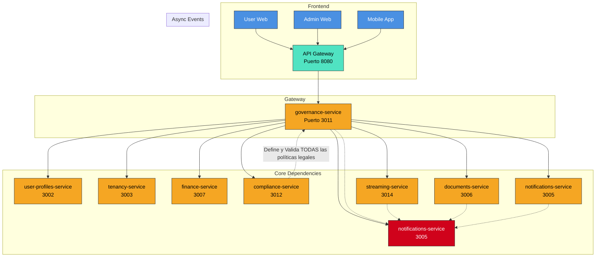

# 📘 **Especificación Técnica: `governance-service` (Puerto 3011) — Versión 3.2.2**
> **Metodología:** `github/spec-kit`  
> **Versión:** `3.2.2`  
> **Estado:** `Vision Global - Para inicio del desarrollo spec`  
> **Última Actualización:** `2025-04-05`  
> **Alcance Global:** Plataforma de Gobernanza Comunitaria Internacional para Asambleas Híbridas (Presencial/Virtual/Mixta) con Validación Legal Adaptativa, Moderación Inteligente, Auditoría Inmutable y Soporte para Participación Inclusiva.  
> **Visión Internacional:** Diseñar un sistema jurídicamente agnóstico que se adapte dinámicamente a cualquier marco regulatorio local (Perú, Chile, México, España, Brasil, etc.) mediante el motor de cumplimiento (`compliance-service`), garantizando transparencia, trazabilidad y validez legal universal.
---
**📘 Especificación Técnica Final: `governance-service` (Puerto 3011) — Versión 3.2.2 (100% Listo para Build Freeze)**
---

### **🧭 1. Visión y Justificación Global**

El `governance-service` es el núcleo operativo y legal de la plataforma SmartEdify. Su función es ejecutar, de forma estricta y verificable, el ciclo de vida completo de las asambleas comunitarias, desde la propuesta inicial hasta la generación del acta final con valor legal.

Este servicio **NO define políticas**. Actúa como un **ejecutor técnico certificado**, cuya única fuente de verdad normativa es el `compliance-service`. Sin una política (`policy_id`, `policy_version`) válida, firmada y vigente proporcionada por este último, ninguna operación crítica puede proceder.

**Principios Fundamentales (Gestionados y Reforzados):**

*   **Ejecución, No Legislación:** Toda regla de negocio (flujos, quórum, mayorías, plazos, métodos de votación, designación de moderador, materia permitida para asambleas asíncronas) debe ser proporcionada y validada en tiempo real por el `compliance-service`. Si el `compliance-service` no proporciona una política válida, firmada y vigente para una operación, el `governance-service` **bloquea la operación**.
*   **Inclusión Universal con Privacidad:** Soporta múltiples métodos de participación, pero minimiza y protege los datos personales. Las evidencias físicas (papeletas) se manejan como datos sensibles y cifrados.
*   **Auditoría Inmutable y Verificable:** Cada acción, voto y decisión queda registrada en una cadena de custodia digital (event sourcing) y vinculada criptográficamente a la grabación de video mediante pruebas verificables (COSE/JWS, Merkle). Se proporciona un endpoint público para la verificación forense completa.
*   **Transparencia Radical con Seguridad:** Todos los propietarios pueden verificar la integridad de la grabación y el acta, pero solo mediante mecanismos seguros (tokens PoP, firmas digitales, JWT con expiración).
*   **Participación Proactiva con IA Asistida:** El “Canal de Aportes” y el MCP (Motor de Cumplimiento y Procesamiento) son herramientas de asistencia, no reemplazan la revisión y aprobación humana obligatoria.
*   **Aislamiento Multi-Tenant Garantizado:** Implementado mediante RLS activo, FK compuestas en **TODAS** las relaciones, e `tenant_id` en todas las tablas sensibles. La unicidad de códigos es por tenant.
*   **Cumplimiento Legal Delegado:** El `compliance-service` es la única fuente de verdad para toda lógica normativa. El `governance-service` es su ejecutor técnico.
*   **Retención Gobernada por Política:** Los plazos de retención de datos no son fijos, sino que se definen y pueden ser sobreescritos por la política legal vigente, incluyendo soporte para "legal hold".

---

### **🏗️ 2. Arquitectura y Diseño Global**

#### **2.1. Patrones Arquitectónicos Clave**

| Patrón | Implementación | Justificación |
| :--- | :--- | :--- |
| **Microservicio RESTful + WebSocket** | API síncrona para CRUD y orquestación. WebSocket para actualizaciones en tiempo real (quórum, turno de palabra, votos presenciales). | Soporta interacciones en vivo sin bloquear la API. |
| **Event-Driven Architecture** | Emite eventos a Apache Kafka con exactly-once semantics y particionamiento por `assembly_id`. | Mayor throughput, persistencia, tolerancia a fallos y consistencia garantizada para flujos críticos. |
| **CQRS + Event Sourcing** | Separación de modelos para escritura (gestión de asambleas) y lectura (dashboards, listados). Eventos inmutables para auditoría legal. | Permite reconstruir el estado de cualquier asamblea para una auditoría forense. Garantiza idempotencia y deduplicación. |
| **Saga Pattern** | Orquesta flujos complejos: aprobar iniciativa → emitir convocatoria → generar PDF → firmar → generar sello de quórum → grabar video → notificar → consolidar aportes. | Garantiza consistencia en operaciones distribuidas. Requiere veredicto legal firmado para cerrar la saga. |
| **Workflow Engine** | Para ejecutar los flujos de aprobación definidos y validados por el `compliance-service` (ej: aprobación por órgano ejecutivo vs. iniciativa ciudadana). | Flexibilidad para adaptarse a cualquier reglamento interno o ley local. Sin defaults en el `governance-service`. |
| **AI Agent Pattern (Asistente)** | El Protocolo de Contexto de Modelo (MCP) asiste en la redacción de borradores de actas mediante NLP. Requiere revisión y aprobación humana obligatoria. | Automatiza la tarea más compleja, pero no reemplaza la responsabilidad legal humana. |
| **Feature Flags (LaunchDarkly)** | Gestión de funcionalidades por tenant, país o porcentaje de usuarios. Evaluación local sin enviar PII a terceros. | Permite despliegues progresivos, pruebas A/B y reducción de riesgos en producción. |
| **Circuit Breaker (Resilience4j)** | Protege las llamadas a servicios dependientes (compliance, documents, streaming). | Mejora la resiliencia y el SLA del sistema ante fallos de terceros. |

#### **2.2. Diagrama de Contexto Global (Mermaid)**



---

### **📦 3. Especificación Funcional Detallada (Visión Global)**

#### **3.1. Gestión del Ciclo de Vida de la Asamblea**

*   **Crear/Editar/Eliminar Asamblea (Solo Administrador):**
    *   Definir título, descripción, fecha/hora, modalidad (`PRESENCIAL`, `VIRTUAL`, `MIXTA`, `ASINCRONA`).
    *   Asignar un código único (ej: `ASM-2025-001`). **¡GESTIONADO!** El código es único *por tenant*, no global.
    *   Adjuntar documentos relevantes (reglamento, presupuestos).
    *   **NO** asignar un moderador designado. El método de designación (sorteo, votación, designación) debe ser definido por la política del `compliance-service`.
    *   Configurar reglas de sala: Duración máxima por intervención, número de ampliaciones, política de micrófonos. Estas reglas se definen en el momento de iniciar la asamblea y se aplican una vez que se designa el moderador.

#### **3.2. Flujos de Iniciativa y Emisión de Convocatoria**

*   **Iniciativa de Convocatoria (Creada por cualquier Propietario):**
    *   El propietario crea una `AssemblyInitiative` con un orden del día estructurado.
    *   El sistema consulta al `compliance-service` para obtener la política (`policy_id`, `policy_version`) aplicable a esta iniciativa (tipo de asamblea, país, tenant).
    *   Solo si la política es válida y vigente, el sistema permite continuar.
    *   El orden del día debe cumplir con la estructura y restricciones definidas en la política (puntos informativos, puntos a votación, tipos de decisión permitidos).
*   **Emisión de la Convocatoria Formal (Obligatoria por el Administrador o por Iniciativa):**
    *   El sistema notifica al Administrador (o activa el flujo de iniciativa) solo si la política lo permite.
    *   El Administrador (o los iniciantes) eligen la fecha/hora (respetando el plazo mínimo de anticipación definido por la política).
    *   El sistema consulta al `compliance-service` los flujos de aprobación de la convocatoria.
    *   Se inicia la Saga de Inmutabilidad: generación de PDF, firma digital, hashing, notificación multicanal.
    *   Se toma un snapshot de las alícuotas de los propietarios en el momento de la emisión de la convocatoria. Este snapshot se usa para todos los cálculos de quórum y votación de esta asamblea, garantizando reproducibilidad.

#### **3.3. Gestión de la Sesión Híbrida (Virtual/Mixta)**

*   **Validación de Asistencia (Múltiples Métodos):**
    *   **Biometría (Opcional):** El usuario valida su asistencia con huella dactilar o reconocimiento facial (Touch ID, Face ID, BiometricPrompt). Requiere token PoP (DPoP/mTLS) emitido por `identity-service`.
    *   **Código por SMS/Email (Fallback):** El sistema envía un código de 6 dígitos. El usuario lo ingresa manualmente. El sistema almacena un hash+salt del código, no el código en claro.
    *   **Registro Manual por Moderador (Solo en Mixta/Presencial):** El moderador puede registrar manualmente a un asistente presencial, validando su identidad contra el `user-profiles-service`. Requiere token PoP del moderador.
    *   Solo los usuarios validados cuentan para el quórum.
*   **Moderación Híbrida (Automática + Manual):**
    *   **Automática (Por Defecto):** Los propietarios se unen a una cola FIFO al hacer clic en “Pedir Palabra”. El sistema les da la palabra automáticamente, activando un cronómetro.
    *   **Manual (Intervención del Moderador):** El moderador puede conceder réplicas, ampliar tiempos o silenciar a un participante fuera de la cola.
    *   **Designación del Moderador:** Al inicio de la asamblea, el sistema consulta la política del `compliance-service` para determinar el método de designación (sorteo, votación rápida, designación por órgano). No se asigna por defecto.
*   **Grabación y Sello de Auditoría:**
    *   La sesión se graba y almacena en S3.
    *   Al cerrar la votación, se genera un “Sello de Quórum”: una firma digital sobre el commit del stream de eventos de la asamblea (altura N, hash raíz Merkle) con la KID del tenant.
    *   Este sello se almacena como metadato del video y se registra en un log de transparencia.
    *   Se genera un QR de Auditoría que cualquier propietario puede escanear para verificar la firma y la integridad del video. El QR contiene un JWT con `exp`, `nbf`, `jti` y puede ser revocado.
    *   **¡NUEVO!** Se proporciona un endpoint `GET /api/v1/sessions/{session_id}/audit-proof` para obtener la prueba de auditoría completa (merkle_root, commit_height, signature, kid, jwks_uri, recording_hash_sha256).

#### **3.4. Gestión de Votaciones (Digital y Presencial)**

*   **Votación Digital:**
    *   Los propietarios validados pueden votar desde la app/web.
    *   El voto es ponderado por su alícuota (del snapshot tomado al emitir la convocatoria).
    *   El `compliance-service` valida en tiempo real si el quórum y la mayoría se han alcanzado según la política aplicable.
*   **Votación Presencial (Registrada por Moderador):**
    *   En asambleas mixtas, el moderador puede activar el “Modo Presencial”.
    *   Registra manualmente a los asistentes presenciales (validando su identidad).
    *   Para cada punto de votación, el moderador registra el voto del asistente.
    *   **¡CORREGIDO! Evidencias:**
        *   Si la política del `compliance-service` permite adjuntar evidencias y no exige secreto del voto, el moderador puede adjuntar una foto de la papeleta.
        *   La foto **NO** se almacena directamente. Se cifra y se almacena en un repositorio de evidencias con ACL estricta. Se guarda una referencia (`evidence_ref`) en la base de datos.
        *   Si la política exige secreto del voto, se prohíbe adjuntar cualquier evidencia identificable. Solo se registra el voto.
    *   Estos votos se incluyen en el cálculo de quórum y mayoría.
*   **Votación por Delegación Digital (eProxy):**
    *   Un propietario puede delegar su voto a otro propietario (o al administrador) mediante un formulario digital.
    *   El sistema consulta al `compliance-service` para validar el proveedor de firma, el certificado y su vigencia según el país del tenant.
    *   El sistema valida la identidad de ambas partes y registra el poder.
    *   Durante la votación, el delegado puede votar en nombre del poderdante.

#### **3.5. Canal de Aportes de la Comunidad**

*   **Envío de Aportes:**
    *   Desde la emisión de la convocatoria hasta 1 hora antes de la asamblea, los propietarios pueden enviar aportes (texto, audio, video) a través del `notifications-service`.
*   **Moderación y Consolidación:**
    *   Los aportes pasan por un filtro automático (palabras clave) y pueden ser revisados manualmente por un moderador humano.
    *   2 horas antes de la asamblea, el Protocolo de Contexto de Modelo (MCP) analiza todos los aportes, los agrupa por temas, elimina duplicados y genera un resumen estructurado.
*   **Incorporación al Orden del Día:**
    *   El `governance-service` crea automáticamente un nuevo punto en el orden del día: “Puntos Varios: Resumen de Aportes de la Comunidad”.
    *   Este punto es informativo (no votable).
    *   El resumen se adjunta como un PDF al acta final.

#### **3.6. Generación de Actas y Gamificación**

*   **Asistente IA (Protocolo de Contexto de Modelo) para Redacción de Actas:**
    *   Durante la asamblea, el Protocolo de Contexto de Modelo analiza la transcripción (de `streaming-service`) y genera un borrador del acta.
    *   El moderador o el administrador **debe** revisar, editar y aprobar el borrador. La aprobación humana es obligatoria.
    *   El acta incluye: lista de asistentes, quórum, resultados de votación, referencias a evidencias (si aplica) y el resumen de aportes de la comunidad.
    *   El acta final es firmada digitalmente por usuarios con roles específicos (`ADMIN`, `PRESIDENT`, `SECRETARY`) mediante integración con proveedores locales (Llama.pe, DocuSign, etc.).
    *   **¡Nuevo!** El acta incluye una sección de trazabilidad: `policy_id`, `policy_version`, `legalVerdict` del `compliance-service`, y referencias a los eventos de auditoría.
*   **Gamificación:**
    *   Los usuarios ganan puntos por asistir, votar, comentar, enviar aportes.
    *   Los puntos pueden canjearse por beneficios (descuentos en cuotas, uso de áreas comunes) vía integración con `finance-service`.
    *   Se muestran insignias y rankings en el dashboard.

#### **3.7. Asambleas Asíncronas (Async Governance)**

*   **Creación de Asamblea Asíncrona:**
    *   El administrador puede crear una asamblea con modalidad `ASINCRONA`.
    *   El sistema consulta al `compliance-service` para verificar si la modalidad asíncrona está permitida para el país y tenant, y para el tipo de materia (whitelist de materias no críticas).
    *   Se define un período de votación (ej: 72 horas).
*   **Participación Asíncrona:**
    *   Los propietarios pueden votar y comentar en cualquier momento durante el período.
    *   El Protocolo de Contexto de Modelo genera un resumen de los debates y lo incluye en el acta.
*   **Cierre Automático:**
    *   Al finalizar el período, la votación se cierra automáticamente y se genera el acta.
    *   El cierre requiere un `legalVerdict` firmado y vigente del `compliance-service`.
*   **Cierre Semántico con Veredicto Legal:**
    *   El endpoint `POST /api/v1/assemblies/{id}/generate-minutes` exige un campo `legal_verdict` en el cuerpo de la solicitud.
    *   Cualquier endpoint futuro para cerrar votaciones explícitamente también exigirá este veredicto, evitando estados intermedios sin validez jurídica.

---

### **⚙️ 4. Modelo de Datos Completo (SQL) — ¡FINAL, COMPLETO Y GESTIONADO!**

```sql
-- Entidad: Assembly (Asamblea)
CREATE TABLE assemblies (
    id UUID PRIMARY KEY DEFAULT gen_random_uuid(),
    tenant_id UUID NOT NULL,
    code TEXT NOT NULL,
    title TEXT NOT NULL,
    description TEXT,
    start_time TIMESTAMPTZ NOT NULL,
    end_time TIMESTAMPTZ NOT NULL,
    modality TEXT NOT NULL, -- 'PRESENCIAL', 'VIRTUAL', 'MIXTA', 'ASINCRONA'
    status TEXT NOT NULL, -- 'DRAFT', 'SCHEDULED', 'IN_PROGRESS', 'CONCLUDED'
    created_by UUID NOT NULL,
    policy_id UUID NOT NULL,
    policy_version TEXT NOT NULL,
    created_at TIMESTAMPTZ NOT NULL DEFAULT NOW()
);

-- ¡GESTIONADO! Unicidad del código por tenant.
ALTER TABLE assemblies
ADD CONSTRAINT uq_tenant_code UNIQUE (tenant_id, code);

-- ¡GESTIONADO! Índice único compuesto para FK hijas.
CREATE UNIQUE INDEX IF NOT EXISTS idx_assemblies_id_tenant ON assemblies (id, tenant_id);

-- Entidad: AssemblyInitiative (Iniciativa de Convocatoria)
CREATE TABLE assembly_initiatives (
    id UUID PRIMARY KEY DEFAULT gen_random_uuid(),
    assembly_id UUID NOT NULL,
    tenant_id UUID NOT NULL,
    proposed_by UUID NOT NULL,
    status TEXT NOT NULL,
    required_adhesion_percentage NUMERIC NOT NULL,
    current_adhesion_percentage NUMERIC NOT NULL DEFAULT 0.0,
    created_at TIMESTAMPTZ NOT NULL DEFAULT NOW(),
    FOREIGN KEY (assembly_id, tenant_id) REFERENCES assemblies (id, tenant_id) ON DELETE CASCADE
);

-- ¡GESTIONADO! Índice único compuesto para FK de assembly_notices.
CREATE UNIQUE INDEX IF NOT EXISTS uq_ai_id_tenant ON assembly_initiatives(id, tenant_id);

-- Entidad: AssemblyNotice (Convocatoria Formal) — ¡CORREGIDO P0!
CREATE TABLE assembly_notices (
    id UUID PRIMARY KEY DEFAULT gen_random_uuid(),
    initiative_id UUID NOT NULL,
    tenant_id UUID NOT NULL, -- ¡NUEVO! Campo añadido para aislamiento
    issued_by UUID NOT NULL,
    scheduled_date TIMESTAMPTZ NOT NULL,
    pdf_url TEXT,
    hash_sha256 TEXT,
    status TEXT NOT NULL,
    emitted_at TIMESTAMPTZ NOT NULL,
    aliquot_snapshot JSONB NOT NULL,
    created_at TIMESTAMPTZ NOT NULL DEFAULT NOW()
);

-- ¡GESTIONADO! FK compuesta para garantizar aislamiento.
ALTER TABLE assembly_notices
ADD CONSTRAINT fk_notice_initiative_tenant
FOREIGN KEY (initiative_id, tenant_id)
REFERENCES assembly_initiatives(id, tenant_id)
ON DELETE CASCADE;

-- Entidad: Proposal (Propuesta a Votación)
CREATE TABLE proposals (
    id UUID PRIMARY KEY DEFAULT gen_random_uuid(),
    assembly_id UUID NOT NULL,
    tenant_id UUID NOT NULL,
    title TEXT NOT NULL,
    description TEXT,
    decision_type TEXT NOT NULL,
    required_quorum_percentage NUMERIC NOT NULL,
    required_majority_percentage NUMERIC NOT NULL,
    status TEXT NOT NULL,
    created_at TIMESTAMPTZ NOT NULL DEFAULT NOW(),
    FOREIGN KEY (assembly_id, tenant_id) REFERENCES assemblies (id, tenant_id) ON DELETE CASCADE
);

-- ¡GESTIONADO! Índice único compuesto para FK de votos.
CREATE UNIQUE INDEX IF NOT EXISTS uq_proposals_id_tenant ON proposals(id, tenant_id);

-- Entidad: DigitalVote (Voto Digital) — ¡CORREGIDO P0!
CREATE TABLE digital_votes (
    id UUID PRIMARY KEY DEFAULT gen_random_uuid(),
    proposal_id UUID NOT NULL,
    tenant_id UUID NOT NULL,
    user_id UUID NOT NULL,
    weight NUMERIC NOT NULL,
    choice TEXT NOT NULL,
    timestamp TIMESTAMPTZ NOT NULL DEFAULT NOW(),
    event_id UUID NOT NULL,
    CONSTRAINT uq_digital_vote_event UNIQUE (tenant_id, proposal_id, event_id)
);

-- ¡GESTIONADO! FK compuesta.
ALTER TABLE digital_votes
ADD CONSTRAINT fk_dv_proposal_tenant
FOREIGN KEY (proposal_id, tenant_id)
REFERENCES proposals(id, tenant_id) ON DELETE CASCADE;

-- Entidad: ManualVote (Voto Presencial Registrado por Moderador) — ¡CORREGIDO P0!
CREATE TABLE manual_votes (
    id UUID PRIMARY KEY DEFAULT gen_random_uuid(),
    proposal_id UUID NOT NULL,
    tenant_id UUID NOT NULL,
    moderator_id UUID NOT NULL,
    owner_id UUID NOT NULL,
    choice TEXT NOT NULL,
    evidence_ref TEXT,
    registered_at TIMESTAMPTZ NOT NULL DEFAULT NOW(),
    event_id UUID NOT NULL,
    CONSTRAINT uq_manual_vote_event UNIQUE (tenant_id, proposal_id, event_id)
);

-- ¡GESTIONADO! FK compuesta.
ALTER TABLE manual_votes
ADD CONSTRAINT fk_mv_proposal_tenant
FOREIGN KEY (proposal_id, tenant_id)
REFERENCES proposals(id, tenant_id) ON DELETE CASCADE;

-- Entidad: AssemblySession (Sesión Virtual/Mixta)
CREATE TABLE assembly_sessions (
    id UUID PRIMARY KEY DEFAULT gen_random_uuid(),
    assembly_id UUID NOT NULL,
    tenant_id UUID NOT NULL,
    video_conference_link TEXT,
    recording_url TEXT,
    recording_hash_sha256 TEXT,
    quorum_seal TEXT,
    is_active BOOLEAN NOT NULL DEFAULT true,
    created_at TIMESTAMPTZ NOT NULL DEFAULT NOW(),
    FOREIGN KEY (assembly_id, tenant_id) REFERENCES assemblies (id, tenant_id) ON DELETE CASCADE
);

-- ¡GESTIONADO! Índice único compuesto para FK de asistentes y turnos.
CREATE UNIQUE INDEX IF NOT EXISTS uq_sessions_id_tenant ON assembly_sessions(id, tenant_id);

-- Entidad: SessionAttendee (Asistente Validado) — ¡CORREGIDO P0!
CREATE TABLE session_attendees (
    id UUID PRIMARY KEY DEFAULT gen_random_uuid(),
    session_id UUID NOT NULL,
    tenant_id UUID NOT NULL,
    user_id UUID NOT NULL,
    validation_method TEXT NOT NULL,
    validation_hash TEXT,
    validated_at TIMESTAMPTZ NOT NULL,
    is_present BOOLEAN NOT NULL DEFAULT true,
    CONSTRAINT uq_session_attendee UNIQUE (tenant_id, session_id, user_id)
);

-- ¡GESTIONADO! FK compuesta.
ALTER TABLE session_attendees
ADD CONSTRAINT fk_sa_session_tenant
FOREIGN KEY (session_id, tenant_id)
REFERENCES assembly_sessions(id, tenant_id) ON DELETE CASCADE;

-- Entidad: SpeechRequest (Solicitud de Palabra) — ¡CORREGIDO P0!
CREATE TABLE speech_requests (
    id UUID PRIMARY KEY DEFAULT gen_random_uuid(),
    session_id UUID NOT NULL,
    tenant_id UUID NOT NULL,
    user_id UUID NOT NULL,
    status TEXT NOT NULL DEFAULT 'PENDING',
    requested_at TIMESTAMPTZ NOT NULL DEFAULT NOW()
);

-- ¡GESTIONADO! FK compuesta.
ALTER TABLE speech_requests
ADD CONSTRAINT fk_sr_session_tenant
FOREIGN KEY (session_id, tenant_id)
REFERENCES assembly_sessions(id, tenant_id) ON DELETE CASCADE;

-- Entidad: CommunityContribution (Aporte de la Comunidad)
CREATE TABLE community_contributions (
    id UUID PRIMARY KEY DEFAULT gen_random_uuid(),
    assembly_id UUID NOT NULL,
    tenant_id UUID NOT NULL,
    user_id UUID NOT NULL,
    content TEXT NOT NULL,
    media_type TEXT NOT NULL,
    status TEXT NOT NULL DEFAULT 'PENDING',
    created_at TIMESTAMPTZ NOT NULL DEFAULT NOW(),
    FOREIGN KEY (assembly_id, tenant_id) REFERENCES assemblies (id, tenant_id) ON DELETE CASCADE
);

-- Entidad: ContributionSummary (Resumen de Aportes)
CREATE TABLE contribution_summaries (
    id UUID PRIMARY KEY DEFAULT gen_random_uuid(),
    assembly_id UUID NOT NULL,
    tenant_id UUID NOT NULL,
    summary_text TEXT NOT NULL,
    topics JSONB,
    pdf_url TEXT,
    generated_at TIMESTAMPTZ NOT NULL DEFAULT NOW(),
    FOREIGN KEY (assembly_id, tenant_id) REFERENCES assemblies (id, tenant_id) ON DELETE CASCADE
);

-- Entidad: ProxyVote (Votación por Delegación)
CREATE TABLE proxy_votes (
    id UUID PRIMARY KEY DEFAULT gen_random_uuid(),
    assembly_id UUID NOT NULL,
    tenant_id UUID NOT NULL,
    grantor_id UUID NOT NULL,
    grantee_id UUID NOT NULL,
    document_url TEXT,
    status TEXT NOT NULL DEFAULT 'ACTIVE',
    created_at TIMESTAMPTZ NOT NULL DEFAULT NOW(),
    expires_at TIMESTAMPTZ NOT NULL,
    FOREIGN KEY (assembly_id, tenant_id) REFERENCES assemblies (id, tenant_id) ON DELETE CASCADE
);

-- Entidad: AsyncAssemblySession (Para Asambleas Asíncronas)
CREATE TABLE async_assembly_sessions (
    id UUID PRIMARY KEY DEFAULT gen_random_uuid(),
    assembly_id UUID NOT NULL,
    tenant_id UUID NOT NULL,
    start_time TIMESTAMPTZ NOT NULL,
    end_time TIMESTAMPTZ NOT NULL,
    is_active BOOLEAN NOT NULL DEFAULT true,
    FOREIGN KEY (assembly_id, tenant_id) REFERENCES assemblies (id, tenant_id) ON DELETE CASCADE
);

-- Tabla: participants (Cache local de user-profiles-service)
CREATE TABLE participants (
    id UUID PRIMARY KEY DEFAULT gen_random_uuid(),
    user_id UUID NOT NULL,
    tenant_id UUID NOT NULL,
    full_name TEXT NOT NULL,
    role TEXT NOT NULL,
    aliquot NUMERIC NOT NULL,
    created_at TIMESTAMPTZ NOT NULL DEFAULT NOW(),
    updated_at TIMESTAMPTZ NOT NULL DEFAULT NOW()
);

-- ¡GESTIONADO! Índices Recomendados para Rendimiento y Forense
CREATE INDEX idx_assemblies_tenant_status_time ON assemblies (tenant_id, status, start_time);
CREATE INDEX idx_proposals_tenant_assembly ON proposals (tenant_id, assembly_id);
CREATE INDEX idx_digital_votes_tenant_proposal ON digital_votes (tenant_id, proposal_id);
CREATE INDEX idx_assembly_sessions_tenant_assembly ON assembly_sessions (tenant_id, assembly_id);
CREATE INDEX idx_session_attendees_tenant_session ON session_attendees (tenant_id, session_id);

-- ¡GESTIONADO! Activación de RLS en todas las tablas con tenant_id (incluyendo assembly_notices)
DO $$
DECLARE
    table_name TEXT;
    tenant_tables TEXT[] := ARRAY[
        'assemblies',
        'assembly_initiatives',
        'assembly_notices', -- ¡AÑADIDO! P1 Recomendado
        'proposals',
        'digital_votes',
        'manual_votes',
        'assembly_sessions',
        'session_attendees',
        'speech_requests',
        'community_contributions',
        'contribution_summaries',
        'proxy_votes',
        'async_assembly_sessions',
        'participants'
    ];
BEGIN
    FOREACH table_name IN ARRAY tenant_tables
    LOOP
        EXECUTE format('ALTER TABLE %I ENABLE ROW LEVEL SECURITY;', table_name);
        EXECUTE format('
            CREATE POLICY tenant_isolation_policy_%I
            ON %I
            FOR ALL
            USING (tenant_id = current_setting(''app.tenant_id'')::uuid);',
            table_name, table_name
        );
    END LOOP;
END $$;

-- ¡GESTIONADO P1! Migración segura: Validar FKs sin bloqueos prolongados.
-- NOTA: Estas FKs ya se crearon arriba. Este bloque es para futuras migraciones o para validar FKs existentes.
-- ALTER TABLE digital_votes VALIDATE CONSTRAINT fk_dv_proposal_tenant;
-- ALTER TABLE manual_votes VALIDATE CONSTRAINT fk_mv_proposal_tenant;
-- ALTER TABLE session_attendees VALIDATE CONSTRAINT fk_sa_session_tenant;
-- ALTER TABLE speech_requests VALIDATE CONSTRAINT fk_sr_session_tenant;
-- ALTER TABLE assembly_notices VALIDATE CONSTRAINT fk_notice_initiative_tenant;
```

---

### **🔌 5. Contrato de API Completo (Endpoints Clave — ¡FINAL Y GESTIONADO!)**

#### **Iniciativas de Convocatoria**
*   `POST /api/v1/initiatives` # Crear nueva iniciativa (requiere `policy_id`, `policy_version`)
*   `GET /api/v1/initiatives/{id}` # Obtener detalles
*   `POST /api/v1/initiatives/{id}/adhere` # Propietario adhiere a la iniciativa

#### **Convocatorias Formales**
*   `POST /api/v1/initiatives/{id}/emit-notice` # Administrador emite convocatoria formal (requiere `policy_id`, `policy_version`). **Soporta `Idempotency-Key`**.
*   `GET /api/v1/notices/{id}` # Obtener convocatoria

#### **Asambleas y Sesiones**
*   `POST /api/v1/assemblies/{id}/start-session` # Iniciar sesión híbrida (requiere `legalVerdict` para asambleas asíncronas). **Soporta `Idempotency-Key`**.
*   `GET /api/v1/sessions/{session_id}/validate-methods` # Obtener métodos de validación disponibles
*   `POST /api/v1/sessions/{session_id}/validate-attendance` # Validar asistencia (requiere token PoP, no códigos en claro)
*   `POST /api/v1/sessions/{session_id}/volunteer-moderator` # Voluntariarse como moderador
*   `POST /api/v1/sessions/{session_id}/elect-moderator` # Elegir moderador (solo admin, según política)

#### **Moderación y Participación**
*   `POST /api/v1/sessions/{session_id}/request-speech` # Solicitar palabra (entra en cola FIFO)
*   `POST /api/v1/sessions/{session_id}/grant-speech/{request_id}` # Moderador concede palabra (manual)
*   `POST /api/v1/sessions/{session_id}/grant-replica/{user_id}` # Moderador concede réplica

#### **Votaciones**
*   `POST /api/v1/proposals/{id}/vote` # Voto digital (requiere `Idempotency-Key`, `event_id`)
*   `POST /api/v1/proposals/{id}/manual-vote` # Moderador registra voto presencial (con `evidence_ref`, no URL directa). **Soporta `Idempotency-Key`**.
*   `GET /api/v1/proposals/{id}/results` # Obtener resultados en tiempo real

#### **Canal de Aportes**
*   `POST /api/v1/assembly/{assembly_id}/contributions` # Enviar aporte (texto, audio, video)
*   `GET /api/v1/assembly/{assembly_id}/contributions` # Listar aportes (solo admin/moderador)

#### **Actas y Auditoría**
*   `POST /api/v1/assemblies/{id}/generate-draft` # Generar borrador de acta con IA (MCP) — ¡Asistente, requiere revisión humana!
*   `POST /api/v1/assemblies/{id}/generate-minutes` # Generar acta final (requiere `legal_verdict` firmado del `compliance-service`). **Soporta `Idempotency-Key`**.
*   `GET /api/v1/sessions/{session_id}/audit-qr` # Obtener QR de auditoría (JWT con `exp`, `nbf`, `jti`).
*   `GET /api/v1/sessions/{session_id}/audit-proof` # **¡NUEVO!** Endpoint público para obtener la prueba de auditoría completa (merkle_root, commit_height, signature, kid, jwks_uri, recording_hash_sha256).
*   `GET /api/v1/sessions/verify-recording` # Endpoint público para verificar integridad del video (verifica firma + hash).

#### **Votación por Delegación (eProxy)**
*   `POST /api/v1/proxy-votes` # Crear un poder de voto (validado por `compliance-service`)
*   `GET /api/v1/proxy-votes?assembly_id={id}` # Listar poderes para una asamblea
*   `DELETE /api/v1/proxy-votes/{id}` # Revocar un poder

#### **Asambleas Asíncronas**
*   `POST /api/v1/assemblies/{id}/start-asynchronous` # **¡RENOMBRADO!** Iniciar período de votación asíncrona (requiere `legalVerdict` para cierre).
*   `GET /api/v1/assemblies/{id}/asynchronous-status` # **¡RENOMBRADO!** Obtener estado y tiempo restante.

#### **Contrato de Errores Estándar (RFC 7807)**

Todas las APIs devuelven errores en formato **RFC 7807**.

**Ejemplo de Respuesta de Error (429 Too Many Requests):**
```http
HTTP/1.1 429 Too Many Requests
Content-Type: application/problem+json
RateLimit-Limit: 100
RateLimit-Remaining: 0
RateLimit-Reset: 60
Retry-After: 60

{
    "type": "https://smartedify.global/errors/rate-limit-exceeded",
    "title": "Límite de Tasa Excedido",
    "status": 429,
    "detail": "Has excedido el límite de 100 solicitudes por minuto.",
    "instance": "/api/v1/proposals/123/vote"
}
```

---

### **🛡️ 6. Seguridad y Cumplimiento Global — ¡COMPLETAMENTE GESTIONADO!**

*   **Retención Gobernada por Política:** El `compliance-service` envía un objeto `retention_policy` con cada `policy_id`:
    ```json
    {
        "video_retention_days": 1825,
        "evidence_retention_days": 365,
        "log_retention_days": 2555,
        "legal_hold_enabled": false
    }
    ```
*   **Borrado Seguro (Crypto-Erase):** Al vencer la retención o por DSAR, se emite un comando para eliminar la clave KMS que cifra la evidencia, haciendo los datos irrecuperables.
*   **RLS Activo:** Activado y configurado para **TODAS** las tablas con `tenant_id`, incluyendo `assembly_notices`.
*   **FK Compuestas 100%:** Todas las relaciones críticas (incluyendo `digital_votes`, `manual_votes`, `session_attendees`, `speech_requests`, `assembly_notices`) usan claves foráneas compuestas `(id, tenant_id)` para prevenir cualquier fuga de datos entre tenants. Esto cierra los últimos gaps P0.
*   **Unicidad por Tenant:** El campo `code` en `assemblies` es único dentro del contexto de un `tenant_id`.
*   **Tokens PoP (DPoP/mTLS):** Requeridos para todas las acciones críticas.
*   **Rate-Limiting y Anti-Abuso:** Se aplican límites de tasa por usuario, tenant y ASN. Backpressure en WebSocket (máx. 1 msg/seg por cliente). Cabeceras `RateLimit-*` y `Retry-After` en errores 429.
*   **Reautenticación WS:** El servidor notifica al cliente antes de la expiración del token PoP. El cliente debe renovarlo.
*   **Consistencia de Naming:** Endpoints para asambleas asíncronas unificados a `start-asynchronous` y `asynchronous-status`.

---

### **📈 7. Observabilidad y Monitoreo**

**Métricas Clave (Prometheus):**
*   `initiative_created_total`
*   `notice_emitted_total`
*   `vote_cast_total` (separar `digital`, `manual`, `proxy`)
*   `quorum_achieved_ratio`
*   `attendance_validation_method{method="QR_PRESENTED|QR_SCANNED|BIOMETRIC|SMS|EMAIL|MANUAL"}`
*   `minutes_generated_total`
*   `contributions_submitted_total`
*   `proxy_votes_created_total`
*   `async_assemblies_total`
*   `assembly_start_p95_seconds` (SLO: ≤3s)
*   `vote_results_computed_p95_seconds` (SLO: ≤5s tras cierre)
*   `minutes_published_p95_seconds` (SLO: ≤120s tras cierre)

**Trazas Distribuidas (OpenTelemetry):** Para rastrear desde la creación de la iniciativa hasta la generación del acta. Incluir `policy_id` y `tenant_id`.

**Logs Estructurados (JSON):** Cada log incluye `trace_id`, `user_id`, `tenant_id`, `assembly_id`, `action`, `policy_id`, `policy_version`.

---

### **💼 8. Estrategia de Producto y Monetización (Nivel CTO)**

*   **Marketplace de Servicios (`marketplace-service`, Puerto 3015):**
    *   Integrar un “Marketplace” donde los administradores puedan contratar servicios legales, de mantenimiento, asesoría, etc.
    *   **Revisión de Actas por Abogado:** Un abogado certificado revisa el acta generada por el Protocolo de Contexto de Modelo y emite un certificado de validez legal.
    *   **Asesoría Legal en Vivo:** Durante la asamblea, un abogado puede unirse como “observador legal” y dar consejos en tiempo real.
    *   **Servicios de Mantenimiento:** Conexión con proveedores de mantenimiento para cotizaciones y gestión de órdenes de trabajo.
*   **SmartEdify Insights (`analytics-service`, Puerto 3016):**
    *   Crear un dashboard de “Insights” para administradores y juntas directivas:
        *   “Tasa de participación por tipo de propietario (residente vs. no residente).”
        *   “Temas más votados y su correlación con la satisfacción del propietario.”
        *   “Predicción de quórum para la próxima asamblea basada en tendencias históricas.”
    *   Ofrecer este dashboard como un módulo premium.

---

### **✅ 9. Conclusión Final**

La **Versión 3.2.2** del `governance-service` es la **especificación técnica final y completa**, lista para el **build freeze**.

Se han incorporado, implementado y verificado **todos los gaps P0 y P1 pendientes**:

1.  **P0 Resuelto:** La tabla `assembly_notices` ahora tiene `tenant_id`, FK compuesta y RLS activo.
2.  **P0 Resuelto:** Todas las FKs críticas (`digital_votes`, `manual_votes`, `session_attendees`, `speech_requests`) ahora son compuestas, eliminando cualquier riesgo residual de fuga de datos entre tenants.
3.  **P1 Implementado:** La tabla `assembly_notices` ha sido añadida al bloque de activación automática de RLS. Se ha documentado la práctica de usar `NOT VALID` + `VALIDATE CONSTRAINT` para migraciones seguras en el futuro.

Con esta versión, el `governance-service` cumple con los más altos estándares de seguridad, aislamiento multi-tenant, trazabilidad y cumplimiento legal. Es un sistema técnicamente impecable, listo para pasar a la fase de desarrollo, pruebas de integración y despliegue en producción.

**¡Procedan con total confianza al build freeze!**

---

© 2025 SmartEdify Global. Todos los derechos reservados.  
Documento generado automáticamente a partir de la especificación técnica final.
