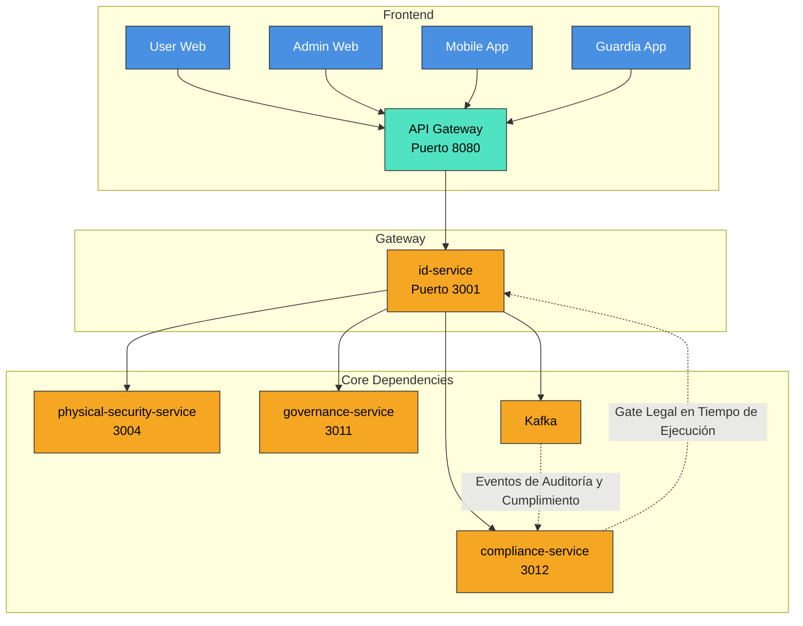

# 📘 Especificación Técnica: identity-service (Puerto 3001) — Versión 3.3

> **Metodología:** `github/spec-kit`  
> **Versión:** `3.3`  
> **Estado:** `En Revisión Arquitectónica`  
> **Última Actualización:** `2025-09-23`  
> **Alcance:** Proveedor central de identidad, autenticación, autorización y sesiones en entorno multi-tenant, con soporte expandido para autenticación biométrica y QR para integración transnacional.  
> **Visión Transnacional:** Servicio de identidad capaz de operar en múltiples jurisdicciones con adaptación local de políticas de autenticación y privacidad, soportando estándares internacionales y requisitos legales específicos por país.

---

### **🧭 1. Visión y Justificación**

El `identity-service` es la puerta de entrada segura y legalmente válida a la plataforma SmartEdify. Su misión es gestionar la identidad digital de todos los actores (residentes, administradores, guardias, sistemas) con un nivel de aseguramiento adaptativo (AAL2/AAL3), garantizando la privacidad, la seguridad y el cumplimiento normativo en cada jurisdicción.

Este servicio actúa como el “sistema nervioso central” de la seguridad y el cumplimiento, integrando estándares técnicos de vanguardia (WebAuthn L3, DPoP, OAuth 2.0 BCP) con el `compliance-service` como el “gate legal en tiempo de ejecución” que valida y autoriza cada operación crítica.

---

### **🏗️ 2. Arquitectura y Diseño Global**

#### **2.1. Patrones Arquitectónicos Clave**

| Patrón | Implementación | Justificación |
| --- | --- | --- |
| Identity Provider (IdP) | Implementación estándar de OpenID Connect (OIDC) y OAuth 2.0. | Estándar de la industria para federación de identidad. |
| Zero Trust Architecture | Verificación explícita de cada acceso, incluso desde dentro de la red. | Mitiga amenazas internas y externas. |
| Event-Driven Architecture | Emite eventos de auditoría y cumplimiento a Kafka para procesamiento asíncrono. | Desacopla la lógica de negocio de la de cumplimiento y auditoría. |
| Policy-Based Access Control (PBAC) | Motor de políticas (OPA/Cedar) para autorización híbrida (RBAC + ABAC + ReBAC). | Flexibilidad para definir reglas complejas de acceso basadas en contexto. |
| Privacy by Design | Minimización de datos, cifrado end-to-end, portabilidad y eliminación de datos. | Cumplimiento normativo transnacional. |
| Runtime Compliance Enforcement | El `compliance-service` valida políticas de retención, DSAR, transferencias y requisitos por país en cada operación crítica (registro, login, emisión de QR). | Cumplimiento proactivo, no solo en release. |

#### **2.2. Diagrama de Contexto (Mermaid)**



---

### **📦 3. Especificación Funcional Detallada**

#### **3.1. Gestión de Identidad y Registro**

**Registro Adaptable por Tenant:**

*   El flujo de registro se personaliza según el tenant.
*   Campos obligatorios: Nombre, Email, Teléfono, Identificador Nacional (según jurisdicción).
*   ¡CORREGIDO! El identificador nacional NO se almacena en `identity-service`. Se mueve a `user-profiles-service` o se cifra determinísticamente con KMS y se clasifica como dato sensible.
*   Validación de email y teléfono vía OTP.
*   Consentimientos explícitos para tratamiento de datos, uso de biometría y grabación de video.

#### **3.2. Autenticación (Baseline Técnico: NIST 800-63-4)**

**Métodos de Autenticación:**

*   **Primario: WebAuthn/Passkeys (AAL2/AAL3):** El método preferido. El backend almacena solo `credentialId`, `publicKey` y `signCount`. NUNCA almacena plantillas biométricas ni claves privadas.
*   **Secundario: TOTP (AAL2):** Para usuarios que no pueden usar Passkeys.
*   **Fallback: Password + Argon2id (AAL1):** Solo si no hay otra opción. Validación contra listas de contraseñas comprometidas. ¡CORREGIDO! Prohibir reset solo con SMS/Email; exigir AAL2 o verificación reforzada.
*   **Contingencia: SMS/Email (AAL1):** Solo para recuperación de cuenta o en caso de fallo de otros métodos.

**MFA Adaptativo:**

*   Se exige MFA (TOTP o Passkey) para operaciones de alto riesgo (cambio de contraseña, acceso a datos sensibles, firma de actas) o según la política de riesgo definida por el `compliance-service`.

#### **3.3. Autorización Híbrida (RBAC + ABAC + ReBAC)**

**Motor de Políticas Centralizado:**

*   Implementación de un PDP (Policy Decision Point) basado en OPA/Cedar.
*   Las políticas se definen en lenguaje declarativo y se almacenan en un repositorio versionado.
*   ¡CORREGIDO! Cache regional, “fail-closed”, pruebas de regresión de políticas y explicación de decisión.

**Modelo de Acceso:**

*   RBAC (Role-Based): Roles predefinidos (`RESIDENT`, `ADMIN`, `GUARD`, `SYSTEM`).
*   ABAC (Attribute-Based): Políticas basadas en atributos del usuario, recurso y contexto (hora, ubicación, dispositivo).
*   ReBAC (Relationship-Based): Políticas basadas en relaciones (ej: un `RESIDENT` solo puede acceder a los datos de su `UNIT` y su `CONDOMINIUM`).

**PEP (Policy Enforcement Point):**

*   Integrado en el `API Gateway` y en sidecars de los microservicios.

#### **3.4. Gestión de Sesiones y Tokens (Baseline Técnico: OAuth 2.0 BCP + DPoP)**

**Flujos OIDC:**

*   **¡NUEVO!** El flujo `authorization_code` con **PKCE es obligatorio** para todas las aplicaciones cliente.
*   **¡NUEVO!** Los flujos implícito e híbrido están **prohibidos**.

**Tokens de Acceso (JWT):**

*   Vida útil: ≤ 10 minutos.
*   Formato: JWT firmado (JWS) con `alg: ES256`.
*   Contenido: `sub`, `iss`, `aud`, `exp`, `iat`, `jti`, `scope`, `tenant_id`, `region`, `cnf` (Proof-of-Possession).
*   **¡NUEVO!** El header del JWT **DEBE** incluir el campo `kid` (Key ID) que identifica la clave pública usada para firmarlo. El valor de `kid` debe corresponder a una entrada en el JWKS del IdP.
*   **¡NUEVO!** El claim `iss` (issuer) será una URL canónica por tenant: `https://auth.smartedify.global/t/{tenant_id}`.
*   **¡NUEVO!** El claim `jwks_uri` en la configuración OIDC (`/.well-known/openid-configuration`) apuntará a: `https://auth.smartedify.global/.well-known/jwks.json?tenant_id={tenant_id}`.
*   **¡NUEVO!** Se **prohíbe explícitamente** el uso de `HS256` en cualquier ejemplo de código, documentación o payload de prueba. Todos los ejemplos deben usar `ES256` o `EdDSA`.

**Tokens de Actualización (Refresh):**

*   ¡CORREGIDO! Rotación obligatoria: Cada uso genera un nuevo refresh token.
*   Reuse Detection: El sistema detecta y revoca todos los tokens si se intenta reutilizar un refresh token.
*   Sender-Constrained: Atado al dispositivo mediante DPoP (RFC 9449). El JWT del refresh token incluye el claim `cnf` con el `jkt` (JWK Thumbprint) de la clave pública del cliente.
*   ¡CORREGIDO! Tabla `refresh_tokens` ampliada con `family_id`, `parent_id`, `replaced_by_id`, `used_at`, `client_id`, `device_id`, `session_id`, `scope`, `created_ip`, `created_ua`, `revoked_reason`.
*   **¡NUEVO!** El header del JWT de refresh token **DEBE** incluir el campo `kid`.

**Rotación de Claves (SLA y Rollover):**

*   **¡NUEVO!** Las claves criptográficas de firma (para JWT y tokens contextuales) se rotarán automáticamente cada **90 días (SLA)**.
*   **¡NUEVO!** Durante la rotación, se implementará un período de solapamiento (**rollover**) de **7 días**.
*   **¡NUEVO!** En este período, el endpoint JWKS (`/.well-known/jwks.json`) expondrá **dos claves activas por tenant**: la nueva (con `kid` nuevo) y la anterior. El `kid` es único dentro del contexto de un tenant.
*   **¡NUEVO!** El `identity-service` firmará todos los *nuevos* tokens con la clave nueva.
*   **¡NUEVO!** Los validadores externos (como `governance-service`) **DEBEN** ser capaces de validar tokens firmados con cualquiera de las dos claves activas durante el período de rollover.
*   **¡NUEVO!** El `API Gateway` y todos los microservicios consumidores **DEBEN** configurar su caché de JWKS con un TTL **≤ 5 minutos** para garantizar que detecten nuevas claves durante el rollover en un plazo máximo de 5 minutos.

**Logout Global:**

*   Tiempo de revocación P95 ≤ 30 segundos.
*   ¡CORREGIDO! Implementado mediante versión de sesión por dispositivo, “not-before” por `sub`, y eventos de revocación distribuidos (no solo lista negra en Redis).

#### **3.5. Generación y Validación de QR Contextuales Firmados**

**Generación de QR:**

*   El `identity-service` genera un token contextual firmado (COSE/JWS) para eventos como asambleas o acceso físico.
*   El payload del token incluye: `iss`, `aud`, `sub`, `jti`, `nbf`, `exp`, `cnf` (para Proof-of-Possession), `event_id`, `location`.
*   ¡CORREGIDO! Define TTL cortos, `jti` único y lista de revocación para pérdida/robo.
*   **¡NUEVO!** El header del token COSE/JWS **DEBE** incluir el campo `kid`.
*   **¡NUEVO!** Se **prohíbe explícitamente** el uso de `HS256` en cualquier ejemplo de código, documentación o payload de prueba para tokens contextuales. Todos los ejemplos deben usar `ES256` o `EdDSA`.

**Validación de QR:**

*   El `physical-security-service` o el `governance-service` valida el QR llamando al endpoint `POST /identity/v2/contextual-tokens/validate`.
*   La validación incluye: verificación de firma (usando `kid`), `aud`, `nbf`/`exp`, y `cnf` (Proof-of-Possession).
*   ¡CORREGIDO! Exige DPoP en validación y `aud` específico por servicio.
*   **¡NUEVO!** El `governance-service` **DEBE** usar siempre el `kid` del header del JWT/COSE para seleccionar la clave pública correcta del JWKS del `identity-service` durante la validación. No debe asumir una clave por defecto.
*   **¡NUEVO! (Nice-to-have)** En el endpoint `/validate`, se **RECOMIENDA** que el cliente incluya el claim `ath` (hash del access token) en el JWT DPoP, además de `htu`, `htm` y `jti`, para vincular inequívocamente la prueba DPoP al token de acceso específico.

#### **3.6. Cumplimiento y Derechos del Titular (DSAR) en Tiempo de Ejecución**

**Notificación de Brechas (Breach-Notify):**

*   Orquestado por el `compliance-service`.

**Portabilidad y Eliminación de Datos (DSAR):**

*   Endpoints: `POST /privacy/export` y `DELETE /privacy/data`.
*   ¡CORREGIDO! Operaciones asíncronas con `job_id` y webhooks de finalización.
*   Requiere autenticación fuerte (AAL2) y verificación adicional (OTP o Passkey).
*   Genera un informe de auditoría con sello de tiempo.
*   **¡NUEVO! Flujo DSAR Cross-Service Explícito:**
    1.  El cliente llama a `DELETE /privacy/data` en el `identity-service`.
    2.  El `identity-service` crea un `job_id` y responde `202 Accepted`.
    3.  Publica un evento `DataDeletionRequested` en Kafka con `user_id`, `job_id`, y lista de servicios afectados (e.g., `["governance-service"]`).
    4.  El `compliance-service` orquesta la llamada al `governance-service`: `DELETE /evidence?user_id={id}&job_id={job_id}`.
    5.  El `governance-service` realiza un **“crypto-erase”** (elimina las claves de cifrado del usuario) y marca el `job_id` como completado.
    6.  **¡NUEVO!** Todos los endpoints de borrado son **idempotentes**. Si se recibe una solicitud con un `job_id` ya procesado, se devuelve el estado actual sin efectos secundarios.
    7.  Una vez todos los servicios confirman, el `compliance-service` notifica al cliente vía webhook.

**¡CORREGIDO! Enforcement Runtime:**

*   El `compliance-service` valida políticas de retención, DSAR, transferencias y requisitos por país en cada operación crítica (registro, login de alto riesgo, emisión de QR).

---

### **⚙️ 4. Modelo de Datos (Resumen — ¡CORREGIDO!)**

```sql
-- Tabla: users (¡CORREGIDO!)
CREATE TABLE users (
    id UUID PRIMARY KEY DEFAULT gen_random_uuid(),
    tenant_id UUID NOT NULL,
    username TEXT NOT NULL,
    email TEXT NOT NULL,
    phone TEXT,
    status TEXT NOT NULL DEFAULT 'ACTIVE', -- ACTIVE, INACTIVE, LOCKED
    email_verified_at TIMESTAMPTZ,
    phone_verified_at TIMESTAMPTZ,
    preferred_login TEXT, -- 'PASSWORD', 'TOTP', 'WEBAUTHN'
    created_at TIMESTAMPTZ NOT NULL DEFAULT NOW(),
    updated_at TIMESTAMPTZ NOT NULL DEFAULT NOW(),
    UNIQUE(tenant_id, username),
    UNIQUE(tenant_id, email)
);

-- Tabla: webauthn_credentials (¡CORREGIDO!)
CREATE TABLE webauthn_credentials (
    id UUID PRIMARY KEY DEFAULT gen_random_uuid(),
    user_id UUID NOT NULL REFERENCES users(id),
    credential_id BYTEA NOT NULL,
    public_key BYTEA NOT NULL,
    sign_count BIGINT NOT NULL DEFAULT 0,
    rp_id TEXT NOT NULL,
    origin TEXT NOT NULL,
    aaguid BYTEA,
    attestation_fmt TEXT,
    transports TEXT[],
    backup_eligible BOOLEAN,
    backup_state TEXT,
    cred_protect TEXT,
    last_used_at TIMESTAMPTZ,
    created_at TIMESTAMPTZ NOT NULL DEFAULT NOW(),
    UNIQUE(user_id, credential_id)
);

-- Tabla: refresh_tokens (¡CORREGIDO!)
CREATE TABLE refresh_tokens (
    id UUID PRIMARY KEY DEFAULT gen_random_uuid(),
    token_hash TEXT NOT NULL,
    user_id UUID NOT NULL REFERENCES users(id),
    jkt TEXT NOT NULL,
    family_id UUID NOT NULL,
    parent_id UUID REFERENCES refresh_tokens(id),
    replaced_by_id UUID REFERENCES refresh_tokens(id),
    used_at TIMESTAMPTZ,
    client_id TEXT NOT NULL,
    device_id TEXT NOT NULL,
    session_id UUID NOT NULL,
    scope TEXT NOT NULL,
    expires_at TIMESTAMPTZ NOT NULL,
    created_ip TEXT,
    created_ua TEXT,
    revoked BOOLEAN NOT NULL DEFAULT false,
    revoked_reason TEXT,
    created_at TIMESTAMPTZ NOT NULL DEFAULT NOW()
);

-- Tabla: sessions (¡NUEVA! ¡CORREGIDO!)
CREATE TABLE sessions (
    id UUID PRIMARY KEY DEFAULT gen_random_uuid(),
    user_id UUID NOT NULL REFERENCES users(id),
    tenant_id UUID NOT NULL,
    device_id TEXT NOT NULL,
    cnf_jkt TEXT NOT NULL,
    issued_at TIMESTAMPTZ NOT NULL DEFAULT NOW(),
    not_after TIMESTAMPTZ NOT NULL,
    revoked_at TIMESTAMPTZ,
    version INT NOT NULL DEFAULT 1,
    created_at TIMESTAMPTZ NOT NULL DEFAULT NOW()
);

-- Tabla: consent_audits (¡CORREGIDO!)
CREATE TABLE consent_audits (
    id UUID PRIMARY KEY DEFAULT gen_random_uuid(),
    user_id UUID NOT NULL REFERENCES users(id),
    consent_type TEXT NOT NULL,
    consent_granted BOOLEAN NOT NULL,
    granted_at TIMESTAMPTZ NOT NULL DEFAULT NOW(),
    ip_address TEXT,
    user_agent TEXT,
    policy_version TEXT,
    purpose TEXT,
    country_code TEXT,
    evidence_ref TEXT
);

-- Tabla: revocation_events (¡NUEVA! ¡CORREGIDO!)
CREATE TABLE revocation_events (
    id UUID PRIMARY KEY DEFAULT gen_random_uuid(),
    type TEXT NOT NULL,
    subject UUID NOT NULL,
    tenant_id UUID NOT NULL,
    session_id UUID,
    jti TEXT,
    not_before TIMESTAMPTZ NOT NULL,
    created_at TIMESTAMPTZ NOT NULL DEFAULT NOW()
);
```

---

### **🔌 5. Contrato de API (Endpoints Clave — ¡CORREGIDO! y ¡NUEVO!)**

```markdown
# Discovery y Claves (OIDC)
GET /.well-known/openid-configuration?tenant_id={id} -- ¡CORREGIDO! jwks_uri por tenant
GET /.well-known/jwks.json?tenant_id={id} -- ¡CORREGIDO! expone 2 kid por tenant durante rollover

# OIDC/OAuth Obligatorios (¡CORREGIDO!)
GET /authorize -- ¡CORREGIDO! PKCE obligatorio
POST /oauth/par -- ¡CORREGIDO!
POST /oauth/token
POST /oauth/introspect -- ¡CORREGIDO! Requiere client auth fuerte (mTLS/private_key_jwt)
POST /oauth/revoke -- ¡CORREGIDO!
POST /oauth/device_authorization -- ¡CORREGIDO!
POST /logout -- ¡CORREGIDO!
POST /backchannel-logout -- ¡CORREGIDO!

# Tokens y Sesiones
POST /oauth/token
POST /identity/v2/token/refresh -- ¡CORREGIDO! DPoP requerido, rotación y reuse detection
GET /identity/v2/sessions/active -- ¡CORREGIDO! incluir device_id, cnf_jkt, issued_at, version
POST /identity/v2/sessions/{id}/revoke -- ¡CORREGIDO!
POST /identity/v2/subject/revoke -- ¡CORREGIDO! (establecen not_before)

# WebAuthn
POST /webauthn/attestation/options
POST /webauthn/attestation/result
POST /webauthn/assertion/options
POST /webauthn/assertion/result

# QR contextuales
POST /identity/v2/contextual-tokens -- ¡CORREGIDO! devuelve COSE/JWS con jti, aud, nbf/exp, cnf, kid, ALG=ES256
POST /identity/v2/contextual-tokens/validate -- ¡CORREGIDO! exige DPoP, verifica aud, htu/htm, jti no usado. ¡NUEVO! (nice-to-have) ath recomendado.

# Cumplimiento y DSAR
POST /compliance/incidents
POST /privacy/export -- ¡CORREGIDO! asíncrono con job_id
DELETE /privacy/data -- ¡CORREGIDO! asíncrono con job_id, orquesta eventos cross-service

# WebSocket PoP (¡NUEVO!)
-- No es un endpoint REST, pero define el contrato del handshake:
-- Cliente: Enviar header `DPoP` en la solicitud HTTP `Upgrade` inicial.
-- Servidor: Validar DPoP y access token (con vida útil ≤ 5 min).
-- Cliente: Para renovar, enviar frame JSON: `{"type": "token_refresh", "new_access_token": "..."}`.
-- Servidor: Si token expira sin renovar, cerrar conexión con código `4401`.
```

---

### **🛡️ 6. Seguridad y Cumplimiento (¡CORREGIDO! y ¡NUEVO!)**

*   **Multi-Tenant:** ¡CORREGIDO! RLS (Row-Level Security) activado en todas las tablas por `tenant_id`. Sharding/residencia por región.
*   **PII:** ¡CORREGIDO! Identificador nacional movido a `user-profiles-service` o cifrado determinísticamente en `identity-service`. Emails/phones normalizados (E.164) y verificados. 0 PII en logs.
*   **Compliance en Tiempo de Ejecución:** ¡CORREGIDO! El `compliance-service` aplica políticas de retención, DSAR, transferencias y requisitos por país en cada operación crítica.
*   **DPoP:** ¡CORREGIDO! Validación `jti + (htu, htm)` con TTL por pareja clave-cliente, replicado entre regiones. Cache anti-replay distribuida. **¡NUEVO! (Nice-to-have)** Uso de `ath` en endpoints críticos.
*   **Revocación:** ¡CORREGIDO! Access ≤10 min, versión de sesión por dispositivo, “not-before” por `sub`, y eventos de revocación distribuidos. **¡NUEVO! Política de rotación de claves (90d SLA + 7d rollover) con `kid` único por tenant.**
*   **WebAuthn:** ¡CORREGIDO! Campos completos: `rp_id`, `origin`, `aaguid`, `attestation fmt`, `transports`, `backup_eligible/state`, `cred_protect`, `last_used_at`.
*   **Transferencias Internacionales:** ¡CORREGIDO! Motor de rutas de datos por país/tenant también en Kafka/backups.
*   **Rate-limits y Anti-enumeración:** ¡CORREGIDO! Por `tenant_id`, usuario, IP/ASN. Respuestas homogéneas en errores de login/recuperación.
*   **WebSocket PoP:** **¡NUEVO!** Implementación de handshake DPoP, renovación in-band y cierre `4401` al expirar.
*   **Validación de Tokens (¡NUEVO!):**
    *   El `API Gateway` y el `governance-service` **DEBEN** refrescar su caché del JWKS del `identity-service` con un TTL **≤ 5 minutos**.
    *   El `governance-service` **DEBE** usar siempre el campo `kid` del header del JWT/COSE para seleccionar la clave pública correcta durante la validación de tokens.
*   **Introspección Segura (¡NUEVO!):**
    *   El endpoint `POST /oauth/introspect` **REQUIERE** autenticación de cliente fuerte mediante `mTLS` o `private_key_jwt`.
    *   Se **RECOMIENDA** que los servicios validadores (como el API Gateway) prefieran la validación local de tokens JWT auto-verificables (usando JWKS) y limiten el uso de introspección solo a casos donde no sea posible (por ejemplo, tokens opacos).
*   **Ejemplos de Código (¡NUEVO!):** Todos los ejemplos de tokens JWT/COSE en la documentación del `governance-service` y del `identity-service` usarán exclusivamente `ES256` o `EdDSA`. Se eliminarán y prohibirán todos los ejemplos que muestren `HS256`.

---

### **📈 7. Observabilidad y Monitoreo (¡CORREGIDO!)**

**Métricas Clave (Prometheus — ¡CORREGIDO!):**

*   `auth_latency_seconds{method,region}`
*   `login_success_total{method="PASSKEY", "TOTP", "PASSWORD"}`
*   `login_failure_total{reason="INVALID_CREDENTIAL", "EXPIRED_TOKEN"}`
*   `token_refresh_total`
*   `logout_global_p95_seconds`
*   `dsar_export_total`, `dsar_delete_total`
*   `breach_notify_pe_48h_total`, `breach_notify_eu_72h_total`
*   `dpop_replay_denied_total`
*   `refresh_reuse_detected_total`
*   `policy_denied_total`
*   `login_enumeration_blocked_total`
*   **¡NUEVO!** `jwks_cache_refresh_total`
*   **¡NUEVO!** `key_rotation_events_total`

**Trazas Distribuidas (OpenTelemetry):**

*   `tenant_id`, `region`, `user_id`, `auth_method`, `assurance_level`.

**Auditoría WORM (Write-Once-Read-Many):**

*   ¡CORREGIDO! Todos los eventos críticos (login, logout, cambio de contraseña, DSAR, breach) se almacenan en un sistema WORM con hash-chain y sellado periódico. Verificación mensual.

---

### **✅ 8. Criterios de Aceptación (Definition of Done — ¡CORREGIDO! y ¡NUEVO!)**

*   95% de logins con Passkeys. El resto debe usar MFA (TOTP o SMS) bajo política de riesgo.
*   Logout global P95 ≤ 30 segundos.
*   Endpoints `/.well-known` y JWKS por tenant operativos, con `jwks_uri` y `iss` por tenant.
*   DPoP activo y funcional en todos los tokens de acceso y refresh. Reuse detection probado.
*   QR contextuales firmados y vinculados a PoP, no reutilizables, con `kid` en header.
*   Breach-notify y DSAR ejecutados de extremo a extremo, con flujo cross-service explícito e idempotente.
*   0 almacenamiento de plantillas biométricas o claves privadas en el backend. WebAuthn L3 vigente.
*   Pruebas de reuse detection y anti-replay DPoP.
*   Revocación por `subject` efectiva ≤30 s global.
*   Política de retención por categoría activa y testeada.
*   **¡NUEVO!** Política de rotación de claves (90d) y rollover (7d) implementada y testeada, con `kid` único por tenant.
*   **¡NUEVO!** Handshake DPoP en WebSocket, renovación in-band y cierre `4401` funcionando.
*   **¡NUEVO!** Matriz de errores RFC-7807 publicada y alineada con códigos 409/422.
*   **¡NUEVO!** Todos los ejemplos de código y documentación usan `ES256`/`EdDSA`. Cero ejemplos con `HS256`.
*   **¡NUEVO!** El `API Gateway` refresca JWKS con TTL ≤ 5 min.
*   **¡NUEVO!** El `governance-service` usa siempre el `kid` para validar tokens.
*   **¡NUEVO!** Pruebas de integración automatizadas que simulan rotación de claves y verifican que el `governance-service` valida correctamente tokens firmados con la clave anterior durante el período de rollover.
*   **¡NUEVO!** El flujo `authorization_code` con PKCE es obligatorio y los flujos implícito/híbrido están bloqueados.
*   **¡NUEVO!** El endpoint `/oauth/introspect` requiere autenticación de cliente fuerte (mTLS o `private_key_jwt`).

---

### **🚀 9. Hoja de Ruta y Migración (¡CORREGIDO!)**

*(Sin cambios respecto a la versión 3.0, las nuevas funcionalidades se integran en las fases existentes)*

---

### **⚠️ 10. Riesgos y Mitigaciones (¡CORREGIDO! y ¡NUEVO!)**

| Riesgo | Mitigación |
| --- | --- |
| Robo de token de acceso/refresh. | DPoP (sender-constrained) + rotación de refresh tokens + reuse detection. |
| Desalineación legal entre países. | `compliance-service` como gate de release Y en tiempo de ejecución. Simulacros trimestrales de brecha y DSAR. |
| Latencia en autenticación inter-región. | Cachés no autoritativas de JWKS y políticas. Colas de eventos regionales. |
| Migración a Passkeys. | Compatibilidad con password y campañas de enrolamiento. |
| Fallo de Redis/Kafka/KMS/HSM. | Estrategias de caos engineering. Blue/green + canary. Migraciones expand-contract. |
| **¡NUEVO!** Clientes no implementan PKCE. | El endpoint `/authorize` rechazará cualquier solicitud que no incluya `code_challenge` y `code_challenge_method`. |
| **¡NUEVO!** Clientes no implementan renovación de token en WebSocket. | Documentación clara y ejemplos de código. Monitorización de códigos de cierre `4401`. |
| **¡NUEVO!** Servicios externos no manejan el rollover de claves (2 `kid`). | Comunicación proactiva a los equipos de desarrollo. Documentación del contrato JWKS. |
| **¡NUEVO!** `governance-service` no usa `kid` o tiene TTL de JWKS > 5 min. | Pruebas de integración automatizadas que simulan rotación de claves. Monitoreo del TTL de la caché. |
| **¡NUEVO!** Un desarrollador introduce un ejemplo con `HS256` en la documentación. | Pipeline de CI/CD con linter que busca `alg.*HS256` en archivos de documentación y ejemplos de código y falla si lo encuentra. |

---

### **📚 11. Anexo: Matriz de Errores RFC-7807 (¡NUEVO!)**

El `identity-service` estandariza todos sus errores según RFC 7807. La matriz completa se publica en `https://auth.smartedify.global/docs/errors.json`.

**Mapeo de Códigos de Estado:**

*   **`409 Conflict`:** Se usa *exclusivamente* para errores de concurrencia o estado del recurso.
    *   Ejemplo: `type: "https://smartedify.global/errors/username-taken"`, `title: "The requested username is already in use."`
*   **`422 Unprocessable Entity`:** Se usa para errores de validación de entrada del cliente.
    *   Ejemplo: `type: "https://smartedify.global/errors/validation-failed"`, `title: "One or more input fields are invalid."`
    *   Ejemplo: `type: "https://smartedify.global/errors/dpop-validation-failed"`, `title: "DPoP proof validation failed."`

**Ejemplos Comunes:**

*   `type: "https://smartedify.global/errors/invalid-credentials"`, `title: "Invalid username or password."`
*   `type: "https://smartedify.global/errors/token-expired"`, `title: "The provided token has expired."`
*   `type: "https://smartedify.global/errors/token-reused"`, `title: "The refresh token has been reused and is now revoked."`
*   `type: "https://smartedify.global/errors/consent-required"`, `title: "User consent is required for this operation."`

---

### **✅ 12. Conclusión**

Esta especificación del `identity-service` v3.3 es la versión **FINAL** para la fase pre-build-freeze. Incorpora todas las correcciones y mejoras solicitadas, estableciendo un nuevo estándar de seguridad, cumplimiento y operabilidad.

Los cambios críticos —la estructura de `iss` y `jwks_uri` por tenant, la obligatoriedad de PKCE, la validación segura de introspección, y la garantía de unicidad de `kid` por tenant durante el rollover— aseguran la máxima interoperabilidad y seguridad en un entorno multi-tenant global.

Al implementar esta especificación, SmartEdify asegura que su núcleo de identidad no solo es técnicamente impecable, sino que también es un modelo de referencia para la gobernanza digital en entornos multi-tenant y transnacionales.

El `compliance-service` como gate legal en tiempo de ejecución, combinado con estas mejoras, asegura que cada interacción en la plataforma sea segura, auditable y legalmente válida, transformando el cumplimiento en la ventaja competitiva definitiva de SmartEdify.

---

© 2025 SmartEdify Global. Todos los derechos reservados.
Documento generado automáticamente a partir de la especificación técnica.
