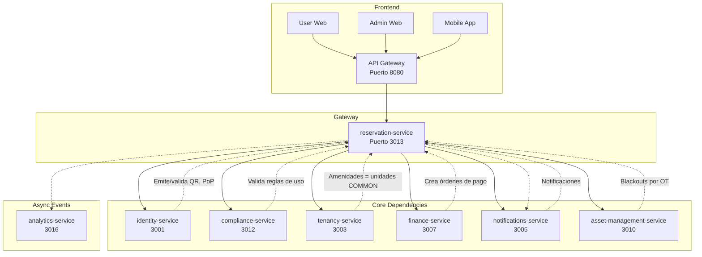

# 📘 Especificación Técnica Final: `reservation-service` (Puerto 3013) — **Versión 1.2**  
**Metodología**: `github/spec-kit`  
**Estado**: ✅ Listo para build freeze  
**Última actualización**: `2025-04-10`  
**Alcance**: Gestión segura, multi-tenant y auditada de reservas de **amenidades/áreas comunes** con disponibilidad, bloqueos, aprobación, cobros opcionales, control de asistencia y auditoría forense.  
**Alineación total**: `SCOPE.md v2.0`, `governance-service v3.2.2`, `tenancy-service v1.0`, `gateway-service v2.0`, `identity-service v1.1`.

---

## 🧭 1. Visión y Principios Fundamentales

El `reservation-service` es el **único responsable técnico** de la gestión de reservas de áreas comunes en SmartEdify. Su diseño se rige por los siguientes principios:

- **Delegación de Identidad**: Nunca emite ni valida credenciales. Solo delega a `identity-service`.
- **Delegación de Reglas**: Las políticas de uso (horarios, capacidad, aprobación) provienen del `compliance-service`.
- **Aislamiento Multi-Tenant Garantizado**: RLS + FK compuestas en todas las tablas.
- **Cumplimiento Criptográfico**: DPoP obligatorio en escrituras, algoritmos asimétricos (`ES256`/`EdDSA`), `kid` obligatorio.
- **Auditoría Inmutable**: Event sourcing + logs WORM para todas las transiciones de estado.
- **Privacidad por Diseño**: Sin PII en endpoints públicos; soporte DSAR con `crypto-erase`.

---

## 🏗️ 2. Arquitectura y Diseño

### 2.1. Patrones Arquitectónicos Clave

| Patrón | Implementación |
|--------|----------------|
| **SRP** | Solo gestiona reservas, no identidad, gobernanza ni cobros. |
| **Event-Driven Architecture** | Emite eventos versionados a Kafka (`ReservationCreated.v1`, etc.). |
| **CQRS** | Modelo de escritura (reservas) separado de lectura (disponibilidad, calendario). |
| **Saga Pattern** | Orquesta: crear → notificar → generar orden de pago → confirmar. |
| **Circuit Breaker** | Protege llamadas a `identity`, `compliance`, `finance`. |
| **Feature Flags** | Habilita/deshabilita waitlist, fees, check-in por tenant. |

### 2.2. Diagrama de Contexto (Mermaid)



---

## 📦 3. Flujos Funcionales Detallados

### 3.1. Creación de Reserva — **Saga con Finanzas**

1. Usuario consulta disponibilidad:  
   `GET /amenities/{id}/availability?from=...&to=...`
2. Usuario envía solicitud:  
   `POST /reservations` con `amenityId`, `start`, `end`, `partySize`, `Idempotency-Key`.
3. Servicio:
   - Valida `tenant_id`, `condominium_id` del JWT.
   - Consulta reglas al `compliance-service`:  
     `POST /compliance/v1/policies/evaluate` con contexto de amenidad.
     - **Fail-mode**:  
       - Amenidades restringidas → **fail-closed**.  
       - Resto → **cache de última política válida** (ETag + TTL=5m) + circuit breaker.
   - Verifica solapamiento contra `reservations` y `blackouts`.
   - Si hay fee, llama a `POST /finance/v1/orders` con mismo `Idempotency-Key`.
4. Estados:
   - Si `finance` responde `ORDER_ACCEPTED` → `CONFIRMED`.
   - Si falla → `PENDING_UNPAID` → reintentos idempotentes (5m, 15m, 1h).
5. Emite evento `ReservationCreated.v1`.

### 3.2. Validación de Asistencia (Check-in)

- **QR**: Usuario escanea QR emitido por `identity-service`.  
  `POST /reservations/{id}/check-in` → delega a `POST /identity/v2/contextual-tokens/validate`.
- **Biometría/SMS**: mismo flujo, con payload biométrico o código.
- **Manual**: Moderador registra asistencia → requiere token PoP.
- **Sin PII**: Solo se almacena `validation_hash = SHA256(payload + salt)`.

### 3.3. Waitlist y Auto-Release

- Si no hay disponibilidad, usuario entra a waitlist con `priority = antigüedad + rol`.
- Al liberarse un slot (cancelación, no-show), se notifica al primero.
- Expiración: 72h sin acción → liberación automática.
- Límite: 3 intentos por usuario por semana.

### 3.4. Integración con Asset Management

- Suscribe evento `WorkOrderScheduled.v1`.
- Crea `Blackout` automático con `source = "MAINTENANCE"`.

### 3.5. DSAR y Crypto-Erase

- Endpoint interno (mTLS): `DELETE /reservations/user/{user_id}`
- Si `compliance-service` no responde en 2s → fallback: marcar como `redacted = true`.
- Publica evento `ReservationDataRedacted.v1`.

---

## 🔌 4. Contrato de API (OpenAPI 3.1)

### 4.1. Security Schemes

```yaml
components:
  securitySchemes:
    BearerAuth:
      type: http
      scheme: bearer
      bearerFormat: JWT
    DPoP:
      type: apiKey
      in: header
      name: DPoP
      description: "DPoP proof JWT (RFC 9449)"
```

### 4.2. Endpoints Clave

| Endpoint | Método | Security | Descripción |
|---------|--------|----------|-------------|
| `POST /reservations` | POST | BearerAuth + DPoP | Crear reserva (con `Idempotency-Key`) |
| `POST /reservations/{id}/cancel` | POST | BearerAuth + DPoP | Cancelar (con `Idempotency-Key`) |
| `POST /reservations/{id}/check-in` | POST | BearerAuth + DPoP | Validar asistencia (delega a `identity-service`) |
| `GET /amenities/{id}/availability` | GET | BearerAuth | Disponibilidad |
| `POST /blackouts` | POST | BearerAuth + DPoP | Crear bloqueo (solo admin) |
| `GET /calendar/ics` | GET | BearerAuth | Feed iCalendar (sin PII) |
| `DELETE /reservations/user/{user_id}` | DELETE | mTLS interno | DSAR (solo `compliance-service`) |

> ✅ **Rate limiting** (por gateway):  
> - `reservations:create`: 30 r/min por usuario, 300 r/min por tenant.  
> - `availability:read`: 120 r/min por usuario.

> ✅ **Anti-replay DPoP**: Redis key `(tenant_id, jkt, jti)` con TTL=300s, clock skew ≤10s.

---

## 🗃️ 5. Modelo de Datos (PostgreSQL)

### 5.1. Tablas Clave

```sql
-- Amenidad = Unidad COMMON de tenancy-service
CREATE TABLE amenities (
  id UUID PRIMARY KEY DEFAULT gen_random_uuid(),
  tenant_id UUID NOT NULL,
  condominium_id UUID NOT NULL REFERENCES condominiums(id),
  local_code TEXT NOT NULL,
  name TEXT NOT NULL,
  capacity INT NOT NULL DEFAULT 1,
  min_duration INTERVAL NOT NULL DEFAULT '30 minutes',
  max_duration INTERVAL NOT NULL DEFAULT '4 hours',
  advance_min INTERVAL NOT NULL DEFAULT '1 hour',
  advance_max INTERVAL NOT NULL DEFAULT '90 days',
  check_in_required BOOLEAN NOT NULL DEFAULT false,
  check_in_window_min INT NOT NULL DEFAULT 15,
  fee_amount NUMERIC(12,2) DEFAULT 0,
  fee_currency CHAR(3) DEFAULT 'PEN',
  rules JSONB NOT NULL DEFAULT '{}'::jsonb,
  active BOOLEAN NOT NULL DEFAULT true,
  UNIQUE(tenant_id, local_code),
  UNIQUE(id, tenant_id) -- ✅ Soporte FK compuesta
);

-- Reserva
CREATE TABLE reservations (
  id UUID PRIMARY KEY DEFAULT gen_random_uuid(),
  tenant_id UUID NOT NULL,
  condominium_id UUID NOT NULL,
  amenity_id UUID NOT NULL,
  created_by TEXT NOT NULL,
  user_id UUID NOT NULL,
  status TEXT NOT NULL DEFAULT 'PENDING_UNPAID',
  time TSTZRANGE NOT NULL,
  party_size INT NOT NULL DEFAULT 1,
  price_amount NUMERIC(12,2) DEFAULT 0,
  price_currency CHAR(3) DEFAULT 'PEN',
  requires_approval BOOLEAN NOT NULL DEFAULT false,
  approved_by TEXT,
  approved_at TIMESTAMPTZ,
  reason_cancel TEXT,
  version INT8 NOT NULL DEFAULT 1,
  FOREIGN KEY (amenity_id, tenant_id) REFERENCES amenities(id, tenant_id) ON DELETE CASCADE,
  CONSTRAINT time_valid CHECK (lower(time) < upper(time)) -- ✅ [start, end)
);

-- Asistencia
CREATE TABLE attendances (
  id UUID PRIMARY KEY DEFAULT gen_random_uuid(),
  reservation_id UUID NOT NULL,
  tenant_id UUID NOT NULL,
  check_in_at TIMESTAMPTZ,
  check_out_at TIMESTAMPTZ,
  method TEXT NOT NULL,
  validation_hash TEXT,
  by_sub TEXT,
  FOREIGN KEY (reservation_id, tenant_id) REFERENCES reservations(id, tenant_id) ON DELETE CASCADE,
  UNIQUE(tenant_id, reservation_id)
);

-- Blackout
CREATE TABLE blackouts (
  id UUID PRIMARY KEY DEFAULT gen_random_uuid(),
  tenant_id UUID NOT NULL,
  amenity_id UUID,
  condominium_id UUID NOT NULL,
  time TSTZRANGE NOT NULL,
  reason TEXT,
  source TEXT NOT NULL
);

-- Waitlist
CREATE TABLE waitlist_items (
  id UUID PRIMARY KEY DEFAULT gen_random_uuid(),
  tenant_id UUID NOT NULL,
  amenity_id UUID NOT NULL,
  user_id UUID NOT NULL,
  desired_time TSTZRANGE NOT NULL,
  created_at TIMESTAMPTZ NOT NULL DEFAULT NOW(),
  priority INT NOT NULL DEFAULT 0,
  FOREIGN KEY (amenity_id, tenant_id) REFERENCES amenities(id, tenant_id) ON DELETE CASCADE
);

-- Idempotencia
CREATE TABLE idempotency_keys (
  tenant_id UUID NOT NULL,
  route TEXT NOT NULL,
  key TEXT NOT NULL,
  response_status INT,
  response_body JSONB,
  created_at TIMESTAMPTZ DEFAULT NOW(),
  PRIMARY KEY (tenant_id, route, key)
);
CREATE INDEX idx_idempotency_ttl ON idempotency_keys (created_at);
-- Job diario: DELETE FROM idempotency_keys WHERE created_at < NOW() - INTERVAL '24 hours';
```

### 5.2. Índices y Restricciones

```sql
-- Solapamiento
CREATE EXTENSION IF NOT EXISTS btree_gist;
CREATE INDEX ON reservations USING GIST (tenant_id, amenity_id, time);
CREATE INDEX ON blackouts USING GIST (tenant_id, COALESCE(amenity_id, '00000000-0000-0000-0000-000000000000'::UUID), time);

-- EXCLUDE
ALTER TABLE reservations ADD CONSTRAINT reservations_no_overlap
  EXCLUDE USING GIST (
    tenant_id WITH =,
    amenity_id WITH =,
    time WITH &&
  ) WHERE (status IN ('PENDING', 'CONFIRMED', 'PENDING_UNPAID'));

-- RLS Dual
DO $$
DECLARE
  table_name TEXT;
  tenant_tables TEXT[] := ARRAY['amenities', 'reservations', 'attendances', 'blackouts', 'waitlist_items', 'idempotency_keys'];
BEGIN
  FOREACH table_name IN ARRAY tenant_tables
  LOOP
    EXECUTE format('ALTER TABLE %I ENABLE ROW LEVEL SECURITY;', table_name);
    EXECUTE format('
      CREATE POLICY tenant_isolation_policy_%I
      ON %I FOR ALL
      USING (tenant_id = current_setting(''app.tenant_id'')::uuid);',
      table_name, table_name
    );
    -- Política adicional por condominio
    EXECUTE format('
      CREATE POLICY condominium_isolation_policy_%I
      ON %I FOR ALL
      USING (
        current_setting(''app.condominium_id'', true) IS NULL OR
        condominium_id = current_setting(''app.condominium_id'')::uuid
      );',
      table_name, table_name
    );
  END LOOP;
END $$;
```

---

## 🛡️ 6. Seguridad y Cumplimiento

- **Autenticación**: JWT + DPoP obligatorio en escrituras. Validado por `gateway-service`.
- **mTLS Interno**: SPIFFE/SPIRE para comunicación con `compliance-service` y `finance-service`.
- **Cifrado**: AES-256 en reposo, TLS 1.3 en tránsito.
- **Consentimiento**: Requerido para check-in biométrico.
- **Retención Gobernada**: Obtiene `log_retention_days` del `compliance-service`.
- **PKCE**: Requerido en flujos de autorización (pre-filtrado por gateway).
- **Privacidad**: Endpoint `/calendar/ics` sin PII; soporte DSAR con `crypto-erase`.

---

## 📈 7. Observabilidad y Auditoría

### Métricas (Prometheus)
- `reservations_created_total{tenant,amenity,status}`
- `reservations_conflict_total`
- `availability_latency_ms_bucket`
- `no_show_total`
- `waitlist_joined_total`
- `compliance_call_error_rate`
- `finance_call_error_rate`

### Trazas (OpenTelemetry)
- `trace_id` propagado desde frontend.
- Atributos: `tenant_id`, `condominium_id`, `amenity_id`, `user_id`.

### Logs Estructurados (JSON)
- Cada log incluye: `timestamp`, `level`, `message`, `trace_id`, `tenant_id`, `user_id`, `action`.
- **PII**: `user_id` solo en nivel `DEBUG`; nunca en `INFO/ERROR`.

### Auditoría
- Evento por transición de estado con `actor`, `ip`, `userAgent`.
- Logs WORM en S3 con Object Lock.

---

## 🔁 8. Integraciones Clave

| Servicio | Integración |
|--------|-------------|
| `identity-service` | Validación de QR, biometría, PoP. |
| `compliance-service` | Evaluación de reglas de uso y políticas. |
| `tenancy-service` | Amenidades = unidades `COMMON`. |
| `finance-service` | Creación de órdenes de pago por fees. |
| `asset-management-service` | Creación automática de blackouts por OTs. |
| `notifications-service` | Alertas de confirmación, recordatorios, liberación de waitlist. |
| `analytics-service` | Métricas de uso y tendencias. |

---

## ✅ 9. Checklist de Entrega (Definition of Done)

- [ ] OpenAPI 3.1 con `DPoP` como `apiKey` y `BearerAuth`.
- [ ] RLS dual activo por `tenant_id` y `condominium_id`.
- [ ] FK compuestas en todas las relaciones críticas + `UNIQUE(id, tenant_id)` en `amenities`.
- [ ] Tabla `idempotency_keys` con TTL y GC.
- [ ] Eventos Kafka versionados con esquemas registrados y claves por `(tenant_id, amenity_id)`.
- [ ] Delegación explícita a `identity-service` para validación de asistencia.
- [ ] Integración con `compliance-service` con fail-mode definido.
- [ ] Saga de finanzas con estados explícitos y compensaciones.
- [ ] Pruebas E2E: crear → aprobar → check-in → completar, cancelar con idempotencia, negativa multi-tenant.
- [ ] Pruebas de seguridad: rechazo sin DPoP, mTLS interno activo.
- [ ] Dashboards RED configurados en Grafana.

---

## 🚀 Conclusión

El `reservation-service` v1.2 es una especificación técnica **completa, segura y alineada** con la visión global de SmartEdify. Incorpora **todos los gaps P0 y P1** identificados y cumple con los más altos estándares de aislamiento multi-tenant, privacidad, resiliencia y cumplimiento legal.


© 2025 SmartEdify Global. Todos los derechos reservados.