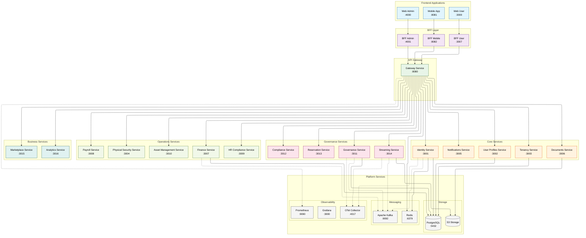

```mermaid

---
config:
  layout: elk
---
flowchart TB
 subgraph subGraph0["Frontend Applications"]
        WA["Web Admin<br>:4000"]
        WU["Web User<br>:3000"]
        MA["Mobile App<br>:8081"]
  end
 subgraph subGraph1["BFF Layer"]
        BFF_A["BFF Admin<br>:4001"]
        BFF_U["BFF User<br>:3007"]
        BFF_M["BFF Mobile<br>:8082"]
  end
 subgraph subGraph2["API Gateway"]
        GW["Gateway Service<br>:8080"]
  end
 subgraph subGraph3["Core Services"]
        IS["Identity Service<br>:3001"]
        UPS["User Profiles Service<br>:3002"]
        TS["Tenancy Service<br>:3003"]
        NS["Notifications Service<br>:3005"]
        DS["Documents Service<br>:3006"]
  end
 subgraph subGraph4["Governance Services"]
        GS["Governance Service<br>:3011"]
        CS["Compliance Service<br>:3012"]
        RS["Reservation Service<br>:3013"]
        SS["Streaming Service<br>:3014"]
  end
 subgraph subGraph5["Operations Services"]
        PSS["Physical Security Service<br>:3004"]
        FS["Finance Service<br>:3007"]
        PS["Payroll Service<br>:3008"]
        HCS["HR Compliance Service<br>:3009"]
        AMS["Asset Management Service<br>:3010"]
  end
 subgraph subGraph6["Business Services"]
        MS["Marketplace Service<br>:3015"]
        AS["Analytics Service<br>:3016"]
  end
 subgraph Observability["Observability"]
        PROM["Prometheus<br>:9090"]
        GRAF["Grafana<br>:3000"]
        OTEL["OTel Collector<br>:4317"]
  end
 subgraph Messaging["Messaging"]
        KAFKA["Apache Kafka<br>:9092"]
        REDIS["Redis<br>:6379"]
  end
 subgraph Storage["Storage"]
        PG[("PostgreSQL<br>:5432")]
        S3[("S3 Storage")]
  end
 subgraph subGraph10["Platform Services"]
        Observability
        Messaging
        Storage
  end
    WA --> BFF_A
    WU --> BFF_U
    MA --> BFF_M
    BFF_A --> GW
    BFF_U --> GW
    BFF_M --> GW
    GW --> IS & UPS & TS & NS & DS & GS & CS & RS & SS & PSS & FS & PS & HCS & AMS & MS & AS & REDIS
    IS -.-> KAFKA & OTEL
    GS -.-> KAFKA & OTEL
    SS -.-> KAFKA & OTEL
    FS -.-> KAFKA
    IS --> PG & REDIS
    UPS --> PG
    TS --> PG
    GS --> PG
    FS --> PG
    DS --> S3
    SS --> S3
    GW -.-> PROM
     WA:::frontend
     WU:::frontend
     MA:::frontend
     BFF_A:::bff
     BFF_U:::bff
     BFF_M:::bff
     GW:::gateway
     IS:::core
     UPS:::core
     TS:::core
     NS:::core
     DS:::core
     GS:::governance
     CS:::governance
     RS:::governance
     SS:::governance
     PSS:::operations
     FS:::operations
     PS:::operations
     HCS:::operations
     AMS:::operations
     MS:::business
     AS:::business
     PROM:::platform
     GRAF:::platform
     OTEL:::platform
     KAFKA:::platform
     REDIS:::platform
     PG:::platform
     S3:::platform

    classDef frontend fill:#e1f5fe,stroke:#01579b,color:#000
    classDef bff fill:#f3e5f5,stroke:#4a148c,color:#000
    classDef gateway fill:#e8f5e8,stroke:#1b5e20,color:#000
    classDef core fill:#fff3e0,stroke:#e65100,color:#000
    classDef governance fill:#fce4ec,stroke:#880e4f,color:#000
    classDef operations fill:#f1f8e9,stroke:#33691e,color:#000
    classDef business fill:#e0f2f1,stroke:#004d40,color:#000
    classDef platform fill:#f5f5f5,stroke:#424242,color:#000

```
    
