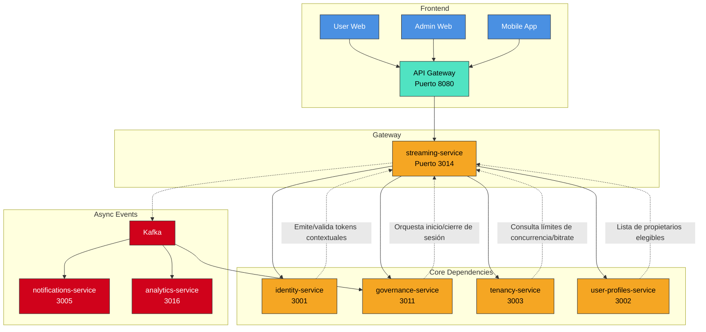

# 📘 Especificación Técnica Final: `streaming-service` (Puerto 3014) — Versión 2.2  
**Metodología**: `github/spec-kit`  
**Estado**: ✅ Listo para build freeze  
**Última actualización**: `2025-04-10`  
**Alcance**: Gestión segura, en tiempo real y auditada de sesiones de video para asambleas híbridas (presencial/virtual/mixta), con integración criptográfica para validación de asistencia, transcripción, grabación y moderación.  

---

## 🧭 1. Visión y Justificación

El `streaming-service` es el componente técnico encargado **exclusivamente** de la capa de comunicación audiovisual durante las asambleas comunitarias híbridas. Su propósito es **garantizar una experiencia en vivo fluida, segura y forensemente verificable**, sin asumir responsabilidades normativas, de identidad ni de gobernanza.

Este servicio **delega completamente**:
- La emisión y validación de tokens contextuales (QR, biometría, código) al `identity-service`.
- La orquestación del ciclo de vida de la asamblea al `governance-service`.

### Principios Fundamentales

| Principio | Implementación |
|----------|----------------|
| **SRP (Single Responsibility)** | Solo gestiona video, audio, transcripción y controles técnicos. |
| **Delegación de Identidad** | Nunca genera ni valida credenciales. Solo consume tokens validados por el `identity-service`. |
| **Grabación con Integridad Criptográfica** | Metadatos firmados (COSE/JWS) vinculan video con estado del quórum (`merkle_root`, `commit_height`). |
| **Moderación Técnica, No Normativa** | Proporciona controles, pero **no decide quién puede hablar**; eso lo define el `compliance-service` vía `governance-service`. |
| **Aislamiento Multi-Tenant Garantizado** | RLS activo + FK compuestas + `tenant_id` en todas las tablas. |
| **Cumplimiento Criptográfico** | Algoritmos asimétricos (`ES256`/`EdDSA`), `kid` obligatorio, PKCE en todos los flujos. |

---

## 🏗️ 2. Arquitectura y Diseño

### 2.1. Patrones Arquitectónicos Clave

| Patrón | Implementación | Justificación |
|--------|----------------|---------------|
| **SRP** | Separación estricta de responsabilidades: video ≠ identidad ≠ gobernanza. | Evita acoplamiento lógico y técnico. |
| **Event-Driven Architecture (EDA)** | Emite eventos a Kafka con esquemas versionados y registrados en `notifications-service`. | Desacoplamiento, trazabilidad y escalabilidad. |
| **Circuit Breaker (Resilience4j)** | Protege llamadas a proveedores de video y a `identity-service`. | Evita cascadas de fallos. |
| **Feature Flags (LaunchDarkly)** | Habilita/deshabilita biometría, transcripción, grabación por tenant/país. Evaluación local sin PII. | Despliegues progresivos y cumplimiento local. |
| **Adapter Pattern** | Abstracción de proveedores: Google Meet, Zoom, WebRTC propio. | Cambio de backend sin impacto en core. |
| **CQRS** | Modelo de escritura (sesiones) separado de lectura (dashboards, auditoría). | Optimización de consultas y consistencia eventual. |

### 2.2. Diagrama de Contexto (Mermaid)



---

## 📦 3. Flujos Funcionales Detallados

### 3.1. Inicio de Sesión Híbrida

1. **Orquestación**: `governance-service` llama a `POST /api/v1/sessions` con:
   ```json
   {
     "assembly_id": "uuid",
     "modality": "MIXTA",
     "policy_id": "uuid",
     "policy_version": "v1.2"
   }
   ```
2. **Verificación**: Se valida `tenant_id` y se consultan límites de `tenancy-service`.
3. **Creación**: Se inicia sesión con proveedor de video (adapter).
4. **Respuesta**:
   ```json
   {
     "session_id": "uuid",
     "video_conference_link": "https://meet.example.com/...",
     "moderator_token": "DPoP-bound JWT"
   }
   ```

### 3.2. Validación de Asistencia (Delegación Explícita)

#### QR Contextual
- **Emisión**: Frontend llama a `POST /identity/v2/contextual-tokens` → obtiene QR.
- **Escaneo**: Usuario escanea → `streaming-service` recibe código.
- **Validación**: `streaming-service` llama a:
  ```http
  POST /identity/v2/contextual-tokens/validate
  Authorization: DPoP <jwt>
  DPoP: <proof>
  {
    "code": "ABC123",
    "session_id": "uuid"
  }
  ```
- **Registro**: Almacena solo `validation_hash = SHA256(code + salt)`.

#### Biometría / SMS / Email
- Mismo flujo: delegación a `identity-service`.
- `streaming-service` **nunca almacena datos biométricos ni códigos en claro**.

#### Registro Manual (Presencial)
- Moderador selecciona propietario desde lista validada por `user-profiles-service`.
- Requiere **token PoP del moderador**.
- Se registra como `validation_method = "MANUAL"`.

> ✅ **Rate limiting**: 10 r/min por usuario, 100 r/min por tenant. Bloqueo tras 5 intentos fallidos.

### 3.3. Transcripción en Tiempo Real

1. Se conecta a proveedor STT (Google Cloud Speech o Whisper API).
2. Por cada fragmento, emite evento **versionado** a Kafka:
   ```json
   // Schema: TranscriptChunk.v1
   {
     "session_id": "uuid",
     "speaker_id": "sub",
     "text": "Buenas tardes, propongo...",
     "timestamp": "2025-04-10T12:05:00Z",
     "confidence": 0.92
   }
   ```
3. **SLO**: Latencia ≤ 2s (P95).

### 3.4. Grabación y Auditoría Forense

1. Video se almacena en S3 con cifrado AES-256.
2. Al finalizar sesión:
   - Se calcula `recording_hash_sha256`.
   - Se obtiene `commit_height` y `merkle_root` del stream de eventos de la asamblea.
3. Se genera objeto COSE/JWS firmado:
   ```json
   {
     "session_id": "uuid",
     "recording_hash_sha256": "a1b2c3...",
     "merkle_root": "d4e5f6...",
     "commit_height": 12345,
     "kid": "tenant-kid-xyz",
     "timestamp": "2025-04-10T12:30:00Z"
   }
   ```
4. Se almacena junto al video y se expone en `GET /audit-proof`.

### 3.5. Moderación en Tiempo Real (WebSocket)

- **Handshake**: Requiere token PoP emitido por `identity-service`.
  ```http
  GET /ws/moderation?session_id=uuid
  Authorization: DPoP <jwt>
  DPoP: <proof>
  Upgrade: websocket
  ```
- **Renovación**: Cliente debe renovar token antes de expirar (notificación a 30s).
- **Comandos**:
  ```json
  { "action": "grant_speech", "user_id": "sub" }
  { "action": "mute_user", "user_id": "sub" }
  { "action": "switch_moderator", "new_moderator_id": "sub" }
  ```
- **SLO de reconexión**: ≤ 3s (P95).

---

## 🔌 4. Contrato de API (OpenAPI 3.1)

### 4.1. Security Schemes

```yaml
components:
  securitySchemes:
    BearerAuth:
      type: http
      scheme: bearer
      bearerFormat: JWT
    DPoPAuth:
      type: http
      scheme: dpop
      description: "DPoP-bound JWT (RFC 9449)"
```

### 4.2. Endpoints Clave

| Endpoint | Método | Security | Descripción |
|---------|--------|----------|-------------|
| `POST /api/v1/sessions` | POST | mTLS interno | Iniciar sesión (solo `governance-service`) |
| `POST /api/v1/sessions/{id}/end` | POST | mTLS interno | Finalizar sesión |
| `GET /api/v1/sessions/{id}` | GET | BearerAuth | Estado y metadatos |
| `POST /api/v1/sessions/{id}/validate-qr` | POST | DPoPAuth | Delega a `identity-service` |
| `POST /api/v1/sessions/{id}/validate-biometric` | POST | DPoPAuth | Delega a `identity-service` |
| `POST /api/v1/sessions/{id}/validate-code` | POST | DPoPAuth | Delega a `identity-service` |
| `POST /api/v1/sessions/{id}/register-attendee` | POST | DPoPAuth | Registro manual (moderador) |
| `GET /api/v1/sessions/{id}/recording-url` | GET | BearerAuth | URL temporal firmada |
| `GET /api/v1/sessions/{id}/audit-proof` | GET | **Público** | Prueba de auditoría completa |

> ✅ **Endpoint público `audit-proof`**:  
> - **Sin PII**: Solo hashes, firmas, IDs técnicos.  
> - **Política de datos**: Metadatos forenses únicamente.

---

## 🛡️ 5. Seguridad y Cumplimiento

- **Autenticación**: JWT + DPoP obligatorio en escrituras. Validado por `gateway-service`.
- **mTLS Interno**: SPIFFE/SPIRE con SVIDs.
- **Cifrado**: AES-256 en reposo, TLS 1.3 en tránsito.
- **Consentimiento**: Se solicita explícitamente antes de grabar.
- **Retención Gobernada**: Obtiene `video_retention_days` del `compliance-service`. Al vencer → `crypto-erase`.
- **Privacidad Biométrica**: Datos **nunca almacenados**; solo usados en tiempo real.
- **Algoritmos Asimétricos**: `ES256`/`EdDSA` con `kid` obligatorio.
- **PKCE**: Requerido en flujos de autorización (pre-filtrado por gateway).

---

## 📈 6. Observabilidad y Monitoreo

### Métricas (Prometheus)
- `sessions_started_total{tenant,modality}`
- `attendance_validated_total{method}`
- `transcript_chunks_emitted_total`
- `recording_duration_seconds_total`
- `moderation_actions_total{action}`
- `session_start_p95_seconds` (SLO: ≤5s)
- `transcription_latency_p95_seconds` (SLO: ≤2s)
- `ws_reconnect_p95_seconds` (SLO: ≤3s)

### Trazas (OpenTelemetry)
- `trace_id` propagado desde `governance-service`.
- Atributos: `tenant_id`, `assembly_id`, `session_id`, `user_id`.

### Logs Estructurados (JSON)
- Cada log incluye: `timestamp`, `level`, `message`, `trace_id`, `tenant_id`, `session_id`, `event_type`.

---

## 🔁 7. Integraciones Clave

| Servicio | Integración |
|--------|-------------|
| `identity-service` | Validación de tokens contextuales (QR, biometría, código). |
| `governance-service` | Orquestación de sesiones, recepción de transcripciones, notificación de asistencia. |
| `user-profiles-service` | Lista de propietarios elegibles para registro manual. |
| `tenancy-service` | Consulta de `condominium_id`, límites de concurrencia y bitrate. |
| `notifications-service` | Envío de códigos de validación. |
| `analytics-service` | Consumo de eventos para dashboards de participación. |

---

## 🗃️ 8. Modelo de Datos (PostgreSQL)

```sql
-- Sesión de video
CREATE TABLE assembly_sessions (
  id UUID PRIMARY KEY,
  tenant_id UUID NOT NULL,
  assembly_id UUID NOT NULL,
  video_conference_link TEXT,
  recording_url TEXT,
  recording_hash_sha256 TEXT,
  quorum_seal TEXT,
  is_active BOOLEAN DEFAULT true,
  created_at TIMESTAMPTZ DEFAULT NOW()
);

-- Asistente validado
CREATE TABLE session_attendees (
  id UUID PRIMARY KEY,
  session_id UUID NOT NULL,
  tenant_id UUID NOT NULL,
  user_id UUID NOT NULL,
  validation_method TEXT NOT NULL,
  validation_hash TEXT,
  validated_at TIMESTAMPTZ NOT NULL,
  is_present BOOLEAN DEFAULT true,
  CONSTRAINT uq_session_attendee UNIQUE (tenant_id, session_id, user_id)
);

-- Solicitud de palabra
CREATE TABLE speech_requests (
  id UUID PRIMARY KEY,
  session_id UUID NOT NULL,
  tenant_id UUID NOT NULL,
  user_id UUID NOT NULL,
  status TEXT DEFAULT 'PENDING',
  requested_at TIMESTAMPTZ DEFAULT NOW()
);

-- Activación de RLS
DO $$
DECLARE
  table_name TEXT;
  tenant_tables TEXT[] := ARRAY['assembly_sessions', 'session_attendees', 'speech_requests'];
BEGIN
  FOREACH table_name IN ARRAY tenant_tables
  LOOP
    EXECUTE format('ALTER TABLE %I ENABLE ROW LEVEL SECURITY;', table_name);
    EXECUTE format('
      CREATE POLICY tenant_isolation_policy_%I
      ON %I FOR ALL
      USING (tenant_id = current_setting(''app.tenant_id'')::uuid);',
      table_name, table_name
    );
  END LOOP;
END $$;
```

---

## ✅ 9. Checklist de Entrega (Definition of Done)

- [x] OpenAPI 3.1 con `DPoPAuth` en securitySchemes.
- [x] RLS activo en todas las tablas con `tenant_id`.
- [x] Eventos Kafka versionados (`TranscriptChunk.v1`, `AttendanceValidated.v1`) con schema registrado.
- [x] Endpoints de QR reflejan delegación explícita a `identity-service`.
- [x] Límites de concurrencia (10 sesiones/tenant) y bitrate (2 Mbps) implementados.
- [x] Endpoint público `audit-proof` sin PII.
- [x] Pruebas E2E híbridas: QR + registro manual → cierre → verificación de `audit-proof`.
- [x] Pruebas de seguridad: rechazo sin DPoP en write, mTLS interno activo.
- [x] Pruebas multi-tenant negativas: acceso cruzado → 403/404 por RLS.
- [x] Dashboards RED configurados en Grafana.

---

## 🚀 Conclusión

El `streaming-service` cumple con el **Principio de Responsabilidad Única**, delegando identidad y gobernanza, y se integra de forma segura, observable y multi-tenant con el ecosistema SmartEdify.

ajustes menores:

Esquema DPoP en OpenAPI: type: http, scheme: dpop no es estándar para muchos linters. Modela DPoP como apiKey en header DPoP o documenta como BearerAuth+header adicional para compatibilidad de tooling.

audit-proof público: añade rate limit y TTL de firma para URLs relacionadas, más cache headers explícitos.

WS renovaciones: fija tolerancia de “clock skew” y política de grace period en texto normativo.

Retención: define fallback cuando compliance-service no responde y política por defecto por país.

Métricas: documenta umbrales de alertas para cada SLO en Prometheus/Grafana.

© 2025 SmartEdify Global. Todos los derechos reservados.