# 🏗️ Documento de Arquitectura de Software (SAD) — SmartEdify

**Versión:** 1.1
**Fecha:** 2025-10-08
**Estado:** Aprobado para desarrollo ágil
**Propósito:** Establecer la arquitectura técnica integral, lineamientos de diseño, dependencias, y artefactos necesarios para la implementación y operación de la plataforma **SmartEdify**.

---

## 1. Introducción

SmartEdify es una plataforma **SaaS multi-tenant** para la **gestión integral de condominios**, que integra servicios de identidad, gobernanza, cumplimiento, operaciones, finanzas y comunicación, bajo un modelo **Zero Trust**, con **cumplimiento regulatorio transnacional** y un enfoque **mobile-first**.

---

## 2. Principios arquitectónicos

1. **Microservicios desacoplados**: cada dominio posee su ciclo de vida y datastore independiente.
2. **Dominio legal y jurisdiccional**: cada condominio es una entidad legal subordinada a un tenant.
3. **Zero Trust + PBAC (OPA/Cedar)**: autorización basada en políticas evaluadas en tiempo real.
4. **Mobile-first + BFF pattern**: todos los flujos prioritarios se diseñan primero para móvil.
5. **Evidencia auditable y WORM**: trazabilidad inmutable y certificable.
6. **Cumplimiento runtime**: `compliance-service` valida cada operación crítica.
7. **Observabilidad total**: métricas, logs y trazas unificadas con OpenTelemetry.
8. **Resiliencia multi-región**: sin dependencias síncronas interregionales en rutas críticas.
9. **Documentación modular**: visión → arquitectura → scope global → scope por servicio → ADRs.
10. **Automatización CI/CD y QA documental**: validación automática de OpenAPI, DBML y ADRs.

---

## 3. Arquitectura lógica

### 3.1. Capas principales

| Capa                        | Descripción                                                    | Componentes                                                                                                     |
| --------------------------- | -------------------------------------------------------------- | --------------------------------------------------------------------------------------------------------------- |
| **Presentación (Frontend)** | Interfaces principales de usuario con enfoque **mobile-first** | Web Admin (4000), Web User (3000), Mobile App (8081)                                                            |
| **BFF Layer**               | Adaptación por canal, anti-chatter, CORS y rate-limit          | BFF-Admin (4001), BFF-User (3007), BFF-Mobile (8082)                                                            |
| **Edge Security**           | Protección externa y control de acceso                         | WAF / DDoS Shield                                                                                               |
| **API Gateway**             | PEP central, routing, JWT validation, observabilidad           | Gateway Service (8080)                                                                                          |
| **Core Services**           | Núcleo funcional transversal                                   | Identity (3001), User Profiles (3002), Tenancy (3003), Notifications (3005), Documents (3006)                   |
| **Governance Services**     | Gobernanza legal y decisiones condominales                     | Governance (3011), Compliance (3012), Reservations (3013), Streaming (3014)                                     |
| **Operations Services**     | Operación de activos, RRHH, finanzas, mantenimiento            | Physical Security (3004, futuro), Finance (3007), Payroll (3008), HR Compliance (3009), Asset Management (3010) |
| **Business Services**       | Servicios de negocio y analítica avanzada                      | Marketplace (3015), Analytics (3016)                                                                            |
| **Platform Layer**          | Soporte de infraestructura y observabilidad                    | Kafka, Redis, PostgreSQL, S3/WORM, KMS, Secrets Manager, Prometheus, Grafana, OTel, Policy CDN                  |

---

## 4. Diagrama de arquitectura

```mermaid
flowchart TB
 subgraph Frontend["Frontend Applications (Mobile-first)"]
  WA["Web Admin<br>:4000"]
  WU["Web User<br>:3000"]
  MA["Mobile App<br>:8081"]
 end
 subgraph BFF["BFF Layer"]
  BFFA["BFF Admin<br>:4001"]
  BFFU["BFF User<br>:3007"]
  BFFM["BFF Mobile<br>:8082"]
 end
 subgraph Edge["Edge Security"]
  WAF["WAF / DDoS Shield"]
 end
 subgraph Gateway["API Gateway"]
  GW["Gateway Service<br>:8080"]
 end
 subgraph Core["Core Services"]
  IS["Identity Service<br>:3001"]
  UPS["User Profiles Service<br>:3002"]
  TS["Tenancy Service<br>:3003"]
  NS["Notifications Service<br>:3005"]
  DS["Documents Service<br>:3006"]
 end
 subgraph Governance["Governance Services"]
  GS["Governance Service<br>:3011"]
  CS["Compliance Service<br>:3012"]
  RS["Reservation Service<br>:3013"]
  SS["Streaming Service<br>:3014"]
 end
 subgraph Operations["Operations Services"]
  PSS["Physical Security Service (Futuro)<br>:3004"]
  FS["Finance Service<br>:3007"]
  PS["Payroll Service<br>:3008"]
  HCS["HR Compliance Service<br>:3009"]
  AMS["Asset Management Service<br>:3010"]
 end
 subgraph Business["Business Services"]
  MS["Marketplace Service<br>:3015"]
  AS["Analytics Service<br>:3016"]
 end
 subgraph Platform["Platform Services"]
  KAFKA["Apache Kafka"]
  REDIS["Redis Regional"]
  PG["PostgreSQL"]
  S3["S3 / WORM"]
  KMS["KMS / HSM"]
  SEC["Secrets Manager"]
  POL["Policy CDN (OPA Bundles firmados)"]
  PROM["Prometheus"]
  GRAF["Grafana"]
  OTEL["OTel Collector"]
  TRC["Tracing Backend"]
  LOGS["Logs Backend"]
 end
 MA --> BFFM
 WU --> BFFU
 WA --> BFFA
 BFFA --> WAF --> GW
 BFFU --> WAF
 BFFM --> WAF
 GW --> IS & UPS & TS & NS & DS & GS & CS & RS & SS & PSS & FS & PS & HCS & AMS & MS & AS
 IS --> PG & REDIS & KAFKA
 GS --> PG
 FS --> PG
 DS --> S3
 SS --> S3
 OTEL --> TRC
 OTEL --> LOGS
 PROM --> GRAF
```

---

## 5. Flujos principales

### 5.1. Autenticación y sesiones

1. Mobile o Web invoca `/authorize` vía BFF → Gateway.
2. Identity emite tokens firmados (ES256/EdDSA) + DPoP.
3. JWT incluye `tenant_id`, `condominium_id`, `region`, `scope`.
4. Revocación distribuida vía Kafka y Redis regional.
5. JWKS TTL ≤ 5 min; rotación automática 90d + rollover 7d.

### 5.2. Asamblea híbrida

1. Governance convoca; usuarios reciben Identity-QR.
2. Identity valida QR (`kid`, TTL ≤300s, DPoP).
3. Governance registra asistencia; compliance evalúa quórum.
4. Acta generada y, si aplica, firmada por PSC (cargos oficiales).

### 5.3. Asset Management

1. Técnico escanea Asset-QR (no cifrado).
2. Asset Management registra incidencia u OT.
3. Puede anexar evidencia a `documents-service`.

---

## 6. Datos y almacenamiento

| Dominio                     | Motor                   | Esquema clave                                 |
| --------------------------- | ----------------------- | --------------------------------------------- |
| Identity, Profiles, Tenancy | PostgreSQL              | `tenant_id`, `user_id`, `condominium_id`      |
| Compliance                  | PostgreSQL              | `law_ref`, `policy_version`, `effective_from` |
| Finance, Payroll            | PostgreSQL              | `ledger`, `voucher`, `fiscal_id`              |
| Documents                   | S3 + Object Lock (WORM) | Evidencias y actas                            |
| Observabilidad              | OpenSearch / Tempo      | Logs y trazas                                 |
| Cache                       | Redis Regional          | Sesiones, JWKS, DPoP, validaciones            |
| Mensajería                  | Kafka + Schema Registry | Eventos asíncronos                            |
| Claves                      | KMS / HSM               | Rotación automática                           |
| Políticas                   | Policy CDN              | Bundles firmados (OPA/Cedar)                  |

---

## 7. Seguridad

| Mecanismo                  | Descripción                                              |
| -------------------------- | -------------------------------------------------------- |
| **Zero Trust**             | Toda solicitud autenticada y autorizada, incluso interna |
| **TLS 1.3 + mTLS**         | Cifrado en tránsito                                      |
| **AES-256 en reposo**      | En bases de datos y objetos                              |
| **ES256/EdDSA**            | Firma de tokens y COSE                                   |
| **DPoP + Nonce**           | Prevención de replay y vinculación de cliente            |
| **PBAC (OPA/Cedar)**       | Evaluación contextual (usuario, recurso, condominio)     |
| **RLS**                    | Aislamiento multi-tenant y multi-condominio              |
| **Revocación distribuida** | Kafka + Redis regional                                   |
| **Logs WORM**              | Auditoría inmutable                                      |
| **Cumplimiento DSAR**      | Ejecución orquestada y validada por tenant               |
| **Attestation FIDO2**      | Protección de Passkeys contra device binding bypass      |

---

## 8. Observabilidad

* **Métricas clave**

  * `login_latency_p95`, `revocation_latency_p95`, `policy_eval_p95`, `token_validation_error_rate`.
* **Logs**

  * Estructurados JSON, correlación por `trace_id` y `tenant_id`.
* **Traces**

  * OpenTelemetry + Tempo, propagación automática vía HTTP headers.
* **Alertas**

  * SLO incumplido → alerta Prometheus + notificación Slack/email.
* **Dashboards**

  * Grafana por tenant y condominio.

---

## 9. Integración y mensajería

| Canal                   | Productor          | Consumidor                | Propósito               |
| ----------------------- | ------------------ | ------------------------- | ----------------------- |
| `UserCreated`           | identity-service   | governance, finance       | Sincronización inicial  |
| `PolicyUpdateIssued`    | compliance-service | governance, finance       | Actualización de reglas |
| `AssemblyActIssued`     | governance-service | documents, compliance     | Registro de actas       |
| `AssetIncidentReported` | asset-management   | compliance, notifications | Control operativo       |
| `PayrollPosted`         | payroll-service    | finance, compliance       | Reportes contables      |
| `DSARRequested`         | identity-service   | compliance, governance    | Cumplimiento privacidad |

---

## 10. Escalabilidad y resiliencia

* **Stateless microservicios**, balanceados con autoscaling.
* **Cache regional** para JWKS, políticas y sesiones.
* **Circuit breakers** entre Gateway y servicios dependientes.
* **Failover multi-región**: PostgreSQL con réplicas en caliente; Kafka con MirrorMaker.
* **Backoff exponencial** en reintentos (HTTP 429/503).
* **Feature toggles**: Progressive rollout controlado.

---

## 11. Estrategia mobile-first

* Flujos críticos primero en móvil: asambleas, reservas, incidencias, notificaciones.
* QR por cámara móvil o deep link.
* Offline sync para reservas y OT.
* Push tokens gestionados por notifications-service.
* API adaptada vía BFF-Mobile.
* Métricas RUM (app_start, error_rate, interaction_latency).

---

## 12. Despliegue e infraestructura

* **Orquestador:** Kubernetes (GKE/EKS/AKS).
* **Networking:** Istio / Envoy con mTLS interno.
* **Infra as Code:** Terraform + Helm.
* **CI/CD:** GitHub Actions + ArgoCD.
* **Escenario Multi-ambiente:** Dev → QA → PreProd → Prod → DR.
* **Blue/Green Deployments** para servicios críticos.
* **Seguridad**: Secrets en Vault/Secrets Manager, rotación automática.

---

## 13. Versionado y documentación

| Artefacto          | Formato  | Control                      |
| ------------------ | -------- | ---------------------------- |
| OpenAPI            | YAML 3.1 | Revisión CI                  |
| DBML               | .dbml    | Validación semántica         |
| ADRs               | Markdown | PR con justificación técnica |
| Scope por servicio | Markdown | Sync con ADRs                |
| Vision / SAD       | Markdown | Aprobación CTO/PO            |

---

## 14. Roadmap técnico

| Fase         | Entregable                                          | Hito                         |
| ------------ | --------------------------------------------------- | ---------------------------- |
| **R0**       | Core (Identity, Profiles, Tenancy, Compliance base) | Backbone operativo           |
| **R1 (PMV)** | Governance, Asset, Reservation + Mobile-first UX    | Validación legal y operativa |
| **R2**       | Compliance boletines, finanzas, nómina              | Cumplimiento extendido       |
| **R3**       | Analítica, marketplace                              | Expansión comercial          |
| **R4**       | Multi-región y certificaciones ISO/SOC              | Escalamiento global          |

---

## 15. Riesgos y mitigaciones

| Riesgo                        | Mitigación                                         |
| ----------------------------- | -------------------------------------------------- |
| Device binding bypass         | Attestation FIDO2, detección SafetyNet/DeviceCheck |
| Revocación cross-region lenta | Cache regional + pruebas de caos                   |
| DSAR fuga de datos            | Cifrado, expiración 48h, validación jurídica       |
| Desalineación documental      | CI/CD Docs y versionado sincronizado               |

---

## 16. Conclusión

El presente **SAD v1.1** establece una arquitectura sólida, legalmente alineada y centrada en el usuario móvil, que prioriza seguridad, cumplimiento y escalabilidad.
Es el documento técnico de referencia para todos los **Scope-[service].md**, **ADRs** y despliegues productivos de SmartEdify.

---

**Fin del Documento de Arquitectura de Software — SmartEdify v1.1**
