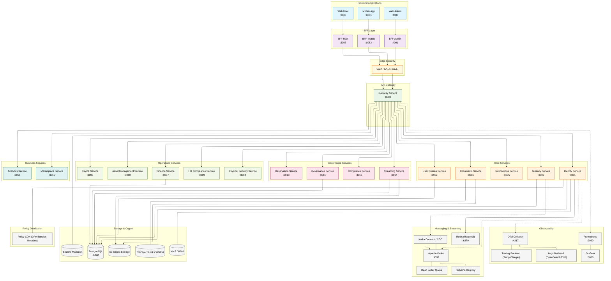

```mermaid
---
config:
  layout: elk
---
flowchart TB
 %% ========= Frontends =========
 subgraph subGraph0["Frontend Applications"]
    WA["Web Admin<br>:4000"]
    WU["Web User<br>:3000"]
    MA["Mobile App<br>:8081"]
 end

 %% ========= BFF =========
 subgraph subGraph1["BFF Layer"]
    BFF_A["BFF Admin<br>:4001"]
    BFF_U["BFF User<br>:3007"]
    BFF_M["BFF Mobile<br>:8082"]
 end

 %% ========= Edge/Gateway =========
 subgraph Edge["Edge Security"]
    WAF["WAF / DDoS Shield"]
 end
 subgraph subGraph2["API Gateway"]
    GW["Gateway Service<br>:8080"]
 end

 %% ========= Core =========
 subgraph subGraph3["Core Services"]
    IS["Identity Service<br>:3001"]
    UPS["User Profiles Service<br>:3002"]
    TS["Tenancy Service<br>:3003"]
    NS["Notifications Service<br>:3005"]
    DS["Documents Service<br>:3006"]
 end

 %% ========= Governance =========
 subgraph subGraph4["Governance Services"]
    GS["Governance Service<br>:3011"]
    CS["Compliance Service<br>:3012"]
    RS["Reservation Service<br>:3013"]
    SS["Streaming Service<br>:3014"]
 end

 %% ========= Operations =========
 subgraph subGraph5["Operations Services"]
    PSS["Physical Security Service<br>:3004"]
    FS["Finance Service<br>:3007"]
    PS["Payroll Service<br>:3008"]
    HCS["HR Compliance Service<br>:3009"]
    AMS["Asset Management Service<br>:3010"]
 end

 %% ========= Business =========
 subgraph subGraph6["Business Services"]
    MS["Marketplace Service<br>:3015"]
    AS["Analytics Service<br>:3016"]
 end

 %% ========= Observability =========
 subgraph Observability["Observability"]
    PROM["Prometheus<br>:9090"]
    GRAF["Grafana<br>:3000"]
    OTEL["OTel Collector<br>:4317"]
    TRC["Tracing Backend (Tempo/Jaeger)"]
    LOGS["Logs Backend (OpenSearch/ELK)"]
 end

 %% ========= Messaging / Contracts =========
 subgraph Messaging["Messaging & Streaming"]
    KAFKA["Apache Kafka<br>:9092"]
    SR["Schema Registry"]
    KC["Kafka Connect / CDC"]
    DLQ["Dead Letter Queue"]
    REDIS["Redis (Regional)<br>:6379"]
 end

 %% ========= Storage / Crypto =========
 subgraph Storage["Storage & Crypto"]
    PG[("PostgreSQL<br>:5432")]
    S3[("S3 Object Storage")]
    WORM[("S3 Object Lock / WORM")]
    KMS[("KMS / HSM")]
    SEC[("Secrets Manager")]
 end

 %% ========= Policy Delivery =========
 subgraph Policy["Policy Distribution"]
    POL["Policy CDN (OPA Bundles firmados)"]
 end

 %% ========= Wiring =========
 %% Frontend → BFF → Gateway (+WAF)
 WA --> BFF_A
 WU --> BFF_U
 MA --> BFF_M
 BFF_A --> WAF --> GW
 BFF_U --> WAF
 BFF_M --> WAF
 WAF --> GW

 %% Gateway → Microservicios
 GW --> IS & UPS & TS & NS & DS & GS & CS & RS & SS & PSS & FS & PS & HCS & AMS & MS & AS

 %% Gateway observability/security
 GW -.-> PROM
 GW --- SEC

 %% Core/Domain services → data/messaging/obs
 IS --> PG
 IS --> REDIS
 IS -.-> KAFKA
 IS -.-> OTEL
 IS --- KMS
 IS --- POL

 UPS --> PG
 TS --> PG
 GS --> PG
 FS --> PG
 SS --> PG
 DS --> S3
 SS --> S3
 DS --- WORM

 %% Messaging contracts and CDC
 KAFKA --- SR
 KAFKA --- DLQ
 KAFKA --- KC
 TS -.-> KC
 KC -.-> KAFKA

 %% Observability backends
 OTEL --- TRC
 OTEL --- LOGS
 PROM --- GRAF

 %% Classes
 class WA,WU,MA frontend
 class BFF_A,BFF_U,BFF_M bff
 class WAF edge
 class GW gateway
 class IS,UPS,TS,NS,DS core
 class GS,CS,RS,SS governance
 class PSS,FS,PS,HCS,AMS operations
 class MS,AS business
 class PROM,GRAF,OTEL,TRC,LOGS platform
 class KAFKA,SR,KC,DLQ,REDIS platform
 class PG,S3,WORM,KMS,SEC platform
 class POL platform

 %% Styles
 classDef frontend fill:#e1f5fe,stroke:#01579b,color:#000
 classDef bff fill:#f3e5f5,stroke:#4a148c,color:#000
 classDef edge fill:#fff8e1,stroke:#ef6c00,color:#000
 classDef gateway fill:#e8f5e8,stroke:#1b5e20,color:#000
 classDef core fill:#fff3e0,stroke:#e65100,color:#000
 classDef governance fill:#fce4ec,stroke:#880e4f,color:#000
 classDef operations fill:#f1f8e9,stroke:#33691e,color:#000
 classDef business fill:#e0f2f1,stroke:#004d40,color:#000
 classDef platform fill:#f5f5f5,stroke:#424242,color:#000
```