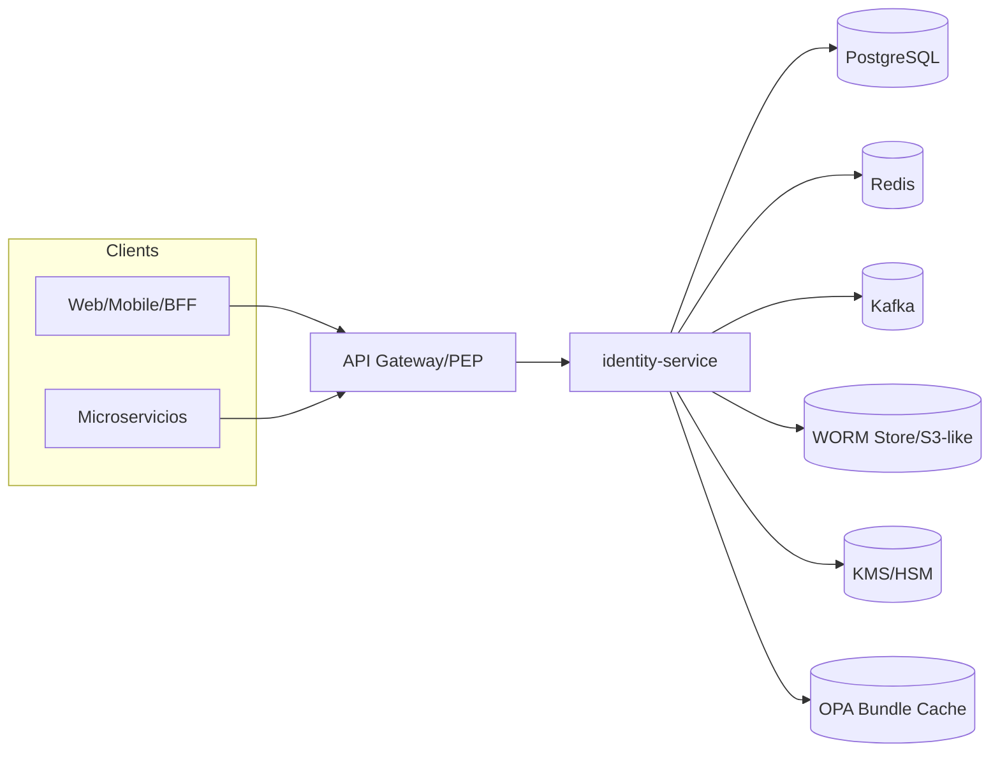

# 📐 Documento de Arquitectura de Software — Identity Service

**Rol responsable de este entregable:** DBA Arquitecto de Datos
**Versión:** 1.0 • **Estado:** Aprobado • **Fecha:** Oct-2025

---

## 0. Propósito y Alcance

Definir la arquitectura de software con énfasis en **persistencia, seguridad de datos, rendimiento, alta disponibilidad, multi-región, multi-tenant** y operación. Aplica a `identity-service` y a sus stores y cachés de soporte.

---

## 1. Visión del Sistema

`identity-service` es IdP central (OIDC/OAuth2.1), emite y valida tokens, gestiona sesiones, integra PBAC (OPA/Cedar) y cumplimiento runtime. Multi-tenant y multi-región.

---

## 2. Arquitectura Lógica



**Patrones:** CQRS ligero (lecturas intensivas en caché), Event-Driven (revocación/auditoría), Zero-Trust, PBAC.

---

## 3. Arquitectura de Datos

### 3.1 Modelo físico (tablas clave)

Resumido; tipos y constraints ajustados a PostgreSQL 14+.

```sql
-- Tenants
CREATE TABLE tenants (
  id uuid PRIMARY KEY,
  code text UNIQUE NOT NULL,
  region text NOT NULL,
  created_at timestamptz DEFAULT now()
);

-- Usuarios (sin PII sensible; email normalizado)
CREATE TABLE users (
  id uuid PRIMARY KEY DEFAULT gen_random_uuid(),
  tenant_id uuid NOT NULL REFERENCES tenants(id),
  username text NOT NULL,
  email citext NOT NULL,
  phone text,
  status text NOT NULL DEFAULT 'ACTIVE',        -- ACTIVE | INACTIVE | LOCKED
  email_verified_at timestamptz,
  phone_verified_at timestamptz,
  preferred_login text,                         -- PASSWORD | TOTP | WEBAUTHN
  created_at timestamptz DEFAULT now(),
  updated_at timestamptz DEFAULT now(),
  UNIQUE(tenant_id, username),
  UNIQUE(tenant_id, email)
);

-- Credenciales WebAuthn (solo material público/metadata)
CREATE TABLE webauthn_credentials (
  id uuid PRIMARY KEY DEFAULT gen_random_uuid(),
  user_id uuid NOT NULL REFERENCES users(id) ON DELETE CASCADE,
  credential_id bytea NOT NULL,                 -- índice binario
  public_key bytea NOT NULL,
  sign_count bigint NOT NULL DEFAULT 0,
  rp_id text NOT NULL,
  origin text NOT NULL,
  aaguid bytea,
  attestation_fmt text,
  transports text[],
  backup_eligible boolean,
  backup_state text,
  cred_protect text,
  last_used_at timestamptz,
  created_at timestamptz DEFAULT now(),
  UNIQUE(user_id, credential_id)
);

-- Refresh Tokens (hash + familia + DPoP)
CREATE TABLE refresh_tokens (
  id uuid PRIMARY KEY DEFAULT gen_random_uuid(),
  token_hash text NOT NULL,                     -- SHA-256/Argon2 hash
  user_id uuid NOT NULL REFERENCES users(id) ON DELETE CASCADE,
  jkt text NOT NULL,                            -- JWK thumbprint del cliente (DPoP)
  family_id uuid NOT NULL,
  parent_id uuid REFERENCES refresh_tokens(id),
  replaced_by_id uuid REFERENCES refresh_tokens(id),
  used_at timestamptz,
  client_id text NOT NULL,
  device_id text NOT NULL,
  session_id uuid NOT NULL,
  scope text NOT NULL,
  expires_at timestamptz NOT NULL,
  created_ip text,
  created_ua text,
  revoked boolean NOT NULL DEFAULT false,
  revoked_reason text,
  created_at timestamptz DEFAULT now()
);

-- Sesiones (control por dispositivo y PoP)
CREATE TABLE sessions (
  id uuid PRIMARY KEY DEFAULT gen_random_uuid(),
  user_id uuid NOT NULL REFERENCES users(id) ON DELETE CASCADE,
  tenant_id uuid NOT NULL REFERENCES tenants(id),
  device_id text NOT NULL,
  cnf_jkt text NOT NULL,
  issued_at timestamptz DEFAULT now(),
  not_after timestamptz NOT NULL,
  revoked_at timestamptz,
  version int NOT NULL DEFAULT 1,
  created_at timestamptz DEFAULT now()
);

-- Consentimientos (WORM lógico)
CREATE TABLE consent_audits (
  id uuid PRIMARY KEY DEFAULT gen_random_uuid(),
  user_id uuid NOT NULL REFERENCES users(id) ON DELETE CASCADE,
  consent_type text NOT NULL,                   -- biometría, video, marketing
  consent_granted boolean NOT NULL,
  granted_at timestamptz DEFAULT now(),
  ip_address text,
  user_agent text,
  policy_version text,
  purpose text,
  country_code text,
  evidence_ref text                             -- puntero a objeto WORM
);

-- Eventos de revocación (propagación)
CREATE TABLE revocation_events (
  id uuid PRIMARY KEY DEFAULT gen_random_uuid(),
  type text NOT NULL,                            -- SESSION | SUBJECT | TOKEN
  subject uuid NOT NULL,                         -- users.id
  tenant_id uuid NOT NULL REFERENCES tenants(id),
  session_id uuid,
  jti text,
  not_before timestamptz NOT NULL,
  created_at timestamptz DEFAULT now()
);
```

### 3.2 Claves, índices y tuning

* **Índices recomendados**

  * `users (tenant_id, email)`, `users (tenant_id, username)`
  * `webauthn_credentials (user_id)`; `GIN` sobre `credential_id` si se usa `bytea_pattern_ops`.
  * `refresh_tokens (user_id, family_id, expires_at)`, `refresh_tokens (token_hash)`
  * `sessions (user_id, not_after)`, `sessions (tenant_id, device_id)`
  * `revocation_events (tenant_id, not_before desc)`
* **Autovacuum** agresivo para `refresh_tokens` y `sessions`.
* **TOAST** habilitado por defecto; revisar `public_key` y `credential_id`.

### 3.3 Multi-tenant y aislamiento

* **RLS ON** en `users`, `webauthn_credentials`, `sessions`, `refresh_tokens`, `consent_audits`, `revocation_events`.
* Política: `tenant_id = current_setting('app.tenant_id')::uuid`.
* **Particionamiento por lista** en `tenant_id` para `sessions` y `refresh_tokens` de tenants de alto volumen.
* **Esquema por región** (p. ej. `latam.users`, `eu.users`) si se requiere residencia legal.

### 3.4 Cifrado y KMS

* **En reposo:** TDE del motor + columnas sensibles con **pgcrypto** o envoltura app-KMS (envelope encryption).
* **KMS jerárquico:** Master por región → subclave por tenant → `kid` por ciclo; rotación 90 días, rollover 7 días.
* **JWKS por tenant:** endpoint entrega solo claves activas del tenant/región.

### 3.5 WORM/Auditoría

* Evidencias (`evidence_ref`) almacenadas en **objeto S3-compatible con retención WORM** y digest SHA-256 guardado en DB.
* Inmutabilidad verificada mediante **hash-chain** (encadenado por `created_at` + `digest`).

---

## 4. Integraciones y Datos en Tránsito

* **Redis**: cache de sesiones activas, jti usados, ventanas anti-replay DPoP. TTL alineado a `access_token` (≤10 min).
* **Kafka**: tópicos `auth.events`, `revocations`, `dsar.jobs`, `keys.lifecycle`. Retención 7–30 días según tópico.
* **OPA/Cedar**: bundles firmados (Ed25519/ES256) servidos por CDN; validación de firma previa al load; TTL ≤5 min.
* **KMS/HSM**: generación y custodia de claves; API transaccional para rotación y revocación.

---

## 5. Disponibilidad, HA y Multi-Región

* **PostgreSQL**: clúster HA (Patroni/Cloud SQL HA), **sync quorum** intra-zona, réplica **async** inter-región (RPO ≤ 5 min).
* **Failover**: primario regional + réplicas calientes; DR runbook (< 30 min RTO).
* **No dependencias síncronas cross-región** en autenticación.
* **Replicación de eventos**: MirrorMaker / PubSub-replicator para Kafka entre regiones.
* **OPA bundles** y **JWKS** vía CDN regional; cache control `max-age=300`.

---

## 6. Seguridad de la Información

* **Transporte:** TLS 1.3 + mTLS interno.
* **Criptografía:** ES256/EdDSA exclusivos; **HS256 prohibido**.
* **Device binding:** DPoP `cnf.jkt`.
* **Attestation móvil:** FIDO2 Attestation + SafetyNet/DeviceCheck para registro/uso en AAL3.
* **RLS + Least Privilege**: roles DB de solo lectura para validadores; escrituras solo por `identity-service`.
* **Auditoría**: habilitar `pgaudit` para DDL/DML sensibles.

---

## 7. Rendimiento y Capacidad

* Perfil objetivo: **100K req/min**, P95 login ≤ 3 s.
* Pooler: `pgbouncer` (transaction pooling) para bursts de `/oauth/token`.
* **Plan de índices** revisado trimestralmente (pg_stat_statements).
* **Hot partitions**: rotate mensual en `refresh_tokens` y `sessions` (archivado frío).

---

## 8. Observabilidad y Métricas (DB y plano de identidad)

* **Prometheus exporters**: postgres, redis, kafka, app.
* KPIs:

  * `db_conn_usage`, `db_locks_waiting`, `checkpoint_write_time`
  * `token_validation_error_rate` ≤ 0.1%
  * `revocation_latency_p95` ≤ 60 s
  * `login_latency_p95` ≤ 3 s
  * `device_attestation_failure_rate` ≤ 0.5%
  * `replication_lag_seconds` (inter-región) ≤ 300
* **Trazas**: OpenTelemetry con atributos `tenant_id`, `region`, `kid`.

---

## 9. Respaldo y Recuperación (B&R)

* **Backups**: full diaria + WAL continuo (PITR). Retención 30–90 días.
* **Pruebas de restore**: mensuales; verificación de checksums e integridad WORM.
* **Cripto-recuperación**: CU-07 — revocar `kid` comprometido, emitir nueva clave, publicar JWKS, revalidar.

---

## 10. Gobierno de Cambios y Migraciones

* Migraciones **idempotentes** con `sqitch/flyway` en pipelines CI/CD.
* Ventanas de cambio azul-verde; rehearsal en réplica.
* **Feature flags** para claims nuevos y TTLs.
* **Contracts**: `/.well-known/openid-configuration`, `jwks_uri` versionados por tenant.

---

## 11. Seguridad Operacional (Runbooks)

* **Incidente de clave**: ejecutar CU-07 (revocación, publicación JWKS, verificación).
* **Degradación Redis**: caer a validación DB con backoff, activar límites.
* **Lentitud DB**: congelar cargas masivas, aumentar pool/IOPS, activar `statement_timeout`.
* **Partición de red**: operar con caches locales; reconciliar eventos al restaurar.

---

## 12. Riesgos Técnicos (resumen DBA)

* **Contención en hot tables** (`refresh_tokens`): particionar + índices compuestos → monitoreo de bloat.
* **Lag de réplica inter-región**: alertas ≥ 180 s → throttling de revocación.
* **Crecimiento WORM**: política de ciclo de vida (expirar evidencias no requeridas legalmente).
* **Vacío de RLS**: tests automáticos de política por release.

---

## 13. Matriz RACI (Datos)

| Actividad        | PO | Arq | Sec | DBA     |
| ---------------- | -- | --- | --- | ------- |
| Diseño esquema   | C  | A   | C   | **R**   |
| Índices y tuning | C  | C   | C   | **R/A** |
| Backups/Restore  | I  | I   | C   | **R/A** |
| RLS/Permisos     | I  | C   | C   | **R/A** |
| DR/HA pruebas    | I  | C   | C   | **R/A** |

---

## 14. Anexos

### 14.1 Políticas RLS (ejemplo)

```sql
ALTER TABLE users ENABLE ROW LEVEL SECURITY;
CREATE POLICY p_users_tenant ON users
USING (tenant_id = current_setting('app.tenant_id')::uuid);
```

### 14.2 Roles DB (mínimo)

```sql
CREATE ROLE id_readonly NOINHERIT;
GRANT SELECT ON ALL TABLES IN SCHEMA public TO id_readonly;

CREATE ROLE id_service NOINHERIT;
GRANT SELECT, INSERT, UPDATE, DELETE ON ALL TABLES IN SCHEMA public TO id_service;
```

### 14.3 Índices sugeridos

```sql
CREATE INDEX idx_rt_user_family ON refresh_tokens(user_id, family_id, expires_at);
CREATE INDEX idx_sess_user_notafter ON sessions(user_id, not_after);
CREATE INDEX idx_webauthn_user ON webauthn_credentials(user_id);
```

---

## 15. Conclusión

La arquitectura propuesta garantiza **aislamiento por tenant, cumplimiento legal, resiliencia multi-región, rendimiento y observabilidad**, con controles de seguridad alineados a estándares y procedimientos operativos claros desde la disciplina DBA. Listo para **go-live** y auditorías **ISO 27001/SOC 2**.
