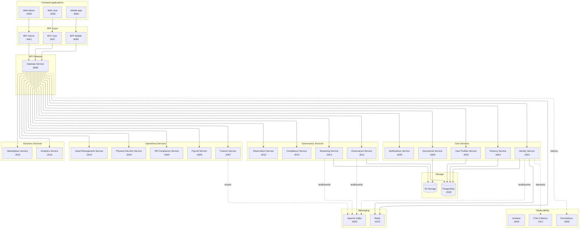

# 📘 Documento de Visión

## **Identity Service — SmartEdify Platform**

**Versión:** 0.0
**Estado:** Aprobado para ejecución y despliegue multirregional
**Fecha:** Octubre 2025
**Autor:** Product Owner — Identity Service
**Revisores:** CTO, Chief Compliance Officer, Arquitectura, Seguridad, Asesor Legal
**Normas de Referencia:** ISO/IEC 12207, ISO 27001, NIST 800-63-4, OAuth 2.1 BCP, FIDO2/WebAuthn, OpenID Connect Core, GDPR, LGPD

---

## 🧭 1. Visión General

### **Propósito**

El `identity-service` es el proveedor central de identidad, autenticación, autorización y trazabilidad del ecosistema SmartEdify.
Asegura que toda interacción digital sea **irrefutable, auditable y legalmente válida**, habilitando la confianza y cumplimiento en procesos de gobernanza condominal y operaciones administrativas.

### **Objetivos Estratégicos**

* Garantizar autenticación fuerte (AAL2/AAL3) en todos los contextos.
* Proveer control centralizado de acceso y sesiones en un entorno multi-tenant.
* Integrar cumplimiento regulatorio transnacional en tiempo de ejecución.
* Ofrecer una API consistente, segura y verificable para todos los servicios dependientes.
* Soportar escalabilidad global con resiliencia criptográfica y auditoría inmutable.

---

## 2. Usuarios y Personas

El identity-service autentica y emite credenciales para **todos los principios**. La asignación de **roles, grupos, relaciones y atributos** es responsabilidad de `user-profiles-service` y se proyecta en los tokens como claims para PBAC.

| Clase (subject_type) | Subtipos/ejemplos | Auth preferente | Claims mínimos | Casos de uso típicos |
|---|---|---|---|---|
| human.end_user | Propietario, Residente, Trabajador, Prestador, Invitado | WebAuthn/Passkey; fallback TOTP | sub, tenant_id, role_ids, entitlements, assurance, cnf.jkt | Acceso a portales, asistencia/voto en asambleas, reservas |
| human.operator | Administrador, Guardia, Auditor/DPO | WebAuthn + MFA reforzado | + group_ids, org_unit | Gestión de quórum, revocación, auditoría |
| service.principal | Microservicios internos | mTLS + private_key_jwt + DPoP | sub=client_id, aud, scp | Llamadas entre servicios, validación de tokens |
| external.app | Integraciones de terceros | private_key_jwt + PKCE | aud, scp, jwk thumbprint | Integraciones partner controladas |
| device | Dispositivo atado | DPoP obligatorio | cnf.jkt, device_id | Validación de QR/PoP, kioscos/torniquetes |

**Nota:** los **roles y permisos** no se definen en identity-service. Se consultan en `user-profiles-service` y se incluyen como `role_ids/entitlements` en los tokens. El PDP (OPA/Cedar) evalúa acceso con RBAC+ABAC+ReBAC.

---

## 🏗️ 3. Arquitectura Técnica Definitiva

### **3.1. Patrón Arquitectónico**

El `identity-service` adopta un modelo **Zero Trust + Event-Driven + Policy-Based Access**, estructurado en cuatro capas:

1. **Capa de Presentación:** BFF Layer especializado por cliente
2. **Capa de Exposición:** API Gateway (8080) con PEP (Policy Enforcement Point)
3. **Capa de Identidad:** Núcleo OIDC/OAuth2 + WebAuthn + DPoP
4. **Capa de Cumplimiento:** Integración con `compliance-service` para validaciones legales y DSAR runtime
5. **Capa de Auditoría:** Kafka y almacenamiento WORM con hash-chain

### 3.2. Arquitectura definitiva (visión plataforma)

### **3.3. Tecnologías y Protocolos**

* **OIDC / OAuth 2.1 / PKCE obligatorio** - Flujos implícito e híbrido PROHIBIDOS
* **WebAuthn L3 / Passkeys (AAL2/AAL3)**
* **DPoP (RFC 9449)** para tokens sender-constrained
* **JWT ES256/EdDSA con rotación 90d + rollover 7d** - HS256 EXPLÍCITAMENTE PROHIBIDO
* **OPA/Cedar** para políticas contextuales híbridas
* **Kafka** para trazabilidad y cumplimiento
* **PostgreSQL** con RLS y cifrado en reposo

---

## ⚙️ 4. Alcance Funcional

### **4.1. Funcionalidades Principales**

| Categoría                | Función                    | Descripción                                                       |
| ------------------------ | -------------------------- | ----------------------------------------------------------------- |
| **Gestión de Identidad** | Registro adaptable         | Registro configurable por tenant, con OTP y validaciones locales. |
|                          | Consentimiento digital     | Captura y almacenamiento inmutable de consentimientos.            |
| **Autenticación**        | WebAuthn / Passkeys        | Método principal, sin almacenamiento de biometría.                |
|                          | TOTP / Fallback            | Alternativa AAL2 con MFA obligatorio.                             |
| **Autorización**         | PBAC híbrido               | Políticas por rol, contexto y relación.                           |
|                          | OPA/Cedar PDP              | Evaluación de acceso en tiempo real.                              |
| **Sesiones**             | Gestión distribuida        | Logout global, DPoP, control por dispositivo.                     |
|                          | Revocación instantánea     | Propagación ≤30s vía Kafka.                                       |
| **QR Contextuales**      | **ÚNICO EMISOR Y VALIDADOR** | COSE/JWS con TTL corto para asambleas o accesos físicos.          |
| **Cumplimiento (DSAR)**  | Portabilidad y eliminación | Cross-service con orquestación del compliance-service.            |
| **Auditoría Legal**      | Logs WORM                  | Registro inmutable y firmado digitalmente.                        |

---

## 🚦 5. Casos de Uso Funcionales

### **CU-01 Registro Adaptativo**

**Actor:** Residente / Administrador
**Flujo:**

1. Usuario envía datos de registro (email, teléfono, jurisdicción).
2. Se valida OTP doble canal.
3. Se registra consentimiento.
4. Se crea entidad `user` cifrada determinísticamente.

**Resultado:** Usuario registrado y vinculado a un tenant con política regional aplicada.

---

### **CU-02 Autenticación Segura (WebAuthn)**

**Actor:** Usuario final o sistema interno
**Flujo:**

1. Usuario inicia autenticación WebAuthn.
2. Se valida `credentialId` y `publicKey`.
3. Se genera JWT + DPoP (ES256/EdDSA).
4. Se publica evento `AuthSuccess` en Kafka.

**Resultado:** Sesión autenticada, válida para 10 minutos y atada al dispositivo.

---

### **CU-03 Autorización Contextual**

**Actor:** Microservicio dependiente
**Flujo:**

1. Solicitud llega con token DPoP y `tenant_id`.
2. PEP consulta OPA/Cedar con atributos de usuario, recurso y contexto.
3. Respuesta `Permit/Deny` firmada y cacheada (TTL ≤5min).

**Resultado:** Autorización evaluada en tiempo real, auditable y coherente entre regiones.

---

### **CU-04 QR Contextual para Asamblea**

**Actor:** Governance Service / Residente
**Flujo:**

1. Governance solicita QR firmado al identity-service.
2. **Identity genera COSE/JWS (`kid`, `ttl=300s`) - ÚNICO EMISOR**.
3. Streaming-service muestra QR para escaneo.
4. Guardia valida QR con `/validate` + DPoP.
5. Evento `AccessValidated` registrado en Kafka.

**Resultado:** Acceso físico o digital validado con respaldo legal y técnico.

---

### **CU-05 Revocación Global**

**Actor:** Usuario / Administrador / Compliance
**Flujo:**

1. Solicitud `POST /identity/v2/sessions/{id}/revoke`.
2. Identity marca `not-before` para el `sub`.
3. Se publica evento `RevokeSession`.
4. Todos los servicios invalidan tokens en P95 ≤30s.

**Resultado:** Cierre de sesión universal, trazado en auditoría.

---

### **CU-06 DSAR – Eliminación de Datos**

**Actor:** Usuario final / DPO
**Flujo:**

1. Usuario solicita `DELETE /privacy/data`.
2. Identity crea `job_id` y publica `DataDeletionRequested`.
3. **Compliance-service orquesta crypto-erase en governance-service y otros**.
4. Todos los servicios confirman eliminación y firman estado.

**Resultado:** Eliminación completa del usuario con registro de cumplimiento.

---

### **CU-07 Rotación de Claves y Validación**

**Actor:** Infraestructura / Seguridad
**Flujo:**

1. Cada 90 días se rota la clave ES256/EdDSA.
2. JWKS publica nuevas y antiguas claves (rollover 7d).
3. **Gateway-service sincroniza caché ≤5min (REQUISITO P0)**.
4. Validación continua sin interrupciones.

**Resultado:** Seguridad criptográfica mantenida sin impacto en disponibilidad.

---

## 🧩 6. Servicios Integrados y Responsabilidades

| Servicio               | Dependencia                    | Función Soportada                      | Tipo de Interacción   |
| ---------------------- | ------------------------------ | -------------------------------------- | --------------------- |
| **BFF Layer**          | Proxy de autenticación         | Adaptación de flujos por tipo de cliente | OIDC + Tokens         |
| **Governance Service** | Identidad, autenticación, QR   | Procesos de asamblea, quórum, votación | Directa OIDC / Tokens |
| **Streaming Service**  | **Solo display QR**            | Muestra QR para escaneo en asambleas   | API Tokens Contextuales |
| **Compliance Service** | Políticas y DSAR               | Validación regulatoria runtime         | Bidireccional         |
| **Finance Service**    | Autenticación fuerte           | Cobros y transferencias seguras        | OIDC + JWT            |
| **Payroll Service**    | Acceso autorizado              | Gestión de nómina y RRHH               | RBAC + DSAR           |

---

## 🔐 7. Seguridad y Cumplimiento

| Mecanismo                           | Descripción                                  |
| ----------------------------------- | -------------------------------------------- |
| **Cifrado TLS 1.3 + mTLS**          | Comunicación segura entre servicios.         |
| **Cifrado en reposo AES-256**       | Protección de datos y claves KMS regionales. |
| **Revocación Distribuida**          | Eventos Kafka + Redis para sesiones.         |
| **Token Sender-Constrained (DPoP)** | Prevención de replay attacks.                |
| **Logs WORM**                       | Evidencias inmutables con hash-chain.        |
| **Cumplimiento DSAR / GDPR / LGPD** | Ejecución orquestada y validada por tenant.  |
| **Algoritmos Asimétricos Exclusivos** | **ES256/EdDSA obligatorios, HS256 prohibido** |

---

## 📈 8. Métricas y SLOs

| Área           | Métrica             | Umbral  | Frecuencia |
| -------------- | ------------------- | ------- | ---------- |
| Autenticación  | Latencia P95        | ≤3s     | Continuo   |
| Revocación     | Propagación global  | ≤30s    | Realtime   |
| Disponibilidad | SLA anual           | ≥99.95% | Mensual    |
| DSAR           | Resolución completa | ≤72h    | Diario     |
| Auditoría      | Eventos firmados    | 100%    | Continuo   |
| JWKS Cache     | Sincronización      | ≤5min   | Continuo   |

---

## 🗺️ 9. Roadmap Técnico

| Fase                                      | Objetivos Clave                                                                 |
| ----------------------------------------- | ------------------------------------------------------------------------------- |
| **Fase 1 — Core Identity Foundation**     | WebAuthn + OIDC completo + Sesiones distribuidas + Políticas OPA/Cedar + DSAR cross-service |
| **Fase 2 — Global Expansion**             | Multi-región + Certificaciones ISO + eIDAS + Optimización de desempeño global   |

---

## 🧾 10. Gobierno del Producto

| Rol                | Responsabilidad                         |
| ------------------ | --------------------------------------- |
| Product Owner      | Roadmap funcional y priorización        |
| CTO / Arquitectura | Diseño técnico y escalabilidad          |
| Seguridad          | Cifrado, pentesting, revisión de claves |
| Compliance         | Adaptación regulatoria por país         |
| DevSecOps          | Monitoreo, CI/CD y resiliencia          |
| QA                 | Pruebas AAL, OIDC, DSAR y auditoría     |

---

## 🏁 11. Conclusión

El **Identity Service** es el eje de confianza y control en la plataforma SmartEdify.
Combina autenticación biométrica moderna, autorización contextual y cumplimiento regulatorio automatizado.
Su arquitectura final garantiza interoperabilidad, seguridad criptográfica y cumplimiento multi-país en entornos de alta demanda.

**🔐 Responsabilidades Clave Confirmadas:**
- **Único emisor y validador** de tokens QR contextuales
- **Algoritmos asimétricos exclusivos** (ES256/EdDSA)
- **PKCE obligatorio** en todos los flujos OIDC
- **Orquestación inicial** de DSAR con compliance-service
- **Integración completa** con BFF Layer para experiencia de cliente optimizada

**Estado final del producto:** 🟩 *Listo para despliegue productivo y expansión internacional.*

---

**Aprobado por:** CTO SmartEdify Global  
**Fecha:** Octubre 2025  
**Versión del Documento:** 1.1 - Alineado con arquitectura BFF y roadmap unificado
