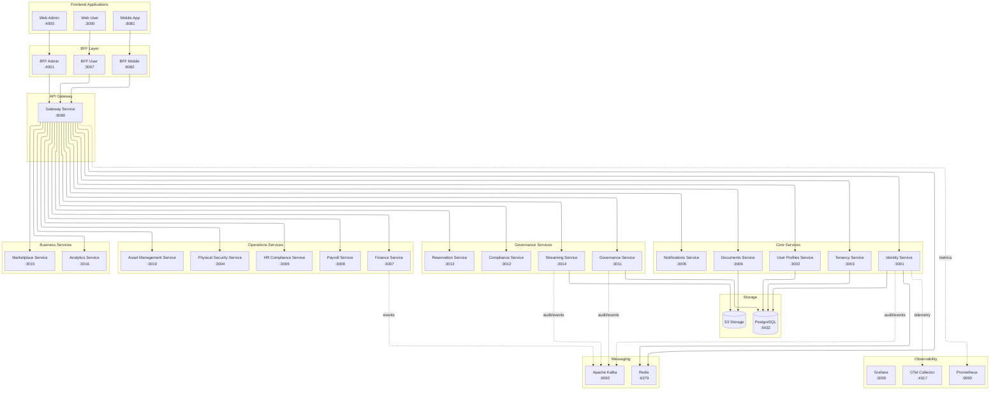

# 📘 Documento de Visión

## **Identity Service — SmartEdify Platform**

**Versión:** 0.0
**Estado:** Aprobado para ejecución y despliegue multirregional
**Fecha:** Octubre 2025
**Autor:** Product Owner — Identity Service
**Revisores:** CTO, Chief Compliance Officer, Arquitectura, Seguridad, Asesor Legal
**Normas de Referencia:** ISO/IEC 12207, ISO 27001, NIST 800-63-4, OAuth 2.1 BCP, FIDO2/WebAuthn, OpenID Connect Core, GDPR, LGPD

---

## 🧭 1. Visión General

### **Propósito**

El identity-service es el proveedor central de identidad y autenticación de la plataforma SmartEdify.
Garantiza que todo acceso, sesión o transacción sea seguro, auditable y legalmente válido, soportando una operación multi-tenant y multi-jurisdiccional.

### **Objetivos Estratégicos**

* Gestionar autenticación, sesiones y tokens con cumplimiento normativo.
* Asegurar interoperabilidad entre microservicios mediante estándares OIDC/OAuth2
* Permitir registro delegado controlado y activación segura por invitación.
* Garantizar AAL2/AAL3 para usuarios y operaciones de riesgo; para M2M, mTLS/private_key_jwt + DPoP.
* Centralizar decisiones de acceso y gestión de sesiones, con enforcement distribuido en Gateway/servicios.
* Integrar cumplimiento regulatorio transnacional en tiempo de ejecución.
* Ofrecer una API consistente, segura y verificable para todos los servicios dependientes.
* Soportar escalabilidad global con resiliencia criptográfica y auditoría inmutable.
* Proveer trazabilidad inmutable de accesos y acciones críticas.

---

## 2. Usuarios y Personas

El identity-service autentica y emite credenciales para **todos los principios**. La asignación de **roles, grupos, relaciones y atributos** es responsabilidad de `user-profiles-service` y se proyecta en los tokens como claims para PBAC.

| Clase (subject_type) | Subtipos/ejemplos | Auth preferente | Claims mínimos | Casos de uso típicos |
|---|---|---|---|---|
| human.end_user | Propietario, Residente, Trabajador, Prestador, Invitado | WebAuthn/Passkey; fallback TOTP | sub, tenant_id, role_ids, entitlements, assurance, cnf.jkt | Acceso a portales, asistencia/voto en asambleas, reservas |
| human.operator | Administrador, Guardia, Auditor/DPO | WebAuthn + MFA reforzado | + group_ids, org_unit | Gestión de quórum, revocación, auditoría |
| service.principal | Microservicios internos | mTLS + private_key_jwt + DPoP | sub=client_id, aud, scp | Llamadas entre servicios, validación de tokens |
| external.app | Integraciones de terceros | private_key_jwt + PKCE | aud, scp, jwk thumbprint | Integraciones partner controladas |
| device | Dispositivo atado | DPoP obligatorio | cnf.jkt, device_id | Validación de QR/PoP o acceso físico |

**Nota:** los **roles y permisos** no se definen en identity-service. Se consultan en `user-profiles-service` y se incluyen como `role_ids/entitlements` en los tokens. El PDP (OPA/Cedar) evalúa acceso con RBAC+ABAC+ReBAC.

---

## 🏗️ 3. Arquitectura Técnica Definitiva

### **3.1. Patrón Arquitectónico**

El `identity-service` adopta un modelo **Zero Trust + Event-Driven + Policy-Based Access**, estructurado en cuatro capas:

1. **Capa de Presentación:** BFF Layer especializado por cliente
2. **Capa de Exposición:** API Gateway (8080) con PEP (Policy Enforcement Point)
3. **Capa de Identidad:** identity-service (OIDC/OAuth2.1, WebAuthn, DPoP).
4. **Capa de Perfil y Roles:** user-profiles-service (atributos, grupos, relaciones).
5. **Capa de Cumplimiento:** Integración con `compliance-service` para validaciones legales y DSAR runtime
6. **Capa de Auditoría:** Kafka y almacenamiento WORM con hash-chain

### 3.2. Arquitectura definitiva (visión plataforma)

### **3.3. Tecnologías y Protocolos**

* **OIDC / OAuth 2.1 / PKCE obligatorio** - Flujos implícito e híbrido PROHIBIDOS
* **WebAuthn L3 / Passkeys (AAL2/AAL3)**
* **DPoP (RFC 9449)** para tokens sender-constrained
* **JWT ES256/EdDSA con rotación 90d + rollover 7d** - HS256 EXPLÍCITAMENTE PROHIBIDO
* **OPA/Cedar** para políticas contextuales híbridas
* **Kafka** para trazabilidad y cumplimiento
* **PostgreSQL** con RLS y cifrado en reposo

---

## ⚙️ 4. Alcance Funcional

### **4.1. Funcionalidades Principales**

| Categoría                 | Función                                      | Descripción                                                                                                                                                              |
| ------------------------- | -------------------------------------------- | ------------------------------------------------------------------------------------------------------------------------------------------------------------------------ |
| **Gestión de Identidad**  | **Registro delegado y activación**           | El CRUD de usuarios se ejecuta en `user-profiles-service` bajo control del Administrador. `identity-service` solo gestiona invitaciones, consentimientos y activaciones. |
|                           | **Consentimiento legal digital**             | Captura y almacenamiento WORM de consentimientos versionados.                                                                                                            |
| **Autenticación**         | **WebAuthn / Passkeys**                      | Autenticación biométrica sin almacenar datos sensibles.                                                                                                                  |
|                           | **TOTP / Fallback MFA**                      | Alternativa AAL2 para dispositivos no compatibles.                                                                                                                       |
| **Autorización**          | **PBAC (RBAC+ABAC+ReBAC)**                   | Motor OPA/Cedar, evaluación contextual y fail-closed.                                                                                                                    |
| **Sesiones**              | **Gestión distribuida y revocación global**  | Logout inmediato, DPoP obligatorio, TTL ≤5 min.                                                                                                                         |
| **QR Contextuales**       | **Tokens firmados (COSE/JWS)**               | Usados para asambleas, accesos físicos o eventos transitorios.                                                                                                           |
| **Cumplimiento y DSAR**   | **Portabilidad / Eliminación Cross-Service** | Coordinado por `compliance-service` en tiempo de ejecución.                                                                                                              |
| **Auditoría y Evidencia** | **Eventos WORM en Kafka**                    | Audit trail legal e inmutable.                                                                                                                                           |

---

## 🚦 5. Casos de Uso Funcionales

### **CU-01 Registro Delegado y Activación**

**Actor:** Administrador del condominio
**Flujo:**

1. El Administrador crea usuarios (individual o masivo) desde su dashboard → user-profiles-service.
2. identity-service genera enlace de invitación seguro (firmado, TTL ≤5min, un solo uso).
3. El usuario recibe correo enviado a traves de 'communication-service', verifica identidad y acepta consentimientos.
4. Configura su método de acceso (Passkey o TOTP).
5. identity-service marca la identidad como ACTIVA y notifica a user-profiles
6. El usuario inicia sesión por primera vez.

**Resultado:** Registro controlado, cumplimiento legal y onboarding seguro.

---

### **CU-02 Autenticación Fuerte**

**Actor:** Usuario final o sistema interno
**Flujo:**

1. El cliente inicia el flujo /authorize (PKCE).
2. WebAuthn/TOTP según tipo de usuario y nivel de aseguramiento.
3. Se emiten tokens firmados (ES256/EdDSA, kid, DPoP).
4. Eventos de autenticación se registran en Kafka.

**Resultado:** Sesión autenticada, trazada y segura.

---

### **CU-03 Autorización Contextual**

**Actor:** API Gateway, PDP (OPA/Cedar)
**Flujo:**

1. Cada solicitud pasa por el PEP del Gateway
2. El PDP evalúa las políticas combinando claims (role_ids, entitlements) con contexto (hora, ubicación, dispositivo).
3. Respuesta `Permit/Deny` firmada y cacheada (TTL ≤5min).

**Resultado:** Autorización evaluada en tiempo real, auditable y coherente entre regiones.

---

### **CU-04 QR Contextual para Asamblea**

**Actor:** Governance Service / Residente
**Flujo:**

1. Governance solicita y consume QR firmado al identity-service.
2. Identity emite el token COSE/JWS firmado (ES256) con kid y iss canónico por tenant, TTL=300 s. Único emisor y validador: ningún otro servicio puede firmar tokens contextuales (endpoint/validate)
3. Streaming-service muestra QR para escaneo.
4. El servicio validador 'governance' ejecuta /validate con DPoP y verifica firma, aud, exp, cnf.
5. Evento `AccessValidated` registrado en Kafka.

**Resultado:** Acceso físico o digital validado con respaldo legal y técnico.

---

### **CU-05 Revocación Global**

**Actor:** Usuario / Administrador / Compliance
**Flujo:**

1. Solicitud `POST /identity/v2/sessions/{id}/revoke`.
2. Identity marca `not-before` para el `sub`.
3. Se publica evento `RevokeSession`.
4. Todos los servicios invalidan tokens en P95 ≤60s.

**Resultado:** Cierre de sesión universal, trazado en auditoría.

---

### **CU-06 DSAR – Eliminación de Datos**

**Actor:** Usuario final / DPO
**Flujo:**

1. Usuario solicita `DELETE /privacy/data`.
2. Identity crea `job_id` y publica `DataDeletionRequested`.
3. **Compliance-service orquesta crypto-erase en governance-service coordina eliminación en todos los servicios dependientes**.
4. Resultado notificado vía webhook.

**Resultado:** Eliminación completa del usuario con registro de cumplimiento.

---

### **CU-07 Recuperación o Reemplazo de Claves**

**Actor:** Equipo de Seguridad / Infraestructura
**Flujo:**

1. Detección o instrucción de reemplazo (auditoría, incidente o fallo).
2. Revocación de 'kid' afectado y evento 'KeyRevoked' en Kafka.
3. Generación controlada de nueva clave (HSM/KMS).
4. Publicación de nueva clave en JWKS; notificación 'KeyRolloverInitiated'.
5. Validadores sincronizan caché JWKS ≤5 min.
6. Validación cruzada y auditoría 'KeyChangeCompleted'.

**Resultado:** continuidad criptográfica restablecida sin interrupción del servicio.
---

## 🧩 6. Servicios Integrados y Responsabilidades

| Servicio                    | Dependencia    | Función Soportada                                        | Tipo de Interacción |
| --------------------------- | -------------- | -------------------------------------------------------- | ------------------- |
| **User Profiles**           | Corresponsable | CRUD de usuarios, roles, relaciones, activación delegada | Bidireccional       |
| **Governance**              | Dependiente    | Procesos de asamblea, quórum, votación, QR               | OIDC + JWT          |
| **Compliance**              | Dependiente    | Validación legal, DSAR runtime                           | Bidireccional       |
| **Finance**                 | Dependiente    | Autenticación transaccional y antifraude                 | OIDC                |
| **Payroll**                 | Dependiente    | Gestión de identidad laboral                             | RBAC + DSAR         |
| **HR Compliance**           | Dependiente    | Validaciones regulatorias                                | API segura          |
| **Asset Management**        | Dependiente    | Acceso y autenticación contextual                        | PBAC                |
| **Physical Security**       | Dependiente    | Validación de QR de acceso                               | COSE/JWS + DPoP     |
| **Marketplace / Analytics** | Dependiente    | Acceso autenticado y multi-tenant                        | OIDC federado       |

---

## 🔐 7. SeguridadZero Trust Architecture: autenticación y autorización continua. y Cumplimiento

| Mecanismo                                       | Descripción                                                                                                                         |
| ----------------------------------------------- | ----------------------------------------------------------------------------------------------------------------------------------- |
| **TLS 1.3 + mTLS**                              | Canal cifrado y autenticación mutua entre microservicios.                                                                           |
| **Cifrado en reposo AES-256 (KMS regional)**    | Protección de datos y claves con segmentación por región.                                                                           |
| **Aislamiento criptográfico por tenant/región** | Cada tenant o jurisdicción posee subclaves dedicadas gestionadas por el KMS jerárquico (master regional → subclave tenant → `kid`). |
| **Rotación y Rollover**                         | Claves ES256/EdDSA rotadas automáticamente cada 90 días con rollover de 7 días. JWKS publicado por tenant con TTL ≤5 min.           |
| **Revocación distribuida global**               | Eventos Kafka replicados entre regiones; Redis cache local para invalidación inmediata. Propagación objetivo ≤60 s P95.             |
| **Token Sender-Constrained (DPoP)**             | Prevención de replay attacks; `cnf.jkt` enlaza token y dispositivo.                                                                 |
| **Logs WORM con hash-chain**                    | Evidencias inmutables, selladas temporalmente y verificables.                                                                       |
| **Políticas PBAC sincronizadas OPA bundles**    | Distribución de bundles firmados por CDN, TTL ≤5 min. Sin dependencias síncronas cross-region.                                      |
| **Fallback TOTP endurecido**                    | Solo TOTP basado en app autenticadora certificada, vinculado al dispositivo y `cnf.jkt`. SMS y correo deshabilitados.               |
| **Cumplimiento DSAR / GDPR / LGPD**             | Ejecución orquestada por tenant y validada en tiempo real por `compliance-service`.                                                 |
| **Algoritmos asimétricos exclusivos**           | **ES256 / EdDSA obligatorios. HS256 prohibido.**                                                                                    |

## ⚙️ 8. Operación Multi-Región
---

**Sincronización Criptográfica y de Políticas**
**JWKS:** replicación asíncrona mediante Kafka o Pub/Sub y distribución vía CDN regional. Cada región mantiene su copia local (eventual consistency).
**Revocación de Sesiones:** propagación por eventos RevocationEvent con cache local Redis; sin dependencias HTTP entre regiones.
**Políticas OPA/Cedar:** bundles versionados en repositorio GitOps o CDN; TTL ≤5 min. Validación siempre local.
**No se permiten llamadas síncronas cross-region** durante autenticación ni validación de tokens.

**Modelo de Claves Jerárquico**
**Nivel 1:** master key regional (jurisdicción legal).
**Nivel 2:** subclave por tenant (kid único).
**Nivel 3:** rotación y rollover automáticos según política de seguridad.

**Endpoint JWKS por tenant:**
'https://auth.smartedify.global/.well-known/jwks.json?tenant_id={tenant}'

**Resiliencia Operativa**
Arquitectura event-driven con consistencia eventual garantizada.
Objetivo de continuidad: ninguna operación de autenticación depende de servicios externos de otra región.
En caso de partición, validación local priorizada; sincronización diferida post-restauración.

## 📈 9. Métricas y SLOs

| Área              | Indicador                 | Umbral                  |
| ----------------- | ------------------------- | ----------------------- |
| Autenticación     | Tiempo medio de login     | ≤3 s                    |
| Revocación Global | Propagación               | ≤60 s P95 / ≤5 min P100 |
| Disponibilidad    | SLA anual                 | ≥99.95%                 |
| DSAR              | Tiempo completitud        | ≤72 h                   |
| Auditoría         | Integridad de logs        | 100% verificada         |
| JWKS              | Latencia de actualización | ≤5 min                  |
| OPA Bundles       | TTL de sincronización     | ≤5 min                  |

---

## 🗺️ 10. Roadmap Técnico

| Fase                                      | Objetivos Clave                                                                 |
| ----------------------------------------- | ------------------------------------------------------------------------------- |
| **Fase 1 — Core Identity Foundation**     | WebAuthn + OIDC completo + Sesiones distribuidas + Políticas OPA/Cedar + DSAR cross-service |
| **Fase 2 — Global Expansion**             | Multi-región + Certificaciones ISO + eIDAS + Optimización de desempeño global   |

---

## 🧾 11. Gobierno del Producto

| Rol                | Responsabilidad                         |
| ------------------ | --------------------------------------- |
| Product Owner      | Roadmap funcional y priorización        |
| CTO / Arquitectura | Diseño técnico y escalabilidad          |
| Seguridad          | Cifrado, pentesting, revisión de claves |
| Compliance         | Adaptación regulatoria por país         |
| DevSecOps          | Monitoreo, CI/CD y resiliencia          |
| QA                 | Pruebas AAL, OIDC, DSAR y auditoría     |

---
## 📋 12. Consideraciones Finales

Los cambios introducen resiliencia multirregional, aislamiento criptográfico por tenant/región y autenticación reforzada.
Todos los mecanismos se ajustan a NIST 800-63-4, RFC 9449 (DPoP) y ISO 27001 Annex A.10.
No se modifican contratos API ni casos de uso de negocio; se extiende la robustez operativa y el cumplimiento transnacional.

## 🏁 13. Conclusión

El **Identity Service** es el eje de confianza y control en la plataforma SmartEdify.
Combina autenticación biométrica moderna, autorización contextual y cumplimiento regulatorio automatizado.
Su arquitectura final garantiza interoperabilidad, seguridad criptográfica y cumplimiento multi-país en entornos de alta demanda.

**🔐 Responsabilidades Clave Confirmadas:**
- **Único emisor y validador** de tokens QR contextuales
- **Algoritmos asimétricos exclusivos** (ES256/EdDSA)
- **PKCE obligatorio** en todos los flujos OIDC
- **Orquestación inicial** de DSAR con compliance-service
- **Integración completa** con BFF Layer para experiencia de cliente optimizada

**Estado final del producto:** 🟩 *Listo para despliegue productivo y expansión internacional.*

---

**Aprobado por:** CTO SmartEdify Global  
**Fecha:** Octubre 2025  
**Versión del Documento:** 1.1 - Alineado con arquitectura BFF y roadmap unificado
