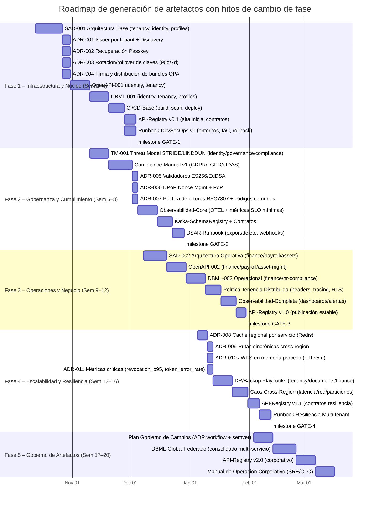

```mermaid
---
title: "Roadmap de Artefactos/Documentos/ADRs — SmartEdify v2.1"
config:
  layout: grid
---
gantt
    dateFormat  YYYY-MM-DD
    axisFormat  %b %d
    title Roadmap de generación de artefactos con hitos de cambio de fase

    %% ===================== FASE 1 =====================
    section Fase 1 – Infraestructura y Núcleo (Sem 1–4)
    SAD-001 Arquitectura Base (tenancy, identity, profiles)     :a1, 2025-10-13, 14d
    ADR-001 Issuer por tenant + Discovery                        :a2, after a1, 4d
    ADR-002 Recuperación Passkey                                  :a3, after a1, 4d
    ADR-003 Rotación/rollover de claves (90d/7d)                  :a4, after a1, 4d
    ADR-004 Firma y distribución de bundles OPA                   :a5, after a1, 4d
    OpenAPI-001 (identity, tenancy)                               :a6, after a2, 10d
    DBML-001 (identity, tenancy, profiles)                        :a7, after a6, 10d
    CI/CD-Base (build, scan, deploy)                              :a8, after a7, 8d
    API-Registry v0.1 (alta inicial contratos)                    :a9, after a8, 6d
    Runbook-DevSecOps v0 (entornos, IaC, rollback)                :a10, after a8, 6d
    milestone GATE-1: Aprobación Comité (Planificación→Desarrollo) :mil1, after a10, 0d

    %% ===================== FASE 2 =====================
    section Fase 2 – Gobernanza y Cumplimiento (Sem 5–8)
    TM-001 Threat Model STRIDE/LINDDUN (identity/governance/compliance) :b1, 2025-11-10, 10d
    Compliance-Manual v1 (GDPR/LGPD/eIDAS)                        :b2, after b1, 12d
    ADR-005 Validadores ES256/EdDSA                               :b3, after b2, 3d
    ADR-006 DPoP Nonce Mgmt + PoP                                 :b4, after b2, 3d
    ADR-007 Política de errores RFC7807 + códigos comunes         :b5, after b2, 3d
    Observabilidad-Core (OTEL + métricas SLO mínimas)             :b6, after b3, 10d
    Kafka-SchemaRegistry + Contratos                              :b7, after b6, 8d
    DSAR-Runbook (export/delete, webhooks)                        :b8, after b7, 6d
    milestone GATE-2: Aprobación QA/Sec (Desarrollo→Pruebas)      :mil2, after b8, 0d

    %% ===================== FASE 3 =====================
    section Fase 3 – Operaciones y Negocio (Sem 9–12)
    SAD-002 Arquitectura Operativa (finance/payroll/assets)       :c1, 2025-12-08, 12d
    OpenAPI-002 (finance/payroll/asset-mgmt)                      :c2, after c1, 10d
    DBML-002 Operacional (finance/hr-compliance)                  :c3, after c2, 10d
    Política Tenencia Distribuida (headers, tracing, RLS)         :c4, after c3, 8d
    Observabilidad-Completa (dashboards/alertas)                  :c5, after c4, 8d
    API-Registry v1.0 (publicación estable)                       :c6, after c5, 5d
    milestone GATE-3: Aprobación Integración (Pruebas→Preprod)    :mil3, after c6, 0d

    %% ===================== FASE 4 =====================
    section Fase 4 – Escalabilidad y Resiliencia (Sem 13–16)
    ADR-008 Caché regional por servicio (Redis)                   :d1, 2026-01-05, 5d
    ADR-009 Rutas sincrónicas cross-region: prohibido             :d2, after d1, 3d
    ADR-010 JWKS en memoria proceso (TTL≤5m)                      :d3, after d1, 3d
    ADR-011 Métricas críticas (revocation_p95, token_error_rate)  :d4, after d1, 3d
    DR/Backup Playbooks (tenancy/documents/finance)               :d5, after d4, 10d
    Caos Cross-Region (latencia/red/particiones)                  :d6, after d5, 8d
    API-Registry v1.1 (contratos resiliencia)                     :d7, after d6, 6d
    Runbook Resiliencia Multi-tenant                              :d8, after d7, 6d
    milestone GATE-4: Aprobación SRE (Preprod→Prod)               :mil4, after d8, 0d

    %% ===================== FASE 5 =====================
    section Fase 5 – Gobierno de Artefactos (Sem 17–20)
    Plan Gobierno de Cambios (ADR workflow + semver)              :e1, 2026-02-03, 10d
    DBML-Global Federado (consolidado multi-servicio)             :e2, after e1, 12d
    API-Registry v2.0 (corporativo)                               :e3, after e2, 10d
    Manual de Operación Corporativo (SRE/CTO)                     :e4, after e3, 10d
```

```mermaid
---
title: "Estrategia de Desarrollo de Artefactos — SmartEdify v2.2"
config:
  layout: grid
---
flowchart TD

    %% ===================== FASES PRINCIPALES =====================
    subgraph P["🧩 Planificación"]
        D1["Definir Alcance y Servicios Core<br/>📘 Documento de Visión"]
        D2["📐 Documento de Arquitectura Base<br/> (SAD-001)"]
        D3["📄 ADRs iniciales 001–005<br/> (decisiones técnicas base)"]
        D4["📊 Roadmap de Artefactos y Entregables"]
        C1["✅ Checkpoint 1: Comité de Arquitectura<br/>Aprueba fase de planificación"]
    end

    subgraph D["⚙️ Desarrollo"]
        A1["🧱 OpenAPI 3.1 inicial (identity, tenancy)"]
        A2["🗄️ DBML inicial (modelo lógico y RLS)"]
        A3["🔧 CI/CD Base (build + scan + deploy)"]
        A4["📜 ADRs 006–010 (caching, resiliencia, seguridad)"]
        A5["📗 Threat Model STRIDE/LINDDUN"]
        C2["✅ Checkpoint 2: QA y Seguridad aprueban artefactos desarrollados"]
    end

    subgraph T["🧪 Pruebas"]
        B1["🔬 Validación de APIs con Schema Contract"]
        B2["🧠 Pruebas de Integración Kafka + OPA + Redis"]
        B3["📈 Validación SLOs (latencia, revocación, cache_hit_ratio)"]
        B4["🔁 Simulaciones DSAR y Compliance-runtime"]
        C3["✅ Checkpoint 3: Integración completa y CI/CD verificado"]
    end

    subgraph DEP["🚀 Despliegue"]
        E1["🌐 Observabilidad completa (OTEL + Grafana + Prometheus)"]
        E2["🧩 Publicación de Catálogo de APIs v1.0"]
        E3["🧱 Estrategia de Caching Regional (Redis per-region)"]
        E4["🧰 Runbook DevSecOps + Runbook Resiliencia"]
        C4["✅ Checkpoint 4: SRE valida estabilidad y resiliencia"]
    end

    subgraph OP["🏗️ Operación"]
        F1["📚 Gobierno de Artefactos (versionado semántico + ADR Workflow)"]
        F2["🗃️ Modelo Federado DBML Global"]
        F3["🔐 Monitoreo de Seguridad + Métricas (token_error_rate, revocation_latency)"]
        F4["📘 Manual de Operación Corporativo (SRE + CTO)"]
        C5["✅ Checkpoint 5: Operación Gobernada y Documentada"]
    end

    %% ===================== TRANSICIONES =====================
    P -->|GATE 1 → Desarrollo| D
    D -->|GATE 2 → QA/Sec| T
    T -->|GATE 3 → Preproducción| DEP
    DEP -->|GATE 4 → Producción| OP
    OP -->|Evolución y Auditorías| P

    %% ===================== ESTILOS =====================
    classDef fase fill:#f9f9f9,stroke:#555,stroke-width:1px,color:#000;
    classDef checkpoint fill:#e8f5e9,stroke:#2e7d32,stroke-width:2px,color:#000,font-weight:bold;
    class P,D,T,DEP,OP fase;
    class C1,C2,C3,C4,C5 checkpoint;
```
